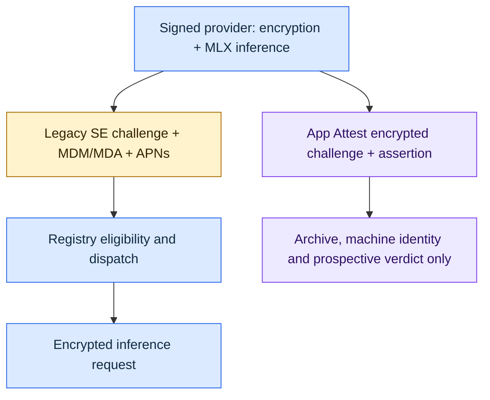
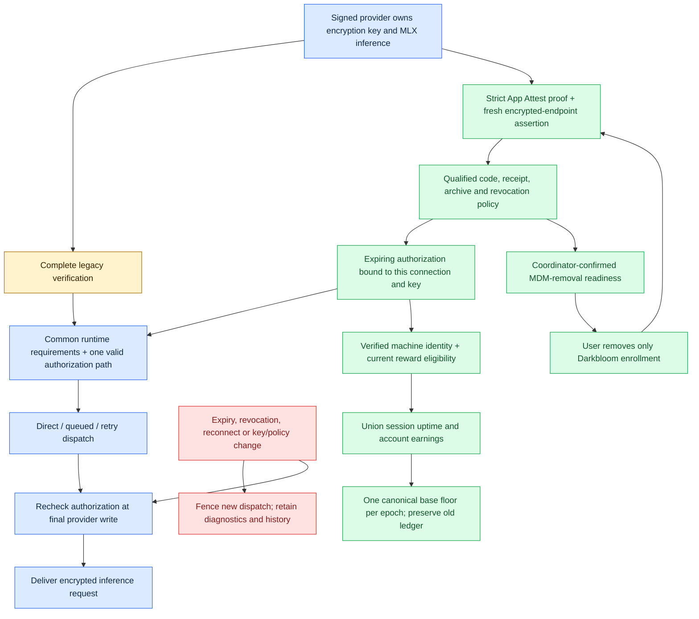

# MDM-optional provider authorization

> Last updated: 2026-09-15 · commit `605651bb9`

Status: **In progress** — 2026-09-15 — implementation of independent legacy and App Attest serving authorization; deployment and physical security-transition qualification remain separate gates.

Allow a provider to serve through complete MDM/MDA plus APNs verification, or through a qualified App Attest credential with fresh connection-bound authorization. Preserve existing providers and their account history. A verified enrollment alone never permits MDM removal or serving.

## Authorization contract

1. Common encryption, runtime, release, capacity and global revocation requirements apply to both paths. App Attest never fabricates legacy MDA/APNs flags.
2. The App Attest path requires the existing strict Mac verifier and prospective policy: expected app and environment, exact SIP/Full Security ACL, qualified signed code measurement, current encrypted-endpoint assertion, durable archive, usable receipt and known revocation state.
3. Authorization belongs to the authenticated account, canonical machine, credential, live connection, process encryption key and policy generation. It expires no later than the assertion/receipt deadlines. No authorization is restored from a database credential on reconnect.
4. Every new inference dispatch checks current authorization, including direct dispatch, queue drain, retry, cold dispatch and the final provider write. Revocation or invalidation prevents further dispatch; already delivered plaintext cannot be recalled. Explicit negative security evidence must not be bypassed by switching paths.
5. Transient failures can retain an independently valid legacy path or an unexpired authorization within its existing deadline. They never extend a lease or turn unknown evidence into verified evidence. Expired authorization permits diagnostics/recovery only.
6. App Attest-only providers also qualify for base rewards. Canonical identities drive new App Attest operational continuity. An unverified serial cannot evict another machine, inherit another account's history or create an extra reward identity. Existing ledger rows and balances remain intact; new floor credits use canonical machine keys, union session uptime and exclude prior same-epoch payments across aliases.
7. MDM removal is offered only after the coordinator confirms qualified App Attest authorization and migration readiness. Remove only the identified Darkbloom enrollment profile on explicit local user action; never alter employer management or the app's embedded signing profile. The code must support first-time providers without Darkbloom enrollment.
8. Rollout is explicitly enabled and defaults to existing behavior. Rollback after unenrollment must retain App Attest capability; disabling new migrations is distinct from revoking existing serving authorization.

## Before

## After

## Implementation and validation sequence

| Work | Completion evidence |
|---|---|
| Registry authorization and dispatch fencing | Tests for expiry at selection and final write, revocation, queue/retry paths, reconnect/key replacement, policy changes, and unchanged legacy eligibility; race tests |
| Coordinator policy integration and recovery | Strict proof acceptance grants only qualified connection authorization; persistence/read failures never grant; revocation invalidates active credentials; mixed-fleet and unenrollment behavior tests |
| Provider onboarding and removal readiness | Current coordinator capability negotiation; signed app remains the attestation/decryption/inference endpoint; scoped profile removal, unsupported-platform fallback and status/doctor tests |
| Stable identity and accounting continuity | Verified canonical identity for App Attest sessions; duplicate/quarantine/account isolation and rotation tests; original ledger records preserved |
| Documentation and review | Updated operational/reference/security docs, accurate changelog and colored before/after PR diagrams; modularity pass; relevant Go/Swift checks and CI |
| Activation qualification, after code review | Final notarized artifact on physical macOS 27, tamper/re-signing and replay negatives, SIP/Full Security downgrade with previously accepted keys, restart/reinstall/account switch, actual scoped unenrollment and company-managed Mac serving |

DeviceCheck's separate two-bit API is outside this change. Keep the DeviceCheck-authorized server credential needed for App Attest receipt renewal. The existing [encryption and privacy model](../architecture/security/encryption.md) remains the canonical statement of plaintext visibility; attestation does not prove inference correctness or one physical machine per reward identity.
