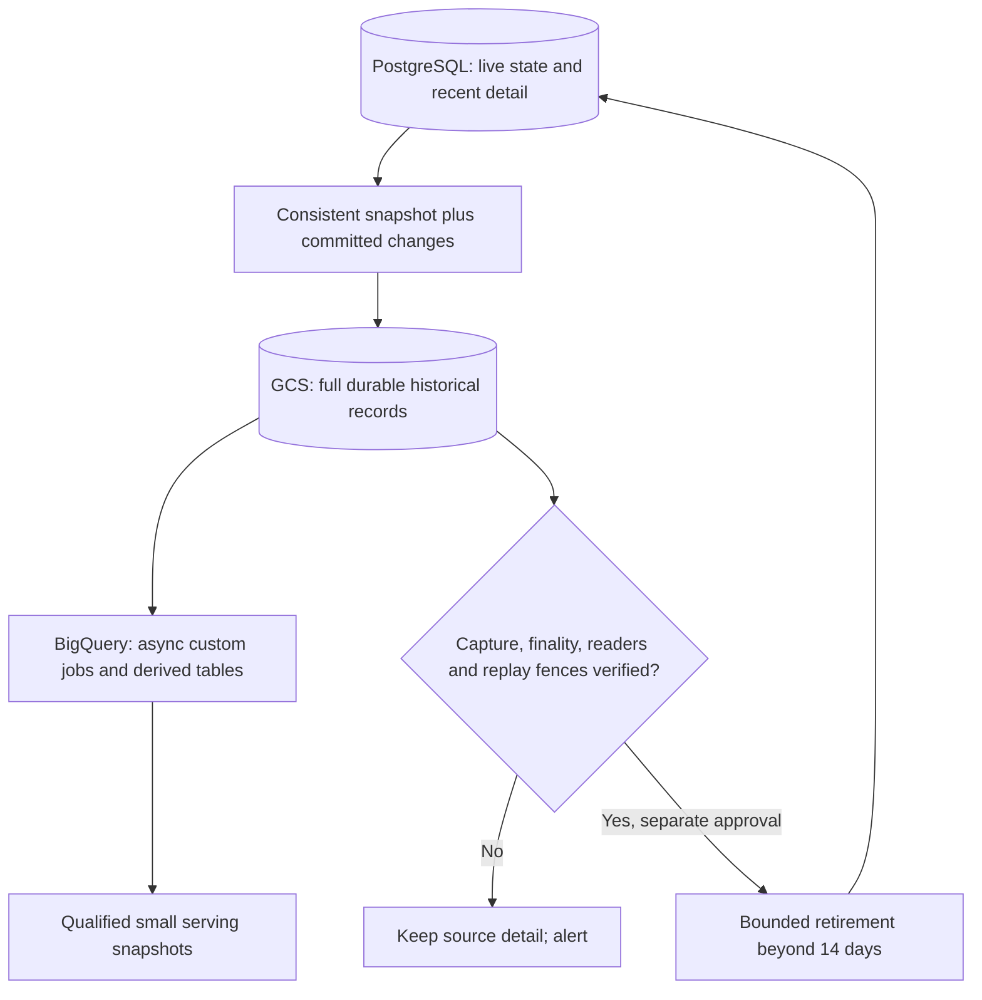

# Fourteen-day operational storage and durable history

> Last updated: 2026-10-05

Status: In progress - 2026-10-05. Copy-only archives and bounded historical queries are the foundation; continuous capture, complete reader migration and source retirement are not activated.

## Decision

Keep PostgreSQL light: retain **14 days of completed historical detail**, plus
the state required to execute current operations correctly. Preserve complete
historical records in private Cloud Storage and query that history asynchronously
with BigQuery. Parquet is a storage/query format, not a separate source of truth.
The goal includes accounting history, not only telemetry. This supersedes the
[telemetry-only retirement proposal](archive-analytics-retention.md).

Fourteen days is a target working set, not permission to delete by timestamp.
If preservation, finality or reader gates fail, retain the source and alert.
An unresolved old payment remains operational; a completed old request does not.
No existing archive receipt authorizes source deletion. The companion
[policy artifact](../../scripts/telemetry_archive/retention-policy.proposed.json)
is not runtime configuration.

## Responsibilities

| Layer | Responsibility | Must not become |
|---|---|---|
| PostgreSQL | Live state, recent detail, exact balance transitions, compact replay fences and transactional spend counters | An unbounded analytics warehouse |
| GCS historical store | Complete captured records and revisions, schemas, immutable manifests, reconciliation and recovery evidence | A lossy summary or a collection of unrelated backups presented as continuous history |
| BigQuery | Custom async jobs and reproducible derived tables, partitioned and clustered where measured useful | A synchronous dependency of inference, key-spend admission or money movement |
| Serving projections | Small qualified results for dashboards, with a five-minute public refresh target | Full-history scans on every HTTP request |
| PostgreSQL backup/PITR | Recover operational state and transactional consistency after failure | Something the historical archive is assumed to replace |

## Capture and recovery contract

1. Establish a consistent initial snapshot and an overlapping committed-change
   stream with an explicit handoff position. An ID maximum, event timestamp or
   successful backfill process is not that position. Select and qualify the
   CDC mechanism before deploying it; Cloud SQL flags, replication slots,
   permissions and any restart require their own approval.
2. Preserve table identity, primary/composite key, schema version, operation,
   transaction/commit position and source record. Capture inserts, updates and
   deletes, including late commits below an earlier ID maximum. A latest-row
   view is derived data; it cannot replace the revision history.
3. Acknowledge a durable capture position only after all associated records and
   manifests are committed to storage. Test crashes on both sides of that
   acknowledgement, replay, source failover and schema changes. Bound replication
   slot/WAL growth and alert on lag rather than silently dropping capture.
4. Compact immutable capture batches into reasonably sized Parquet partitions.
   Publish a replacement manifest atomically after reconciling source revisions,
   row counts and exact sums. Keep capture evidence sufficient to reconstruct
   the derived data; never add overlapping snapshots as additional payments.
5. Prove recovery at an explicit committed cut. Compare keys, revisions, hashes
   and exact accounting totals. Record gaps in already-expired history instead
   of claiming to recover records that no remaining source contains.

The existing finite-copy worker remains useful for initial preservation and
explicit recapture. Its per-window snapshots and observation-time deduplication
are **not** this CDC contract or a database-wide transactional backup.

## Data and reader migration

This is a dependency inventory, not an enabled deletion allowlist. Existing
capture supports nine tables; extending capture to other keys, blobs and state
machines requires explicit adapters and tests, not adding their names to a list.

| Data | Eventual disposition | Blocking dependency / current owner |
|---|---|---|
| `request_profiles`, `fleet_snapshots`, `request_outcomes`, `inference_routes`, `request_rejections` | Completed detail older than the target in GCS | Capture outcome/route revisions; move historical admin reads; replace unacknowledged pruning in `coordinator/api/observation/profiler_fleet.go` and `coordinator/store/postgres/profiles.go` |
| `usage` | Old detail in GCS, exact operational counters in PostgreSQL | `KeySpendSince` in `coordinator/store/postgres/apikey.go` enforces calendar-month and lifetime caps; migrate this transactionally before retiring detail |
| `provider_earnings`, `ledger_entries`, `provider_floor_draws` | Old detail in GCS, replay/settlement identities retained operationally | `CreditProviderAccount`, `CreditWithdrawableOnce`, Stripe settlement and machine-floor settlement use historical identities; keep original replay inputs/results and atomicity |
| `consumer_charge_settlements`, model-token reservations/grants/carries | Historical audit copies; unresolved state and necessary replay evidence stay hot | `coordinator/store/postgres/consumer_settlement.go` and `model_token_promotions_schema.go`; no age-only deletion of settled replay records |
| Provider/machine sessions and observations | Closed history in GCS, open state retained | `machine_inventory_schema.go`, `machine_floor_settlement.go`; closure and machine aliases affect reward deduplication |
| `model_demand_requests`, `model_demand_hourly` | Archive historical evidence; retain compact current product projection | Revision/conflict fences in `coordinator/store/postgres/model_demand.go`; current 30-day products cannot use only 14 days of detail |
| Autopilot events, log reports, App Attest evidence and receipts | Separately classified historical storage | Non-numeric/composite keys, blobs, privacy review, pending verification and receipt recovery require dedicated handling |
| Balances, active accounts/keys, current configuration, live payment workflows, exact summaries and migration markers | Operational PostgreSQL; restricted backup as appropriate | Do not expose secrets through analytical tables or expire authoritative state by creation date |

Before retirement, replace all applicable readers, including those outside the
coordinator:

- Public 30-day/all-time rankings, network totals and usage charts:
  `coordinator/api/reporting/`, backed by qualified same-cut projections.
- Private earnings/usage history and lifetime referrals:
  `coordinator/api/billing/`, `coordinator/store/postgres/referrals.go` and
  `coordinator/store/postgres/usage.go`; use authorized archive pagination or
  exact summaries with an explicit recent/history boundary.
- Admin historical diagnostics and direct replica queries:
  `coordinator/api/observation/` and `admin-ui/src/lib/queries/`; migrating public
  APIs does not migrate these SQL readers.
- Restore and repair: preserve `usage_totals`, `earnings_summary` and
  `schema_migrations`; never reconstruct lifetime truth from a truncated source.

## Efficient asynchronous queries

Operators submit a bounded SELECT job, receive an identity immediately, then
poll and page its results or cancel it. Queries select an explicit catalog,
not independently changing stable aliases. Byte caps, bounded results,
idempotent submission, private access and visible failure/cancellation are part
of the interface. Results do not certify complete source coverage.

For occasional exploration, query the verified external Parquet files. For
repeated or large historical analysis, build native BigQuery projections with
date partition pruning and useful account/model clustering. Maintain affected
keys/partitions incrementally; measure bytes billed and latency. Preserve exact
micro-USD and widen sums before aggregation. Do not rescan the entire GCS
history every five minutes to implement the public refresh target.

Partitioning and rollups must preserve rolling-window boundaries, corrections,
distinct-account semantics and privacy-qualified cohorts. The current public
snapshot reader is optional; its validation is a last-line consistency check,
not proof that a producer captured every source record.

## Protection and retention gates

Private access and content-addressed object names do not enforce immutability.
Versioning/soft delete aid recovery, but a BigQuery external table ordinarily
reads the current object at a URI. Qualify protections against overwrite and
loss, restrict accounting access at both bucket and dataset layers, and test
generation changes. Select a retention/hold policy compatible with approved
erasure requirements before locking it. Complete history is not permission to
ignore account erasure, legal holds or field-specific access controls.

For every candidate source batch, require verified continuous capture through
the retirement boundary, exact version revalidation under the retirement
transaction, completed workflows, preserved financial fences, migrated readers,
restore evidence and specific production approval. Bound rows, time, locks,
WAL and load; record progress and pause on unhealthy capture/replication.

Existing profile/outcome expiry is not archive-aware and continues until
separately changed. It can remove uncaptured records while this foundation is
being prepared. The first preservation rollout must address that existing
sweeper before claiming complete ongoing history.

## Delivery boundaries

| Stage | Acceptance evidence |
|---|---|
| This PR: foundation | Rebased archive/snapshot code, explicit recapture, bounded completion/replay, catalog validation, async queries, regression tests and this broader 14-day policy; no source deletion or cloud activation |
| Preservation | Complete source inventory, qualified snapshot/CDC handoff, gap accounting, schema/revision replay, protected GCS and restore/reconciliation tests |
| Reader migration | Exact financial counters/fences, authorized historical paging, public/private/admin parity at the same cut; measured analytical cost and latency |
| Retirement | Dry-run eligibility evidence, load tests and separately approved bounded deletion; old versions and active state cannot be removed accidentally |
| Capacity reduction | Measure retained working set, bloat and vacuum needs; plan compaction/partitioning and any instance resize separately |

Ordinary DELETE generally makes PostgreSQL pages reusable; it does not by
itself shrink a provisioned Cloud SQL disk. Storage reclamation and infrastructure
sizing are measured follow-up operations, not a promised effect of merging code.

## Related

- [Read-only cloud baseline](../reports/2026-10-05-history-storage-baseline.md)
- [Accounting archive operations](../operations/accounting-history.md)
- [Public analytics snapshot operations](../operations/analytics-snapshots.md)
