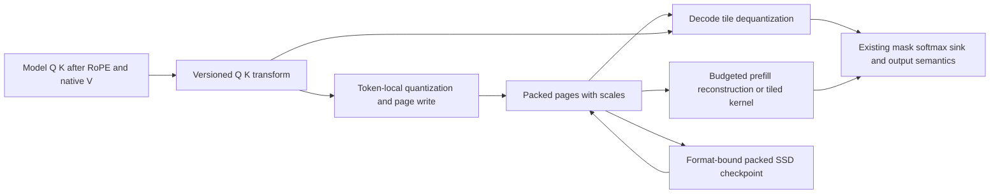

# Paged KV quantization: evidence and proposed strategy

> Last updated: 2026-09-07 · commit `0b46b1618`

Status: **In progress** — 2026-09-07 — optional packed formats and admission are implemented in the isolated worktree; numerical and model validation continues; see the [implementation reference](../reference/paged-kv-quantization.md).

Target rotation-assisted INT4 attention KV, with native precision as the reference and K8/V4 as a fallback candidate. Choose the serving policy from exact-artifact quality, latency and physical-memory measurements. Weight precision alone cannot determine KV precision.

## 1. Decision and scope

Build a small candidate family behind the existing paged cache interface: native, affine K4/V4, rotated K4/V4, K8/V4 and K8/V8. Use K4/V8 as a diagnostic to isolate key versus value sensitivity. Begin with full-attention cache owners. Keep recurrent state, convolution state, sliding-window caches and model weights at their current precision during the first comparison.

The intended implementation is token-local packed storage, a deterministic orthogonal transform, and dequantization inside the decode attention tile. Prefill may use explicitly budgeted native scratch if that wins measured performance. A lower-byte format becomes a default only for the exact artifact and workloads it qualifies; INT4 remains the primary candidate, not a predetermined result.

Review scope: papers and primary implementations available on 2026-09-07, current master, and `mlx-swift-lm` at `6aa60eeb51881eed53a457a4edf1d94918eff89f`. The [catalog snapshot](../../reports/kv-quantization-2026-09-07/catalog.json) and [provenance](../../reports/kv-quantization-2026-09-07/provenance.json) retain nine catalog entries, including beta and rollback builds. Catalog presence does not prove live routable capacity.

## 2. First principles

For one attention head, with row-vector query q:

```text
z_j = q k_j^T / sqrt(d)
p   = softmax(z)
o   = sum_j p_j v_j

delta z_j = q epsilon_kj^T / sqrt(d)
delta o ~= sum_j p_j epsilon_vj
           + sum_j p_j (v_j - o) delta z_j
```

Key error changes the selection of history; value error changes the content being combined. Error aligned with common queries can matter more than larger reconstruction error in an unused direction. Softmax depends on relative logits, so a common shift is harmless while a changed margin between relevant tokens may matter. There is no theorem that K8/V4 always beats K4/V8, or that every small cache MSE is safe.

Quantized weights perturb the creation of activations. Quantized KV storage then adds another perturbation. During generation, changed attention also changes future hidden states, queries and stored keys. The interaction can be damped or amplified depending on the model and task; it cannot be inferred from the weight bit width. PPL and logit comparisons must actually read compressed history, and long free-running generation remains a separate test.

For fixed orthogonal R, `(qR)(KR)^T = qK^T`. Applying R to Q and K **after RoPE** redistributes coordinate magnitudes without changing ideal attention scores. Quantization then sees fewer dominant coordinate outliers. Floating-point transform error still needs a native-rotation control. A generic R does not commute with RoPE: moving the transform before RoPE requires different position-aware machinery. If V is also rotated, the attention result needs the inverse V transform before leaving the cache interface.

Paging controls allocation and ownership; quantization controls bytes per stored value. They complement each other, but one does not establish the numerical validity of the other. At decode, compression is faster only when saved cache reads outweigh unpacking, scaling, transforms and any occupancy loss. At low context or high weight/recurrence cost, that may not happen. At memory saturation, more resident prefixes and admitted requests may still improve queueing TTFT without improving isolated TPOT.

## 3. What the literature establishes

These are bounded findings from the cited work, not reproduced Darkbloom results.

| Work | Mechanism and evidence | Implication for this proposal |
|---|---|---|
| [KIVI, ICML 2024](https://arxiv.org/html/2402.02750) | Per-channel K across token groups, per-token V, with native recent-token buffers; evaluated older Llama, Mistral and Falcon models. | Quantization axis matters. Native tails and scale metadata make nominal bits different from effective bytes. Cross-token grouping complicates immutable shared pages. |
| [KVQuant, NeurIPS 2024](https://arxiv.org/html/2401.18079) | Pre-RoPE K, calibrated nonuniform quantizers, sparse native outliers and sink protection; strong low-bit results on Llama/Mistral. | Useful quality reference, but introduces calibration, positional reconstruction and sparse metadata. Defer this complexity until a simpler candidate demonstrably needs it. |
| [RotateKV, IJCAI 2025](https://arxiv.org/html/2501.16383v2) | Adaptive rotations, channel reordering, pre-RoPE grouped heads and sink protection; tested Llama/Mistral/LLaVA. | Rotation makes token-local low-bit storage plausible. Its preprocessing and sink policy are additional mechanisms, not benefits guaranteed by any Hadamard transform. |
| [TurboQuant, ICLR 2026](https://arxiv.org/html/2504.19874) | Rotation plus distortion-optimized scalar quantization; inner-product variant adds residual correction. | Strong rate-distortion reference. Unbiased score estimation does not imply unbiased softmax or unchanged task quality; actual codebooks, residuals and metadata must be counted. |
| [SAW-INT4, April 2026](https://arxiv.org/html/2604.19157v1) | Token-local INT4 with block Hadamard rotation and fused paged kernels. On Qwen3-4B thinking, reported mean score is 75.64 native, 0 naive INT4 and 73.78 with K-only rotation128. | Closest simple serving design. Small rotation blocks can lose substantial quality. These CUDA results are neither a Metal benchmark nor a guarantee for our artifacts. |
| [KVarN, June 2026](https://arxiv.org/html/2606.03458) | Rotation and variance normalization, tested on Qwen3/Phi4; introduces cache-consuming chunked pseudo-decode evaluation. | Static prefill evaluations can miss propagation through compressed history. Use the evaluation idea even if we do not implement its quantizer. |
| [UltraQuant, June 2026](https://arxiv.org/html/2606.20474v1) | Rotated FP4 with group32 exponent scales and native AMD matrix instructions. Qwen3.5-A3B AIME25: 90 native, 76.67 FP4, 83.33 TurboQuant4/4; some other scores stay stable. First/last two attention layers remain BF16. | Particularly relevant family evidence, but a different artifact/stack and small reasoning benchmark. Four-bit storage is not uniformly neutral; AMD hardware speed claims do not transfer to Metal. |
| [NOVA-KV, August 2026](https://arxiv.org/html/2608.04074) | Query-aware calibrated transforms, vector quantization and native sink/recent bands. GPT-OSS20B RULER128K: 80.4 native versus 54.0 at its low-bit setting; 2.41 effective bits for head64. | An interesting later quality/bit frontier, not evidence for a global 2-bit default. The method is substantially more complex than groupwise INT4. |

Two closer model-specific results help bound expectations:

- [Minima/Qwen3.8, September 2026, section 7](https://arxiv.org/html/2609.04098v1): on a different NVFP4 W4A4 checkpoint, changing native KV to uncalibrated FP8 adds 0.41 PPL at 32K, versus 0.13 with BF16 weights. Calibrated KV scales recover 83% of the former penalty. This supports measuring combined weight/KV error; it does not establish an INT4 result or permit quantizing the recurrent state, whose mechanism study uses FP32.
- [ThinKV](https://arxiv.org/html/2510.01290v2) reports GPT-OSS20B quality at roughly 3.5 average bits using an adaptive mix of formats. Its quantization-only B8 throughput gain is about 1.1x, with generation-length changes consuming some gains. Adaptive mixed precision is evidence that low-bit reasoning can work, not validation of uniform INT4.

The [vLLM team's independent TurboQuant evaluation](https://vllm-project.github.io/2026/05/11/turboquant.html) is a useful counterweight to kernel-only claims. On its tested Qwen3/Llama/MiniMax models, K8/V4 tracks native quality more closely than lower-bit variants. Compression can help burst queueing while slowing per-token latency. Its FP8 advantage includes NVIDIA low-precision attention compute, so it cannot choose our Metal format for us.

## 4. What people have actually implemented

| Primary implementation | Verified capability | Boundary |
|---|---|---|
| [llama.cpp rotation PR #21038](https://github.com/ggml-org/llama.cpp/pull/21038), merged April 1 | Q/K/V Hadamard transforms plus inverse output transform, using existing quantized types. | Practical precedent. Its author PPL checks do not cover every downstream task. |
| [Gemma4 extension #21513](https://github.com/ggml-org/llama.cpp/pull/21513), merged April 7 | Heterogeneous head-width support. Reported Gemma4-26B Q8-weight PPL: 5.6225 native, 5.7044 q4, 5.6583 rotated q4. | Relevant architecture, different base/Q8 artifact from our instruction/QAT4 build. |
| [Metal prefill PR #27390](https://github.com/ggml-org/llama.cpp/pull/27390), merged August 20 | Dequantizes quantized K/V to per-operation F16 scratch for native flash attention. Current larger-query path uses this; small-query decode can dequantize inline. | Prefill and decode need different cost models. Scratch must count toward admission; mixed K/V types are not automatically supported by the existing Metal kernels. |
| [MLX-LM cache](https://github.com/ml-explore/mlx-lm/blob/main/mlx_lm/models/cache.py) and [attention](https://github.com/ml-explore/mlx-lm/blob/main/mlx_lm/models/base.py) | Groupwise affine quantized cache and quantized matmuls. | Explicit score/softmax path, not our fused paged backend; its quantized attention rejects sinks. Useful reference, not a drop-in replacement. |
| [SAW-INT4 official SGLang fork](https://github.com/togethercomputer/saw-int4) | FA3 prefill/Triton decode; [K-only rotation default](https://github.com/togethercomputer/saw-int4/blob/main/docs/bdr_env_vars.md), optional V rotation. | Port the algorithm and layout ideas, then qualify Metal. |

Do not treat a fork as upstream support: [MLX-LM TurboQuant PR #1067](https://github.com/ml-explore/mlx-lm/pull/1067) is closed without merge. Also do not infer successful compression from allocated code arrays: the Apple prototype [When Quantization Is Free](https://arxiv.org/html/2605.05699v1) retains an expanded prefix in one path and reports a short Qwen failure case with increased peak memory. Both are reasons to inspect execution and physical ownership.

## 5. Model scope and potential memory benefit

The [native probes](../reports/2026-09-05-five-model-native-kv-probes.md) and [QAT4 probe](../reports/2026-09-05-gemma-qat4-initial-pairs.md) pin actual storage types. The live catalog is not uniformly 4-bit: Gemma has 8-bit entries, while labels such as `fp4` and `mxfp8` do not describe every tensor's actual quantization. Keep exact aggregate hashes in every experiment.

The following is **analytic full-attention payload arithmetic**, not allocated-memory or supported-context evidence. Assume 131,072 cached positions, equal K/V dimensions and affine group64 with one 16-bit scale plus one 16-bit offset per group: `4 + 32/64 = 4.5` bits/value. Native windows, recurrent state, scale-range exceptions, page padding, metadata, temporary buffers and model weights are excluded.

| Build | Full-attention owners and geometry | Native full KV | Hypothetical K4/V4 full KV |
|---|---|---:|---:|
| Qwen3.5/3.6 35B | 10 x 2 KV heads x 256, BF16 | 2.50 GiB | 0.70 GiB |
| Qwen3.8 27B | 16 x 4 x 256, BF16 | 8.00 GiB | 2.25 GiB |
| Gemma4 26B QAT4 | 5 x 2 x 512, BF16 | 2.50 GiB | 0.70 GiB |
| GPT-OSS20B | 12 x 8 x 64, FP32 | 6.00 GiB | 0.84 GiB |

For GPT-OSS, requiring FP32 scale/offset metadata would raise this illustrative figure to 0.94 GiB. Scale precision is part of the experiment, not implicitly reduced with storage. For BF16, this format gives 3.56x payload compression; K8/V4 with the same metadata convention gives about 2.46x. Neither is a whole-process reduction.

Start implementation on Qwen3.6's existing paged path. Include Qwen3.8 early because its full-attention footprint offers a larger potential benefit, using the required M5 path. Add GPT-OSS and Gemma full layers as separate kernel/quality cases. Qwen3.5-9B and Qwen3-VL30B need separate paged qualification; the current automatic policy does not select paged for their exact IDs. Preserve the Gemma8 rollback control.

## 6. Proposed format and execution

This section is a design choice to test, not a claim that the cited papers establish the optimum.

1. **Fixed policy per loaded artifact/layer.** Specify storage scheme, K/V bits, group size, scale dtype, transform definition and version, compute dtype, and native exceptions. Do not switch precision in the middle of a request or requantize existing shared pages when context grows. Per-layer mixtures can use separate existing allocator groups; they are not inherently incompatible with paging.
2. **Token-local affine group64 initially.** Store packed nibbles and explicit scales/offsets for each token, KV head and channel group. No token's scale depends on a future token, so append, rollback and prefix sharing remain local. Test group32/128 if the quality/metadata tradeoff justifies it. Quantization group size and rotation block size are different parameters.
3. **K-only post-RoPE rotation first.** Use a fixed normalized Hadamard transform on both Q and K: initial block128 for divisible wide heads and block64 for GPT-OSS head64. Compare full-head transforms for widths256/512 and K/V rotation. Version normalization, sign pattern and seed. Do not apply this to GDN's recurrent keys merely because they share a name.
4. **Fused decode.** Quantize new K/V at the cache write boundary, read packed history in the attention tile, reconstruct into registers and retain native query/output precision plus existing FP32 accumulation. Preserve masks, GQA, softcaps and GPT-OSS learned sink logits. Its learned sink parameters are distinct from the high-attention token positions discussed by sink-protection papers.
5. **Prefill selected by measurement.** Compare a compressed tiled kernel with budgeted native dequantization scratch feeding existing SDPA. For wide prefill, repeated unpacking per query can cost more than temporary materialization. A full-prefix per-layer scratch buffer is allowed only if explicitly reserved and measured; smaller tiles require correct online-softmax merging, not independent normalization followed by summing outputs. Do not retain an expanded duplicate of the cache across decode.
6. **One numerical cache policy across phases.** The current chunk path can attend directly to fresh floating K/V. The quantized reference must roundtrip those fresh values consistently with stored values, including the newest decode token and MTP verification columns. Otherwise chunk size, prefix restore or batch packing can silently change which tokens were quantized before being attended. Establish kernel/reference tolerances; quantized/native generated-token equality is not required.
7. **Quantize once; persist packed bytes.** Include format/transform identity in resident-prefix keys, SSD manifests and compatibility checks. Restore the same bytes and scales, rather than dequantizing and requantizing through a lossy conversion. Qualify complete recurrent/assistant checkpoints as well as attention tensors. Existing native entries must miss cleanly under incompatible formats.
8. **Account for every allocation.** Price packed data, scale arrays, poison pages, segment size classes, copy-on-write, scratch, speculative reservations and checkpoint staging from the real format. Provider grants/heartbeats and coordinator token-budget calculations must agree. Compression does not authorize lowering measured activation reserves or resident-weight estimates.

Do not start with moving native tails, token eviction, sparse outlier sidecars, calibrated vector codebooks or 2/3-bit packing. They remain escalation options if measured quality or capacity requirements justify the extra ownership and kernel complexity. K8/V4 is also a deliberate new kernel format, not a flag assumed to work because K8/V8 and K4/V4 do.



## 7. Experiments and decision rules

Run the work in stages so expensive serving integration follows evidence that the representation is useful.

| Stage | Comparison and output | Advance condition |
|---|---|---|
| Numerical reference | Native; native plus transform/inverse; plain K4/V4; rotated K4/V4; K8/V4; K8/V8; diagnostic K4/V8. Quantize at actual cache boundaries, initially without packed storage. | Finite outputs and a format worth measuring. Reference simulation is not memory/performance evidence. |
| Cache-consuming quality | Same shipped weights/templates, teacher-forced continuations through actual cache reads, then long free-running tasks. Compare quantizing a native prefix once with quantization from the first prefill write. | Predeclared quality margins met on held-out tasks, not just a small mean PPL difference. |
| Packed Metal kernels | Compare packed implementation with the quantized reference; actual page writes/reads, masks, poisoned pages, shared prefixes, window boundaries and widths64/256/512. | Existing numerical tolerances satisfied and actual compressed execution proven. |
| Serving qualification | Same concurrency/context plus equal-memory saturation tests; normal MTP, resident reuse, SSD restore, cancellation, restart and multiple co-resident slots. | Demonstrated capacity or end-to-end benefit with acceptable quality/latency and complete ownership accounting. |

Quality reporting:

- Measure NLL/PPL by position and domain; logit KL distribution and tail values; attention-output error, top-token margins and clipping/scale saturation. A single full-sequence forward that never consumes quantized history is invalid for this question.
- Use 4K/16K/32K/64K and feasible advertised maxima, including 128K/256K where supported. Include ordinary prose, code, multi-turn tools/JSON, long documents, multi-key retrieval and hard reasoning. Pin tokenized inputs and the correct thinking/chat template. Test real image inputs for vision qualification; do not substitute text-only results.
- Report correctness, answer extraction, loops, premature EOS, token-limit truncation and output lengths. Use matched seeds and paired confidence intervals; calibration/tuning data must be disjoint from validation. AIME alone is too small to establish tight margins. Do not claim quality improvement from changed answer parsing.
- Predeclare a per-task noninferiority margin before the full comparison; a proposed starting point is no more than one absolute percentage point on adequately powered correctness suites, with separate bounds for serious tool/schema failures. If confidence intervals cannot resolve the margin, report inconclusive. NLL/KL remain diagnostics, not arbitrary universal quality thresholds.

Performance reporting:

- Match contexts, batch sizes B1/B2/B4/B8, output budgets, artifact hashes, cache state, hardware/power/thermal state and serving modes. Report fixed-length kernel measurements separately from completed-request results so extra output tokens do not masquerade as throughput gains.
- Measure TTFT, TPOT, total request time, throughput, admitted requests, physical allocated/peak bytes, usable KV capacity, temporary memory, resident-prefix hit rate, SSD bytes and restore time. Compare both equal-workload and equal-memory operating points. Native OOM is a capacity result, not an infinite speedup.
- Qualify target-only quantization before MTP. Then compare MTP on/off under the same quantized target policy; record accepted tokens per draft, verification work, rollback and total latency. Speculative exactness is relative to the chosen quantized target, not the original native target.
- Test M4-class and M5 serving paths separately; Qwen3.8's production capability requirements still apply. Do not convert NVIDIA/AMD native FP8/FP4 speed results into an Apple prediction.

Choose the lowest-byte candidate that passes the quality and service requirements for each exact artifact. Promote K4/V4 if it passes; otherwise test K8/V4 or measured native-layer exceptions, then K8/V8/native. If gains appear only under long-context memory pressure, document that operating region instead of declaring a universal speed improvement. Keep rollback by constructing a fresh native backend and excluding incompatible cached state.

## 8. Code map and implementation boundaries

| Concern | Existing code and symbol to extend |
|---|---|
| Storage identity and byte layout | `libs/mlx-swift-lm/Libraries/MLXLMCommon/ContinuousBatchingV2/Paged/PagedKVStorageLayout.swift` (`PagedKVGroupKey`), `PagedKVPool.swift` (`PagedKVPoolConfig`), `PagedKVSegments.swift` |
| Writes, gathers and fences | `libs/mlx-swift-lm/Libraries/MLXLMCommon/ContinuousBatchingV2/Paged/PagedSegmentTransfers.swift` (`PagedSegmentTransfers`); preserve the existing read/write-fence chain |
| Decode and native compute dtype | `libs/mlx-swift-lm/Libraries/MLXLMCommon/ContinuousBatchingV2/Paged/PagedSegmentAttention.swift` (`decode`), `PagedAttentionKernel.swift`, `pagedattention.metal`; storage dtype must stop determining query/output dtype |
| Fresh-chunk and MTP semantics | `libs/mlx-swift-lm/Libraries/MLXLMCommon/ContinuousBatchingV2/Paged/PagedLayerCache.swift` (`updateAndAttend`, `prefillKVWritingChunk`) |
| Checkpoint format and identity | `libs/mlx-swift-lm/Libraries/MLXLMCommon/ContinuousBatchingV2/Prefix/CompleteCheckpointCodec.swift`, `PagedCompleteCheckpointCodec.swift`, `PagedCheckpointTensorSource.swift` |
| Construction and exact capacity | `provider-swift/Sources/ProviderCore/Inference/EngineV2Factory+SegmentedBackend.swift` (`makeSegmentedPagedBackend`), `EngineV2Factory+NativeKVTypes.swift` (`nativeFullKVBytesPerToken`) |
| Model policy and routing budget | `provider-swift/Sources/ProviderCore/Inference/EngineV2KVBackendPolicy.swift` (`preferredBackend`); `coordinator/registry/servability.go` (`coldTokenBudgetEstimate`) and provider-reported slot budgets |

Keep new format definitions, pure byte arithmetic, quantization reference code and Metal kernels in separate focused files. The parent repository and pinned library changes need to land together. Telemetry additions must follow the existing Go/Swift/TypeScript symmetry rules. This proposal changes no serving configuration and does not authorize a production rollout.

Related: [release acceptance](release-090-acceptance.md), [prefix-cache architecture](../architecture/prefix-cache.md), [memory architecture](../architecture/hardware-support.md).
