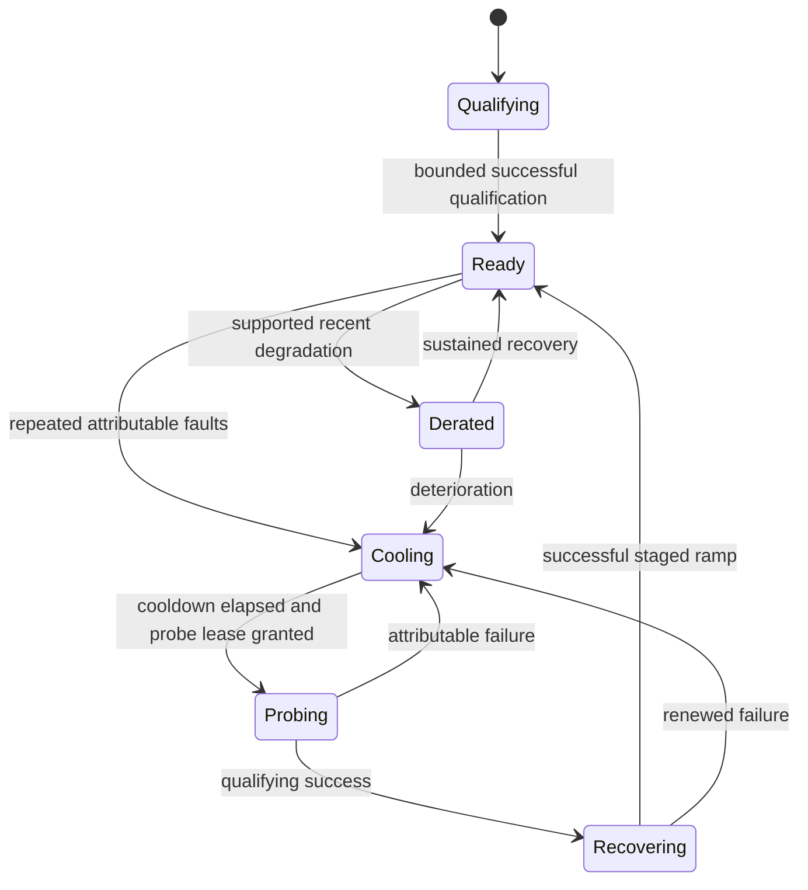
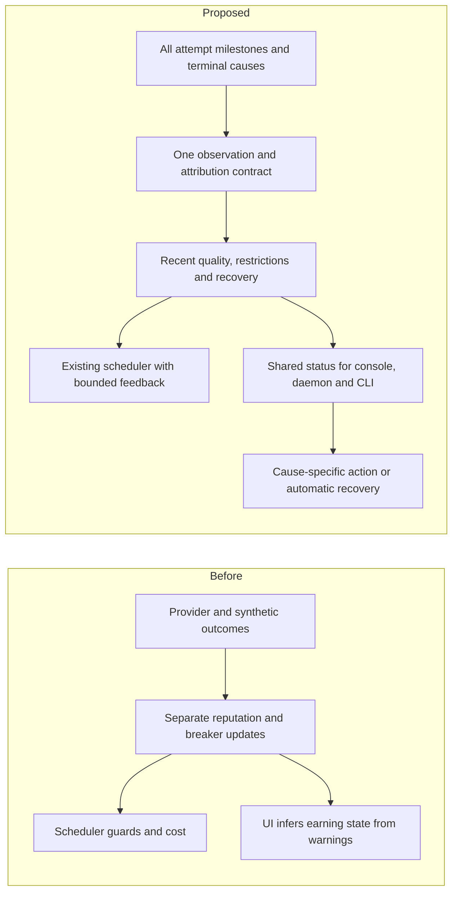

# Provider service quality, routing feedback and recovery

> Last updated: 2026-09-05 · commit `4d9811f7c`

Status: **In progress** — 2026-09-05 — provider-status API/UI and two persistence fixes implemented locally; routing estimator, recovery policy and remaining accounting changes are proposed.

Replace the provider's composite reputation score with recent service-quality estimates and an authoritative explanation of its current serving state. Use the estimates to improve successful work delivered within request deadlines, and give operators predictable recovery, useful diagnostics and control over their Mac.

The [September 5 audit](../../reports/2026-09-05-reputation-audit/report.md) contains executable reproductions of four accounting/persistence defects. This proposal specifies the replacement and its migration. All new names, thresholds and interfaces below are proposed, not current features.

## 1. Decisions and intended outcomes

Build one observation and explanation layer, with two consumers: the existing scheduler and provider-facing status. Retain the scheduler's trust, request capability, physical-memory and token-budget gates. Begin with small statistical estimates and an inspectable cost adjustment; defer a learned routing policy until evidence warrants it.

| Objective | Measure | Guard against |
|---|---|---|
| More useful work from existing hardware | Clean completions per unit time and resource, within relevant request deadlines | Reporting admission or first-token success as completed work |
| Better latency | Raw end-to-end first-content p50/p95/p99 and deadline attainment by model/shape | Improving the average by refusing difficult requests |
| Less wasted capacity | Attempts per logical request, failed-attempt time, duplicate hedge work, bounced admissions | Moving load to peers until they overload |
| Less provider work | Unnecessary restarts, actionable alerts, recovery time and steps | An opaque score that prompts repeated restarts |
| Fair treatment | Outcomes attributed to the responsible component, low-volume confidence, access to qualification | Permanent damage from platform faults, voluntary offline time or old software |

Capacity shortages, quota refusals and poor routing require different remedies. The [live baseline](../../reports/2026-09-05-provider-quality-live/findings.md) records fresh Datadog queries and read-only replica inspection. The observed window has far more rate-limit outcomes than service faults; those rate limits include policy refusals and cannot all be labeled lost capacity. This supports examining admission and useful throughput alongside failure scoring. No proposed statistical thresholds or performance gains have been validated by this snapshot.

## 2. Current integration points and additional constraints

The audit already establishes that `Reputation.Score` is not a scheduler input. Further source inspection reveals three important constraints:

- `console-ui/src/app/providers/dashboard/routing.ts` (`deriveRouting`, `routingMeta`) infers routing status from warning severity, then labels the clean state “EARNING — receiving traffic.” An eligible provider can be idle, while a per-model breaker can exclude a provider without a corresponding frontend warning. Eligibility, recent traffic and booked earnings need separate facts.
- `coordinator/api/profiler.go` (`newRequestProfile`, `sampled`) allows profiling to be disabled and samples routine successes. `coordinator/registry/routingsim/trace_ndjson.go` documents the default success sampling bias. Raw profile counts are not a valid reliability denominator.
- `coordinator/api/route_telemetry_submit.go` (`submitRouteRecord`, `submitRouteOutcome`) and `coordinator/api/profiler_sink.go` (`submit`) use nonblocking, best-effort sinks. A new control loop cannot assume every persisted trace exists.

Use `PendingRequest` and the two-sided `AttemptProfile` lifecycle as implementation references. Current source uses these abstractions; this proposal does not assume an older request-actor implementation is present. The minimum service-quality lifecycle must operate even when profiling is off. A route row marked successful at content commit is not proof of eventual clean completion.

The existing `coordinator/registry/fleet_sample.go` (`slotEligibilityReasonLocked`) already evaluates the real snapshot/build-candidate pipeline for a specified plain-text probe. Reuse that approach for explanations, while labeling the probe's scope: passing one short text probe cannot promise eligibility for every tool, vision or long-context request.

## 3. One attempt record, with separate observations and attribution

Introduce a small, mandatory `AttemptObservation` held with the pending attempt. Its coordinator-minted key is `(coordinator_epoch, attempt_uuid)`; preserve the logical request ID and attempt index for retries and hedges. Identity and request context are copied at reservation, so removing a WebSocket session cannot erase the owner of a later outcome.

A record carries only operational metadata: authenticated device key, session ID, verified release identity when available, exact model artifact, endpoint/shape category, bounded prompt/output-size buckets, cold/warm and cache regime, actual scheduling cohort, coordinator timestamps, phase reached, terminal class and policy version. It stores no prompt, response, image, tool schema or arbitrary provider string. Reuse the [privacy model](../architecture/security/encryption.md).

Use milestone guards for dispatched, accepted and first meaningful content, and one terminal claim. Provider ingress, dispatch timeout, disconnect flush, consumer cancellation and settlement-grace expiry converge on the same terminal arbitration. A terminal received on time must retain ownership when a slower worker processes it later. A duplicate or late terminal cannot increment health counters twice. Completion does not wait for a billing database write before recording a validated serving outcome; billing still owns its existing settlement semantics.

**Do not collapse customer outcome into provider blame.** Every observation can affect customer-fulfillment metrics while affecting different provider estimators:

| Observation | Customer/service record | Routing evidence | Operator explanation |
|---|---|---|---|
| First meaningful content arrives in time | First-content deadline met; completion pending | Acceptance and latency evidence | Serving |
| Valid clean terminal | Clean attempt completion; logical request counted separately | Completion success | Completed work |
| Attributable provider stall or abrupt disconnect after dispatch | Failed or partial attempt | Node/model fault and delay evidence | Connection or serving problem; cause may still be unknown |
| Capacity refusal | Admission bounced | Acceptance/envelope evidence, not fault guilt | Busy or advertised capacity needs correction |
| Coordinator supplied too little remaining time | Deadline refusal | Scheduler/deadline calibration; no node-fault strike | No action needed |
| Client cancellation or losing hedge cancelled before a terminal | Cancelled/censored, never assumed successful | Milestones already observed remain; no invented completion or fault | No action needed |
| Announced drain or scheduled pause | Maintenance; interrupted accepted work remains visible | Availability closes immediately; no lasting reliability penalty | Paused/updating; active work shown |
| Known model/template/version defect | Failed request, attributed to the affected scope | Avoid or restrict that artifact/version/shape | Platform issue or applicable verified update |
| Proven attestation failure | Security exclusion | Existing hard trust gate | Specific verification requirement |
| Missing/inconsistent evidence or coordinator failure | Unknown/incomplete | Reduce confidence; never mint success or blame | Status/evidence unavailable |

Graceful close is not a shortcut for concealing aborted work: planned maintenance and in-flight interruption remain different events, even when neither causes a permanent score penalty. Unknown failure ownership remains explicit. Provider-supplied neutral strings are interpreted through validated protocol vocabulary and coordinator-observed phase; a provider cannot declare a coordinator-caused event.

Keep synthetic qualification and self-routed/operator traffic distinct from public customer evidence. Such traffic can prove liveness or calibrate latency, but must not manufacture a flawless public reliability history. Do not base payout deductions on this estimator.

## 4. Replace the score with three estimates and evidence quality

For a specific eligible workload, estimate:

1. **Acceptance:** probability that the provider can honor an offer within the offered serving envelope.
2. **Responsiveness:** the distribution of time to first meaningful content, conditional on acceptance and the request context.
3. **Completion:** probability of clean protocol completion once service starts, plus post-content stall behavior.

These are separate conditional populations. Client cancellations, unknown outcomes, capacity refusals and hedged losers cannot be poured into one successes/total ratio. For selection, use observed outcomes that affect delivery even when the operator is not at fault; apply those signals at the model/platform scope when appropriate. For provider diagnostics, present attributable failures separately.

Keep raw customer-visible latency alongside model-normalized residuals. Subtracting a guessed prefill cost does not produce “Avg TTFT.” Preserve the existing calibrated timing model initially, and add cohort residuals only where data shows a systematic error. Cache participants, cold starts, image/video requests and speculative winners require separate treatment. Pre-content cancellations are censored observations; do not learn a fast latency distribution from winners alone. Observed local timing components help distinguish coordinator queue/write delay from upstream response delay, but do not by themselves prove the provider caused network delay.

Use exponentially decayed success/failure counts for each conditional estimate. An initial, shadow-only estimator is:

```text
w = 2 ^ (-elapsed / half_life)
S := w*S + observed_success
F := w*F + observed_failure
estimate := (S + prior_strength*cohort_rate) / (S + F + prior_strength)
```

Maintain raw counts, weighted mass, last observation and coverage separately. Weighted mass is not an IID sample count or a statistical confidence interval. Correlated faults within one outage and repeated traffic from one tenant require conservative uncertainty treatment. Calibrate uncertainty against held-out time/device blocks rather than advertising a textbook Beta interval as a guarantee.

**Proposed initial scopes:** stable device × model artifact, with an independently maintained node fault view. Split by verified engine release when release behavior changes. Use bounded context buckets for timing and cohort priors; create narrower shape buckets only when evidence supports them. Avoid eagerly allocating the Cartesian product of device, model, version, modality, cache and prompt size.

**Proposed shadow starting points:** a five-minute half-life for fast response to deterioration and a six-hour half-life for background evidence. These are sweep parameters, not asserted optima or production defaults. Cohort priors follow exact model plus relevant hardware/engine context; exclude the same device's evidence from its own prior where practical. Version-wide defects affect the version cohort, not every operator's permanent record.

Show insufficient data explicitly. New devices begin with a cohort estimate after hard verification, then qualify through bounded traffic; they do not start as either 50% reliable or proven perfect. Confidence fades during long inactivity. Voluntary offline time does not become a job failure. Report availability only against an explicitly advertised schedule; without that denominator, label the measure “connected time.”

## 5. Let failure cost affect routing without destabilizing it

Keep existing feasibility, privacy, account policy and request-deadline gates. Preserve the single request clock rooted at `ReceivedAt`; no retry, alias fallback, probe or new quality estimator gets a fresh deadline. Exact model SLA policy remains authoritative.

Add a transparent, bounded `ReliabilityMs` term to `RoutingDecision` and the existing candidate cost. The starting approximation is expected *additional* time consumed by unsuccessful attempts, derived from mutually exclusive failure classes and measured phase-specific costs. Compare it with a direct first-content deadline probability in shadow mode. Do not sum correlated miss/fault probabilities twice, count baseline queue time twice, or retain the old capacity penalty on top of an equivalent new penalty indefinitely.

```text
candidate cost = current cost + bounded expected extra failure/retry cost
```

The present cost is a ranking proxy, not an exact expected latency. The added term therefore requires calibration; do not interpret the total as a promise to the user. If observations become stale, smoothly fall back toward the cohort/baseline estimate. Preserve short-lived, evidence-backed circuit breakers for repeated hard failures.

An illustrative one-retry calculation explains the value. If A succeeds in 0.7 s with probability 0.85, otherwise fails after 3 s, and B always succeeds in 0.9 s, routing A then falling back to B takes `0.85*0.7 + 0.15*(3+0.9) = 1.18 s` on average. B first takes 0.9 s. With a 2 s deadline, A first delivers on time only 85% of the time. These are invented inputs, not measured Darkbloom gains. The correct choice depends on failure detection time, deadline, retry options and load—not nominal TPS alone.

**Control-loop safeguards:**

- Publish immutable per-key summaries and read them during the existing scan without database calls, per-candidate allocations or new nested global locks. Update lightweight aggregates after lifecycle ownership is decided, outside the registry critical section.
- Smooth parameter changes and separate entry/recovery thresholds. One slow request should not move the entire fleet.
- Keep load costs and admission gates active when reliability redirects work. Evaluate resulting queue growth on the receiving peers; a reroute does not create hardware capacity.
- Coordinate node, pair, shape and capacity controls so the same incident is not charged several unrelated penalties. During migration, preserve old guards but enable only one overlapping soft penalty in a cohort.
- Keep a small qualification/exploration budget inside eligible, deadline-safe candidates, with per-device and per-model caps. Do not give equal traffic to unequal hardware or promise equal earnings.
- Log the selected policy, effective probability of the choice and candidate context for exploration. An unselected candidate has no measured counterfactual outcome.

A purely historical replay cannot prove the new router would have improved production: the old policy determines which outcomes were observed. Use replay for invariant checks and modeled sensitivity, then a canary for causal evidence. Logged-policy evaluation needs support and selection probabilities; see [Microsoft Research on off-policy evaluation](https://www.microsoft.com/en-us/research/publication/optimal-adaptive-off-policy-evaluation-contextual-bandits/).

## 6. Recovery is an explicit state machine

Keep connection, trust, operator intent and serving health as orthogonal fields. The following state machine applies to the affected serving scope after hard trust gates:



A node fault uses a device-wide probe lease; a model/shape problem uses its narrower lease. Acquire and debit it atomically with admission. Only one probe is initially in flight per affected scope; a node lease dominates all subordinate model probes. Completion, cancellation, disconnect and lease expiry each release or resolve ownership exactly once. A queued or never-dispatched probe is not a failed provider probe.

After a successful probe, increase allowed work gradually within the existing memory/token/concurrency limits. A single success proves useful work is possible, not that all fault history should be erased. Use jittered backoff, a model-wide probe budget and success evidence spanning more than one immediate request burst. The exact ramp and recovery minimum remain experimental policy parameters.

Time passing permits a new probe, not automatic full recovery. With no demand, perform a bounded synthetic request through the real serving path if the provider has opted into qualification work; label it as synthetic and do not charge a consumer. A warm short-text probe proves neither long-context nor multimodal readiness. Return to the relevant status only after the required evidence arrives; do not invent a recovery ETA.

When every otherwise-feasible candidate is quarantined, replace unrestricted breaker bypass with an explicit degraded-service budget. Permit bounded probes only where existing hard gates and the request's remaining deadline allow them; otherwise use the existing queue/shedding contract. Roll this policy separately from score changes because it changes outage behavior. Evidence decay or a data gap alone must not mass-quarantine a healthy fleet.

Pause and maintenance freeze new admission independently of health. Reuse the provider's existing auto-update drain machinery. A graceful pause acknowledges the admission fence, drains accepted work to a displayed bound, then releases capacity. A user-requested immediate stop remains explicit about interrupted work. Resume re-verifies current requirements and restores service without wiping history or recreating identity keys.

## 7. Provider experience: status, reasons, recovery and control

Replace the headline 0–1 score with a concise serving status, current work, observed earnings and evidence freshness. Keep history in details. The primary provider question is: “Can this Mac serve, is it receiving work, and do I need to do anything?”

| Situation | Main message | Detail/action |
|---|---|---|
| Verified, no active request | Ready for work | Last job time; no action needed; never imply guaranteed demand |
| Actual active requests | Serving 2 requests | Models, current workload, booked earnings for a named period |
| One model failing | Gemma temporarily limited | Other models unaffected; scope, reason, earliest next probe |
| Recovery in progress | Checking recovery | Probe/ramp progress; automatic next action; no restart instruction |
| Thermal/memory constraint | Reducing work while your Mac is busy | Actual applied limit and measured constraint; user can pause |
| Scheduled pause | Paused until your next scheduled window | Resume control; no lasting quality penalty; existing earnings policy explained |
| Known platform issue | Darkbloom is investigating this model | Incident scope; no local repair unless evidence changes |
| Trust remediation needed | Verification needs attention | Exact requirement and applicable diagnosis |
| Stale control-plane snapshot | Coordinator status unavailable | Timestamp; local daemon status shown separately |

**One explanation from the backend.** Extend `/v1/me/providers` with a versioned `service_quality` snapshot. Use the same schema over a capability-negotiated `service_status` provider message and in the daemon state consumed by `darkbloom status` and `doctor`. Publish on transitions plus bounded refresh, coalescing repeated changes. Include coordinator epoch and revision so late status cannot replace newer status.

Proposed fields: `observed_at`, `expires_at`, `schema_version`, `policy_version`, connection/trust/operator intent, activity, per-model evaluated request profiles, current restriction scope, closed reason code, evidence counts/coverage, action owner, earliest next probe, recovery progress and recent actual traffic. Render summary text from a shared reason specification with Go/Swift/TypeScript symmetry checks. Do not distribute arbitrary shell commands from provider-controlled error strings.

The status must distinguish a current diagnostic probe result from historical route observations. “Ready for short text” has a different scope from “your last long-context request was rejected for memory.” Do not create a new frontend eligibility engine or expose another provider's identity, traffic or pricing to explain a loss. Where demand evidence is absent, say “No recent work observed,” not “There is no demand.”

**Reduce disruptive advice.** Prefer read-only diagnosis and a recovery check before recommending a whole-daemon restart. Existing UI mappings in `dashboard/fixes.ts` sometimes recommend restart/re-link from coarse warning classes; replace these with cause-specific actions. Restarting must never be presented as a way to erase bad history. An isolated model repair should leave other models and in-flight work alone.

**Operator control:** retain existing schedule and idle-unload preferences. Add a consistent graceful pause/resume path, then explicit local-comfort settings that reduce offered work within the hard memory cap. Keep settings local-first; a dashboard action requires a linked-device, allowlisted command with acknowledgement and visible result, not remote shell execution. Do not silently change thermal/fan, memory or model-download policy. Surface the earning/resource tradeoff; paused or unloaded capacity continues to follow existing base-reward rules.

Notify only when action is useful or an important incident changes state. Group repeated messages by device/model incident, suppress platform-wide duplicates, and emit one recovery notification according to the user's preferences. A routine busy period, one timeout or a small score change is not a notification. This emphasis on impact, short/long evidence windows and noise control follows [Google SRE alerting guidance](https://sre.google/workbook/alerting-on-slos/); provider notifications need their own conservative policy.

## 8. Improve capacity offers, not just rankings

Ranking improves which capable device receives work. Fewer bounced offers and more appropriate work improve the amount of useful capacity available.

First use acceptance observations to adjust an offered workload envelope: supported model/shape, warm/cold state, memory budget and concurrency. When the provider rejects inside an apparently safe envelope, reduce offers temporarily and diagnose the mismatch. Classify whether the coordinator sent stale/overlarge work or whether a supposedly available provider repeatedly failed to admit it. Lower observed acceptance is an operational routing signal without being an accusation.

Make adaptation conservative: multiplicative reduction on a confirmed mismatch, slow increase after sustained successful work and fresh capacity evidence, with hysteresis. Treat this as a proposed evolution of existing capacity clamps and rate feedback, not an additional independent controller. It may only tighten published concurrency/token limits; it must never relax the provider's hard memory cap or invent model activation-reserve formulas.

Offer model recommendations only when observed demand, measured fit and expected load cost support them. Avoid repeatedly loading an unwanted large model because a global score looks high. Use the existing warm-pool/model-management path and respect the user's permitted model set, download consent and idle policy. Report recommendations and demand uncertainty without guaranteeing earnings. This is a later phase after trustworthy observations, not a dependency for the initial fixes.

## 9. Identity, durability, bounded cost and missing data

Create a durable internal device key bound only through verified identity evidence. Session UUID, account ownership and software release are separate dimensions. Maintain verified serial/SE-key aliases so reconnects enrich identity rather than fork history. A new owner must not receive the previous owner's private earnings or detailed account history. Any key-rotation or device-transfer path must verify the new binding; account fallback cannot merge an entire fleet into one reputation record.

**Choose bounded-loss operational persistence for the first release, not a financial ledger or a new distributed event broker.** Every finalized attempt updates in-memory counters regardless of forensic sampling. Keep rolling histograms/decayed aggregates and bounded incident details. Persist coalesced snapshots in batches on a proposed five-second target cadence and on orderly shutdown; the cadence is a target, not a durability guarantee during database outages.

Use revisioned snapshots with an explicit coordinator writer epoch. Database comparison must reject older revisions and stale writer ownership; a retiring coordinator cannot overwrite newer live state. Preserve each epoch's aggregate contribution independently where an old instance may finish draining work after handoff. Resolve those contributions by event time for history; an old completion cannot clear a newer quarantine. Restore active expiring restrictions and evidence freshness without resurrecting trust.

During a storage outage, live routing continues from local observations and a bounded dirty-key set keeps the latest aggregate. Coalescing replaces stale pending snapshots rather than spawning a goroutine per outcome. After an unclean restart, expose the interval since the last acknowledged checkpoint as potentially incomplete. Missing outcomes are never fabricated. Restore conservative existing/cohort estimates and bounded qualification where needed; do not make an entire fleet unavailable simply because evidence is incomplete.

This guarantees duplicate suppression within the live attempt lifecycle and monotonic acknowledged snapshot updates, not zero event loss across a crash. If exact historical accounting becomes necessary for contracts or payouts, it requires a separate durable event/outbox design and review. The current payment ledger remains authoritative for money.

Do not persist every expanded attempt merely to compute a ratio. At an illustrative 4,000 attempts/s, even 256 bytes per attempt is 88.5 GB/day before indexes and replication. Persist aggregates for every outcome and retain bounded sampled forensic evidence with inclusion probability, retention limits and coverage metrics. A missing sample is not a missing live update.

Cardinality and state are bounded by configured active devices, catalog models, recent verified versions, bounded context bins and retention. Idle buckets expire; unsupported/unknown provider strings fold into closed categories. Never attach raw device or request IDs as high-cardinality Datadog metric labels. Restricted diagnostic storage can retain the coordinator-owned correlation needed to explain an individual incident.

Migration fixes the current restore/write defects first. Keep old counters labeled as legacy history; do not sum session snapshots that already copied cumulative counts. Start new recent estimates from complete live observations, or backfill only from deduplicated evidence with known sampling/coverage. Maintain the old API field during a compatibility window with its legacy meaning; do not silently redefine it as a probability.

## 10. Implementation boundaries and rollout

| Slice | Concrete work | Dependencies and exit gate |
|---|---|---|
| 1. Persistence correctness and honest labels | Fix oldest-session selection, reconnect lookup and stale writes; correct current score/TTFT/routing copy | Audit reproductions become regression tests; zero routing-policy change |
| 2. Mandatory attempt observations | Small lifecycle record, normalized classifier, terminal/milestone arbitration, all-traffic aggregate updates | Profiling-off, disconnect, timeout, cancellation, duplicate and settlement tests pass; denominators reconcile |
| 3. Shared status and provider QoL | Backend explanation snapshots, scoped reasons, frontend rendering, daemon/CLI status; cause-specific diagnostics | All surfaces agree with current scheduler/profile scope; stale data is visibly stale |
| 4. Shadow estimates | Decayed conditional estimates, priors, coverage, decision annotations, replay harness | Calibration, bias and fleet-cost checks; no dispatch changes |
| 5. Bounded recovery and ranking canary | Probe leases/ramp, separately controlled fallback policy, bounded reliability cost | Failure injection and isolated canary show delivery benefit without capacity/tail regression |
| 6. Capacity offers and comfort controls | Consolidate adaptive envelope feedback, graceful controls, demand-aware model advice | Demonstrated lower bounce rate/toil; no memory, model-slot or user-preference violations |

Proposed code ownership: `coordinator/servicequality/` for pure types, classification, decay and summaries; `coordinator/api/attempt_observation.go` for lifecycle wiring; focused store files for device identity and revisioned aggregates; registry adapters for read snapshots, cost and probe leases; `coordinator/api/provider_service_status.go` for authorized presentation; a small provider diagnostics module and console `providers/quality/` module for rendering. These are intended new paths, not existing files.

Avoid moving the entire scheduler or provider read loop. Keep pure policy outside the large orchestration files. Existing `registry/gate_state.go`, `capacity_cooldown.go` and `capacity_rate.go` remain the integration points until equivalent behavior is proven. Consolidate overlapping node fault/ejection logic only after a replayed transition contract replaces both; their capacities and fault exemptions are not interchangeable today.

Protocol fields need Go/Swift mirrors. Telemetry changes additionally need the TypeScript mirror and ingest allowlist. Follow the store decorator/cache rules for new mutators. Update architecture, API/protocol references, provider CLI documentation and the changelog with each behavior-changing PR. Each PR includes scoped before/after behavior and code diagrams.



## 11. Proving improvement

Reconcile, within a cohort and interval including carry-in/out, `dispatched = finalized + still_active`; finalized attempts partition into clean, attributable failure, capacity refusal, neutral cancellation/maintenance, platform/request fault and unknown. Logical customer requests are counted once regardless of retries or hedges. First-content and completion populations remain separate. Each existing tracker is compared with the proposed policy on the same observations before switching its writer.

Test at least: alternating failures/successes; a single model failing on a healthy multi-model Mac; correlated bad releases; sudden load spikes; healthy busy nodes; client cancellation and hedged winners; cold/cache/multimodal timing; repeated reconnects; out-of-order/duplicate terminals; old writer after restart; database failure; profiling disabled and 10% success sampling; all nodes quarantined; pause during active work; low-demand recovery; and a new device with no history.

Benchmark at realistic provider count, request rate and hot-device skew. Proposed budget: no new per-candidate heap allocation, database/network request or per-request goroutine; no statistically supported regression above 5% in p99 reservation latency or above 2% in coordinator CPU under the benchmark workload. Treat those as initial acceptance budgets to ratify against baseline variability, not measured results.

For routing efficacy compare clean completion yield over offered eligible customer demand, first-content deadline attainment, p95/p99 latency, retries, failed/duplicate work and false exclusions by model, shape and hardware. Preserve separate quota-policy counts. Report uncertainty and reject improvements obtained merely by shedding more difficult requests or moving losses to a small model cohort.

For provider QoL measure time to an accurate explanation, avoidable restarts per device-week, actionable versus noisy notifications, time from verified recovery to resumed work, and support contacts. Time to first paid work must be conditioned on actual matching demand. Any earnings comparison must account for workload mix, availability preferences and unchanged payout policy.

Use shadow mode first. A naive per-request A/B shares provider queues and health feedback between policies, so it can contaminate both arms. Prefer matched capacity cohorts or model/time switchbacks with warm-up, carryover accounting and enough capacity per arm; select the design from fleet size and traffic before the canary. Keep canary/control estimator state distinguishable, while applying hard security rules to both. Roll out one control change at a time and retain independent kill switches.

Production changes require specific human approval under the deployment runbook. This design does not authorize a deployment. Declare success only after measured customer delivery improves, router overhead stays within budget, and provider recovery requires fewer manual interventions.

## 12. Explicit exclusions and open calibration choices

The first release does not add token staking, slashing, a public leaderboard, payout multipliers, a neural ranking model, a new broker, or unrestricted remote repair. Completed protocol responses are not proof of semantic correctness; test model/tool behavior through separate synthetic canaries without inspecting production prompts.

The architecture above is the recommendation. Half-lives, prior strength, restriction/ramp thresholds, exploration budget, reliability penalty cap and canary segmentation require calibration from the newly reconciled observations. Begin with shadow sweeps and the existing policy as the control. No numerical production performance or earnings improvement is claimed by this proposal.

Related: [routing architecture](../architecture/routing.md), [request outcomes](../architecture/request-outcome-observability.md), [system profiler](../architecture/system-profiler.md), [live baseline and limitations](../../reports/2026-09-05-provider-quality-live/findings.md), [provider memory-limit proposal](provider-memory-limit.md), and [Envoy fault-class separation](https://www.envoyproxy.io/docs/envoy/latest/intro/arch_overview/upstream/outlier).
