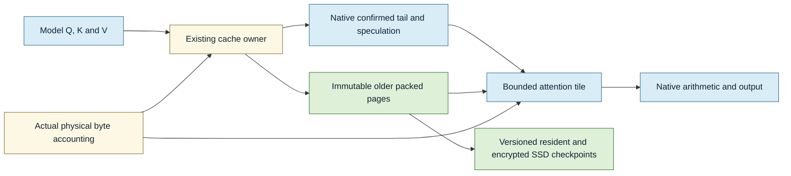

# Runtime KV compression

> Last updated: 2026-10-09

Status: **In progress** — 2026-10-09 — the serving implementation excludes MiMo under the revised scope; see [the implemented cache policy](../architecture/kv-cache-quantization.md). Model qualification and PR review remain required.

Use one rotation-assisted four-bit attention KV representation across the
current model catalog, with native recent state and an eight-bit precision
fallback. The objective is less resident KV and fewer SSD bytes while accepting
a bounded quality loss. Attention arithmetic retains its native compute
precision; packed history is read inside bounded attention tiles.

## Selected numerical policy

- Target K4/V4, token-local affine groups of 64, with FP32 scale and offset.
  Rotate keys after projection and positional transforms using deterministic
  normalized signed Hadamard blocks. Rotate queries consistently; values stay
  in their original basis in the initial implementation.
- Resolve the key rotation width from actual geometry as the smaller of 128
  and the largest power-of-two divisor of the key width. MiMo K192 uses three
  64-wide blocks, without padding. Key and value widths are independent.
- Keep the newest 128 confirmed tokens and all pending/speculative tokens
  native. Encode older committed rows once. Preserve declared sink tokens and
  learned attention-sink logits. A 128-token sliding window remains native.
- Apply the same storage policy to owning full-attention and sliding-window
  rows. Shared layers borrow their owner's representation and precision;
  borrowers do not create another KV allocation.
- Keep recurrent, convolution, assistant/MTP state and auxiliary media state
  native initially. MTP target verification still uses the selected target KV
  policy, with correct confirmation and rollback frontiers.
- Select precision at load time from an exact-artifact qualification record:
  K4/V4 target, then K8/V4, then K8/V8 if quality requires it. Native is the
  explicit rollback policy. Different formats get separate storage groups and
  checkpoint identities.

This is a SAW-style rotated affine format, not the complete TurboQuant
algorithm. The reference experiment also measures Gaussian Lloyd-Max
nonuniform candidates; it does not implement QJL residual correction.
The initial public Qwen packet favors the simpler rotated affine candidate
over the tested nonuniform four-bit variants in operator distortion. One
packet cannot choose an artifact's production quality profile.

[SAW-INT4](https://arxiv.org/abs/2604.19157) supports the serving-compatible
token-local rotation approach on its evaluated systems.
The [vLLM TurboQuant evaluation](https://vllm-project.github.io/2026/05/11/turboquant.html)
finds a useful four-bit capacity tradeoff but also latency and quality costs.
Those NVIDIA results do not qualify these model artifacts or Apple kernels.

## Expected storage savings

The old committed attention region uses 0.625 bytes per element: four-bit
codes plus eight FP32 metadata bytes per 64 elements. That is 3.2 times less
storage than BF16 and 6.4 times less than FP32. Native tails, speculative rows,
short windows, recurrence and allocator overhead reduce whole-model savings.

Illustrative 4,096-token state sizes from the verified Gemma/GPT/Qwen geometry:

| Artifact | Native tensors | K4/V4 plus native recent 128 | Reduction |
|---|---:|---:|---:|
| Gemma 4 26B QAT4 | 280 MiB | 106.41 MiB | 62.0% |
| GPT OSS 20B | 197.75 MiB | 40.81 MiB | 79.4% |
| Qwen 3.6 35B | 157.42 MiB | 104.14 MiB | 33.8% |

These are sizing calculations, not measured live allocator peaks. They assume
128 native rows per attention owner, all older rows packed, group-64 FP32
scale/offset, and native recurrent/MTP state. They exclude pending speculation,
page alignment, poison pages, descriptors and temporary workspace. Qwen's
fixed state limits short-context savings; its attention portion alone falls
from 80 to 26.72 MiB. The fixed state becomes a smaller fraction at longer
contexts.

## Coverage of the current catalog

The 2026-10-09 catalog snapshot contains 11 active IDs and 10 distinct weight
hashes. Geometry must be resolved from the loaded model and native dtype probe,
not weight-quantization labels. The complete source coverage matrix and exact
hashes are retained in the accompanying research evidence.

| Models | Attention storage to cover | Additional requirements |
|---|---|---|
| GPT OSS 20B | Full and window128, K64/V64 | BF16/FP32 layer promotion, learned sinks; window128 stays native |
| Qwen 3.5 9B, Qwen 3.5 35B, Qwen 3.6 35B, Qwen 3.8 27B | Full K256/V256 | Native recurrent/conv/MTP state and media-span semantics |
| Ternary Bonsai 27B | Full K256/V256 | Prism activation promotion and native recurrence |
| Gemma 4 26B, QAT4 and 8-bit alias | Full K512/V512 and window1024 K256/V256 | Both backends, shared assistant access and native tail/window clocks |
| Nemotron 3.5 Lightning | Full K128/V128 | Native Mamba state, MTP and observed segmented-paging requirements |
| MiMo V2.6 Flash | Full/window128, K192/V128 | SDK-owned resources, sinks, native media path and MoPD/MTP contracts |

Both paged and contiguous serving must support the selected representation.
The two 8-bit Gemma IDs currently auto-select contiguous; MiMo's default
contiguous path owns media while its optional paged path refuses media.
MiMo bypasses the generic production model adapter and validates concrete
SDK-owned caches and row ledgers. Its owned resources require an explicit
extension. A paged-only switch cannot satisfy current all-model coverage.

The exact MiMo catalog config was unavailable to the structural investigation;
its asymmetric widths are independently enforced by native serving source.
Upstream topology corroboration is not an authenticated loaded-artifact probe.
The locally inspected Nemotron config is older than the active artifact.
Both require fresh exact-artifact load verification before promotion.

## Serving implementation

1. Add the versioned codec and physical format inside existing page and
   sequence owners. Keep append, confirmed-tail aging, trim, branch, page reuse,
   cancellation and speculative rollback on one token clock. No native history
   duplicate may remain after its packed representation becomes authoritative.
2. Implement decode reads directly from packed tiles, then bounded prefill and
   rectangular target verification. Preserve GQA, unequal K/V widths, windows,
   sinks, softcap, media spans, batching and shared owners. Do not materialize
   full history or a full attention-score matrix as a compatibility fallback.
3. Extend generic paged/contiguous caches and MiMo's SDK-issued resources.
   Validate both routes and the actual selected fallback before reporting
   support. Prototype operator results do not establish this integration.
4. Price codes, metadata, native tail/pending rows, page tables, alignment,
   poison pages, recurrent/MTP state and scratch from actual allocations.
   Preserve OS, activation and minimum-KV safeguards. Report effective capacity
   only after ownership receipts and peak measurements confirm it.
5. Persist packed state with explicit codec/numerical identity. Include bits,
   grouping, rotation block/sign version, native dtype, owner/window geometry,
   tail/commit rule, assistant policy and build/metallib. Do not silently adopt
   native-format entries or repeatedly dequantize/requantize packed ancestry.

The existing seams are the native `CBv2AttendingLayerCache` contract,
`PagedLayerCache`, `CBv2LayerCache`, `PagedSequenceKV`,
`CBv2ContiguousKVBackend`, `AdmissionV2` and complete checkpoint codecs.
Provider construction lives in
`provider-swift/Sources/ProviderCore/Inference/Engine/Factory/EngineV2Factory+BackendPreparation.swift`
and byte estimation in
`provider-swift/Sources/ProviderCore/Inference/Memory/KVEstimation.swift`.
Centralized admission and protocol integration belongs in darkbloom-platform
under the repository ownership rules.

## Quality and performance selection

Use a starting acceptance budget of at most two absolute percentage points
average task-score loss and at most three on an individual benchmark. Evaluate
paired repeated heldout results with uncertainty; a small screen cannot certify
that margin. Reject severe retrieval collapse, malformed tool/JSON output or
systematic truncation. Select fallback profiles on development data, then freeze
them before heldout evaluation.

Qualify every distinct active artifact with native and compressed inference,
not only native-cache restoration. Test reasoning, executable coding,
multi-round long-context retrieval, structured/tools and supported media.
Cover B1/B4/B8, 512/4K/16K/64K and the longest admitted context, non-aligned
frontiers, window rollover, mixed prefill, MTP, prefix hit/miss, restart and
repeated restore/donate cycles. Record token counts, finish reasons, individual
regressions and MTP acceptance.

Measure actual resident and peak memory, prefill TTFT, decode TPOT, serving p95
and throughput alongside bytes. More capacity does not establish a decode
speedup. Preserve the earlier paused quantization worktree and its failed
quality/performance results as evidence; it is not the implementation baseline.

## Current evidence

The isolated research prototype encodes actual authenticated public Qwen
packet bytes, decodes them back to native BF16 and evaluates one original-query
FP32 attention operator. It includes native rotation controls, packing,
codebook, geometry and unequal-width checks. This is an offline numerical
prototype, not a serving backend or all-model quality result.

The current serving binaries and catalog remain unchanged. Runtime integration,
physical peak-memory measurements and full-model qualification are required
before changing model defaults.

Related: [prefix-cache architecture](../architecture/prefix-cache.md),
[SSD cache reference](../reference/ssd-kv-cache.md),
[inference architecture](../architecture/inference.md).
