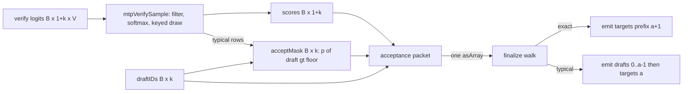

# Typical MTP acceptance for every Darkbloom MTP target

> Last updated: 2026-09-27 · commit `34162111a`

Status: **In progress** — 2026-09-26 — engine layer in mlx-swift-lm [#165](https://github.com/Layr-Labs/mlx-swift-lm/pull/165), provider layer in d-inference [#1204](https://github.com/Layr-Labs/d-inference/pull/1204); G4 measurement pending. Source: ddalcu/mlx-serve main `2a93a011e` (David's PR #427, `1ee8af3da`).

## 1. Summary

This record designs the port of the opt-in **typical** MTP acceptance rule from David's mlx-serve PR #427 (`1ee8af3da`) into Darkbloom's CBv2 engine.

- The rule is model-agnostic. It reads only the target's own next-token distribution at each verify position. One implementation in the engine covers Gemma 4, Qwen 3.5, Qwen 3.8 Flash-Next and Nemotron 3.5, because all four drafters already use the same target-prefix verify path.
- **No Metal kernel is needed, and a kernel alone would not enable it.** In mlx-serve the rule is a lazy MLX graph plus a host prefix walk (`src/generate.zig@2a93a011e`). In d-inference the acceptance decision is a host integer walk over a device packet (`EngineLoopV2+MTPFinalize.swift`). The kernel in PR #427 is the paired routed gate/up MoE kernel. It is a Qwen 3.8 pack + M5 speed-up, and it is not part of acceptance (`docs/mtp-acceptance-port.md@2a93a011e`, section "Paired routed gate/up kernel").
- The port is small because d-inference already pre-samples every verify position with the request's real sampler. That sample is exactly the correction and bonus token that typical acceptance needs. Four engine touch points, one config enum, and provider plumbing complete the work.
- Greedy requests do not change. Typical acceptance engages only for rows with `temperature >= greedyEpsilon`, the same rule as mlx-serve.

## 2. What PR #427 contains, and what ports

| Piece in mlx-serve | Location | Ports to d-inference? |
|---|---|---|
| Acceptance modes `exact | typical | tokenv3` | `src/mtp_acceptance.zig@2a93a011e` | `typical` yes. `tokenv3` no (section 9). |
| Typical rule: accept iff `p(x) > min(eps, delta * exp(-H(p)))`, `eps = 1`, `delta = 0.2` | `src/mtp_acceptance.zig@2a93a011e` | Yes, unchanged. |
| Batched device graph: gather `p(draft)`, entropy floor, correction samples in one lazy graph, one eval | `src/generate.zig@2a93a011e` | The floor and gather port. The correction graph is not needed (section 4.2). |
| Host prefix walk, no RNG consumed on the accept path | `src/mtp_acceptance.zig@2a93a011e`, `src/generate.zig@2a93a011e` | Yes, as a change to the existing walk. |
| Mode installed once at request construction, no per-token mode switch | `src/generate.zig@2a93a011e` | Yes, installed once per engine slot. |
| Greedy keeps the argmax verifier | `docs/mtp-acceptance-port.md@2a93a011e` | Yes. |
| Lossy mode refuses without batched corrections (`MtpLossyRequiresBatchedCorrections`) | `src/generate.zig@2a93a011e` | Not needed. d-inference has one verify path. |
| CLI flags `--mtp-typical <d>`, `--mtp-tokenv3 <a>` | `src/main.zig@2a93a011e` | Replaced by provider config keys (section 5). |
| Per-model `mtp_acceptance` in `model-settings.json` (Dalcu, `ffea79b29`) | `src/model_settings.zig@2a93a011e` | Yes, as `mtp_acceptance_by_model` (section 5). |
| Seeded draft and correction draws per request | `src/generate.zig@2a93a011e` (`mtpSamplingDraw`) | Already present: RNG key = (seed, requestID, output index) (`DefaultSamplerV2.swift`). |
| Paired routed gate/up verifier kernel (`MLX_SERVE_MOE_VERIFY_PAIRED_GU=1`) | `src/transformer.zig` | No. Qwen 3.8 pack + M5 only. Separate work if wanted. |

Measured in mlx-serve on M5 Max, MTP depth 3, creative sampling, thinking off, llmprobe 0.6.7, three timed samples (`docs/mtp-acceptance-port.md@2a93a011e`):

| Verifier (mlx-serve mixed pack, KV8) | Short median tok/s | ~16K median tok/s |
|---|---:|---:|
| Exact | 92.5 | 82.4 |
| Typical 0.2 | 106.3 | 86.7 |
| Change | +14.9% | +5.2% |

One read: typical acceptance gave a double-digit decode gain at short context on Qwen 3.8. The sampled-quality screen (100-question JS eval) passed 76 exact vs 78 typical. These numbers come from a different pack, KV format and sampler than Darkbloom's. Section 7 measures again.

## 3. How d-inference accepts drafts today

The mechanism is the same for all four MTP targets.

1. The drafter proposes `k` tokens `d_0 .. d_{k-1}` per row. The target scores the window `[seed, d_0 .. d_{k-1}]` in one rectangular forward, or one eager forward per column in serial mode (`EngineLoopV2+MTPTargetVerification.swift`).
2. For greedy rows, the score at each position is the target argmax. For stochastic rows, the score is a **pre-sampled target token**: temperature, top-k/top-p/min-p, softmax, then a keyed Gumbel draw with key (seed, requestID, output index) (`DefaultSamplerV2.swift`). This is exact for the output distribution at any temperature. All four drafters opt in with `supportsTargetPrefixAcceptance = true` (`Gemma4CBv2MTPDrafter.swift`, `Qwen35MTP.swift`, `Qwen4ExpMTP.swift`, `NemotronH35MTP.swift`).
3. The drafts and scores ride one flat int32 **acceptance packet**: `[B*k drafts | B*(1+k) scores | optional B*(1+k) shortlist mass ppm]` (`EngineLoopV2+MTPExecution.swift`, layout in `CBv2MTPRoundDriver.swift`). One `asArray` at finalize reads it.
4. Finalize walks each row: `while accepted < k, targets[accepted] == drafts[accepted]`, then emits `targets.prefix(accepted + 1)` (`EngineLoopV2+MTPFinalize.swift`). The last emitted token is the correction (first mismatch) or the bonus (full accept).
5. Everything after the walk is positional: KV rollback of `k - accepted` rows, carry hidden at column `confirmed - 1`, stateful-drafter `finalizeRound(confirmedInputTokens:committedDraftTokens:)`, depth controller, metrics.

Eligibility keeps stochastic rows out of MTP unless the drafter and sampler support target-prefix acceptance (`EngineLoopV2+MTPPlanning.swift`). Penalties, logit bias, logprobs, stop strings and token constraints stay excluded.

## 4. The port

### 4.1 Rule

For row `r`, verify position `i` in `0 ..< k`, with `p_i` the filtered, normalized target row that `mtpVerifySample` already builds (`DefaultSamplerV2.swift`):

```text
H_i      = -sum_v p_i(v) * ln p_i(v)        (terms with p_i(v) = 0 add 0)
floor_i  = min(1, delta * exp(-H_i))         delta = 0.2
accept_i = p_i(d_i) > floor_i                 strict, no RNG
```

When the target is confident (low entropy) the floor is near `delta`. When the target is uncertain (high entropy) the floor falls toward zero and more drafts pass. One `delta` serves every vocabulary size because the floor adapts to each row.

Walk: `a` = number of leading positions with `accept_i`. Emit `d_0 .. d_{a-1}`, then `s_a`, the pre-sampled target token at position `a`. Roll back `k - a` rows. Greedy rows keep `accept_i = (argmax_i == d_i)`.

### 4.2 Why the correction is free

mlx-serve's exact mode is p/q rejection sampling, so PR #427 had to build a correction-sampling graph. d-inference's exact mode already draws `s_i` from the filtered target row at every position with the correct per-request key. `s_a` is therefore "sample directly from p at the first rejection" and "the full-accept bonus samples from the final target row", which is the rule in `docs/mtp-acceptance-port.md@2a93a011e`. No new RNG draw, no correction graph, no change to the keyed stream.

### 4.3 Engine touch points (mlx-swift-lm fork)



| # | File (engine pin `6f3d171fb`; identical on fork main `e22fc82bd`) | Change |
|---|---|---|
| 1 | `MTP/MTPContractsV2.swift` (`CBv2MTPConfig`) | Add `public enum CBv2MTPAcceptance: Sendable, Equatable { case exact; case typical(delta: Float) }`, `static let defaultTypicalDelta: Float = 0.2`, and `public var acceptance: CBv2MTPAcceptance = .exact`. Add `acceptance` to `CBv2MTPMetrics` beside `verificationMode`. |
| 2 | `EngineLoopV2.swift` (`CBv2StepSampler`) and `DefaultSamplerV2.swift` | `mtpVerifySample` gains an optional `typical: (draftIDs: MLXArray, delta: Float)?` and returns the accept mask beside the tokens. The mask is built on the existing `probs` tensor: `pDraft = takeAlong(probs, draftIDs)`, `H = -sum(probs * log(maximum(probs, tiny)))`, `floor = minimum(delta * exp(-H), 1)`, `mask = which(greedyFlags, argmax == draft, pDraft > floor)`. One production conformer (`CBv2DefaultSampler`). |
| 3 | `MTP/EngineLoopV2+MTPTargetVerification.swift` (`scoreColumns`) | Pass the column's draft ids when `mtp.config.acceptance` is `.typical`. Rectangular: one call over the window. Serial: one call per column, masks concatenated like `scores`. Return the mask beside `scores`. |
| 4 | `MTP/EngineLoopV2+MTPExecution.swift` and `MTP/CBv2MTPRoundDriver.swift` | Append the `[B*k]` int32 mask as a fourth packet part. Update the layout comment. Zero added host syncs. |
| 5 | `MTP/EngineLoopV2+MTPFinalize.swift` | Walk on the mask when present. Build `emitted` as the accepted drafts followed by `targets[accepted]`. Every later line (rollback counts, carry column, `finalizeRound`, metrics, diagnostics `reconcile`) is positional and does not change. |
| 6 | `MTP/CBv2MTPRoundDriver.swift` | Copy `config.acceptance` into the driver and metrics. |

Device cost: one gather and one log-multiply-sum over `[B*k, V]` rows inside the graph that already runs softmax over the same rows. The ops (`log`, `exp`, `multiply`, `sum`, `maximum`, `minimum`, `takeAlong`, `which`) are standard MLX primitives that the sampler already uses (`LogitsPipelineV2.swift`). The shipped `mlx.metallib` needs no change.

### 4.4 What stays the same

- Greedy rows: bit-identical packet and walk.
- Eligibility gates (`mtpBasicEligible`), depth controller, committed-decode baseline, shortlist drafting, prefix checkpoints, paged and contiguous rollback, capture-verify commit for recurrent targets.
- The one-host-sync finalize contract.

## 5. Configuration for all models

Precedence, highest first. A missing level falls through.

| Level | Where | Value | Notes |
|---|---|---|---|
| 1 | `[backend] mtp_acceptance_by_model` | TOML table `{ "<build id>" = "typical" }` | Same shape as `engine_v2_kv_backend_by_model` (`ProviderConfig.swift`). |
| 2 | `[backend] mtp_acceptance` | `"exact"` or `"typical"` | Optional key (`MTPAcceptance?`). nil means "not set". Optional is required: `TOMLEncoder` writes every non-optional key, so a written default would shadow lower levels forever (see the `defaultEngineV2MaxConcurrent` note, `ProviderConfig.swift`, and the optional `prefillDeadlineMode` precedent ). |
| 3 | Catalog `metadata.mtp_acceptance` (phase 2, decision D3) | `"typical"` | Sibling of `metadata.spec_dec`, parsed next to `SpecDecMetadata.swift`. The catalog manifest is the only per-model channel the coordinator already pushes to providers. Coordinator `runtime_parameters` is request-side only (`coordinator/api/model_runtime_defaults.go`). |
| 4 | Built-in | `exact` | |

Resolution lives in a new `MTPAcceptancePolicy.resolve(modelID:backend:catalogMetadata:)` beside `MTPAutomaticVerificationPolicy.swift`. The slot factory passes the result into `CBv2MTPConfig(acceptance:)` at `EngineV2SlotFactory.swift`. `delta` is the engine constant `0.2`, not a production key (decision D2).

Other surfaces:

- Standalone `darkbloom local`: `StandaloneServer` takes `mtpAcceptance` beside `mtpMode` (`StandaloneServer.swift`, wired from `StartCommand+Modes.swift`).
- Benchmark harness: `DARKBLOOM_MTP_ACCEPTANCE=exact|typical[:<delta>]`, read only by `MTPProductionSession` beside `DARKBLOOM_MTP_VERIFICATION_MODE` (`MTPProductionSession.swift`). Production reads no environment variable for this. No env var can switch a lossy mode on in serving.
- Kill switch: `DARKBLOOM_CBV2_MTP=0` still disables all MTP (`MTPContractsV2.swift`).
- Telemetry: `mtp_acceptance` string in the slot posture fields (`EngineV2Bridge+MTP.swift` region), the allowlist (`TelemetryEvent.swift`) and `docs/reference/telemetry-schema.md`. The bridge comment requires all three mirrors in one change. Fleet dashboards can then split `mtp_acceptance_rate` by mode.
- Docs: one row per key in `docs/provider/cli-reference.md` table; one paragraph in `docs/architecture/inference.md` "Multi-token prediction"; this record under `docs/design/` with a README row.

## 6. Invariants

Kept:

1. MTP-on output is token-exact vs MTP-off for temperature-0 requests (`MTPContractsV2.swift`). Typical never engages for greedy rows.
2. The committed token at the first rejection and at the bonus position is a genuine target sample with the output-indexed key (`inference.md`).
3. One host sync per finalize for the acceptance packet.

Changed, per model, only when a model is configured `typical`:

4. Accepted drafts are kept when the target's probability for them exceeds an entropy-scaled floor. The emitted stream is **not** distribution-exact for the target. `inference.md` must say this in the MTP section, and the record's status line must carry the measured evidence before any catalog default moves.

## 7. Validation gates

One review per change, final at merge. Each gate is a result, pass or fail.

| Gate | What | Where |
|---|---|---|
| G1 unit | CPU oracle vs device mask. Toy rows from `src/mtp_acceptance.zig@2a93a011e` (`p = [0.5, 0.5, 0]`, `delta = 0.2`, floor `0.1`, strict `>`). dtype matrix f32/f16/bf16 and ragged step bases as in `CBv2MTPTargetSamplingMatrixTests.swift`. Mixed greedy and stochastic batch. Serial and rectangular masks equal. Packet layout with and without the shortlist part. | mlx-swift-lm `Tests/MLXLMTests` |
| G2 round | Tiny Gemma 4 target + drafter (shape of `Gemma4MTPStochasticTests.swift`). Under typical: emitted prefix equals the drafts at accepted positions, the correction equals `mtpVerifySample`'s token at that column, and KV plus scheduler state after rollback equals exact mode for the same accepted count. | mlx-swift-lm |
| G3 greedy | All existing MTP tests pass with the default `exact`. `BackendParityReport.mtpTokenExactness` (greedy self-parity) unchanged. | mlx-swift-lm, provider-swift |
| G4 measure | `MTPProductionSession` exact vs typical, same box, same seeds, per target family: decode tok/s, `mtp_acceptance_rate`, mean accepted per round, and a sampled-quality screen. Qwen 3.8 Flash-Next first (matches the mlx-serve evidence), then Gemma QAT, Qwen 3.5, Nemotron. One run each. No fleet default moves before the table exists. | box run, report under `docs/reports/` |

## 8. Layer map and sequence

One PR per repository layer.

| Layer | Repository and base | Content |
|---|---|---|
| L1 | `Layr-Labs/mlx-swift-lm`, branch `feat/typical-mtp-acceptance` from main `cb5372d` | Section 4.3 items 1 to 6 plus G1 to G3 tests. |
| L2 | `Layr-Labs/d-inference`, branch `feat/typical-mtp-acceptance` from master | Submodule pin bump, `ProviderConfig` keys and decode/encode, `MTPAcceptancePolicy`, slot factory, standalone server and start command, benchmark env, telemetry three mirrors, docs rows, this record. |
| L3 (phase 2) | `d-inference` | Provider parse of catalog `metadata.mtp_acceptance` and the `docs/reference/model-registry-format.md` contract. Registration of the key on one build goes through the existing approved registration workflow. No coordinator code change: `metadata` is a free-form map delivered as-is. |

Sequencing fact: d-inference master pins `6f3d171`, the tip of the DiffusionGemma branch that was squash-merged into fork main as #157. The tree at fork main `cb5372d` equals that pin, so the L1 commit sits on fork main and the pin jump in L2 carries only the engine change.

## 9. Out of scope

- **TokenV3**. The rule needs the drafter's proposal density `q`. Darkbloom drafters emit argmax tokens with no `q`. A one-hot `q` form is possible later at the same seam. The enum leaves room.
- **Paired routed gate/up kernel**. Qwen 3.8 Flash-Next pack contract and M5 only. Not portable to other models by construction. Separate record if wanted.
- **Per-request API field**. Acceptance mode is a per-model serving policy, not a request parameter.

## 10. Decisions

| # | Decision | Applied |
|---|---|---|
| D1 | Default acceptance everywhere | `exact`. Typical is per-model opt-in only. |
| D2 | `delta` as a production key | No. Engine constant `0.2` (mlx-serve default). Benchmark env only. Add a key when G4 shows a model needs another value. |
| D3 | Catalog fleet default (L3) | Deferred until G4 has numbers for at least one target. |
| D4 | First target to measure | Qwen 3.8 Flash-Next, then Gemma QAT. |
| D5 | Place of this record | This file, landed with the L2 PR. |

## 11. Code map

| Concern | File, symbol |
|---|---|
| Rule and modes (source) | `mlx-serve/src/mtp_acceptance.zig` (`Mode`, `typicalThreshold`, `typicalPrefix`) |
| Device floor graph (source) | `mlx-serve/src/generate.zig` (`mtpBatchedLossyGraph`) |
| Engine config and metrics | `libs/mlx-swift-lm/.../MTP/MTPContractsV2.swift` (`CBv2MTPConfig`, `CBv2MTPMetrics`) |
| Verify pre-sampling and mask | `libs/mlx-swift-lm/.../DefaultSamplerV2.swift` (`mtpVerifySample`) |
| Score columns | `libs/mlx-swift-lm/.../MTP/EngineLoopV2+MTPTargetVerification.swift` (`mtpBuildTargetVerification`, `scoreColumns`) |
| Packet | `libs/mlx-swift-lm/.../MTP/EngineLoopV2+MTPExecution.swift`, `CBv2MTPRoundDriver.swift` (`Verify.acceptancePacket`) |
| Walk and emission | `libs/mlx-swift-lm/.../MTP/EngineLoopV2+MTPFinalize.swift` (`finalizeMTPRound`) |
| Provider config | `provider-swift/Sources/ProviderCore/Config/ProviderConfig.swift` (`BackendSettings`) |
| Per-model resolution | `provider-swift/Sources/ProviderCore/Inference/MTP/MTPAcceptancePolicy.swift` (new) |
| Slot build | `provider-swift/Sources/ProviderCore/Inference/Engine/Factory/EngineV2SlotFactory.swift` |
| Standalone | `provider-swift/Sources/ProviderCore/Server/StandaloneServer.swift` |
| Benchmark | `provider-swift/Sources/ProviderBenchmark/MTPProductionSession.swift` (`makeSession`) |
| Telemetry | `provider-swift/Sources/ProviderCore/Inference/Engine/Bridge/EngineV2Bridge+MTP.swift`, `Telemetry/TelemetryEvent.swift`, `docs/reference/telemetry-schema.md` |
| Catalog metadata (phase 2) | `provider-swift/Sources/ProviderCore/SpecDec/SpecDecMetadata.swift`, `docs/reference/model-registry-format.md` |
