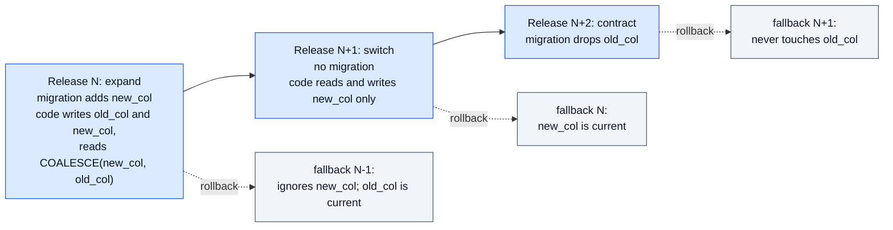

# Add a database migration

> Last updated: 2026-10-04

How to change the coordinator's Postgres schema: choose the migration kind,
write it as a numbered goose version, regenerate the checked-in schema, and
test it. Every schema change is a new version. Do not put DDL in Go strings,
and do not edit a migration that has merged. Why the rules exist is in
[schema lifecycle](../architecture/schema-lifecycle.md); applying a migration
in production is the [schema migration runbook](../operations/schema-migration.md).

## Prerequisites

- Go as pinned in `go.mod`, and Docker.
- A throwaway Postgres 17 server, the major version that production runs:

  ```bash
  docker run -d --name dinf-store-pg -e POSTGRES_PASSWORD=pg -p 55432:5432 postgres:17
  ```

- `DATABASE_URL` for the store tests ([test](test.md)):

  ```bash
  export DATABASE_URL='postgres://postgres:pg@127.0.0.1:55432/postgres?sslmode=disable'
  ```

## Steps

1. **Choose the kind.** Use the first row that fits.

   | Change | Kind | Example in the repo |
   |---|---|---|
   | Add a table, a nullable column, or a column with a constant default; add a constraint `NOT VALID` | SQL file, one transaction (the default) | Template in step 3 |
   | Several `ALTER TABLE`s on busy tables that must not hold their locks together; `DROP INDEX CONCURRENTLY`; `VALIDATE CONSTRAINT` after a `NOT VALID` add | SQL file with `-- +goose NO TRANSACTION` | `coordinator/store/schema/migrations/00001_baseline.sql` |
   | Create an index on a table that has rows in production | Go migration through `ensureConcurrentIndex` | `ensureProviderRestoreIndexes` (version 3) |
   | A step that must read data first, check a precondition, or check its own result | Go migration | `checkRetiredBackfills` (version 2) |
   | Rename or drop a column, or tighten a constraint | Two or more releases; see [expand and contract](#change-a-column-in-two-releases-expand-and-contract) | — |
   | Fix rows that a writer keeps producing | Not a migration: fix the writer | — |
   | A cleanup that needs a long lock | Manual SQL under `coordinator/store/migrations/`, applied under an approved operation | `coordinator/store/migrations/dedupe_provider_earnings.sql` |

2. **Pick the version.** Use one more than the highest version in
   `coordinator/store/schema/migrations/` and in `goMigrations`
   (`coordinator/store/postgres_migrations.go`). SQL files and Go migrations
   share one sequence. If a branch that merges before yours takes the same
   number, renumber yours before it merges.

3. **Write the migration.** Follow the part for your kind.

   *SQL file, one transaction.* Create
   `coordinator/store/schema/migrations/<NNNNN>_<short_name>.sql`, where
   `<NNNNN>` is the version with leading zeros:

   ```sql
   -- +goose Up
   ALTER TABLE providers ADD COLUMN IF NOT EXISTS example TEXT;
   ```

   Goose runs every statement and the `goose_db_version` insert in one
   transaction. A failure rolls all of it back.

   *SQL file, no transaction.* Put `-- +goose NO TRANSACTION` above
   `-- +goose Up`. Each statement commits on its own, and the version is
   recorded after the last one. A failure in the middle leaves the earlier
   statements applied, and the next boot runs the whole file again, so every
   statement must be safe to run twice (`IF NOT EXISTS`, `IF EXISTS`, or
   drop-then-add). Wrap a statement that contains `;`, such as a `DO` block,
   in `-- +goose StatementBegin` and `-- +goose StatementEnd`, as the baseline
   does.

   *Go migration.* Write a method on `PostgresStore` that takes a
   `context.Context` and returns an error, and add it to `goMigrations`:

   ```go
   step(6, s.checkExampleRows),
   ```

   It runs on the store pool with no session timeouts unless the database URL
   sets them. It runs once; keep it safe to run again after a failure, because
   a failed run is not recorded.

   *Concurrent index.* Do not put `CREATE INDEX CONCURRENTLY` in an SQL file;
   `TestSQLMigrationsDoNotBuildIndexesConcurrently` fails. Add a Go migration
   that calls `ensureConcurrentIndex` (`coordinator/store/postgres_startup.go`),
   as `ensureProviderRestoreIndexes` does:

   ```go
   step(6, func(ctx context.Context) error {
       return s.ensureConcurrentIndex(ctx, "idx_example_account",
           `CREATE INDEX CONCURRENTLY IF NOT EXISTS idx_example_account ON example (account_id)`)
   }),
   ```

   The helper returns at once when a valid index exists, refuses an invalid
   leftover by name, builds the index, and fails unless it is valid. The
   version is recorded only after it succeeds.

4. **Keep it lock-safe.** SQL migrations run with `lock_timeout` 3 s and
   `statement_timeout` 10 min ([locks and timeouts](../architecture/schema-lifecycle.md#locks-and-timeouts)).
   - Add a column without a volatile default; a nullable column with no
     default changes only the catalog.
   - Add a foreign key or check `NOT VALID`, then `VALIDATE` it in a separate
     statement of a `NO TRANSACTION` file.
   - Do not catch errors in a `DO ... EXCEPTION WHEN others` block. A failure
     must stop the boot.
   - Do not drop or rename a column, or add `NOT NULL` or a constraint to a
     table the baseline creates, in one step; see
     [destructive changes](#destructive-changes-and-the-pre-goose-fallback).

5. **Apply it to an empty database and regenerate the schema file.**

   ```bash
   docker exec dinf-store-pg createdb -U postgres schema_dump
   EIGENINFERENCE_DATABASE_URL='postgres://postgres:pg@127.0.0.1:55432/schema_dump?sslmode=disable' \
     go run ./coordinator/cmd/coordinator --migrate-only
   docker exec dinf-store-pg pg_dump -U postgres --schema-only --no-owner --no-privileges \
     --exclude-table=goose_db_version schema_dump \
     | grep -v '^\\restrict \|^\\unrestrict \|^-- Dumped from database version\|^-- Dumped by pg_dump version' \
     > coordinator/store/schema/schema.sql
   docker exec dinf-store-pg dropdb -U postgres schema_dump
   ```

   The `--migrate-only` run logs one `postgres migration` line per version
   with `"result":"applied"`, then `coordinator migrations complete`. Use the
   `pg_dump` inside the container, so that its major version matches
   production (17). Review `git diff coordinator/store/schema/schema.sql`: it
   must show only your change.

6. **Regenerate the sqlc code** if a query in `coordinator/store/queries/`
   reads the changed table: `make sqlc-generate`
   ([Write store queries with sqlc](sqlc.md)).

7. **Update the rest of the store.** Make `MemoryStore`
   (`coordinator/store/memory.go`) match, and update the docs that describe
   the changed tables ([storage](../architecture/storage.md)).

## Verify

```bash
go test ./coordinator/store -count=1 \
  -run 'TestMigrations|TestConcurrentMigrations|TestMigrateRetries|TestSQLMigrations'
```

| Test | Fails when |
|---|---|
| `TestMigrationsBuildCheckedInSchema` | `schema.sql` differs from what the migrations build |
| `TestMigrationsLeaveLegacyDatabaseUnchanged` | Versions 1 to 5 change a database that a pre-goose coordinator built |
| `TestConcurrentMigrationsApplyOnce` | Two runs at once apply a version twice |
| `TestSQLMigrationsDoNotBuildIndexesConcurrently` | An SQL file contains `CREATE [UNIQUE] INDEX CONCURRENTLY` |

Then run the store tests for the tables you changed, on both backends. CI
also runs `make sqlc-check`, which runs `TestMigrationsBuildCheckedInSchema`
and fails when the generated sqlc code is stale:

```bash
make sqlc-check
```

## Change a column in two releases (expand and contract)

A rollback starts the previous image on the migrated schema; nothing reverts
the schema ([invariants](../architecture/schema-lifecycle.md#invariants)).
`--migrate-only` can also run while the previous image still serves. So each
release must work on the schema of the release after it. A breaking change
therefore ships in steps, and the contract step ships two releases after the
expand step.



Legend: blue = release, grey = the image a rollback starts.

1. Release N, expand: add the new column, table or index as an additive
   migration. Write both shapes, and read the new one with a fallback to the
   old one. Backfill old rows in small batches, as a Go migration or a
   reviewed manual operation; a backfill in one statement holds row locks for
   its whole run.
2. Deploy release N. Ship N+1 only after N runs in production, so that N is
   the fallback image.
3. Release N+1, switch: read and write only the new shape. No migration.
4. Deploy release N+1. Ship N+2 only after N+1 runs in production.
5. Release N+2, contract: drop the old shape, or add the constraint
   (`NOT VALID`, then `VALIDATE`).

## Destructive changes and the pre-goose fallback

A coordinator image built before goose ignores `goose_db_version` and replays
its own boot DDL. `ADD COLUMN IF NOT EXISTS` brings a dropped column back, and
its `DROP NOT NULL` on `fleet_snapshots.free_for_load_gb` undoes a later
`SET NOT NULL`. Ship no contract step on a table the baseline creates while a
pre-goose image can be started as the fallback. The
[runbook](../operations/schema-migration.md#rollback) states which images are
safe.

## Troubleshooting

| Symptom | Fix |
|---|---|
| `found duplicate migration version` | Two sources share a number; renumber yours. |
| `detected 1 missing (out-of-order) migration lower than database version` on a shared database | A higher version was applied first; renumber the unapplied one above it. |
| `canceling statement due to lock timeout` three times | Another session holds the table. Stop it, or make the statement take a weaker lock. |
| `TestMigrationsBuildCheckedInSchema` fails | `schema.sql` is stale. Repeat step 5 on an empty database. |
| The `schema.sql` diff shows objects you did not add | The dump came from a database that held other objects, or from a `pg_dump` older than 17. Repeat step 5 with a new database. |
| `index ... is invalid; repair the interrupted concurrent index build before retrying` locally | Drop the index (`DROP INDEX CONCURRENTLY <name>`) and run again. |

## Related

- [Schema lifecycle](../architecture/schema-lifecycle.md) — how goose runs, locks, timeouts, failure modes
- [Apply schema migrations in production](../operations/schema-migration.md) — backup, checks, rollback
- [Write store queries with sqlc](sqlc.md) — queries generated from `schema.sql`
- [Storage](../architecture/storage.md) — what the tables hold
- [Test](test.md) — running the Postgres tests
