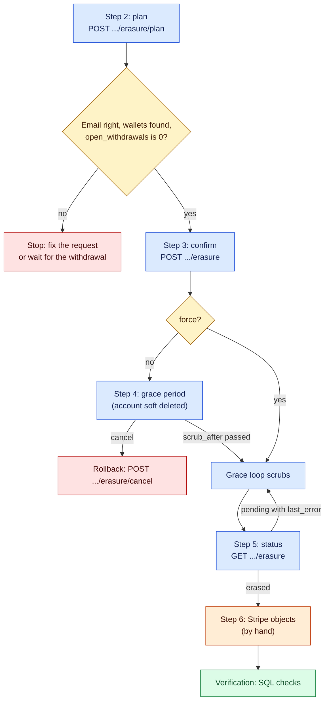

# Erase an account (GDPR)

> Last updated: 2026-10-06

Runbook for erasing the personal data of one consumer or provider account:
plan, confirm, grace period, scrub, the Stripe deletions, review of refused
credits, replay after a database restore, and cancel. How erasure works is in
[account erasure](../architecture/account-erasure.md); the route shapes are
in [API contracts](../reference/api-contracts.md#account-erasure); what the
scrub changes and keeps is in [personal-data rules](../reference/personal-data-rules.md).

## When to use

- A person asks for the erasure of their account, and support has verified
  that the request comes from the account holder.
- An admin closes an account and its personal data must go.

Do not use it to block an account for abuse; revoke its keys instead. The
scrub forfeits the balance and cannot be undone.



Blue: an API call or wait. Yellow: a check you make. Red: stop or roll back.
Orange: work in Stripe. Green: done.

## Prerequisites

- Explicit human approval for this erasure. Every step from step 3 on
  changes production data.
- Admin access to the coordinator: the admin key
  (`EIGENINFERENCE_ADMIN_KEY`) or a Privy session of an email in
  `EIGENINFERENCE_ADMIN_EMAILS`. The request records `admin_key` or
  `account:<id>`, never an email.
- The account ID, from the support ticket or the admin console.
- The wallet addresses of the account, only if it used the retired on-chain
  payments. `payments` and `provider_payouts` have no account column, so you
  name the addresses. Give each one exactly as stored.
- No open withdrawal. The plan shows `open_withdrawals`; the confirm refuses
  with 409 `open_withdrawal`. What counts as open is in
  [configuration and constants](../reference/personal-data-rules.md#configuration-and-constants)
  (for example a Stripe payout `paid` within the last 30 days).
- Read access to the production database for the SQL checks, and write
  access with approval for the outbox updates in step 6.
- Stripe dashboard access to the platform account (step 6).

## Steps

1. Set the variables:

   ```bash
   export COORD=https://api.darkbloom.dev
   export ADMIN_KEY='<EIGENINFERENCE_ADMIN_KEY>'   # or a Privy JWT of an admin
   export ACCOUNT='<account_id>'
   ```

2. Run the plan. It is a dry run and changes no account data:

   ```bash
   curl -sS -X POST "$COORD/v1/admin/accounts/$ACCOUNT/erasure/plan" \
     -H "Authorization: Bearer $ADMIN_KEY" \
     -H "Content-Type: application/json" \
     -d '{"wallet_addresses": ["0x..."]}'
   ```

   Leave out `-d` when the account has no wallet addresses. Check:

   | Field | Check |
   |---|---|
   | `email` | It is the verified requester's email |
   | `wallets[]` | Each address has rows; all counts 0 means the address is wrong |
   | `open_withdrawals` | 0; otherwise wait for the withdrawal to end |
   | `balance_micro_usd`, `withdrawable_micro_usd` | The balance the scrub forfeits; tell the requester |
   | `rows[]` | Rows each rule will change |
   | `stripe_objects[]` | The Express accounts, Global Payouts recipients and Checkout Sessions to delete in step 6 |
   | `retained[]` | Rows kept because another account shares a machine or key |

   Keep `confirm_token`. It expires after 15 minutes (`erasureConfirmTTL`)
   and is bound to this wallet list: to change the list, plan again.

3. Confirm the erasure. Repeat the account ID, the token, the email (when
   the account has one) and the same wallet list:

   ```bash
   curl -sS -X POST "$COORD/v1/admin/accounts/$ACCOUNT/erasure" \
     -H "Authorization: Bearer $ADMIN_KEY" \
     -H "Content-Type: application/json" \
     -d '{"account_id": "'"$ACCOUNT"'", "confirm_token": "<token>", "email": "<email>", "reason": "ticket <number>", "wallet_addresses": ["0x..."]}'
   ```

   The coordinator soft deletes the user and its providers, revokes the API
   keys and provider tokens, and disconnects the account's providers. A
   provider that reconnects comes back unlinked. A Privy login of the account
   gets 403 `account_pending_deletion`. `reason` is kept: write the ticket
   number, not personal data. Errors are listed in
   [erasure confirm](../reference/api-contracts.md#erasure-confirm).

4. Wait for the grace period. The default is 30 days
   (`EIGENINFERENCE_ERASURE_GRACE`); `request.scrub_after` shows the time. The
   grace loop runs every hour and scrubs each request after its
   `scrub_after`. To scrub at once (for example when the requester asks for
   no grace period), add `"force": true` to the body in step 3.

5. Check the status:

   ```bash
   curl -sS "$COORD/v1/admin/accounts/$ACCOUNT/erasure" \
     -H "Authorization: Bearer $ADMIN_KEY"
   ```

   | Field | Meaning |
   |---|---|
   | `request.state` | `planned`: not confirmed. `pending`: soft deleted, waiting. `erased`: scrubbed. `canceled`: canceled |
   | `request.scrub_after` | Earliest scrub time |
   | `request.requested_at`, `erased_at`, `canceled_at` | When each step happened |
   | `request.last_error` | Why the last scrub failed; the loop retries one hour later |
   | `request.wallet_address_count` | Addresses stored at confirm; 0 after the scrub |
   | `request.summary.planned`, `request.summary.applied` | Row counts per rule at plan and at scrub; `applied.balance_micro_usd` is the forfeited balance |
   | `outbox[].target`, `outbox[].state` | One row per Stripe object and one `erasure_log` row; see step 6 |
   | `outbox[].has_external_id` | The row still holds a Stripe ID |
   | `refused_credits[]` | Money that arrived after the scrub; see [refused credits](#refused-credits) |

   If the state is still `pending` after `scrub_after`, read `last_error`.
   `erasure: account has a withdrawal that is not in a terminal state` clears
   when the withdrawal ends. Other errors are in
   [failure modes](../architecture/account-erasure.md#failure-modes).

6. Delete the Stripe objects by hand. No worker delivers the outbox in this
   version, so every row stays `pending`. The API does not return the Stripe
   IDs; read them with SQL:

   ```sql
   SELECT o.id, o.target, o.external_id
   FROM erasure_outbox o JOIN erasure_requests r ON r.id = o.request_id
   WHERE r.account_id = '<account_id>' AND o.state = 'pending'
   ORDER BY o.created_at, o.id;
   ```

   | `target` | In Stripe |
   |---|---|
   | `stripe_account` | Delete the Express account `acct_…` (Connect key). Stripe deletes it only when all its balances are zero |
   | `global_recipient` | Close the Global Payouts recipient account (Global Payouts key) |
   | `checkout_sessions` | Redact the listed `cs_…` sessions with Stripe Redaction Jobs (needs access from Stripe). Most can be redacted only 90 days after they were created |
   | `erasure_log` | Write the request ID, account ID and `erased_at` in the ticket; this is the record you replay after a restore |

   After each one, mark the row done (with approval):

   ```sql
   UPDATE erasure_outbox
   SET state = 'done', done_at = NOW(), external_id = '', last_error = 'done by hand: ticket <number>'
   WHERE id = '<outbox_id>' AND state = 'pending';
   ```

### Refused credits

After the scrub the balance stays zero. A credit that arrives later (a bank
returns a paid payout, a Global Payout comes back, a settlement or referral
reward lands late) is refused by database triggers and recorded in
`erasure_refused_credits`. The caller sees success, so Stripe does not
redeliver its webhook. Credits during the grace period still apply.

1. List them for one account with `GET …/erasure` (`refused_credits[]`), or
   for every account with SQL:

   ```sql
   SELECT c.id, c.account_id, c.entry_type, c.amount_micro_usd, c.reference, c.created_at, r.id AS request_id
   FROM erasure_refused_credits c
   JOIN erasure_requests r ON r.account_id = c.account_id AND r.state = 'erased'
   WHERE c.created_at > NOW() - interval '7 days'
   ORDER BY c.created_at;
   ```

2. For each row, decide where the money is. `entry_type` and `reference`
   name the source:

   | `entry_type` | `reference` | Source |
   |---|---|---|
   | `refund` | `stripe_withdraw:<id>` or `stripe_withdraw_fee:<id>` | A Stripe payout or its fee came back (`coordinator/api/billing/payouts/stripe_payouts_webhooks.go`) |
   | `refund` | `global_payout_refund:<id>` | A Global Payout came back |
   | `payout`, `provider_floor_draw` | job ID, epoch ID | Provider earnings settled late |
   | `referral_reward` | job ID | A referral share of a served request (`coordinator/billing/referral.go`) |

   The money stays with the platform (or Stripe).

3. Return it to the person by another channel if the policy requires it, or
   book it as forfeited. Record the decision in the ticket. Do not credit the
   erased account; the triggers refuse it.

A Checkout payment that completes after the scrub is not a refused credit:
the webhook answers 200, credits nothing, and logs
`stripe Checkout completed for an erased account; refund it in Stripe` with
`billing_session_id`. Refund that payment in the Stripe dashboard.

### After a database restore

A restore to a point in time before an erasure brings the erased data back.

1. List every erasure completed after the restore point. In this version the
   list is the support tickets (step 6, `erasure_log`).
2. For each account, read its state:

   ```bash
   curl -sS "$COORD/v1/admin/accounts/<account_id>/erasure" -H "Authorization: Bearer $ADMIN_KEY"
   ```

3. Act on the restored state:

   | Restored state | Action |
   |---|---|
   | 404, `planned` or `canceled` | Run steps 2 and 3 again with `"force": true` and the wallet list from the ticket |
   | `pending`, `scrub_after` passed | Nothing: the grace loop scrubs it within an hour |
   | `pending`, `scrub_after` in the future | Read the stored list (`SELECT wallet_addresses FROM erasure_requests WHERE id = '<request_id>'`), [cancel](#rollback), then run steps 2 and 3 with `"force": true` and that list |
   | `erased` | Nothing |

4. Do step 6 again for the new outbox rows. Deleting a Stripe object that is
   already gone is harmless.

## Verification

1. `GET …/erasure` shows `request.state` `erased`.
2. Run the checks below in `psql`. Every `n` must be 0:

   ```sql
   \set acct '<account_id>'
   SELECT check_name, n FROM (
     SELECT 'users: email, Privy ID, Stripe fields' AS check_name, COUNT(*) AS n FROM users
      WHERE account_id = :'acct' AND (email <> '' OR privy_user_id NOT LIKE 'erased:%'
        OR stripe_account_id <> '' OR stripe_account_status <> '' OR stripe_account_country <> ''
        OR stripe_destination_type <> '' OR stripe_destination_last4 <> '')
     UNION ALL SELECT 'api_keys.name', COUNT(*) FROM api_keys
      WHERE owner_account_id = :'acct' AND name <> ''
     UNION ALL SELECT 'provider_tokens.label', COUNT(*) FROM provider_tokens
      WHERE account_id = :'acct' AND label <> ''
     UNION ALL SELECT 'device_codes rows', COUNT(*) FROM device_codes
      WHERE account_id = :'acct'
     UNION ALL SELECT 'providers: serial, location, attestation, MDA chain', COUNT(*) FROM providers
      WHERE account_id = :'acct' AND (serial_number <> '' OR location IS NOT NULL
        OR attestation_result IS NOT NULL OR mda_cert_chain IS NOT NULL)
     UNION ALL SELECT 'provider_sessions: serial or open', COUNT(*) FROM provider_sessions
      WHERE account_id = :'acct' AND (serial_number <> '' OR disconnected_at IS NULL)
     UNION ALL SELECT 'provider_log_reports rows', COUNT(*) FROM provider_log_reports
      WHERE account_id = :'acct'
     UNION ALL SELECT 'trust rows of unshared SE keys', COUNT(*) FROM provider_trust_reuse t
      WHERE t.se_pubkey IN (SELECT se_public_key FROM providers WHERE account_id = :'acct')
        AND NOT EXISTS (SELECT 1 FROM providers o WHERE o.se_public_key = t.se_pubkey AND o.account_id <> :'acct')
     UNION ALL SELECT 'code_attestations of unshared SE keys', COUNT(*) FROM code_attestations c
      WHERE c.se_pubkey IN (SELECT se_public_key FROM providers WHERE account_id = :'acct')
        AND NOT EXISTS (SELECT 1 FROM providers o WHERE o.se_public_key = c.se_pubkey AND o.account_id <> :'acct')
     UNION ALL SELECT 'machine aliases with account scope', COUNT(*) FROM darkbloom_machine_aliases
      WHERE kind IN ('app_attest', 'legacy_se') AND scope = :'acct'
     UNION ALL SELECT 'app_attest_evidence.context', COUNT(*) FROM app_attest_evidence
      WHERE session_id IN (SELECT id FROM providers WHERE account_id = :'acct') AND context <> '{}'::jsonb
     UNION ALL SELECT 'app_attest_evidence_blobs rows', COUNT(*) FROM app_attest_evidence_blobs
      WHERE evidence_id IN (SELECT e.id FROM app_attest_evidence e
        JOIN providers p ON p.id = e.session_id WHERE p.account_id = :'acct')
     UNION ALL SELECT 'usage.request_location', COUNT(*) FROM usage
      WHERE consumer_key_hash = encode(sha256(convert_to(:'acct', 'UTF8')), 'hex') AND request_location IS NOT NULL
     UNION ALL SELECT 'inference_routes.consumer_region', COUNT(*) FROM inference_routes
      WHERE consumer_key_hash = encode(sha256(convert_to(:'acct', 'UTF8')), 'hex') AND consumer_region IS NOT NULL
     UNION ALL SELECT 'inference_routes.provider_region', COUNT(*) FROM inference_routes
      WHERE provider_id IN (SELECT id FROM providers WHERE account_id = :'acct') AND provider_region IS NOT NULL
     UNION ALL SELECT 'referrers.code', COUNT(*) FROM referrers
      WHERE account_id = :'acct' AND code NOT LIKE 'erased-%'
     UNION ALL SELECT 'billing_sessions: Checkout ID or pending', COUNT(*) FROM billing_sessions
      WHERE account_id = :'acct' AND (external_id <> '' OR status = 'pending')
     UNION ALL SELECT 'ledger_entries: Checkout ID or admin note', COUNT(*) FROM ledger_entries
      WHERE account_id = :'acct' AND ((reference LIKE 'stripe:%' AND reference <> 'stripe:erased')
        OR (entry_type IN ('admin_credit', 'admin_reward') AND reference <> entry_type))
     UNION ALL SELECT 'global_payout_recipients: country, recipient, method', COUNT(*) FROM global_payout_recipients
      WHERE account_id = :'acct' AND (country <> '' OR COALESCE(data->>'recipient_id', '') <> ''
        OR COALESCE(data->>'payout_method_id', '') <> '')
     UNION ALL SELECT 'global_payout_withdrawals: recipient, method, request', COUNT(*) FROM global_payout_withdrawals
      WHERE account_id = :'acct' AND (COALESCE(data->>'recipient_id', '') <> ''
        OR COALESCE(data->>'payout_method_id', '') <> '' OR COALESCE(data->'request', '{}'::jsonb) <> '{}'::jsonb)
     UNION ALL SELECT 'stripe_withdrawals.stripe_account_id', COUNT(*) FROM stripe_withdrawals
      WHERE account_id = :'acct' AND stripe_account_id <> ''
     UNION ALL SELECT 'balances not zero', COUNT(*) FROM balances
      WHERE account_id = :'acct' AND (balance_micro_usd <> 0 OR withdrawable_micro_usd <> 0)
     UNION ALL SELECT 'erasure_requests: wallet list kept', COUNT(*) FROM erasure_requests
      WHERE account_id = :'acct' AND wallet_addresses <> '{}'
   ) checks
   ORDER BY check_name;
   ```

   A row of a shared Secure Enclave key or machine is kept on purpose and is
   not counted here
   ([retained data](../reference/personal-data-rules.md#retained-data)).

3. For each wallet address you named, both counts must be 0:

   ```sql
   \set wallet '0x...'
   SELECT
     (SELECT COUNT(*) FROM payments WHERE consumer_address = :'wallet' OR provider_address = :'wallet') AS payments_rows,
     (SELECT COUNT(*) FROM provider_payouts WHERE provider_address = :'wallet') AS provider_payouts_rows;
   ```

4. A Privy login with the old identity creates a new, empty account.

## Rollback

Only during the grace period: while `request.state` is `pending` and before
`scrub_after`.

```bash
curl -sS -X POST "$COORD/v1/admin/accounts/$ACCOUNT/erasure/cancel" \
  -H "Authorization: Bearer $ADMIN_KEY"
```

The user and its provider rows are live again, and `request.state` is
`canceled`. API keys and provider tokens stay revoked: the user makes new keys
and links the machines again. A 409 `erasure_conflict` means `scrub_after`
has passed or the request was never confirmed.

After the scrub there is no rollback. The data is gone from the live
database by design. Do not restore a backup to undo an erasure.

## Staged external resources

A Stripe response that arrives after confirmation is retained in the outbox
without restoring the local object. Do not process outbox rows for `pending`
or `canceled` requests: the grace period remains reversible. After cancellation,
any later erasure collects those staged IDs into its own cleanup set. The
status response may therefore show retained staging on a canceled request.
Mechanism: [concurrent writes](../architecture/account-erasure.md#concurrent-writes-and-late-external-results).

## Related

- [Account erasure](../architecture/account-erasure.md): mechanism, invariants, failure modes
- [Personal-data rules](../reference/personal-data-rules.md): rule table, retained data, constants
- [API contracts: account erasure](../reference/api-contracts.md#account-erasure): fields and errors
- [Configuration](../reference/configuration.md): `EIGENINFERENCE_ERASURE_GRACE`
