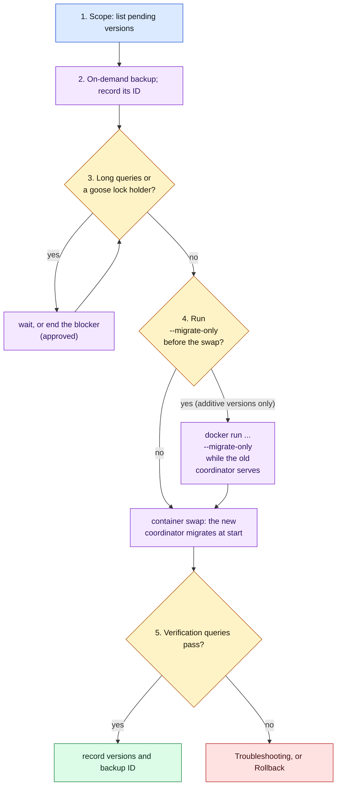

# Apply schema migrations in production

> Last updated: 2026-10-04

Runbook for applying the goose migrations of a coordinator candidate to the
production database (Cloud SQL for PostgreSQL 17 in `darkbloom-mainnet`, read
replica `d-inference-prod-pg17-ro`): scope the change, back up, check for
long queries, apply, verify, and roll back. The container swap itself is
[Deploy the coordinator](coordinator-deploy.md). How the migrations run is
[schema lifecycle](../architecture/schema-lifecycle.md).

## When to use

- The candidate commit adds goose versions that production does not have.
- The first deploy of a coordinator built with goose; also follow the
  [first cut-over checklist](#first-production-cut-over-to-goose).
- A coordinator exited at boot with `store: run migrations`.

## Prerequisites

- Explicit human approval for each production mutation in this runbook: the
  backup, the `--migrate-only` run, the container swap, and every repair
  statement ([operations rule 1](README.md)). Without it, an agent runs only
  the read-only queries.
- `gcloud` with IAM on `darkbloom-mainnet` for Cloud SQL backups and IAP SSH to
  the VM `darkbloom-coordinator`.
- `psql` and a `pg_dump` 17 client, and `PROD_DB_URL` for the **primary**.
  Locks, `goose_db_version` and the migrations live on the primary; the
  replica cannot show them.
- `CANDIDATE_COMMIT`, `CANDIDATE_IMAGE` and `CANDIDATE_DIGEST` from steps 1
  and 2 of the [deploy runbook](coordinator-deploy.md#steps), and a checkout of
  `CANDIDATE_COMMIT`.

## Steps



Legend: blue = read-only, purple = needs approval, amber = decision,
green = done, red = failure path.

### 1. Scope the change

List what production has and what the candidate brings:

```bash
psql "$PROD_DB_URL" -Atc "select coalesce(max(version_id), 0) from goose_db_version;"
git ls-tree --name-only "$CANDIDATE_COMMIT" coordinator/store/schema/migrations/
git show "$CANDIDATE_COMMIT:coordinator/store/postgres_migrations.go" | grep -n 'step('
```

An error `relation "goose_db_version" does not exist` means no goose build
has run yet: this is the [first cut-over](#first-production-cut-over-to-goose).
For each version above the production maximum, write down its kind
([migration kinds](../architecture/schema-lifecycle.md#migration-kinds)) and
whether it is additive. Note every `-- +goose NO TRANSACTION` file and every
index build. A version that drops, renames or tightens something needs the
[rollback rules](#rollback) checked before you continue.

### 2. Take an on-demand backup and record its ID

```bash
PRIMARY=$(gcloud sql instances describe d-inference-prod-pg17-ro \
  --project=darkbloom-mainnet --format='value(masterInstanceName)')
PRIMARY=${PRIMARY#*:}
BACKUP_NOTE="pre-migration ${CANDIDATE_COMMIT:0:7}"
gcloud sql backups create --instance="$PRIMARY" --project=darkbloom-mainnet \
  --description="$BACKUP_NOTE"
gcloud sql backups list --instance="$PRIMARY" --project=darkbloom-mainnet \
  --filter="description='$BACKUP_NOTE'" --format='table(id,status,windowStartTime)'
```

The replica's `masterInstanceName` names the primary. Wait for status
`SUCCESSFUL`, then record the backup ID in the deploy record.

### 3. Check for long-running queries

A migration statement waits 3 s for a lock, three times; a
`CREATE INDEX CONCURRENTLY` waits for every older snapshot. Each query below
should return no rows (the second returns `0`):

```bash
psql "$PROD_DB_URL" -c "select pid, now()-query_start as runtime, state, left(query,80)
  from pg_stat_activity where state <> 'idle'
    and query_start < now() - interval '60 seconds' and pid <> pg_backend_pid();"
psql "$PROD_DB_URL" -c "select count(*) as blocked from pg_locks where granted = false;"
psql "$PROD_DB_URL" -c "select l.pid, a.state, now()-a.backend_start as connected
  from pg_locks l join pg_stat_activity a on a.pid = l.pid
  where l.locktype = 'advisory' and l.classid = 0 and l.objid = 4097083626 and l.objsubid = 1;"
```

The third query finds a holder of the goose advisory lock
(`lock.DefaultLockID = 4097083626`). If a query blocks, wait for it to end, or
end it with `pg_terminate_backend(<pid>)` under approval.

### 4. Apply the migrations

Either let the container swap apply them (step 4 of the
[deploy runbook](coordinator-deploy.md#4-swap)), or apply them first with the
database-only command while the current coordinator serves. Use the
database-only command only when every pending version is additive: the
current coordinator keeps serving on the new schema. The command runs every
pending version and does not check compatibility. It moves index builds out of
the cutover window, but it does not prove a five-second handoff.

```bash
sudo docker run --rm --network host --env-file /etc/d-inference/env \
  --entrypoint /usr/local/bin/coordinator \
  "${CANDIDATE_IMAGE%:*}@${CANDIDATE_DIGEST}" --migrate-only
```

The `--entrypoint` override is mandatory: the image's default `start.sh`
starts MicroMDM and touches persistent MDM state. The container needs no
userdata mount and publishes no port. The command seeds no admin key, starts
no listener or worker, and stops after 15 min
(`runMaintenanceCommand` in `coordinator/cmd/coordinator/maintenance.go`). Do
not start a second ordinary coordinator container.

Expected JSON log lines, in this order:

| `msg` | Fields | Meaning |
|---|---|---|
| `postgres startup phase` | `"phase":"connect","result":"applied"` | Connected and pinged |
| `postgres startup phase` | `"phase":"<index name>","result":"applied"` | One per index that versions 3 and 5 build; none when no such version is pending |
| `postgres migration` | `"version":N,"result":"applied","duration_ms":…` | One per applied version, all written after the run ends; none when nothing was pending |
| `coordinator migrations complete` | `duration_ms` | Exit 0 |

On failure the last line is `coordinator maintenance command failed` with an
`error` field, and the exit code is 1; see [Troubleshooting](#troubleshooting).
Then rerun the step 3 queries and check `/health` of the serving coordinator.
Success here is not approval to swap.

### 5. Verify

Run the [verification queries](#verification).

## Verification

```bash
# Every candidate version is recorded, once.
psql "$PROD_DB_URL" -c "select version_id, is_applied, tstamp from goose_db_version order by id;"
# No invalid or unready index remains (expect no rows).
psql "$PROD_DB_URL" -c "select c.relname, i.indisvalid, i.indisready
  from pg_index i join pg_class c on c.oid = i.indexrelid
  join pg_namespace n on n.oid = c.relnamespace
  where n.nspname = 'public' and not (i.indisvalid and i.indisready);"
# The schema matches the checked-in file of the candidate commit.
git show "$CANDIDATE_COMMIT:coordinator/store/schema/schema.sql" > /tmp/schema.candidate.sql
pg_dump "$PROD_DB_URL" --schema-only --no-owner --no-privileges --exclude-table=goose_db_version \
  | grep -v '^\\restrict \|^\\unrestrict \|^-- Dumped from database version\|^-- Dumped by pg_dump version' \
  | diff - /tmp/schema.candidate.sql
```

`goose_db_version` lists version 0 (goose writes it when it creates the table)
and then every version up to the candidate's highest. Only objects applied by
hand, such as the `request_waterfall` view
(`coordinator/store/migrations/request_waterfall.sql`), may differ in the
diff. Any other difference is a finding: record it and fix it under a separate
approved operation.

## Troubleshooting

### Lock timeout

Log: three `postgres migration hit lock_timeout; retrying` warnings, then
`partial migration error (type:sql,version:N): ERROR: canceling statement due
to lock timeout (SQLSTATE 55P03)`. Version N is not recorded; a transactional
file rolled back, and the coordinator did not serve. Find the blocker with the
step 3 queries, wait for it or end it (approved), and run step 4 again. Do not
loop restarts of the container.

### Invalid index

Log: `index <name> is invalid; repair the interrupted concurrent index build
before retrying` (versions 3 and 5, `ensureConcurrentIndex`). The build was
interrupted and left an invalid index; the version is not recorded. Under
approval, drop it without blocking writes, then run step 4 again:

```bash
psql "$PROD_DB_URL" -c 'DROP INDEX CONCURRENTLY IF EXISTS <name>;'
```

Version 4 (`ensureProviderEarningsJobIndex`) drops an invalid
`idx_provider_earnings_job` itself with a plain `DROP INDEX`. That statement
takes an `ACCESS EXCLUSIVE` lock on `provider_earnings` and runs on the store
pool without a `lock_timeout`, so run step 3 first.

### Partly applied NO TRANSACTION file

A failed `-- +goose NO TRANSACTION` file keeps the statements that committed
before the failure, and its version is not recorded. Compare the file with
`\d <table>` to see which statements took effect. The next run executes the
whole file again; its statements are written to be safe to run twice, so
rerun step 4 after you remove the cause. Do not insert a row into
`goose_db_version` by hand.

### A second coordinator waits on the lock

Only one process migrates at a time. The other one tries the advisory lock
every 5 s and, after 5 min, exits 1 with `failed to initialize: failed to
acquire lock`. Find the holder with the third step 3 query. If it is a
`--migrate-only` run or a starting coordinator, let it finish. If it is a dead
session, end it with `pg_terminate_backend(<pid>)` (approved); Postgres
releases a session lock when the session ends.

## Rollback

There are no down migrations; a rollback starts an older image on the
migrated schema ([deploy rollback](coordinator-deploy.md#rollback)). Choose
the image by these rules:

1. **A goose image is safe** when the migrations after it were additive. It
   finds its versions recorded and applies nothing.
2. **A pre-goose image** replays its own boot DDL and ignores
   `goose_db_version`. It is safe only while no destructive migration has
   applied: its `ADD COLUMN IF NOT EXISTS` brings a dropped column back, and
   its `DROP NOT NULL` on `fleet_snapshots.free_for_load_gb` undoes a later
   `SET NOT NULL`.
3. **Never start a coordinator built before the
   `backfill_withdrawable_balance_v1` marker existed**; the deploy runbook
   states this rule.
4. **Restoring the backup is a last resort.** `gcloud sql backups restore
   <backup-id> --restore-instance="$PRIMARY" --project=darkbloom-mainnet`
   overwrites the instance and loses every write after the backup. It needs
   its own approval.

## First production cut-over to goose

The first goose build records the existing schema as version 1 and applies
versions 2 to 5 once. They change nothing on a schema that the previous
coordinator built, but a lock timeout inside one of the baseline's
`DO ... EXCEPTION WHEN others` blocks is swallowed, and goose still records
version 1.

- [ ] Step 1 shows `relation "goose_db_version" does not exist`.
- [ ] The candidate's highest version is 5, so the pre-goose image stays a
      safe fallback ([rollback rule 2](#rollback)).
- [ ] The three retired-backfill markers exist
      ([deploy step 2](coordinator-deploy.md#2-pre-swap-checks-vm-and-db)).
- [ ] Backup taken; its ID is in the deploy record (step 2).
- [ ] Step 3 is clean.
- [ ] Migrations applied (step 4 or the swap). The log shows
      `postgres migration` for versions 1 to 5 with `"result":"applied"`.
- [ ] `goose_db_version` lists 0, 1, 2, 3, 4, 5.
- [ ] The invalid-index query returns no rows.
- [ ] The `pg_dump` diff shows only hand-applied objects. A missing column or
      index means a swallowed statement; apply it under a separate approved
      operation.

## Related

- [Deploy the coordinator](coordinator-deploy.md) — the container swap and its rollback
- [Schema lifecycle](../architecture/schema-lifecycle.md) — versions, locks, timeouts, failure modes
- [Add a database migration](../developer/database-migrations.md) — how migrations are written
