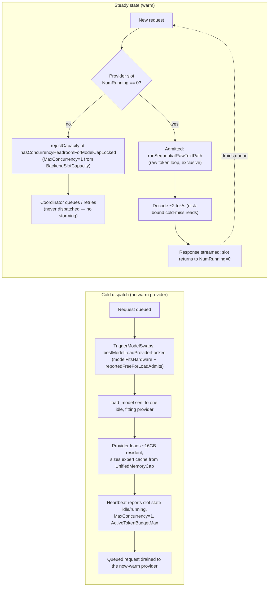

# DeepSeek-V4 single-machine serving

> **Status: PARKED (2026-07-05).** DeepSeek-V4 is no longer the rollout
> target — the flagship moved to `mlx-community/gemma-4-31b-4bit`
> ([gemma-4-31b-serving.md](gemma-4-31b-serving.md)), which is fully resident
> and needs none of the machinery below. The code and tests documented here
> remain in the tree and green (expert streaming, sequential serving, DSML
> are all opt-in per model and inert for non-DSV4 models); this document is
> kept as the reference for them.

How the provider serves DeepSeek-V4-Flash-4bit (284B-total / 13B-active MoE,
141GB on disk) on 36–128GB Apple Silicon machines. Everything below shipped on
the `deepseek-v4-flash-4bit` branch (provider) + `deepseek-v4-flash`
(Layr-Labs/mlx-swift-lm).

## Why it needs four subsystems

| Constraint | Subsystem |
|---|---|
| 141GB weights > any fleet box's RAM (and > the 90% `UnifiedMemoryCap`) | MoE expert SSD streaming |
| The batched engine can't represent DSV4's pooling/rotating hybrid caches | Sequential serving route |
| The checkpoint ships **no chat template**; tools use a bespoke DSML syntax | Native prompt encoder + DSML parser |
| M5 NAX bf16 GEMM kernels are nondeterministic for DSV4's HC shapes | `MLX_METAL_NO_NAX` release builds |

## 1. Expert SSD streaming (mlx-swift-lm `ExpertStreaming/`)

DSV4's non-expert weights are only ~4GB at 4-bit; the other ~137GB is 256
routed experts × 41 MoE layers, of which each token touches 6 per layer.

- **Load**: `StreamedWeightsModel.shouldStreamWeight` filters `switch_mlp`
  keys BEFORE shard eval (`Load.swift`) — the expert bytes are never read;
  full-model load is seconds at ~4GB resident.
- **Forward**: `StreamingQuantizedSwitchGLU` run-length groups the routed
  (token, expert) pairs (`gatherSort`), fetches missing experts via
  contiguous-per-expert `pread` (expert axis is outermost in the stacked
  tensors; fds cached per shard), stacks ≤16-expert chunks, and runs the SAME
  `gatherQuantizedMM` kernels as the resident path — parity is bit-exact.
- **Cache**: `ExpertCache` — process-wide byte-budgeted LRU keyed
  (layer, expert), ~13.6MB per mxfp4 expert. `purgeAll()` on model unload
  (wired in `BatchScheduler.stopCurrentEngine`), `setByteBudget` on load.
- **Budget** (`ExpertStreamingAdmission`, provider): everything derives from
  `UnifiedMemoryCap.hardCapBytes()` — `cache = cap − resident×1.2 −
  activationReserve − 8GB KV target`, clamped [0, 70GB]; explicit
  `expert_cache_gb` is clamped so it can never overcommit the cap. Admission
  (`ModelScanner`) advertises `resident + cache` instead of the naive
  on-disk×1.2.
- **Perf reality** (M5 Max, 70GB cache): steady-state hit rate 90–93%,
  decode 2.0–2.3 tok/s — bound by cold-miss disk reads (~0.3–0.8GB/token),
  not syscalls or GPU syncs. `DSV4_STREAM_PREFETCH` (last-token lookahead) is
  opt-in and measured useless at production cache sizes; frequency-profile
  warming is the active research lever.

Config: `[backend] stream_experts = true`, `expert_cache_gb = 0` (auto).
Env (harness/debug): `DSV4_STREAM_EXPERTS`, `DSV4_EXPERT_CACHE_GB`,
`DSV4_STREAM_CHUNK_EXPERTS`, `DSV4_STREAM_EVAL_THRESHOLD_MB`.

## 2. Sequential serving (provider `BatchScheduler`)

`Scheduler.supportsBatchedServing(cacheLayout:)` probes `model.newCache()` at
load; DSV4's `DeepseekV4LayerCache` fails it → `requiresSequentialServing`:

- Every request routes through `runSequentialRawTextPath`
  (`BatchScheduler+SequentialRawRunner.swift`): mlx-swift-lm's public
  `generateTokens` (raw token loop — CANNOT tool-parse or consume text) +
  incremental detokenization, with the same admission/billing/cancellation
  bookkeeping as the B=1 fast path. OpenAI `seed` is honored by seeding the
  RNG (sound because the route is single-request-exclusive).
- Exclusivity: one request at a time; others get the retryable
  `token_budget_exhausted` rejection. Heartbeats clamp advertised
  concurrency to 1 (`effectiveMaxConcurrentRequests`) so the coordinator
  doesn't dispatch guaranteed bounces.

## 3. Prompt encoding + DSML tools

There is no Jinja template — the official repo publishes a reference Python
encoder (`encoding/encoding_dsv4.py`) and golden fixtures instead.

- `DeepseekV4Encoding` (ProviderCoreFoundation) is a faithful Swift port:
  `<｜User｜>/<｜Assistant｜>` turns, `<think>` thinking/chat modes,
  drop-thinking rules (auto-disabled with tools), the `## Tools` DSML block,
  `<tool_result>` ordering, `reasoning_effort=max` prefix. The four official
  golden fixtures are mirrored as tests (byte-exact; tool-schema JSON compared
  semantically — Swift dictionaries can't preserve wire key order).
- Wired via `DeepseekV4TemplateFix` at all tokenization seams
  (`streamChatCompletion`, `/apply-template`, `submit`). `TemplateRenderCheck`
  runs the native encoder at scan time so `template_render_ok` stays honest.
- Tool-call output parses via `DSMLToolCallParser`
  (`ToolCallFormat.dsml`, model type `deepseek_v4*`), streaming-robust,
  multiple `invoke`s per block. Reasoning (`reasoning</think>content`,
  implicit-open think) splits via the existing deepseek parser, auto-selected
  by model type on all endpoints.

## 4. NAX

See `docs/spikes/nax-nondeterminism-m5.md`. Summary: M5 Neural-Accelerator
bf16 GEMM kernels drift run-to-run for some shapes (DSV4's hyper-connection
GEMM among them; 10-second repro `DSV4Smoke --op-stress`). Releases build with
`-Xcc -DMLX_METAL_NO_NAX`; Gemma-4 A/B measured zero cost. Re-test each mlx
bump.

## Fleet rollout

Everything above is the SINGLE-MACHINE story (`darkbloom local`). This section
covers the previously-unaudited coordinator-driven FLEET path: routing a
public/self-route request to a streaming DeepSeek-V4 provider, and pushing
`load_model` to warm one.

### Audit: coordinator memory gates vs. a streaming catalog entry

The coordinator's memory-admission gates (`coordinator/registry/scheduler.go`,
`servability.go`, `cold_dispatch.go`, `warm_pool_controller.go`) were all
written assuming a catalog entry's `size_gb` approximates the model's RESIDENT
weight footprint — correct for an ordinary model the provider loads fully into
memory. DeepSeek-V4-Flash streams ~125GB of routed-expert (`switch_mlp`)
tensors straight from disk and never loads them resident
(`ExpertStreamingAdmission.swift`), so registering the catalog with the naive
on-disk manifest total (141GB — what `TotalSizeBytes/1e9` produces) breaks
every one of those gates. Gate-by-gate, with `X = size_gb`, `Y = min_ram_gb`:

| Gate | File | Uses `X` (size_gb)? | Uses `Y` (min_ram_gb)? | With `X=141` (raw on-disk) | With `X=16, Y=36` (fixed) |
|---|---|---|---|---|---|
| `modelFitsHardware` (structural "can this box run it at all") | `scheduler.go` | Only as a `×2.0` FALLBACK when `Y` is unset | Preferred over `X` when set | N/A — `Y` governs once set | Admits any box `≥36GB`; `X` irrelevant |
| `freeMemoryAdmits` → `reportedFreeForLoadAdmits` (cold-load weight fits provider's reported `free_for_load_gb`) | `scheduler.go` | Directly: `X × 1.1176 ≤ free_for_load_gb` | Not consulted | **REJECTS on every box**, including 128GB (`141×1.1176≈157.6GB` exceeds any realistic free-for-load figure) | Admits: `16×1.1176≈17.9GB` fits comfortably on all documented tiers |
| `freeMemoryAdmits` legacy fallback (no `free_for_load_gb` reported) | `scheduler.go` | Directly: `X + kv + 4 ≤ total_memory_gb` | Not consulted | Rejects on every box `<145GB` | Admits (16 + kv + 4 easily fits 36GB+) |
| `coldTokenBudgetEstimate` / `PredictServable` tier 2 (optimistic pre-load token budget) | `servability.go` | Directly: `paddedWeights = X×1.1176`; `kvHeadroom = 0.9×total − paddedWeights − 3` | Not consulted | Collapses to **0 tokens** on boxes ≤128GB (`141×1.1176≈157.6 > 0.9×128`) → false "unservable" | Non-degenerate on every tier (e.g. 36GB: `~7.9GB` headroom ≈ 19.8k default-KV tokens) |
| `ColdSpillProviders` / `TriggerModelSwaps` / warm-pool planner cold-load target (identical `modelFitsHardware` + `reportedFreeForLoadAdmits` pair) | `cold_dispatch.go`, `registry.go`, `warm_pool_controller.go` | Same as above | Same as above | Never selects ANY provider as a `load_model` target | Selects any fitting idle provider |
| Provider-reported `Models[].SizeBytes` / `estimated_memory_gb` | wire (`ModelInfo`) | **Not read by any coordinator gate today** — only `catalogSizeGBLocked`/`catalogMinRAMGbLocked` (catalog-sourced) feed `routingSnapshot.modelSizeGB`/`minRAMGb`. The Go `protocol.ModelInfo` mirror doesn't even have an `estimated_memory_gb` field — the Swift provider's streaming-aware estimate is computed but silently dropped by `encoding/json` on decode. | — | No effect either way | No effect either way (confirms no protocol change is needed) |
| Sequential single-slot concurrency (`BackendSlotCapacity.MaxConcurrency=1`) | `concurrency_cap.go` | N/A | N/A | Already correct — provider self-reports `effectiveMaxConcurrentRequests=1` for `requiresSequentialServing`; coordinator's `maxConcurrencyForModelLocked` honors it, additional requests get `rejectCapacity` and queue (never bypassed) | Same — unaffected by this fix |
| Once WARM: `activeTokenBudgetMax`-based admission (`freeMemoryAdmits` top branch, `PredictServable`'s `liveStructuralBudget`) | `scheduler.go`, `servability.go` | Not consulted (provider-reported value is authoritative) | Not consulted | Unaffected — this path only matters while COLD | Unaffected |

**Key findings:**

1. **Provider-reported `SizeBytes`/`estimated_memory_gb` is a dead letter for
   fleet routing.** Every coordinator memory gate reads `CatalogEntry.SizeGB`/
   `MinRAMGB` (admin-configured, DB-backed), never the provider's own
   `ModelInfo.SizeBytes` — and the Go `protocol.ModelInfo` struct doesn't even
   decode `estimated_memory_gb` (there's no field for it), so the Swift
   provider's streaming-aware scan-time estimate never reaches the
   coordinator today. This means: **no protocol change is needed** — the
   fix is entirely in how the catalog is registered/synced.
2. **A single global `size_gb` is fine IF it represents the streamed
   LOAD-WEIGHT, not resident+cache.** The resident (non-`switch_mlp`) weight
   is a fixed ~16GB regardless of box size (`ExpertStreamingAdmissionTests`);
   only the expert CACHE varies per box (2.2GB on a 36GB box up to the 70GB
   ceiling on 128GB+). Every gate above that consults `size_gb` treats it as
   "the weight that must be loaded" (mirroring `coldLoadCatalogGBToMemGiB`'s
   own doc comment: "catalog on-disk size, decimal GB, TotalSizeBytes/1e9,
   UNPADDED"), so setting `size_gb ≈ 16` (the box-invariant load weight) is
   correct on every tier — a per-box resident+cache figure would NOT be
   (it's the wrong quantity for `reportedFreeForLoadAdmits`, which compares
   against the provider's generic `free_for_load_gb`, itself sized off "how
   much NEW weight can I load", not "how much will this model eventually
   occupy including its cache").
3. **`min_ram_gb` already fully decouples structural fit from `size_gb`.**
   `modelFitsHardware` prefers `min_ram_gb` whenever it's set, so setting
   `min_ram_gb=36` (the documented smallest viable tier) makes the
   "can this box run it at all" question independent of whatever `size_gb`
   is used for the load-weight gates. No code change was needed here either
   — it's a registration-parameter fix.
4. **One real code bug**: `SyncModelCatalog`
   (`coordinator/api/server.go`) computed `SizeGB` unconditionally from
   `ActiveVersion.TotalSizeBytes` (the raw on-disk manifest total) with no way
   for an operator to override it for a streaming model. Fixed by
   `catalogSizeGBForRow` (`coordinator/api/catalog_size_override.go`): it
   prefers a `catalog_size_gb` key in the model registry row's
   `runtime_parameters` (already a free-form, no-migration-needed JSON field
   used for things like `reasoning_parser`) when present and positive, else
   falls back to the historical on-disk-total computation byte-for-byte. This
   is a coordinator-internal admin-schema addition, not a
   provider↔coordinator wire-protocol change, so
   `provider-swift/Sources/ProviderCore/Protocol/` needed no changes.
5. **The provider does NOT under-advertise its ability to load DSV4.**
   `ModelLoadAdmission.maxLoadableWeightGb` is generic ("how much new weight
   can I fit"), and since DSV4 only needs to load ~16GB resident, a real
   provider reports a large `free_for_load_gb` relative to that need — the
   bug was entirely on the coordinator side (comparing that number against
   the wrong catalog `size_gb`).

### Registration parameters for DeepSeek-V4-Flash-4bit

Via `scripts/publish-model.sh` → `register-model.yml` (or the admin API
directly):

| Parameter | Recommended value | Why |
|---|---|---|
| `min_ram_gb` | `36` | Smallest box tier where resident (~19.2GB with overhead) + auto expert cache (~2.2GB) + activation reserve (3GB) + KV target (8GB) fits the 90%-of-physical unified-memory cap (`ExpertStreamingAdmissionTests.testStreamingPlanFitsUnderCapAcrossFleetBoxSizes`). Governs `modelFitsHardware` — independent of `size_gb`. |
| `runtime_parameters_json` | `{"catalog_size_gb": 16}` | `16` is the raw (unpadded) on-disk byte total of the non-`switch_mlp` tensors — the actual weight the provider reads resident. `SyncModelCatalog` applies the SAME `×1.1176` padding to it that it applies to any other model's on-disk size, so do not pre-pad this value. |
| `max_context_length` | `131072` initially | Clamp to a conservative window until fleet-wide KV-headroom-under-load is measured across all box tiers; DSV4's native context is larger, but decode at ~2 tok/s makes a very long context impractical anyway (a 131k-token completion would take hours). Raise once per-tier live KV telemetry (`kv_bytes_per_token`, `active_token_budget_max`) confirms headroom at longer windows on the smallest supported tier (36GB). |
| `capabilities` | `["tools"]` (plus `"reasoning"` if the deployment enables thinking mode) | DSML tool calls are supported (`DSMLToolCallParser`); the coordinator's tools-capability version floor and `template_render_ok` gate apply as for any other tool-capable model. |
| Pricing | Priced for a **decode-bound, ~2 tok/s** model | At 90–93% expert-cache hit rate the model is disk-bound (~0.3–0.8GB/token on cold misses), not compute-bound — throughput does not scale with concurrent requests the way a batched model's does (DSV4 serves ONE request at a time per provider; see below). Price per-token generously above the coordinator's usual floor so a provider's GPU-second economics stay viable at this rate, and set consumer-facing expectations (e.g. UI messaging) that streaming responses will be visibly slower than the rest of the fleet. |

### Which boxes are viable

| Physical RAM | Unified-memory cap (90%, or `physical−2GiB`) | Resident weight | Auto expert cache | Fits? |
|---|---|---|---|---|
| 36GB | 32.4GB | ~19.2GB | ~2.2GB | Yes — tight (resident+cache+activation+KV-target = cap exactly) |
| 48GB | 43.2GB | ~19.2GB | ~13.0GB | Yes |
| 64GB | 57.6GB | ~19.2GB | ~27.4GB | Yes |
| 96GB | 86.4GB | ~19.2GB | ~56.2GB | Yes |
| 128GB | 115.2GB | ~19.2GB | 70GB (ceiling) | Yes |

(Figures from `ExpertStreamingAdmissionTests` / `ExpertStreamingAdmission.swift`;
resident figure here includes the scanner's 1.2× overhead factor, unlike the
raw `size_gb=16` catalog registration value above — see finding #2.) Boxes
below 36GB are excluded via `min_ram_gb`; the coordinator reports them as a
permanent `model_too_large` rejection (never counted against the transient
capacity/429 signal).

### Request flow through the sequential single-slot provider

The single-slot gate is not new code — `BackendSlotCapacity.MaxConcurrency`
(provider-reported, `effectiveMaxConcurrentRequests` in
`BatchScheduler+Telemetry.swift`) already flows into
`maxConcurrencyForModelLocked` / `hasConcurrencyHeadroomForModelCapLocked`
generically (`TestPerSlotMaxConcurrencyUsesBackendReportedLoad`); this audit
adds DSV4-specific coverage
(`TestDSV4SingleSlotConcurrencyQueuesInsteadOfStorming`) confirming the
existing mechanism handles it correctly with no new code.

### Open questions

- `min_ram_gb=36` is tight (auto expert cache leaves almost no slack above the
  8GB KV target on that tier) — worth confirming with a live 36GB run before
  fleet-wide rollout; if it's unacceptably tight in practice, raise
  `min_ram_gb` to 48 rather than changing `size_gb`.
- `coldTokenBudgetEstimate`'s optimistic pre-load estimate does not know about
  the expert cache eating into the same unified-memory cap, so it can
  overstate a COLD provider's token budget until the first heartbeat after
  load reports the real `active_token_budget_max`. This is consistent with
  the servability predictor's documented fail-open design ("err toward
  serving") and self-corrects within one heartbeat interval, but is worth
  watching in `admitted_but_failed` telemetry during rollout.
- `cold_dispatch.go` / `TriggerModelSwaps` read `p.Hardware.MemoryGB` for the
  fit gate while `warm_pool_controller.go` prefers
  `BackendCapacity.TotalMemoryGB` when reported — a pre-existing minor
  inconsistency (both should normally agree on physical RAM) noted here but
  left unchanged as out of scope for this audit.
- Public model listing/display (`model_registry_handlers.go`'s
  `model.SizeGB = TotalSizeBytes/1e9`, consumed by `console-ui` and
  `install.sh`'s catalog preview) is a SEPARATE computation from
  `SyncModelCatalog`'s routing-only `registry.CatalogEntry.SizeGB` — the
  `catalog_size_gb` override only feeds the latter. So the fix is
  self-contained: users still see the true ~141GB on-disk footprint
  ("how much disk space do I need") while the coordinator's internal routing
  gates use the ~16GB load-weight. No UI change needed; verified by reading
  both call sites rather than assumed.

## Validation surface

- mlx-swift-lm: `DeepseekV4Tests` (analytic RoPE, clamps, caches, quantized
  wo_a, newCache regression), `ExpertStreamingTests` (layout parser,
  byte-range math, LRU, decode/prefill parity, lifecycle), `ToolTests` (DSML).
- provider: `SequentialServingTests`, `ExpertStreamingAdmissionTests`
  (per-box-size cap fit), `SafetensorsSizingTests`,
  `DeepseekV4EncodingTests` (golden fixtures), scanner/config suites.
- coordinator fleet path: `registry/deepseek_v4_streaming_test.go` (admission
  across the 36/48/64/96/128GB tiers, cold-load spill eligibility,
  `PredictServable` warm/cold token-budget tiers, single-slot concurrency —
  each paired with a "before the fix" regression proving the raw on-disk
  `size_gb=141` breaks the same gate), `api/catalog_size_override_test.go`
  (the `catalog_size_gb` registration override, end-to-end through
  `SyncModelCatalog`).
- Reference parity: pre-head hidden state vs mlx-lm PR #1192 at cosine 0.9987
  on real weights; resident-vs-streamed logits bit-identical.
- Live E2E (M5 Max): `darkbloom start --local` serving chat, split reasoning,
  DSML tool round-trip, tool-result follow-up, SSE streaming.
