# Generation Deadline Redesign: Latest-Master Implementation Map

**Source commit:** `78701be8c`

**Purpose:** Reconstruct the current request state machine from source before
implementing the design in
`2026-07-20-generation-deadline-incident-and-redesign.md`. This document pins
current ownership and turns every proposed invariant into a concrete transition,
persistence boundary, and adversarial test. The incident report is a design
input; this map records the source evidence used for implementation.

## Current State Machine

### Ingress, reservation, and dispatch

1. Chat/Responses requests enter `handleChatCompletions`; Completions and
   Messages enter `handleGenericInference`. Both reserve the worst-case amount
   before routing (`coordinator/api/consumer.go:1646-1662,3714-3737` and
   `coordinator/api/inference_admission.go:45-113`).
2. Normal-account reservation uses a non-request-unique ledger reference
   `reserve:<account>`; early refund similarly uses the shared
   `reservation_refund` reference (`coordinator/api/reservations.go:67-103`). A
   service account uses only an in-process aggregate hold by account
   (`coordinator/api/reservations.go:11-54`). No durable logical-request row is
   created before provider dispatch.
3. Chat/Responses creates a new `PendingRequest` for every provider attempt.
   Completions/Messages has a separate single-attempt construction path
   (`coordinator/api/consumer.go:730-795,3857-3889`). `RequestID` is therefore a
   provider-attempt identity, not a stable inbound logical-request identity.
4. `PendingRequest` exposes four independent channels: `AcceptedCh`, `ChunkCh`,
   `CompleteCh`, and `ErrorCh`. Reservation and route terminal gates are
   process-local mutex/boolean CAS equivalents
   (`coordinator/registry/registry.go:69-256,398-449`).
5. `dispatchState.run` may make up to 64 sequential attempts and may add one
   concurrently active speculative backup (`coordinator/api/dispatch.go:2424-2525`
   and `coordinator/api/consumer.go:44-76`). Each attempt gets a new UUID and its
   own pending channels.
6. The first non-boilerplate provider chunk is treated as the logical commit
   before a client write occurs (`coordinator/api/dispatch.go:466-499,1436-1588`).
   A race winner is selected by whichever attempt channel the dispatch select
   receives first; the loser is cancelled and marked separately
   (`coordinator/api/dispatch.go:1786-1986`).
7. An attempt error independently drives retry. Several speculative sub-waits do
   wait for the already-active peer, but ownership is distributed across select
   branches rather than one request-wide arbiter
   (`coordinator/api/dispatch.go:1911-1938,2081-2180`).
8. A prefill keepalive owns the `ResponseWriter` from a separate goroutine until
   `takeOver`. Its first event commits HTTP 200 but emits no attempt-specific
   semantic output (`coordinator/api/prefill_keepalive.go:39-54,75-132`).

### Provider-frame ingress

1. One provider WebSocket read loop decodes frames in wire order
   (`coordinator/api/provider.go:177-293`).
2. Accepted and chunk frames are handled synchronously on that read loop
   (`coordinator/api/provider.go:494-500`). A chunk decrypts and enters
   `ChunkCh`; channel overflow gets one 250 ms grace, then synthesizes a 499
   error and sends provider cancellation (`coordinator/api/provider.go:1536-1629`).
3. A completion frame launches `handleComplete` asynchronously because billing
   blocks on database operations. The immediately following error frame runs
   `handleInferenceError` synchronously
   (`coordinator/api/provider.go:502-515`).
4. Both terminal handlers use `Provider.RemovePending` as their effective claim
   (`coordinator/api/provider.go:1702-1717,2239-2253`). Consequently a later
   decoded error can remove the request before the earlier completion goroutine
   runs.
5. `handleComplete` performs reputation success, consumer settlement, usage
   persistence, referral distribution, provider payout, platform fee credit, and
   route completion before it signals `CompleteCh` and closes `ChunkCh`
   (`coordinator/api/provider.go:1785-2212`).
6. `handleInferenceError` classifies reputation synchronously, then sends
   `ErrorCh` and closes all terminal channels (`coordinator/api/provider.go:2262-2358`).
7. Provider disconnect cleanup closes pending channels independently of the
   provider-terminal paths. A late complete/error then finds no pending request,
   is warned, and is ignored. Only an unknown late chunk also triggers the
   cancellation nudge (`coordinator/api/provider.go:1536-1565`).

### Client delivery

1. Streaming writers receive chunks from `ChunkCh`, reconstruct terminal order
   from channel closure plus a separate `ErrorCh`, and use independent timers.
   Chat and Responses reset a 600-second timer on chunks
   (`coordinator/api/consumer.go:1823-2163`). Generic endpoints repeat a separate
   loop (`coordinator/api/generic_endpoint_stream.go:22-91`).
2. Chat streaming writes with `fmt.Fprintf`/`fmt.Fprint` and calls
   `http.Flusher.Flush` without observing write or flush failure
   (`coordinator/api/consumer.go:1872-2074`). The internal content-commit latch is
   therefore provider receipt, not outer-writer confirmation.
3. Finish, usage, signature, and `[DONE]` events are partly held until
   `ChunkCh` closes, but endpoint paths own different terminal behavior
   (`coordinator/api/consumer.go:1851-1996` and
   `coordinator/api/responses_stream.go`).
4. Non-streaming collects all provider chunks under one absolute 600-second
   context, waits separately for `CompleteCh`, then writes the assembled body
   (`coordinator/api/consumer.go:2165-2354`). Provider chunks do not mean client
   delivery, but they already disabled dispatch retry.
5. A handler timer can fire while `handleComplete` is doing billing. The timeout
   path can tell the client it failed even when completion already won the
   process-local reservation gate and charged/paid
   (`coordinator/api/consumer.go:2068-2074,2170-2351` and
   `coordinator/api/provider.go:1878-2201`).
6. Plain response writes have no per-write monotonic deadline. The server-wide
   inference write timeout is intentionally unbounded.
7. Sealed streaming buffers complete SSE events, silently discards encryption,
   inner write, and flush errors, and reports the plaintext write length as
   success (`coordinator/api/sender_encryption.go:294-337`). Sealed non-streaming
   only stages plaintext during the handler; the first encrypted outer write is
   deferred until `finish()` after the handler returns
   (`coordinator/api/sender_encryption.go:196-198,273-287,339-376`).

### Provider and CBv2

1. The provider event loop awaits `handleInferenceRequest`. That method sends
   `inference_accepted`, registers the request, and awaits cold model loading
   before it creates the detached inference task
   (`provider-swift/Sources/ProviderCore/ProviderLoop+Serve.swift:240-272` and
   `ProviderLoop+InferenceHandler.swift:256-410`). The same loop cannot consume
   the next cancel event during that await.
2. CBv2 creates `Date() + 120s` at scheduler enqueue and stores it on both
   waiting and running records
   (`libs/mlx-swift-lm/Libraries/MLXLMCommon/ContinuousBatchingV2/EngineLoopV2.swift:205-239,689-737`).
3. The same wall expires from sampled-token finalization and boundary deadline
   scanning, so waiting, prefill, decode, preemption, and backpressure all consume
   it (`EngineLoopV2.swift:1431-1441,1760-1772`). MTP has a parallel deadline
   branch in `EngineLoopV2+MTPFinalize.swift`.
4. Natural and error finishes both reconcile prompt/completion usage in
   `finishRequest` (`EngineLoopV2.swift:1475-1544`). The step watchdog instead
   finishes live streams from another queue with raw zero usage
   (`EngineLoopV2.swift:1924-1956`).
5. `EngineV2Bridge` retains reconciled usage for bookkeeping, but an error emits
   only `GenerationEvent.error(String)`; usage leaves the event stream
   (`provider-swift/Sources/ProviderCore/Inference/EngineV2Bridge.swift:945-999`
   and `InferenceTypes.swift:17-29`).
6. `MultiModelBatchSchedulerEngine` converts that string to a thrown
   `MultiModelBatchSchedulerEngineError`, again without usage
   (`provider-swift/Sources/ProviderCore/Inference/MultiModelBatchSchedulerEngine.swift:620-695`).
7. The provider catches the thrown error and sends a string/status/reason-only
   `inference_error` (`ProviderLoop+InferenceHandler.swift:792-823`).
8. Coordinator-initiated cancellation after visible output is encoded as an
   ordinary `inference_complete`; the wire has no termination reason, sequence,
   cumulative watermark, request fence, or terminal protocol version
   (`ProviderLoop+InferenceHandler.swift:837-989` and
   `provider-swift/Sources/ProviderCore/Protocol/Messages.swift:204-260`).
9. `CBv2OutputStream` already has a lock-protected idempotent terminal and a
   scheduling backpressure transition, but no backpressure-duration lease
   (`libs/mlx-swift-lm/Libraries/MLXLMCommon/ContinuousBatchingV2/OutputStreamV2.swift:19-130`).
10. Provider chunks and terminals take different outbound paths. `ChunkSender`
    queues chunks directly, bypassing the coordinator event `AsyncStream`;
    terminal/control sends synchronously flush the queued direct chunks before
    their own write (`provider-swift/Sources/ProviderCore/ProviderLoop.swift:46-73`,
    `Coordinator/ChunkSender.swift:30-48`, and
    `ProviderLoop+InferenceHandler.swift:469-480`). The barrier orders write
    submission but currently carries no sequence or prefix commitment.
    `SendHandle.sendChunk` returns no outcome, and `ChunkSender.sendChunk` reports
    only encode success; a batcher with no live connection may drop the frame.
    `ChunkBatcher.flush` waits only until frames are handed to its sink;
    `ChunkFrameWriter` then uses fire-and-forget `NWConnection.send`, whose
    `contentProcessed` callback only cancels on error
    (`Coordinator/ChunkBatcher.swift:114-141` and
    `Coordinator/ChunkFrameWriter.swift:54-79`). It is not an on-wire receipt.

### Persistence and money

1. `inference_routes` is keyed by provider request ID plus attempt and is
   best-effort telemetry, not the terminal journal. It cannot correlate all
   attempts to one inbound request (`coordinator/store/interface.go:99-237` and
   `coordinator/store/postgres.go:772-896`).
2. The process-local `FinalizeReservation` mutex cannot survive a coordinator
   crash (`coordinator/registry/registry.go:398-431`).
3. Consumer adjustment/refund, provider earning, referral reward, and platform
   fee are separate calls. They do not share one sealed intent or universal
   request/effect idempotency constraint
   (`coordinator/api/provider.go:1878-2201`).
4. `CreditWithdrawableOnce` provides a narrow `(entry type, reference)` guard,
   while generic `Credit`, `Debit`, and provider-credit calls are not one
   request-wide settlement transaction (`coordinator/store/interface_domains.go:188-236,500-536`).
5. A crash can therefore leave a reservation, consumer adjustment, provider
   payout, referral credit, and platform fee at different completion points with
   no durable effect plan from which to converge.
6. Speculative attempts have different provider request IDs and different
   process-local reservation gates. Both can claim their own attempt before loser
   cancellation and independently execute financial effects for one logical
   request (`coordinator/api/consumer.go:730-795`,
   `coordinator/api/dispatch.go:1637-1687`, and
   `coordinator/api/provider.go:1702-1717`).
7. Service holds are process-local per-account aggregates, disappear on restart,
   cannot coordinate multiple replicas, and do not cap the provider-reported
   actual charge at settlement (`coordinator/api/reservations.go:11-54` and
   `coordinator/api/provider.go:1884-1920`).
8. Provider terminal usage fields are unrestricted integers. Ordinary-account
   settlement has a coarse two-times-reservation clamp, while service settlement
   has no equivalent bound (`coordinator/protocol/messages.go:334-350` and
   `coordinator/api/provider.go:1828-1982`).
9. Linked providers use a job-ID-idempotent earning path. Unlinked providers are
   routable, but inference completion does not call `CreditProviderWallet`, so
   their documented internal-ledger payout is lost
   (`coordinator/api/provider.go:2142-2181`).
10. API-key spend caps read asynchronously persisted usage rather than active
    reservations. Concurrent admission can exceed the cap and a failed usage
    write undercounts it permanently (`coordinator/api/apikey_handlers.go:155-176`
    and `coordinator/store/postgres.go:1519-1536,1622-1640`).
11. Route persistence is not a terminal claim. Its conflict path updates an
    existing row, and terminal outcome updates remain best effort, so it cannot
    make an attempt terminal immutable (`coordinator/store/postgres.go:1714-1768`).
12. Authentication and drain gates execute outside the inference handlers. A
    401 can therefore write and return before any request outcome owner exists
    (`coordinator/api/server.go:1693-1714,2192-2208,2283-2285`).
13. Current rejection telemetry guesses `client_class=openrouter` from the
    untrusted `User-Agent`; it does not prove the exact marketplace credential
    (`coordinator/api/rejection_telemetry.go:99-101,155-181`).

### Current transition ledger

This table is the source-derived end-to-end state machine at `78701be8c`. A
dash in the durable-boundary column means process loss discards the transition.

| Event | Current transition and owner | Current durable boundary | Consequence or race |
|---|---|---|---|
| Middleware rejection | Drain/auth middleware writes directly and returns before an inference handler | Rejection logging only; no logical request | OpenRouter request denominator omits some 401/402/404 paths |
| Handler receipt | Endpoint handler parses, estimates tokens, and selects stream mode | None | No stable logical request ID or parent budget yet |
| Initial reservation | Ordinary account is debited; service account increments an in-process aggregate hold | One ledger operation for ordinary accounts; none for service holds | Debit and future request identity are not atomic; replicas cannot share service holds |
| Attempt construction | Handler creates `PendingRequest` with four channels and a new UUID | Best-effort attempt route row | UUID is an attempt/job ID; routes do not establish terminal ownership |
| Provider selection/top-up | Scheduler selects a provider; custom price may debit an attempt surcharge | Standalone debit only | Crash can strand a surcharge without a durable attempt/effect intent |
| Provider dispatch | `WriteText` blocks until the inference frame reaches the WebSocket writer | None beyond route telemetry | Send is ordered before a later cancel, but no request budget or protocol agreement crosses the wire |
| Provider intake | Provider decrypts, parses, checks admission, sends accepted, registers cancellation, and may await cold load | None | Event-loop await delays later cancel consumption; naively spawning creates cancel-before-register loss |
| Accepted | `AcceptedCh` wakes a dispatch select | None | In a speculative race, acceptance currently cancels the peer even though neither produced output |
| Preamble/first chunk | Dispatch holds boilerplate; first candidate content marks `ContentCommitted` before client write | Timing/route telemetry only | Provider receipt is mistaken for logical/client commitment |
| Speculative first event | Independent channel arm chooses a racer and cancels the other | Mutable route outcome | Channel closure can choose an empty winner before a clean completion terminal is proved |
| Attempt error before commit | Select branch removes pending, refunds attempt top-up, updates breakers, and may loop | Separate ledger credit and best-effort route update | Retry is branch-local; another active peer is handled by bespoke subloops |
| Attempt policy timeout | Timer branch removes pending, cancels provider, may strike health, and retries | Separate effects only | Local timer can race an earlier decoded terminal; clocks and retry budget reset across branches |
| Provider completion frame | Read loop launches `handleComplete` asynchronously | None at decode | A following error can synchronously remove pending first |
| Provider error frame | Read loop synchronously removes pending and sends `ErrorCh` | None at decode | Error can beat earlier completion due to goroutine scheduling |
| Streaming outer write | Endpoint-specific loop calls unchecked `Fprintf`/`Flush`; sealed adapter suppresses failures | None | No trustworthy protocol/semantic or token watermark receipt |
| Non-streaming assembly | Provider chunks are buffered and already disable dispatch retry | None | No client delivery has occurred; a later error or write failure can still refund after provider work |
| Handler/client exit | Defer parks the pending record, removes it, marks provider idle, and sends one untyped cancel | In-process 30-second holder only | Client result can end while late provider finance remains pending; restart loses the holder |
| Completion settlement | `handleComplete` validates loosely, adjusts consumer balance, records usage, pays referral/provider/platform, then signals channels | Each database call independently | Client can time out during settlement; crashes leave a partially applied effect set |
| Grace expiry | Holder refunds and records `no_terminal_after_cancel` | Standalone refund | A later terminal is ignored; no durable request fence or per-attempt acknowledgement exists |
| Startup | Coordinator restores selected provider/billing subsystems | No inference recovery scan | Active, delivery-pending, or partially settled inference work cannot converge |

### Source-to-transition acceptance map

The following map is the implementation gate for the new journal. It was
rechecked against commit `78701be8c`; a store transition is accepted only when a
current source seam, a target invariant, a commit boundary, and an adversarial
proof all line up. The incident report is not evidence for any row by itself.

#### Admission and provider send

| Current source transition | Required transition | Invariant and commit boundary | Adversarial proof |
|---|---|---|---|
| `reserveInferenceBalance` debits an ordinary account or creates a process-local service hold before routing (`coordinator/api/consumer.go:1646-1669`; `coordinator/api/reservations.go:27-40,67-86`) | `BeginRequestReservation` inserts one stable logical request, its base debit/hold effect, and the funded balance mutation | No provider selection or send exists without one request-unique durable funding intent; request row, effect, and debit/hold commit atomically | Concurrent duplicate request IDs; crash before/after commit; ordinary/service parity across two store instances; key cap with another active request |
| `dispatchOneProvider` mints a fresh UUID, scheduler registration happens in memory, and a provider-specific surcharge is debited separately (`coordinator/api/consumer.go:759-795,821-883,1292-1324`) | `BeginAttemptBeforeDispatch` inserts the distinct provider request ID, role/ordinal, provider, protocol/budget allocation, and any top-up | Every zero- or nonzero-top-up attempt is durable before encryption/send; attempt, top-up effect, balance mutation, and updated request reservation commit atomically | Zero-top-up attempt; duplicate same identity; conflicting reuse; crash after top-up but before send; concurrent top-ups at balance/key cap |
| `writeProviderInferenceRequest` returns only after the coordinator provider writer has put the frame on the socket, but nothing records that result (`coordinator/api/consumer.go:204-209,958-975`) | Create as `dispatch_pending`; call `MarkAttemptDispatched` only after the checked provider write returns success | Intent precedes send and `dispatched_at` follows checked send; a crash in the gap remains conservatively possibly dispatched | Send failure leaves `dispatch_pending`; success then mark; success/crash-before-mark recovery never assumes the provider did not receive it; duplicate mark is idempotent |
| Provider `inference_accepted` only signals `AcceptedCh`, while the speculative select can cancel the other racer on acceptance (`coordinator/api/provider.go:1679-1691`; `coordinator/api/dispatch.go:1890-1909`) | `AdvanceAttemptAdmission` advances `pre_accept -> accepted -> running` only | Admission provenance is monotonic and never selects a winner, changes money, or cancels a peer; attempt row is the checkpoint | Admission regression; duplicate acceptance; primary accepts then backup produces first semantic output and vice versa |

#### Retry and speculation ownership

| Current source transition | Required transition | Invariant and commit boundary | Adversarial proof |
|---|---|---|---|
| First content calls `commitFirstContent` and sets `committed` before any outer response write (`coordinator/api/dispatch.go:466-499,1477-1507`) | Actor assigns ingress sequence and calls `SelectRequestWinner` before enqueueing the candidate delivery event | Exactly one eligible attempt owns output; winner ID and every active peer disposition commit before an attempt-specific outer write | Primary/backup first-content race in both orders; concurrent winner CAS; ambiguous commit read-back; persisted winner with no delivery checkpoint |
| Speculative selection is encoded independently in many channel arms, and an accepted racer can win without output (`coordinator/api/dispatch.go:1791-1986`) | One request actor arbitrates all racers; acceptance is provenance only; first semantic event or a previously validated empty terminal may select | Channel scheduling cannot create multiple winners or make acceptance a winner; durable winner CAS is the only ownership boundary | Simultaneous chunks; accepted-primary/content-backup; content-primary/accepted-backup; late loser chunk/error/complete has no write, finance, or health side effect |
| A closed `ChunkCh` with no immediately visible error is treated as a committed empty response (`coordinator/api/dispatch.go:1491-1505,1822-1838,1863-1886`) | `ClaimAttemptTerminal` must first insert a valid clean terminal; only that transaction may select an empty winner | Empty output is not success merely because a channel closed; immutable terminal evidence precedes empty winner selection | Close before complete; complete/error in both wire orders; malformed or unsigned v1 complete; late empty complete from a loser |
| Pre-content error/timeout removes the pending entry, refunds the attempt surcharge, and branch-locally loops (`coordinator/api/dispatch.go:1515-1580,1692-1782,2272-2420`) | Every provider/local terminal goes through `ClaimAttemptTerminal`; retry evaluates one request-wide snapshot | First terminal claim is immutable; retry requires client live, no fence, remaining parent budget, no eligible peer, and `V0,C0`; terminal row commits before retry | Duplicate/conflicting terminal; local timeout races earlier decoded provider terminal; primary fails while backup remains live; deterministic cause; budget exhaustion |
| A non-streaming attempt becomes `committed` after receiving provider chunks even though no client bytes were written, so the current ladder cannot retry it (`coordinator/api/dispatch.go:2695-2707`; `coordinator/api/consumer.go:2174-2363`) | A retryable failed winner may call `ReleaseRequestWinnerForRetry` only after delivery is quiesced at `V0,C0` and no peer remains | Winner release and `failed_retry` disposition commit in one CAS before any replacement attempt is created | Chunks then error before non-streaming write; stale winner epoch; release with active peer; release after keepalive/lifecycle/semantic visibility; crash/ambiguous release read-back |

#### Cancellation and provider intake

| Current source transition | Required transition | Invariant and commit boundary | Adversarial proof |
|---|---|---|---|
| Every context/timeout/speculative-loser branch calls `cancelDispatch`, which removes transport ownership and then best-effort enqueues an untyped cancel (`coordinator/api/consumer.go:182-229`; `coordinator/api/dispatch.go:1558-1587,1815-1821,1978-1984`) | Actor calls `FenceRequest`, atomically freezes the request boundary and sets each live attempt to `cancel_pending` before any cancel send | Fence disables winner selection, retries, new delivery, and new attempts; request fence plus per-attempt cancel intent is durable before control I/O | Fence races winner CAS, retry timer, terminal claim, and new attempt creation; duplicate same fence; conflicting fence; missing attempt causes no partial mutation |
| `sendProviderCancel` uses `EnqueueText`; callers cannot distinguish queue acceptance, socket success, disconnect, or timeout (`coordinator/api/consumer.go:182-201`) | Checked control writer advances `cancel_pending -> on_wire` on success or `cancel_pending -> send_failed` on failure; matching terminal advances to `acknowledged`; grace advances to `grace_expired` | Cancel state never claims on-wire delivery without a checked receipt and never regresses; each transition is durable and idempotent | Full control queue; disconnected writer; write timeout; duplicate resend identity; acknowledgement before send result; stale/mismatched acknowledgement; grace race |
| Provider event loop awaits all decrypt/admission/cold-load work inside `handleInferenceRequest`, so a later cancel event cannot run; cancellation registration happens only after accepted and just before load (`provider-swift/Sources/ProviderCore/ProviderLoop+Serve.swift:240-273`; `ProviderLoop+InferenceHandler.swift:95-104,256-316`) | Provider intake actor synchronously installs request ownership and a cancellation token/tombstone before spawning async decrypt/admission/load work | Cancel-before-register and cancel-during-load both prevent engine submission; ownership is connection-generation scoped | Cancel is decoded immediately before/after request; cancel during decrypt, fast admission, cold load, stream creation, and engine submission; duplicate ID; disconnect during each phase |
| Provider cancellation removes the model reservation/task if present but emits no fence identity or acknowledgement, and unknown early cancels leave no tombstone (`ProviderLoop+Cancellation.swift:20-78`) | Matched v1 cancel carries logical/attempt IDs plus fence version/sequence/reason; provider handles duplicates idempotently and emits one signed terminal | Acknowledgement is bound to the exact request fence and attempt; unknown early cancel persists as a connection-generation tombstone | Duplicate/reordered cancel; wrong fence; cancel-before-intake; old-connection cancel after reconnect; exactly one terminal outbox entry |
| Post-commit handler exit parks `PendingRequest` for 30 seconds only in process memory, then refunds if no terminal arrives (`coordinator/api/dispatch.go:2867-2894`; `coordinator/api/settlement.go:10-58,70-121`) | Fence and final client snapshot persist immediately; each attempt later receives a provider or synthetic grace terminal | Client finalization and settlement evidence freeze independently; restart cannot erase outstanding cancellation evidence | Crash before/after park equivalent; terminal before/after grace; complete/error/grace contend for one attempt terminal; late terminal cannot reopen delivery or money |

#### Checked client delivery

| Current source transition | Required transition | Invariant and commit boundary | Adversarial proof |
|---|---|---|---|
| Streaming paths ignore every `Fprintf` result and treat `Flush` as success (`coordinator/api/consumer.go:1827-2084,2087-2171`; `generic_endpoint_stream.go:20-105`) | One delivery writer performs checked encryption, outer write, and flush under a fresh monotonic lease, then calls a durable `AdvanceDeliveryCheckpoint` | Only a successful outer receipt advances transport/protocol/semantic state or the written sequence/token watermark; checkpoint commits before terminal arbitration resumes | Short write; write error; flush error/unsupported flush; blocked write lease expiry; terminal/fence queued behind an in-flight write; keepalive advances only `T` |
| Sealed SSE stages plaintext and returns `len(p)` before the outer encrypted write; encryption failures are dropped, and outer write results are ignored (`coordinator/api/sender_encryption.go:278-336`) | Plain and sealed adapters expose the same outcome-aware receipt; sealed staging is never a delivery receipt | `V/C` describe bytes confirmed at the outer writer, not bytes accepted by an intermediate buffer | Seal failure; outer short write/error; complete and partial SSE boundaries; staged semantic frame followed by fence; plain/sealed parity |
| Non-streaming buffers all provider chunks and calls `writeJSON` once after terminal/usage assembly (`coordinator/api/consumer.go:2174-2363`) | Persist `delivery_pending` before the one bounded outer write, then `RecordDeliveryResult(confirmed|failed|indeterminate)` with an immutable client snapshot | Non-streaming remains `V0,C0` until the complete outer body succeeds; success/crash-before-checkpoint and partial write are indeterminate and never replayed | Provider chunks then retryable error; failure before first byte; short write; full write then process loss before result; recovery from `delivery_pending` |
| Handler defer can return while provider settlement continues, but no goroutine may safely use `ResponseWriter` afterward (`coordinator/api/dispatch.go:2867-2914`) | Handler-owned finalizer performs at most one bounded remaining write and freezes the client snapshot before `ServeHTTP` returns | No provider/reconciler/background goroutine writes to the client; delivery state becomes immutable at handler return | Terminal during final write; context cancellation during write; late provider completion after handler return; race detector verifies no post-return writer use |

#### Terminal order and financial settlement

| Current source transition | Required transition | Invariant and commit boundary | Adversarial proof |
|---|---|---|---|
| Coordinator decodes a completion first but launches slow `handleComplete` asynchronously; a following error synchronously removes pending and can win (`coordinator/api/provider.go:494-515,1702-1717,2239-2253`) | Read loop submits both frames synchronously to the actor; `ClaimAttemptTerminal` inserts the first validated terminal before returning | Wire/ingress order, not goroutine scheduling or database latency, determines the one terminal; unique insert-only terminal row is authoritative | Complete then error and error then complete under blocked store/settlement; duplicate same terminal; conflicting snapshot; ambiguous terminal commit/read-back |
| Provider chunk fast path reports success after enqueue, may drop with no connection, and terminal flush only hands frames to fire-and-forget `NWConnection.send` (`ChunkSender.swift:30-47`; `ChunkBatcher.swift:114-141`; `ChunkFrameWriter.swift:54-78`) | v1 sender assigns every frame a sequence/rolling commitment and returns request-scoped transport receipts; terminal outbox replays until coordinator `inference_terminal_ack` | Terminal evidence commits to ordered generated frames without claiming client delivery; request/connection scope prevents another stream's flush from serving as its receipt | Send completion failure; unbind/drop; terminal overtakes queued chunk; reconnect/replay; lost terminal ack; concurrent requests cannot borrow receipts |
| `handleComplete` performs reservation adjustment, usage insert, referral, provider payout, and platform credit as separate operations before signaling the client (`coordinator/api/provider.go:1878-2200`) | Actor first freezes attempt evidence; planner later calls `SealSettlementEffects`; reconciler claims and applies dependency-ordered effects by idempotency key | No money moves from mutable channel state; full settlement snapshot/effect DAG commits before any child effect, and request settles only after all effects converge | Crash at every child effect; duplicate worker; ambiguous database result/read-back; dependency blocked/manual-review; restart resumes without duplication |
| Each speculative `PendingRequest` has its own process-local reservation finalizer, so both provider completions can enter settlement (`registry/registry.go:398-431`; `coordinator/api/dispatch.go:1637-1687`; `coordinator/api/provider.go:1702-1717`) | Winner/loser dispositions gate the settlement planner; losers and failed retries receive explicit zero-money/not-applicable effects | Exactly one logical winner can charge or pay; attempt-local terminal evidence alone never authorizes money | Both racers complete before loser cancel; loser completes after winner settlement; failed winner release then replacement success; no loser payout/referral/platform effect |
| Service holds are in-process and actual service charge is attempted only at completion (`coordinator/api/reservations.go:11-54`; `coordinator/api/provider.go:1884-1920`) | Durable base/top-up holds count across replicas and API-key windows; collected charge is capped by applied funding | No restart/replica oversubscription and no provider-funded payout after an uncollected service charge | Two coordinators reserve concurrently; restart with live hold; charge failure; charge less/equal/greater than hold; release/refund idempotency |
| Terminal usage is provider-supplied; ordinary accounts have a coarse overage clamp while service accounts do not (`coordinator/protocol/messages.go:334-350`; `coordinator/api/provider.go:1828-1982`) | Planner validates matched protocol/signature/rolling commitment and `C <= R <= G`; charge and payout are capped at authenticated written/funded watermarks | Generated, coordinator-received, client-written, and funded bounds are distinct immutable settlement inputs | Negative/overflow decode; gaps/duplicates; altered frame/count; oversized terminal usage; reasoning/tool-only output; legacy/mismatched metadata forces conservative policy |
| Linked payout is job-id idempotent, unlinked wallet payout is not called by inference and is not job-id idempotent (`coordinator/api/provider.go:2142-2181`; `coordinator/store/postgres.go:4422-4533`) | Sealed payout effect chooses exactly one linked-account or unlinked-wallet target and depends on applied consumer charge or explicit subsidy | Every eligible winner has one idempotent payout target; payout cannot precede funding | Linked/unlinked winners; duplicate payout apply; ambiguous apply/read-back; charge failure; subsidy smaller than payout; target disappears after sealing |
| There is no inference startup recovery scan; the in-memory holder/service holds disappear (`coordinator/api/settlement.go`; `coordinator/api/reservations.go`) | `ListRecoverableRequestSettlements` plus effect claim/complete transitions resume active, fenced, delivery-pending, settling, and indeterminate rows | Recovery uses committed snapshots only, never assumes uncheckpointed write/send, and isolates unresolved ambiguity in manual review | Restart at every transaction/I/O gap; concurrent reconcilers; stale applying lease; delivery-pending recovery; manual-review rows do not hot-loop |

This trace requires two durable primitives beyond the initial store draft:
`AdvanceDeliveryCheckpoint` for checked `T/V/C` and watermark progress, and
effect claim/complete/manual-review transitions for a crash-safe reconciler. Tests
for the draft store are not accepted until those primitives and their source-
derived legal transitions exist.

#### Backend contract test derivation

Memory and PostgreSQL run the same contract cases. Each case below names the
invariant and the exact adversarial sequence derived from the source seams above;
backend-specific tests may add transaction-failure coverage but may not weaken
these assertions.

| Contract case | Named invariant | Concrete adversarial sequence and required result |
|---|---|---|
| `ReservationCommitBeforeDispatch` | Pre-dispatch journal | Seed balance; begin a request; repeat the exact call; reuse the ID with changed immutable data; attempt an insufficient reservation. Exactly one debit/base effect exists, the exact retry is a no-op, the conflict changes nothing, and the failed request has no row/effect. Repeat with service hold and API-key active reservations. |
| `AttemptCommitBeforeSend` | Every attempt exists before send | Begin primary with a top-up; retry exactly; conflict on provider identity and on ordinal/role; begin a zero-top-up attempt; mark on-wire twice. Top-up/request/effect commit once, zero-top-up still has a row, and failed/conflicting sends never create an extra debit. |
| `AcceptanceDoesNotSelectWinner` | Acceptance is not a winner | Create primary and backup; advance primary then backup to accepted/running in both orders; read request. Winner remains empty and both dispositions remain eligible until output arbitration. Admission regression and post-terminal advance fail. |
| `WinnerCASIsSingleAndCancelsLosers` | One output winner and loser isolation | Race primary and backup winner calls with distinct ingress boundaries; one CAS succeeds, the other conflicts; all peers become speculative losers with cancel intent before any delivery checkpoint. A loser checkpoint and new attempt while the winner exists fail; late loser terminal records evidence only. |
| `TerminalClaimIsImmutableAndIngressOrdered` | One terminal per attempt and wire-order precedence | Claim terminal A; replay identical hash; replay conflicting hash; claim another attempt with lower/equal ingress; race complete/error order. First ordered claim wins, exact replay is a no-op, conflicting/lower claims fail, and no mutable request/effect state is changed by the rejected terminal. |
| `EmptyCompletionValidatesBeforeWinner` | Empty completion validates first | Close-like state alone performs no transition; atomically claim a valid zero-output complete with empty-winner selection; try malformed/error/nonempty variants. Only the valid terminal transaction can establish the empty winner and loser dispositions. |
| `RetryReleaseRequiresInvisibleQuiescentWinner` | Retry can release only an invisible winner | Select winner; claim its retryable terminal while peer remains nonterminal; release fails. Claim peer terminal; release succeeds and increments epoch; exact replay is a no-op; replacement attempt can then be created. Repeat after `V1` and `C1`, after a fence, and with stale epoch: every release fails. |
| `FenceIsAtomicAndCancelReceiptsAreBound` | Request-wide fence and checked cancellation | Fence with a missing/duplicate live-attempt set; verify no mutation. Fence exact live set; verify request boundary plus per-attempt `cancel_pending`; apply wrong fence receipt, legal on-wire, duplicate on-wire, acknowledgement, regression, and grace race. Only exact monotonic fence-bound transitions succeed. |
| `CheckedDeliveryCheckpointIsMonotonic` | Checked outer write is the only visibility checkpoint | Select winner; advance keepalive `T1/V0/C0`; attempt semantic progress from loser and without outer receipt; advance winner `V1/C1` with valid prefix; replay; regress sequence/tokens/commitment; fence then submit beyond-boundary write. Only checked winner progress advances written watermarks; keepalive never advances `V/C`; stale/beyond-fence writes fail. Run the same sequence for plain and sealed writer fixtures above the store contract. |
| `NonStreamingDeliveryPendingRecoversIndeterminate` | Non-streaming is undelivered until full write | Persist `delivery_pending`; simulate crash before result; finalize as indeterminate; attempt confirmed replay/body replay. Indeterminate snapshot freezes once and forbids retry or later delivery mutation. Separate success and failure sequences freeze confirmed/failed snapshots. |
| `SettlementSealRequiresAllEvidenceAndFunding` | Coherent split snapshots and payout bounded/funded | Freeze client snapshot while an attempt lacks terminal evidence; sealing fails. Add evidence; try payout without charge/subsidy dependency, excess payout, loser payout, missing target, cyclic dependency, and charge beyond reservation; all fail atomically. A valid winner charge/refund/payout plan seals once and cannot be replaced. |
| `EffectClaimsRespectDependenciesAndLeases` | Payout cannot precede funding and reconciler is crash-safe | Seal charge then dependent payout; first claim is charge; second worker cannot steal live lease; expire lease and reclaim; complete charge; only then claim payout; repeat completion idempotently. Indeterminate is reclaimable, manual-review stops recovery, and request reaches settled only when every effect is applied/not-applicable. |
| `RecoveryUsesCommittedSnapshotsOnly` | Startup recovery is conservative | Create reserved, dispatched, fenced, delivery-pending, settling, settled, and manual-review rows; list recoverable with limit/order. Only nonterminal/nonmanual committed rows return; no uncheckpointed send/write is promoted, and stale applying effects require lease expiry before reclaim. |

### Target transition ledger

| Event | Required transition and owner | Commit-before boundary | Failure behavior |
|---|---|---|---|
| Middleware admission/rejection | Outer outcome envelope starts the monotonic budget and exact-credential classification before drain/auth; rejection freezes one client outcome | Rejection snapshot before metric emission | No inference journal or money for rejected requests; exactly one request terminal metric |
| Inference admission | `BeginRequestReservation` creates logical request, budget origin, base effect, and funded debit/hold | Transaction before routing or client delivery | No dispatch on failure or ambiguous-unresolved funding |
| Attempt creation/top-up | Actor creates distinct attempt identity; store applies any attempt top-up | Attempt row/allocation and applied top-up before send | Attempt remains unsent and top-up is safely refundable/reconcilable |
| Provider send | Store marks `dispatch_pending`; provider writer confirms on-wire submission; actor advances to `dispatched` | Intent before send and confirmation after send | Crash in the gap is possibly dispatched; connection teardown stops provider work and recovery seals `no_terminal`, never assumes no send |
| Provider intake | Provider installs intake owner/token synchronously, then begins async setup | In-memory connection-generation record before first suspension | Cancel/disconnect tombstone wins before decrypt/load/engine work proceeds |
| Accepted | Provider sends accepted; coordinator actor advances provenance only | Attempt provenance checkpoint | Does not select/cancel a speculative winner |
| Candidate chunk | Actor validates active eligibility, performs durable winner CAS if needed, assigns ingress sequence, and queues one delivery event | Winner CAS before any attempt-specific outer write | Loser/late event is counted and dropped before write, finance, route, or health |
| Outer streaming write | Single writer applies a fresh lease and checks encryption/write/flush | Successful checkpoint advances `T/V/C` and written sequence/token watermark | Error/lease expiry records client-gone fence; crash undercounts to previous checkpoint |
| Provider terminal | Actor validates IDs/version/signature/usage, assigns sequence, and invokes insert-only terminal claim | Attempt terminal row before accepted claim/health/finalization | Invalid v1 evidence remains conservative; ambiguous claim is read back; later terminal cannot overtake |
| Attempt-local timeout/disconnect | Local source submits a typed terminal through the same actor | Same insert-only terminal claim | Earlier provider terminal wins; retry waits for writer quiescence and active-peer arbitration |
| Retry | Actor evaluates one request-wide predicate, durably releases any failed `V0,C0` winner epoch, then creates a replacement attempt | Failed attempt `failed_retry` zero-money disposition and cleared winner epoch before replacement send | No retry after `V1`, `V2`, `C1`, client gone, fence, active peer, deterministic cause, exhausted budget, or uncertain release |
| Request control fence | Actor records cause/boundary, snapshots active attempts, stops timers/winners/retry/delivery, and persists `cancel_pending`; the control writer advances each to `on_wire` or `send_failed` | Request fence and per-attempt cancel intent before cancel sends; on-wire state only after checked control write | Retry the same fence identity while in-process; client result can finalize after bounded delivery quiescence; settlement evidence remains open |
| Client finalization | Handler-owned finalizer persists pending, performs at most one bounded remaining write, and freezes delivery/client snapshot | `delivery_pending` before write; immutable result after | Non-streaming post-write crash is indeterminate; no response write after handler return |
| Cancel acknowledgement/grace | Each matched provider terminal or synthetic grace terminal claims only its own attempt | Append-only attempt evidence | Cannot reopen client output/retry/health; missing/invalid winner evidence forces conservative finance |
| Settlement sealing | Planner validates watermarks/funding and freezes settlement snapshot/effect DAG | One transaction after all required evidence | Open evidence remains recoverable; no financial operation executes from an unsealed plan |
| Effect application | Reconciler applies idempotent effects in dependency order | Per-effect applied/not-applicable/indeterminate state | Ambiguous result is read by key; payout cannot precede charge/subsidy; request settles only after convergence |
| Startup recovery | Scanner resumes active/fenced/delivery-pending/settling rows by state | Existing committed snapshots/effects only | Never assumes uncheckpointed delivery; stale work refunds or enters manual review by explicit rule |

### Exact OpenRouter outcome owner

The outer inference wrapper, not an endpoint handler, owns one outcome envelope
from receipt through the final status/in-band result. `OpenRouterCredentialClassifier`
matches only operator-configured API-key IDs and SHA-256 fingerprints of the
exact high-entropy bearer credential, using constant-time comparison. It runs on
the bearer before auth so a disabled/expired known credential's 401 is still
attributable, then confirms the public key ID after successful auth. Missing or
unknown credentials are not guessed as OpenRouter. `User-Agent`, endpoint, and
service-account role are never authoritative.

Only `openrouter_exact=true` plus the final envelope snapshot feeds the new
published-contract metric. The request row stores only that boolean/channel enum,
never a bearer token or fingerprint. The shadow metric includes attributable
401/402/404, all specified 5xx/timeouts/mid-stream errors, and documented
exclusions; it starts in the measurement phase and runs beside the existing
counter before any actor, finance, or deadline behavior cutover.

## Target Ownership

### Request actor

The outer inference wrapper creates a monotonic `RequestClock` at HTTP route
receipt, before drain/auth. After successful admission, one `RequestActor`
inherits that original start and receives a stable logical request ID, logical
budget, endpoint/mode, and one ordered event stream. It owns:

- Active attempts and immutable attempt terminal claims.
- Global ingress sequence assignment.
- Winner selection before any attempt-specific write.
- Request-wide fence and per-attempt cancellation/grace state.
- `T`, `V`, `C`, `W`, client liveness, received/written watermarks.
- Retry/speculation arbitration across the whole active set.
- Exactly-once typed provider-health classification submission.
- The immutable client-decision snapshot handed to the finalizer; later
  cancellation evidence belongs to the settlement snapshot.

Provider read loops submit decoded events synchronously to the actor. Slow money,
route, or telemetry work begins only after the actor returns a claim decision.
The provider pending map remains transport lookup, never terminal authority.

`claimTerminal` is not complete at an in-memory CAS. It assigns the ingress
sequence, validates the terminal, and calls an insert-only bounded
`ClaimAttemptTerminal` store primitive. The primitive commits the immutable
attempt row before the actor returns `accepted` or starts health/finalization.
It never uses an upsert. An ambiguous database result is resolved by reading the
unique attempt key and comparing the snapshot hash. Until resolved, that attempt
is process-locally `claim_uncertain`; later frames cannot overtake it. A crash
with no committed row recovers as `no_terminal`, never as a different accepted
wire terminal.

Winner selection is also durable before client delivery. First candidate output
uses `SelectRequestWinner`, a request-row compare-and-set from null winner to the
active attempt that atomically marks every other active racer
`speculative_loser`. A clean empty completion may perform the same transition
only in the transaction that has already inserted its valid terminal.
`inference_accepted` advances admission provenance but never selects a winner or
cancels a speculative peer.

Winner selection has the same indeterminate-commit discipline as terminal
claiming. The actor enters `winner_uncertain` before the store call and permits no
attempt-specific delivery or competing selection until a read by logical request
ID proves the committed winner or proves absence and permits retrying the CAS.
After a crash, the persisted winner and peer dispositions are authoritative; if
no delivery checkpoint exists, recovery treats the disconnected client
conservatively rather than selecting another winner.

A winner is not necessarily final for non-streaming or a failed pre-write
stream. When that winner later accepts a retryable terminal and the quiesced
request is still `V0,C0`, client-live, unfenced, and peer-free,
`ReleaseRequestWinnerForRetry` compare-and-sets the request's current
`(winner_attempt_id,winner_epoch)` to `(null,next_epoch)` and changes that
attempt's disposition from `winner` to `failed_retry` in one transaction. It has
`winner_release_uncertain` read-back semantics identical to selection. Only
after release is proved may a replacement attempt be created; cancelled
speculative losers from the old epoch never reactivate or inherit output,
sequence, or watermark state.

### Delivery writer

One request-owned delivery writer serializes keepalives, winner chunks, and the
final endpoint terminal. Every accepted write has a sequence boundary and a
fresh monotonic write lease. A checked outer write/flush receipt alone advances
`V`, `C`, or the client-written watermark. Plain and sealed adapters implement
the same contract; sealed staging is not delivery. The finalizer remains owned
by the live HTTP handler until its bounded outer write returns; no goroutine may
touch `ResponseWriter` after `ServeHTTP` returns.

A socket write and its database checkpoint cannot be atomic. Streaming recovery
uses the last previously committed watermark and therefore only undercounts a
write that succeeded immediately before a crash. A non-streaming final write
first persists `delivery_pending`; success followed by a crash before its
checkpoint recovers as `delivery_state=indeterminate`, never as confirmed and
never by replaying the body. A write returning partial bytes plus an error is
also indeterminate, marks the client gone, confirms no semantic watermark for
that write, and forbids retry.

### Request finalizer

The finalizer receives the actor's post-quiescence client-decision snapshot. It
persists `delivery_pending`, performs the one remaining bounded
terminal/non-streaming write, records an immutable delivery/client snapshot,
updates the logical route, and emits one terminal request metric. It cannot
change attempt ownership, retry, winner, or health.

A request fence deliberately has two freeze points. Client delivery can finalize
immediately after bounded quiescence. Per-attempt cancellation acknowledgements
or grace expiries append immutable attempt evidence later. Only after every
fenced attempt has terminal evidence does the settlement planner freeze a
separate immutable settlement snapshot and seal financial effects. Late evidence
cannot alter the already-frozen client result.

### Durable settlement

`request_settlements` exists before routing. `request_attempts` records every
provider job before send, whether or not it needs a top-up. `attempt_terminals`
is a separate insert-only table that records one accepted terminal per attempt.
`settlement_effects` records every money movement with a unique idempotency key.
An effect worker/reconciler applies sealed effects and converges after restart.
No settlement branch calls an unjournaled money-moving operation. Reservation
intent and its balance hold are request-unique and durable for both ordinary and
service accounts, so replicas share the same admission bound. Provider payout
has an explicit linked-account or unlinked-wallet target; neither path may be
omitted after an eligible attempt is sealed.

The store exposes composite primitives rather than composing standalone ledger
calls in API code:

- `BeginRequestReservation` atomically inserts the request, base effect, and
  ordinary debit or durable service hold.
- `BeginAttemptBeforeDispatch` unconditionally inserts the provider request ID,
  provider identity, ordinal/role, protocol version, remaining budget allocation,
  initial provenance/cancel state, and any request/attempt-unique top-up; a
  top-up is applied in that transaction before the provider frame may be sent.
- `ClaimAttemptTerminal` inserts into the separate `attempt_terminals` table and
  commits before claim acceptance.
- `RecordDeliveryResult` freezes the client-delivery snapshot independently of
  later cancellation acknowledgements.
- `SealSettlementEffects` freezes the settlement snapshot and complete effect
  DAG in one compare-and-set transaction only after all required attempt evidence
  exists and binds it to the immutable client-snapshot hash.

Effect dependencies are enforced by the applier, not just by planner arithmetic.
A provider payout cannot apply until its consumer charge is applied, or until a
separately sealed explicit-subsidy effect covering the difference is applied.
Referral and platform effects depend on the collected charge. Refund/release
effects conflict with charge effects for the same reserved amount. Active durable
holds count against API-key spend caps and service-account admission across
replicas.

## Invariant-to-Implementation Matrix

| Invariant | Concrete owner/transition | Durable boundary | Adversarial proof |
|---|---|---|---|
| One terminal per attempt | `RequestActor.claimTerminal` assigns sequence and synchronously commits an insert-only terminal before work dispatch | Unique immutable `attempt_terminals` row `(client_request_id, provider_request_id)` | Complete/error in both orders, duplicates, disconnect race, crash before/after durable claim, ambiguous commit read-back |
| One output winner | First eligible semantic event performs `SelectRequestWinner`, atomically selecting winner and loser dispositions before delivery | Winner ID plus peer dispositions | Primary/backup concurrent first output, crash/ambiguous CAS read-back, persisted winner with no delivery |
| Retry can release only an invisible winner | `ReleaseRequestWinnerForRetry` atomically clears exact winner epoch and seals `failed_retry` only at quiesced `V0,C0` | Request winner epoch plus attempt disposition | Non-streaming chunks then error, streaming pre-write failure, crash/ambiguous release, stale-epoch release |
| Acceptance is not a winner | Accepted advances provenance only; both racers remain eligible | Attempt admission state | Primary/backup accepted in both orders, then opposite racer produces first output |
| Empty completion validates first | Insert immutable clean terminal before same-transaction empty-winner CAS | Attempt terminal plus request winner | Empty close without complete, late empty complete from loser, malformed complete |
| Loser isolation | Winner CAS marks peers `speculative_loser`; later events fail eligibility before side effects | Loser attempt disposition | Late loser chunk/complete/error cannot write, settle, or update health |
| Active-peer arbitration | Failed attempt remains request-local while another eligible peer exists | Each attempt terminal, request stays active | Primary error with live backup launches no replacement |
| Wire-order terminal precedence | Provider read loop waits for synchronous actor claim result | Attempt terminal hash immutable | Earlier complete beats later error despite blocked completion work |
| Request-wide fence | Fence atomically records cause/boundary, snapshots attempts, disables timers/writes/winners/retries | Request fence plus per-attempt `cancel_pending -> on_wire | send_failed -> acknowledged | grace_expired` | Fence races every timer/terminal; queue full, write failure, duplicate resend, crash before on-wire ack |
| Client and settlement freeze separately | Client snapshot freezes after delivery quiescence; cancellation evidence appends until settlement snapshot seals | Immutable client snapshot, append-only attempt rows, later immutable settlement snapshot | Delayed acknowledgement supplies usage without delaying or rewriting client terminal |
| Bounded quiescence | Terminal/fence waits for delivery events through its boundary; every outer write has a lease | Delivery pending/recorded snapshots | Queued write, blocked write, lease expiry |
| Pre-dispatch journal | Atomically create request row, base effect, and debit/hold before provider send | Composite `BeginRequestReservation` transaction | Crash before/after reservation and dispatch |
| Every attempt exists before send | `BeginAttemptBeforeDispatch` records even zero-top-up attempts | Durable `request_attempts` row with protocol/budget/provider/cancel state | Platform-price attempt crash before/after provider write |
| Durable reservation bound | Apply each request/attempt-unique top-up transaction before dispatch; cap validated charge to applied funding | Request reservation row and applied base/top-up effects | Restart, ambiguous commit, concurrent replicas, ordinary/service parity |
| Retry has no money | Failed-retry and speculative-loser dispositions seal zero charge/payout | Explicit not-applicable effects | Retry chain contains only winner financial effects |
| Retry predicate | Actor checks `V0,C0`, client live, no fence, no peer, typed cause, remaining budget | Retry decision on attempt/request snapshot | Property test all predicate dimensions |
| `V1/V2/C1` forbid retry | Delivery receipt updates state before terminal arbitration resumes | Confirmed delivery checkpoint | Lifecycle/semantic/terminal visibility followed by retryable fault |
| `T` separate from `V/C` | Keepalive advances only `T`; final status selection reads `T` | Transport state in request row | Exhaustion at `T0` versus keepalive `T1` |
| Finalizer owns terminal protocol events | Role/lifecycle held until semantic co-emit; finish/usage/DONE/completed held until finalization | Final delivery snapshot | No terminal event before arbitration or after `V2` |
| Non-streaming is undelivered until full write | Body staging leaves `V0,C0`; bounded full outer write may confirm `V2`, fail, or become indeterminate | `delivery_pending` before write; confirmed/failed/indeterminate after | Chunks then error retry; write failure; success/partial write then crash before checkpoint |
| Charge bounded by authenticated written watermark | Carry engine token count through every transform; verify signed rolling prefix and terminal; validate `C <= R <= G`; billable completion is capped at `C` | Three watermarks, written prefix commitment, and terminal verification | Gaps, duplicates, transform holdback, altered early count/frame, oversized usage, signed-field tampering |
| Payout bounded and funded | Planner rejects excess payout and applier blocks payout until collected charge or covering subsidy is applied | Sealed effect DAG and application prerequisites | Property test plus charge/manual-review/payout scheduling permutations |
| Every eligible provider has one payout target | Effect planner selects linked account or unlinked wallet before sealing | Provider payout effect with target kind | Linked/unlinked completion and retry after ambiguous apply |
| Spend caps include in-flight reservations | Admission reads durable settled spend plus active request holds | Request hold indexed by API key and period | Concurrent requests at cap and crash/restart |
| Admission provenance | Accepted/running events monotonically advance attempt provenance | Attempt snapshot | Pre-accept 429 versus accepted/running 503 |
| Neutral policy/capacity/cancel health | Typed cause maps through one health funnel | Health outcome on immutable attempt terminal | Policy deadlines/cancel never strike or clear |
| Backpressure remains distinguishable after transport loss | Provider outbox replays signed terminal; actor waits bounded v1 replay grace before synthetic disconnect | Durable attempt terminal then hash ack; otherwise grace terminal | Receipt expiry, reconnect replay, lost ack, provider process loss/grace fault |
| Fault real stalls/watchdog/teardown | Typed cause maps exactly once to eligible health trackers | Same attempt row | Each fault updates each tracker at most once |
| Late terminal is telemetry only | Actor rejects event for terminal/ineligible attempt before side effects | Existing immutable snapshots | Late terminal after refund, retry, grace, finalization |
| Coherent staged snapshots | Route/client status project the immutable client snapshot; billing projects the later settlement snapshot; provider health projects immutable attempts | Each snapshot hash immutable, with explicit parent hashes | Delay/block any acknowledgement, write, or effect and verify no earlier snapshot mutates |
| Conservative legacy fallback | Missing metadata disables partial billing and natural-success clearing where ambiguous | Metadata version and fallback outcome | All old/new coordinator-provider combinations |
| One logical budget | Request actor starts once; each attempt receives remaining relative duration | Request start/budget and attempt allocation | Retry never resets budget; expiry fences all attempts |
| Monotonic internal clocks | Outer wrapper starts once; coordinator/provider use wall time only for telemetry and injected monotonic clocks in-process | Relative durations on wire; restart conservatively expires live/grace state | Auth latency included; wall jumps; restart during cancellation grace; every coordinator/provider/CBv2 lease |
| Exact OpenRouter denominator | Outer envelope classifies only configured key ID/fingerprint and emits one shadow terminal metric before behavior changes | Final envelope snapshot with channel enum only | Valid, disabled, expired, missing, spoofed-UA, and unknown credentials across 401/402/404/5xx/in-band results |

## Provider Intake And Cancellation Ownership

Making `ProviderLoop.run` nonblocking requires registration before concurrency.
For every decoded inference request, the actor synchronously installs an intake
record and cancellation token before the first suspension, then starts an intake
task that owns decrypt, admission, accepted, cold load, engine submission, and
terminal emission. Duplicate request IDs are rejected without replacing the
first owner.

Cancellation records a tombstone even if the intake task has not reached
admission or model loading. A cancel-before-register race is resolved under the
same actor operation: either the intake record exists and is cancelled, or its
tombstone exists and a later duplicate/intake observes cancellation before work.
Disconnect cancels every intake and engine task and retains tombstones until the
connection generation is discarded. Registration, task attachment, engine
submission, and terminal send all re-check the token. This closes the current
cancel-during-cold-load defect without creating a new cancel-before-register
window.

On the coordinator, request fencing first commits each attempt as
`cancel_pending`. It then uses the checked control-lane `WriteTextControl`, not
fire-and-forget `EnqueueText`. Only a successful on-wire return advances
`cancel_pending -> on_wire`; queue saturation, disconnected writer, and write
failure advance to `send_failed`. Bounded retries reuse the identical
`(client_request_id, provider_request_id, request_fence_version,
request_fence_seq, cancel_reason)` identity, and the provider handles duplicates
idempotently without sending a second terminal. Grace may expire from any of the
three states. On coordinator restart the old WebSocket is gone, so all pre-restart
pending/on-wire cancel states expire immediately to conservative synthetic
`no_terminal` instead of waiting for an acknowledgement to a possibly unsent
frame.

### Provider terminal transport recovery

Outcome-aware chunk receipts are keyed by
`(connection_generation, provider_request_id, chunk_seq)`. Each inference intake
gets a request-scoped `OutcomeAwareChunkSender` bound to the current connection
generation; the underlying `ChunkBatcher` may remain shared but
`flushThrough(connectionGeneration, providerRequestID, sequence, lease)` waits
only for that attempt's receipts. Unbind fails every unresolved receipt for that
connection generation. Concurrent requests may both use sequence one without
sharing barriers or commitments.

If queue/transport backpressure produces a signed v1 terminal but the connection
cannot carry it, the provider places the immutable terminal in an in-memory
terminal outbox before tearing down the session. On reconnect it replays outbox
terminals before accepting new inference work. A new
`inference_terminal_ack(client_request_id, provider_request_id, terminal_hash)`
control message is sent by a v1 coordinator only after the insert-only durable
terminal claim; the provider removes an outbox entry only on a matching ack.
Replay can therefore duplicate a wire terminal but never an accepted terminal or
effect.

For a version-matched attempt, provider WebSocket loss transitions to
`transport_lost_pending_terminal` for a short monotonic replay grace instead of
immediately claiming `provider_disconnect`. A replayed signed
`backpressure_timeout/backpressure` remains non-retryable under the selected
policy and neutral for health. Grace expiry claims the genuinely unexplained
`provider_disconnect` fault. The actor is indexed by stable logical/provider
request IDs rather than the old connection's pending map, so replay on the new
connection can reach it. Coordinator restart remains conservative: recovery has
already fenced/refunded live requests, records replay as late telemetry, and
returns the ack so the provider can discard it.

## Protocol Field Contract

Protocol metadata is accepted only after the coordinator actor, durable claim,
delivery, and journal paths exist in shadow mode. Every field below is optional
on the JSON wire and emitted only when the coordinator requests
`terminal_protocol_version=1` on that provider attempt.

| Direction and field | Transition justified | Persistence boundary | Compatibility rule | Adversarial proof |
|---|---|---|---|---|
| Request `terminal_protocol_version` | Selects matched terminal/cancel/deadline semantics for this attempt | `request_attempts` protocol version before send | Missing/zero is legacy; provider never emits v1 metadata unsolicited | Old/new matrix and coordinator rollback |
| Request `client_request_id` | Binds distinct provider jobs to one logical actor and settlement | Request row and attempt foreign key | Legacy provider may ignore; coordinator still correlates locally | Retry/speculation retain one logical ID and distinct job IDs |
| Request `request_budget_ms` | Allocates only the parent budget remaining at attempt send | `request_attempts` allocation committed before send | Honored only for matched v1; absent uses legacy timing and is excluded from deadline canary | Queue/retry/cold-load time reduces allocation; retry never resets it |
| Cancel `cancel_reason` | Distinguishes client cancel, client gone, and request-budget fence | Request fence cause | Legacy provider ignores; coordinator treats legacy post-fence completion conservatively | Every fence cause before/after output |
| Cancel `request_fence_version` and `request_fence_seq` | Binds one per-attempt acknowledgement to the fence that requested it | `request_attempts` cancel state; `on_wire` only after checked control write | Echo required for matched partial settlement; absent/mismatch refunds and is neutral | Stale/duplicate/mismatched acknowledgement, send failure, and grace race |
| Coordinator `inference_terminal_ack` IDs/hash | Lets a provider discard a replayable terminal only after durable coordinator claim | Insert-only `attempt_terminals` row precedes ack | Sent only to the provider that negotiated v1; duplicates are idempotent | Lost ack, reconnect replay, duplicate terminal, coordinator restart/late ack |
| Chunk `chunk_seq` | Orders provider emission independently of channel scheduling | Last received and written sequence | Missing disables partial settlement; legacy delivery may continue | Gap, duplicate, regression, loser sequence, chunk/terminal race |
| Chunk `completion_tokens_cumulative` | Carries exact CBv2 generated-token progress through bridge, parser, and SSE transforms | Received value; written value only after checked semantic outer write | Missing disables partial settlement | Empty-token deltas, held reasoning/tool frames, coalescing, failed write |
| Chunk `chunk_commitment` | Authenticates this exact sequence/token/frame prefix after the terminal signature arrives | Last received and written rolling commitment | Required for matched v1 partial settlement | Alter an early count/frame while preserving final usage |
| Terminal `terminal_metadata_version` | Selects canonical validation and health/billing interpretation | Immutable attempt terminal | Missing is `legacy_unverified`; unknown version is conservative | Unknown and downgraded versions cannot enable v1 policy |
| Terminal `terminal_kind` | States complete/error/cancelled independently of the legacy message envelope | Immutable attempt terminal | Required for v1 and never derived by Go; absent is legacy | Cancellation on complete/error envelopes and contradictory kind/cause tuples |
| Terminal `terminal_cause` and `terminal_stage` | Classifies retry, status, finance, and health from one fact | Insert-only attempt terminal | Legacy maps only to conservative coarse outcome | Every cause/stage and malformed enum |
| Terminal `terminal_source` and `admission_state` | Distinguishes provider/engine/local sources and pre-accept/accepted/running capacity | Insert-only attempt terminal | Missing admission never upgrades a failure to early 429 | Same capacity cause at each provenance stage |
| Error `attempt_usage` | Preserves reconciled prompt/completion/reasoning work on non-success terminals | Insert-only attempt terminal | Ignored for partial finance unless matched, signed, and valid | Deadline/watchdog/cancel usage through both Swift bridges |
| Complete `termination_reason` | Distinguishes stop/length from cancellation or budget expiry after output | Insert-only attempt terminal | Missing natural success is not inferred after a request fence | Stop, length, cancellation after output, budget after output |
| Terminal `last_emitted_chunk_seq` and `last_emitted_completion_tokens` | Closes the provider emission stream and bounds received/written evidence | Insert-only attempt terminal | Missing/inconsistent disables partial finance | Terminal below/above observed sequence or generated usage |
| Terminal `cancel_reason`, `request_fence_version`, and `request_fence_seq` | Proves a cancellation terminal acknowledges this cause and request fence | Insert-only attempt terminal and per-attempt ack state | Required only for matched cancellation acknowledgement | Replay or alter an acknowledgement from an older fence/request/cause |
| Terminal `response_hash` | Retains and binds the existing semantic-response proof | Attempt terminal | Existing legacy hash/signature scope is unchanged | Existing consumer proof fixtures and semantic hash mismatch |
| Terminal `terminal_transcript_hash` | Binds the ordered v1 provider frames, sequences, and cumulative watermarks | Attempt terminal; coordinator recomputes incrementally over decrypted frames | Required only for matched v1; no persisted response content | Missing/reordered/altered frame or watermark |
| Terminal `terminal_hash` and `terminal_signature` | Authenticates cause, usage, watermarks, IDs, fence, and response hash | Verification result stored with immutable terminal | Separate from legacy `se_signature`; required for v1 partial finance and natural-success health clearing | Tamper every signed field and use wrong request/provider key |

The v1 wire vocabularies are closed and decoded strictly:

- Terminal kind: `complete`, `error`, `cancelled`.
- Terminal cause: `stop`, `length`, `capacity_unavailable`,
  `attempt_budget_exhausted`, `prefill_stall`, `decode_stall`,
  `backpressure_timeout`, `step_watchdog`, `request_cancel_ack`,
  `client_cancel_ack`, `provider_disconnect`, `engine_teardown`,
  `provider_error`, `request_error`, `no_terminal`, `speculative_loser`.
- Terminal stage: `provider_setup`, `waiting`, `prefill`, `decode`,
  `backpressure`, `settlement`.
- Terminal source: `provider`, `engine`, `coordinator_policy`,
  `coordinator_disconnect`, `coordinator_grace`.
- Admission state: `pre_accept`, `accepted`, `running`.
- Completion termination reason: `stop`, `length`,
  `client_cancelled_after_output`, `client_gone_after_output`,
  `request_budget_exhausted_after_output`.
- Cancel reason: `client_cancelled`, `client_gone`,
  `request_budget_exhausted`. Unknown values invalidate v1 metadata.

Synthetic coordinator terminals use the same internal vocabularies but are never
forged as provider-signed wire facts.

For v1, `terminal_kind` is an explicit optional JSON field on both existing
`inference_complete` and `inference_error` messages and is required when
`terminal_metadata_version=1`. Go never derives it from the envelope. Legal
provider-signed tuples are:

| Envelope | Kind | Cause/reason | Required related fields |
|---|---|---|---|
| `inference_complete` | `complete` | cause and `termination_reason` are both `stop` or both `length` | source=`engine`; fence version/seq zero; cancel reason empty |
| `inference_complete` | `cancelled` | `client_cancel_ack` with `client_cancelled_after_output` or `client_gone_after_output`; or `request_cancel_ack` with `request_budget_exhausted_after_output` | matching cancel reason and nonzero v1 fence; at least one semantic provider frame was emitted |
| `inference_error` | `cancelled` | `client_cancel_ack` or `request_cancel_ack` | matching cancel reason and nonzero v1 fence; termination reason empty; no semantic provider frame was emitted |
| `inference_error` | `error` | capacity, attempt budget, stall, backpressure, watchdog, teardown, provider error, or request error | termination reason/cancel reason empty and fence zero; stage/source must match the cause |

`no_terminal`, `speculative_loser`, coordinator policy/disconnect/grace sources,
and synthetic `provider_disconnect` are internal actor facts, not
provider-signed v1 tuples. `prefill_stall` requires stage `prefill`,
`decode_stall` requires `decode`, and `backpressure_timeout` requires
`backpressure`; other cause/stage/source compatibility is enumerated in a shared
Go/Swift validation table. Complete/cancelled tuples require admission at least
`accepted`; pre-accept errors cannot claim running work. Any contradictory tuple
invalidates v1 metadata before terminal claim side effects, while the legacy
envelope may still drive conservative client cleanup.

`terminal_hash` and `terminal_transcript_hash` are exactly 64 lowercase hex
characters on JSON. `terminal_signature` is standard padded base64 of a strict
DER ECDSA signature. `terminal_hash` is compared to SHA-256(canonical bytes) but
is not itself part of the canonical payload.

CBv2 already exposes token IDs on each `.delta`. `EngineV2Bridge` maintains the
exact cumulative completion-token count, includes it on `GenerationEvent.chunk`,
and preserves it through `MultiModelBatchSchedulerEngine`. Provider response
transforms attach the latest cumulative count to each emitted semantic frame;
role/keepalive/finish-only frames do not create a billable checkpoint.

Every provider chunk frame participates in the v1 sequence and transcript,
including role/lifecycle, reasoning scaffolding, finish, usage, `[DONE]`, and
other frames that the coordinator buffers, transforms, or suppresses. These
frames advance received sequence/commitment state but do not by themselves
advance semantic `C` or the billable token watermark. A delivery event records
the source provider-frame boundary it resolves; when the finalizer co-emits,
transforms, or suppresses buffered frames, checked completion advances the
resolved source sequence while only a successfully written semantic event
advances `C` and its cumulative token watermark. Thus an empty semantic response
may have `N>0`; `N=0,H_0` means literally no provider chunk frames were emitted.

Sequence starts at one. After formatting the exact UTF-8 provider frame and
before encryption, the provider computes candidate rolling commitment `H_i`:

```text
H_0 = SHA-256("darkbloom.inference-transcript.v1\x00")
H_i = SHA-256(H_(i-1) || uint64be(i) ||
             uint64be(completion_tokens_cumulative) ||
             uint64be(frame_utf8_length) || frame_utf8_bytes)
```

The chunk carries `i`, the cumulative count, and lowercase-hex `H_i`. For v1,
`OutcomeAwareChunkSender.enqueue(message, sequence)` performs encoding and a
byte-bounded direct-queue admission atomically and returns either a receipt or a
typed rejection. It never falls back to the outcome-blind control closure.
Sequence and accumulator advance only after this enqueue returns an accepted
receipt. A terminal control send snapshots `H_N` and `(N, cumulative_N)`, then
awaits `flushThrough(connectionGeneration, providerRequestID, N, lease)`.
`ChunkFrameWriter` completes every keyed receipt from its `contentProcessed`
callback; the barrier succeeds only after every accepted frame for that attempt
through `N` is processed. Only then may the terminal enter the control path.
Encoding/queue rejection stops generation before that candidate advances;
receipt error/expiry seals the terminal into the reconnect outbox and cancels the
connection if the live control path cannot deliver it.

On a receipt failure, the backpressure terminal uses the last contiguous
successfully processed prefix `K,H_K`, not the larger accepted prefix. Frames
above `K` become unconfirmed. The coordinator may already have received some of
them; any written watermark above signed generated prefix `K` makes finance
conservatively invalid but does not erase a separately valid signature over the
typed backpressure cause. Natural success is never inferred from a transcript
mismatch.
The coordinator recomputes each prefix online, rejects gaps/regressions or a
commitment mismatch, and checkpoints the corresponding `H_i` only after the
plain/sealed semantic outer write and flush succeeds. The terminal signature over
`H_N` authenticates every earlier written prefix; finance remains conservative
until that terminal verifies.

The provider emission tracker has no caller-supplied watermark setter: it accepts
the cumulative count carried from the CBv2 delta through the typed bridge and
atomically formats `(frame, count, next sequence, H_i)`. Coordinator validation
also requires every cumulative value to be nondecreasing and no greater than the
signed terminal completion usage or requested maximum. Partial finance is enabled
only for a version-matched provider whose signing key and running binary identity
passed the existing hardware/code attestation policy. The signature authenticates
the attested implementation's evidence; it is not treated as proof from arbitrary
unattested provider code.

The v1 direct queue is byte-bounded. `OutcomeAwareChunkSender` returns an enqueue
outcome, `ChunkBatcher` tracks sequence-to-receipt ownership and in-flight bytes,
and `ChunkFrameWriter` completes receipts exactly once. Queue saturation or an
oldest-unprocessed receipt exceeding its lease emits
`backpressure_timeout/backpressure`, never a compute-stall fault. Legacy requests
retain `SendHandle.sendChunk` and its control fallback; v1 requests cannot enter
that path and use the checked barrier required by their terminal evidence.

For v1, `terminal_signature` is Secure Enclave P-256 ECDSA/SHA-256 over the named
`DarkbloomTerminalCanonicalV1` binary encoding, not JSON:

```text
domain = darkbloom.inference-terminal.v1
terminal_protocol_version, request_budget_ms,
client_request_id, provider_request_id, terminal_kind, terminal_cause,
terminal_stage, terminal_source, admission_state, termination_reason,
prompt_tokens, completion_tokens, reasoning_tokens,
last_emitted_chunk_seq, last_emitted_completion_tokens,
request_fence_version, request_fence_seq, cancel_reason,
response_hash, terminal_transcript_hash
```

The encoding begins with the exact UTF-8 domain plus NUL. It appends fields in
the listed order. Strings use `uint32be(byte_count)` followed by their exact UTF-8
bytes with no Unicode normalization; enum and ID fields are validated ASCII.
Nonnegative integers use `uint64be`. The two 32-byte hashes are appended as raw
bytes after strict lowercase-hex decoding. All v1 canonical inputs are present:
non-cancellation fence/version integers are zero and inapplicable enum strings
are empty, so JSON null/omission cannot alter canonical bytes. Negative,
overflowing, non-integral, missing-required, non-UTF-8, or noncanonical hash
values invalidate v1 metadata. `terminal_hash` is SHA-256 of these bytes. The
existing Swift `AttestationSigner.sign(data:)` receives the canonical bytes
themselves, never `terminal_hash`; both signer implementations apply SHA-256
internally exactly once and return DER ECDSA. The wire signature is that DER
value base64-encoded. Go `VerifyTerminalSignature` independently computes
SHA-256 over the same canonical bytes and calls P-256 ECDSA verification on that
digest. Cross-language fixtures include a deliberately double-hashed signature
that must fail.

The coordinator reconstructs the binary payload, verifies the hash and signature
against the already-attested SE key, and compares `terminal_transcript_hash` to
its computed `H_N` without persisting response content. Existing `response_hash`
and `se_signature` retain their legacy semantic-response scope for consumer
proof; changing either would break old verifiers.

## Resolved Policy Defaults

These defaults resolve the local product/protocol choices needed for an
implementable test oracle. They remain configuration/policy, not wire facts.

| Decision | Initial behavior |
|---|---|
| Clean non-streaming completion whose final write fails or is indeterminate | Consumer refund and no provider payout. A future provider make-good must be an explicit platform subsidy. |
| Platform-caused partial streaming timeout | Goodwill refund and no provider payout by default, even when a written watermark exists. The watermark remains persisted for audit. |
| Typed client cancellation after streaming output | Charge/pay validated prompt plus no more than the last written cumulative completion watermark. Missing acknowledgement or invalid evidence refunds/pays zero. |
| Reasoning/tool token basis | The cumulative watermark counts all generated completion tokens through the latest successfully written semantic frame, including reasoning/tool tokens preceding or represented by that frame. Tokens generated after that frame are excluded. |
| Logical request budget | Configurable monotonic cap, initially 30 minutes, reduced by any earlier explicit inbound context deadline. It begins at inference route receipt before drain/auth and never resets. Version-matched deadline behavior remains gated off until canary phase. |
| Provider attempt safety allocation | The remaining logical budget at send; the provider may derive a shorter conservative model/token bound but cannot extend it. |
| Backpressure timeout at `C0` | Non-retryable by default because downstream pressure is not proved attempt-local; neutral provider health. |
| Signed terminal payload | The v1 canonical payload specified above, with a separate terminal signature and unchanged legacy response signature. |
| OpenRouter post-commit envelope | Keep existing endpoint encoders behind golden tests; do not claim external conformance until controlled read-only probes are separately approved. |

Phase-lease defaults are independently configurable and monotonic: engine
admission 120 seconds until first actual admission, prefill progress 120 seconds,
decode progress 120 seconds, output-stream backpressure 30 seconds, WebSocket-send
backpressure 30 seconds, existing step watchdog 30 seconds, and the
request-derived/parent safety allocation above.
Admission never re-arms after preemption. Prefill/decode refresh only on finalized
engine progress, not scheduler plans or transport activity.

Monotonic instants are process-local and are never serialized as if comparable
after restart. Persistence stores original duration allocations and wall times
for audit only. An HTTP request and provider WebSocket cannot survive coordinator
restart: startup fences every nonterminal request as client/connection gone and
immediately expires any pre-restart cancellation grace to conservative
`no_terminal`. A persisted wall anchor may shorten an operator-visible recovery
age but can never extend a correctness lease. Effect reconciliation uses durable
states/idempotency, not a resurrected request clock.

## Implementation Dependency DAG

The order below is a correctness dependency, not merely a rollout suggestion.
All new authority paths start shadowed/disabled and no production mutation is
part of this work.

1. Add the exact-credential classifier and outer request-outcome envelope around
   drain/auth/handler routing so pre-handler 401/402/404 and handler outcomes
   share one terminal owner. Enable the new shadow OpenRouter metric beside the
   old counter in this measurement-only step.
2. Add request/attempt/effect schemas, composite reservation/top-up/terminal
   primitives, immutable snapshot hashes, effect dependencies, and startup
   reconciliation. Keep current finance authoritative while comparing shadow
   plans.
3. Add the coordinator request actor, stable logical ID, ordered attempt events,
   durable terminal/winner claims, request fences, and split client/settlement
   snapshots. Keep current endpoint output authoritative until parity tests pass.
4. Add the checked, lease-bounded delivery writer and make keepalive, plain,
   sealed, streaming, and non-streaming paths use it. Make the actor/finalizer
   authoritative for retry and client outcome only after write/crash tests pass.
5. Add optional Go/Swift protocol parsing plus provider intake/tombstone
   ownership. A new provider still emits legacy semantics unless a request asks
   for v1; never dual-send terminals.
6. Preserve exact token progress and typed terminal usage through CBv2,
   `EngineV2Bridge`, `MultiModelBatchSchedulerEngine`, provider transforms, signed
   terminal construction, and coordinator verification. Shadow billing/health
   decisions first.
7. Enable v1 settlement and typed health only for version-matched requests after
   shadow parity and recovery gates. Keep mixed versions conservative.
8. Add coordinator logical-budget fences and provider/CBv2 monotonic phase
   leases behind request-level kill switches. Canary deadline behavior only after
   terminal, delivery, and finance invariants are authoritative.
9. Persist the full metadata-only observability projection, validate shadow
   parity, and cut dashboards/alerts to the already-running request-level
   OpenRouter terminal metric; keep the old metric for an explained overlap.

```mermaid
flowchart LR
  A[Outer outcome envelope] --> B[Durable journal and composite finance]
  B --> C[Request actor and durable claims]
  C --> D[Checked delivery and finalizer]
  D --> E[Negotiated optional protocol]
  E --> F[Typed usage and signed watermarks]
  F --> G[Matched settlement and health]
  G --> H[Logical budget and phase leases]
  H --> I[Canary and observability cutover]
```



## Verification Gates

Implementation is not complete until all of these pass:

- Protocol symmetry and mixed-version tests in Go and Swift.
- CBv2 fake-clock phase-lease tests, including MTP parity and preemption.
- Provider cancel-before-register, cancel/disconnect during cold load,
  duplicate-request, engine-submit, terminal-send, and typed usage propagation
  tests.
- Coordinator terminal-order, speculation, quiescence, write-failure, sealed
  parity, request-fence, retry-predicate, health, and endpoint-parity tests.
- Acceptance never wins speculation; empty completion selects a winner only
  after durable terminal validation.
- Crash before/after insert-only terminal claim, ambiguous claim read-back, and
  no upsert/overwrite tests.
- Unconditional pre-dispatch attempt-row tests with and without top-up, including
  crash before send, after possible send, and after dispatch confirmation.
- Winner CAS crash/ambiguous-result read-back tests that atomically preserve one
  winner and every speculative-loser disposition before any write.
- Winner-release epoch tests for non-streaming chunks then retryable failure,
  streaming failure before the first outer write, stale epoch, crash/ambiguous
  release, and replacement selection only after proved `V0,C0` release.
- Cancel `pending/on_wire/send_failed` tests using the checked control writer:
  queue full, socket write failure, duplicate same-fence resend, crash before
  on-wire confirmation, acknowledgement, and grace expiry.
- Split-freeze tests where the client terminal completes before a delayed
  cancellation acknowledgement supplies settlement evidence.
- Streaming write-success-before-checkpoint undercount and non-streaming
  success/partial-write-before-checkpoint indeterminate recovery tests.
- Cross-language `DarkbloomTerminalCanonicalV1` fixtures, sequence-one and empty
  transport sentinels, empty-semantic-with-nonsemantic-frames, rolling prefix
  commitments, direct-chunk/terminal receipt ordering, v1 no-fallback failures,
  single-hash/double-hash signature fixtures, legacy response-hash scope, usage,
  replay, cancel-enum, and per-field/prefix tamper tests.
- Strict terminal-tuple fixtures for every legal envelope/kind/cause/stage/source/
  admission/fence combination and every contradictory combination, including
  cancellation before/after semantic provider output and terminal hash encoding.
- Concurrent A/B receipt tests with both attempts at sequence one, connection
  generation replacement, unbind failure, scoped `flushThrough`, backpressure
  terminal outbox replay, lost terminal ack, and replay-grace fault fallback.
- Memory and Postgres schema/idempotency/recovery tests for every child effect.
- Composite request/debit and attempt/top-up transaction tests, plus effect-DAG
  tests proving payout cannot run before collected charge or subsidy.
- Concurrent-replica durable service hold and API-key in-flight spend-cap tests.
- Exact OpenRouter credential tests for valid/disabled/expired/unknown/missing
  credentials and spoofed `User-Agent`, with 401/402/404/5xx/in-band outcomes and
  exactly one shadow terminal metric before behavioral cutover.
- Go race tests for request actor, provider ingress, delivery writer, and
  settlement worker.
- Injected-clock tests for coordinator request budget, client write lease,
  cancellation grace, provider intake, and every CBv2 lease; wall-clock jumps
  cannot change correctness. Auth time consumes the parent budget; restart during
  cancellation grace expires conservatively without extending it.
- Full coordinator and provider test suites plus formatting.
- Independent adversarial review against every matrix row above.

Controlled OpenRouter fetch/error-envelope experiments remain explicitly outside
local implementation verification and must not be inferred from downstream
public response examples. No production mutation is part of this work.
