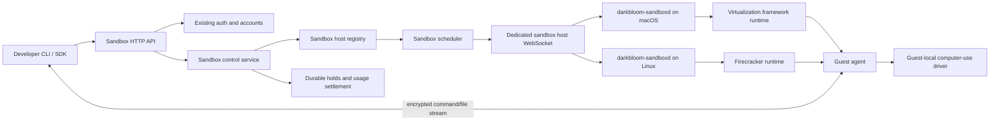
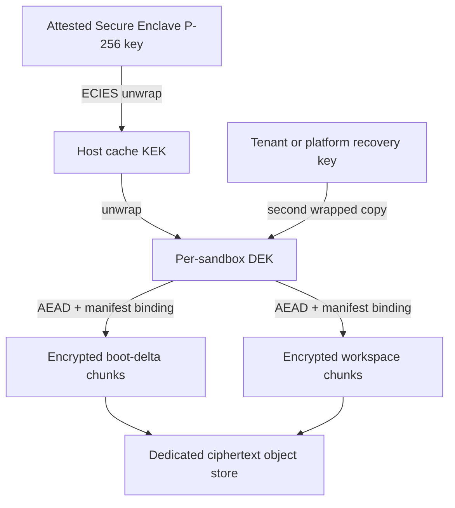
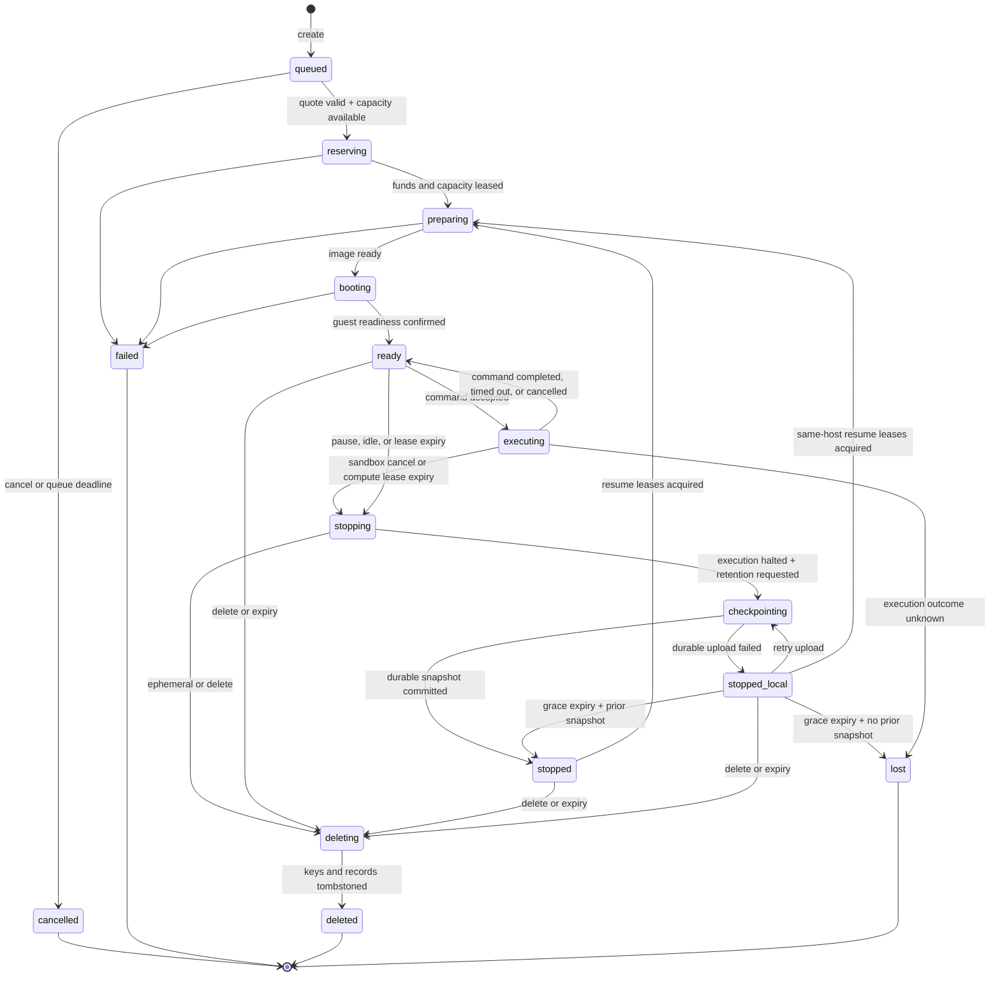

# Darkbloom sandbox platform plan

Status: **proposed for review; no sandbox product is implemented yet**

Date: 2026-08-22

Companion documents:

- [Provider and developer experience](2026-08-22-sandbox-user-experience.md)
- [Economics and pricing](2026-08-22-sandbox-economics.md)

This plan deliberately excludes legal and licensing analysis. It defines the
product and engineering shape. A named legal owner must sign off on macOS/Xcode
image distribution and provider-hosted VM access before the private alpha;
engineering does not infer that approval from this document.

## 1. Decision

Build a sandbox plane next to the inference plane, not inside it. Reuse
Darkbloom's identity, account balance, deposits, payouts, provider enrollment,
and attestation foundations. Give sandboxes their own host daemon, WebSocket
protocol, scheduler, state machine, durable reservations, usage records, and
rate cards.

Target three products behind one API:

| Product | Isolation substrate | Initial use | Relative position |
|---|---|---|---|
| Linux Sandbox | Firecracker microVM on Linux/KVM | Agents, tests, builds, general code execution | Commodity, E2B-priced |
| macOS Sandbox | One macOS VM per sandbox on Apple Virtualization.framework | Xcode, Apple-platform builds, public CI jobs | Scarce premium |
| macOS Computer | macOS Sandbox plus a guest-local computer-use driver | GUI automation and agent evaluation | Highest premium |

Start implementation with the macOS command sandbox. It is the differentiated
product and validates the hardest host, image, and Secure Enclave constraints.
Keep the common API runtime-neutral so the Linux Firecracker adapter can follow
without changing the developer contract.

## 2. Launch contract

The private alpha has these hard constraints:

1. The platform admits at most **two running macOS sandboxes globally**. This is
   an explicit coordinator capacity lease limit, not an undocumented operator
   convention.
2. Each command has a **15-minute maximum execution time**. Sandbox retention
   and command execution are separate clocks.
3. Active compute is authorized in renewable leases of at most **15 minutes**.
   A sandbox checkpoints and stops before an unfunded lease expires.
4. A macOS VM uses a sufficiently large sparse boot disk cloned from the signed
   template. The developer separately gets a **25 GiB workspace quota** by
   default or **50 GiB** when requested.
5. Access is permissioned for both developers and providers.
6. Alpha workloads must not rely on the provider being unable to inspect a
   running VM. Persistent tenant data is encrypted at rest, but the host owner
   remains inside the runtime trust boundary.
7. CPU, memory, chip family, workspace, cache retention, and exclusivity are explicit
   quote dimensions.
8. A normal sandbox receives no fractional GPU guarantee. Timing-sensitive CPU
   or GPU work uses an exclusive-host product.
9. Compute is metered from `ready` through daemon-confirmed
   `execution_halted_at`, including at most the pre-funded shutdown guard. New
   user work is accepted only in `ready`/`executing`. A retained, stopped
   sandbox pays storage but not a 24-hour compute minimum.

### GitHub Actions caveat

"No secrets" and an arbitrary GitHub Actions runner are incompatible. A runner
uses short-lived registration credentials and receives a `GITHUB_TOKEN`; public
repositories can still expose repository/environment secrets, OIDC identity,
write permissions, reusable workflows, or privileged `pull_request_target`
behavior. A provider can read ephemeral credentials and alter build results.

The alpha runner gate therefore requires an approved workflow commit SHA,
read-only token permissions, no OIDC, no repository/environment secrets, no
release/deploy/signing jobs, no unapproved reusable workflow, and no
`pull_request_target`. The GitHub App rejects a job when it cannot prove those
conditions. Jobs use GitHub's
[JIT runner configuration API](https://docs.github.com/en/rest/actions/self-hosted-runners)
and an explicitly labeled **no durable secrets, host-trusted integrity** mode.

Private repositories and workflows with valuable credentials remain disabled
until the runtime threat model changes. Short-lived credentials reduce blast
radius; they do not make an untrusted host confidential or its output
trustworthy.

## 3. First-principles constraints

### 3.1 A macOS user account is not a tenant boundary

App Sandbox constrains a signed app. A separate Unix user constrains ordinary
filesystem access. Neither gives arbitrary, adversarial child code a separate
kernel. The tenant boundary must therefore be a VM, with one guest per active
sandbox. A dedicated host user can still reduce accidental host access by the
sandbox daemon, but it is defense in depth rather than the product boundary.

### 3.2 Computer use is a privileged guest capability, not isolation

Cua Driver has screen-recording and input-control privileges. It must run only
inside the tenant's VM. Running it on the provider's host would turn a guest
feature into host compromise by design. The VM provides isolation; the driver
provides automation.

### 3.3 Secure Enclave protects keys, not running plaintext

Bulk disks are encrypted with symmetric data-encryption keys. A Secure Enclave
P-256 key wraps those keys; it does not encrypt 25–50 GiB directly. When the VM
is running, plaintext necessarily exists in guest memory and storage blocks are
decrypted for use. Secure Enclave key custody protects stopped images and cache
files from offline theft, but it does not provide confidential computing
against the machine owner.

### 3.4 Resource labels must describe enforceable guarantees

Virtualization.framework can configure guest vCPU count and memory size, but its
public API does not pin vCPUs to specific performance cores or partition the
Apple GPU. A "reserved GPU" label on a shared Mac would be false. The defensible
timing-sensitive tier is exclusive use of the whole host, with measured chip
performance and no co-tenant.

### 3.5 Side effects prevent transparent retry

The scheduler may fail over while preparing or booting a sandbox, before a
command is dispatched. Once a command frame may have reached the host,
replaying it on another machine may duplicate deployments, purchases, or
writes. The host durably records acceptance before spawning the process. Any
post-dispatch ambiguity is `lost` unless reconciliation proves the process
never started. Recovery resumes from the latest durable checkpoint only after
an explicit developer action.

## 4. System boundary



The coordinator owns identity, policy, quotes, admission, lifecycle intent,
metering, and settlement. A dedicated sandbox relay carries bounded session
streams for providers behind NAT during the alpha. It must not share the
inference provider WebSocket writer: file transfer and desktop frames could
otherwise block inference control traffic.

The target data path establishes an ephemeral SDK-to-guest session key. The
coordinator issues a short-lived signed grant binding sandbox generation,
session ID, scopes, expiry, and the SDK's ephemeral X25519 public key. The guest
returns an ephemeral public key through the attested host connection. Directional
AEAD keys are derived over the transcript; every frame authenticates the
session ID, direction, and monotonic counter. Reconnect creates a new grant and
key, and duplicate counters fail closed.

The relay sees routing metadata and ciphertext, not command output, uploaded
files, or screenshots. The host owns the guest and can still inspect or
interpose on the session; this encryption excludes the coordinator relay, not
the provider.

## 5. Reuse and separation in the current repository

### Reuse

- API-key and account authentication from `coordinator/auth/`,
  `coordinator/api/`, and `coordinator/store/`.
- The micro-USD double-entry ledger in `coordinator/payments/` and
  `coordinator/store/`.
- Stripe deposits and Connect payouts in `coordinator/billing/`.
- Provider device linking, enrollment, hardware description, and attestation
  concepts from `coordinator/api/provider.go`, `coordinator/attestation/`, and
  `provider-swift/Sources/ProviderCore/Security/`.
- The existing Secure Enclave ECIES key-wrapping pattern in
  `provider-swift/Sources/ProviderCore/KVCache/SecureEnclaveKeyWrappingService.swift`.

### Do not reuse

- The inference `registry.Registry` or model scheduler for sandbox hosts.
- Token pricing in `coordinator/payments/pricing.go`.
- Inference usage rows as sandbox usage rows.
- `serviceReservationManager` in `coordinator/api/reservations.go`; its
  outstanding holds are process-local and cannot safely cover long-lived
  sandboxes across coordinator restarts.
- The inference provider WebSocket protocol in
  `coordinator/protocol/messages.go` as an unstructured catch-all.
- `ProviderCore` as the sandbox daemon's dependency. It pulls in MLX and
  inference code that a virtualization daemon does not need.

The first shared-code refactor should extract provider identity, attestation,
and key-wrapping primitives into a small Swift module consumed by both
`ProviderCore` and the new sandbox daemon. The two daemons remain separate
processes so a VM lifecycle failure cannot terminate inference.

## 6. Host runtime

### 6.1 macOS

Use Apple's Virtualization.framework as the production substrate. It exposes
the VM configuration, CPU, memory, storage, networking, graphics, and macOS
platform objects needed by this product.

Use [Lume](https://github.com/trycua/cua/tree/main/libs/lume) as the first
proof substrate because it is MIT-licensed, exercises the same framework, and
already handles macOS image installation and unattended guest setup. Pin an
audited commit and hide it behind a narrow `VirtualMachineRuntime` interface.
After measurement, either:

1. retain the audited Lume core if its lifecycle and embedding surface are
   stable; or
2. replace the adapter with a small direct Virtualization.framework
   implementation that covers only create, start, stop, pause, disk attach,
   network attach, and display.

Do not start with Tart. It solves similar VM management problems but adds an
[FSL-1.1-ALv2 commercial licensing surface](https://github.com/openai/tart/blob/main/LICENSE)
without supplying a capability needed for the proposed alpha.

`darkbloom-sandboxd` owns:

- host registration, health, capacity, and drain state;
- image verification and cache accounting;
- atomic resource and disk reservation;
- VM lifecycle and crash cleanup;
- the guest-agent transport;
- deadline enforcement;
- usage heartbeats; and
- deletion of ephemeral overlays and key material.

It runs as a signed, hardened daemon under a dedicated host account. It opens no
public inbound port; all control connections originate outbound.

#### Release and code identity

The sandbox host is split into:

- a persistent `darkbloom-sandboxd` LaunchDaemon for VM, disk, packet-gateway,
  and control-plane work; and
- `DarkbloomSandboxAttestation.app` (`io.darkbloom.sandbox-attestation`) as a
  LaunchAgent in a continuously logged-in Aqua session, solely for APNs token
  registration and challenge delivery.

The daemon profile grants `com.apple.security.virtualization`, outbound network
access, a sandbox-specific keychain access group, and only the file access
needed for its image/cache volume. The Aqua bridge profile grants APNs and no VM
or tenant-disk access. They authenticate each other over XPC by audit token,
Developer ID team, bundle/designated requirement, and nonce-bound messages.
The bridge forwards encrypted challenges; the daemon owns the sandbox-specific
Secure Enclave identity and response key.

APNs on macOS requires an Aqua GUI login session. The dedicated sandbox account
must therefore remain logged in, even on an otherwise headless Mac. No manual
GUI interaction is required after bootstrap, but loss of that session/token
makes the host ineligible for new or renewed capacity leases. The coordinator
binds the sandbox identity to the already enrolled physical machine and does
not reuse the inference private key.

The release workflow signs the nested daemon, XPC boundary, and app; embeds
their distinct provisioning profiles; notarizes the final bundle; and computes
hashes after signing. APNs code attestation covers the complete signed manifest.
The installer verifies and installs the LaunchDaemon/LaunchAgent separately.
Upgrade drains first; rollback accepts only a still-supported signed manifest.
An independent sandbox protocol/version floor gates eligibility. These steps
require coordinated changes to the release workflow, installer, release
manifest, coordinator version gate, and uninstall path.

### 6.2 Linux

Use [Firecracker](https://firecracker-microvm.github.io/) through its jailer on
Linux/KVM. Each sandbox gets a guest kernel, root filesystem, cgroup limits,
network namespace, seccomp-constrained VMM, and a vsock guest-agent channel.

Do not use a plain Docker container as the public multi-tenant boundary. OCI
images remain the developer packaging format, but the host converts or mounts
their filesystem as a Firecracker root disk.

The Linux and macOS runtimes implement the same lifecycle interface. Platform
differences remain capabilities rather than forks in the public API.

## 7. Resource model

Every host advertises:

- operating systems and guest versions;
- machine model, chip name, chip family, chip tier, and measured benchmark
  class;
- physical performance/efficiency core counts and allocatable vCPUs;
- total and allocatable memory;
- graphics/computer-use support;
- active, reserved, and maximum sandbox slots;
- free image-cache and workspace bytes;
- network region and egress policy;
- daemon version and runtime version; and
- attestation and code-identity status.

Every offer defines a posted minimum price and hard capacity. The coordinator
publishes a final quote within centrally configured price bands.

For launch, expose a small number of fixed shapes rather than arbitrary
combinations:

| Shape | vCPU | Memory | Workspace | Intended use |
|---|---:|---:|---:|---|
| `macos-s` | 4 | 8 GiB | 25 GiB | Builds and tests |
| `macos-m` | 6 | 16 GiB | 25 GiB | Xcode and moderate parallelism |
| `macos-l` | 8 | 32 GiB | 50 GiB | Large builds on eligible hosts |
| `macos-exclusive` | Host capacity | Host capacity | 50 GiB | Timing-sensitive CPU/GPU |

Every macOS shape also receives a sparse boot disk cloned from the compatible
signed template; use 100 GiB as the proof default until measured image/update
requirements set the production minimum. The 25/50 GiB number is a separate
workspace quota, not the whole macOS disk. Tenant system changes consume
copy-on-write boot-disk extents and count toward retained bytes.

The scheduler validates each shape against the selected host. It never
oversubscribes memory. Shared CPU may be scheduled, but the exclusive shape
admits no other sandbox or inference workload on that host for the reservation
window.

An exact chip request such as `chip.name = "M5"` is a hard filter and carries
the matching posted premium. A portable request should prefer
`chip.minimum_benchmark_class` so future chips can satisfy it.

## 8. Image and storage architecture

### 8.1 Layering

Each macOS sandbox consists of:

1. an immutable, content-addressed template artifact signed by Darkbloom;
2. a writable sparse boot-disk clone created from that template;
3. unique `VZMacMachineIdentifier` and auxiliary storage;
4. a separate 25/50 GiB workspace data disk; and
5. a per-run scratch area discarded on reset or failure.

The template is immutable, but the disk attached to
`VZDiskImageStorageDeviceAttachment` is a normal local writable image.
Virtualization.framework does not consume an encrypted chunk manifest as a
random-access disk. Before boot, the daemon verifies and materializes a
VZ-compatible sparse image on its encrypted APFS volume. After a clean stop, it
chunks changed boot/workspace extents, encrypts them, commits a new manifest,
and removes the materialized files when they are no longer a warm local cache.

Base images are public and deduplicated. Tenant boot deltas and workspaces are
never shared. APFS clones accelerate local creation, but the portable format is
an authenticated chunk tree plus the portable VM configuration needed to
reconstruct local disk images. Linux uses immutable rootfs layers plus a writable
block overlay.

The 25/50 GiB selection is the workspace logical quota. Billing for retained
state uses actual unique encrypted boot-delta and workspace bytes, rounded in
documented units, rather than sparse-disk capacities.

macOS updates occur in the base-image pipeline, not ad hoc in tenant VMs.
Retained configuration includes `VZMacMachineIdentifier`, auxiliary-storage
bytes, hardware model, guest version, and disk manifest. Same-host resume
preserves them. On macOS 15 and later, moving the VM to another physical Mac can
still create a new host-Secure-Enclave-derived Apple VM identity/UDID and
require Apple-account reauthentication. The alpha therefore prohibits signed-in
Apple IDs, signing certificates, notarization, and workflows that depend on
stable Apple-service identity.

Migration is stopped-only, filters for a host that supports the saved hardware
model, and surfaces any host-derived identity change. There is no live
migration and no promise that every Apple service survives a host move.

### 8.2 Key hierarchy



- Generate a random 256-bit DEK per sandbox generation.
- Encrypt chunks with AES-256-GCM or XChaCha20-Poly1305 using unique nonces and
  authenticated metadata containing sandbox ID, generation, disk role, chunk
  index, and parent-manifest hash.
- Commit chunk hashes into an authenticated, versioned Merkle manifest. The
  store accepts a generation only with compare-and-swap against its parent, so
  rollback, omission, reordering, and split-brain writers fail closed.
- Wrap the DEK to the host Secure Enclave-backed KEK for local sticky-cache
  access.
- Store ciphertext and manifests in a dedicated sandbox object bucket, separate
  from model/release objects. Require object versioning, bounded backup
  retention, integrity checks, and at least two failure-independent copies
  before a checkpoint is called durable.
- Give a selected host short-lived object credentials scoped to one sandbox
  generation and operation. It cannot list another tenant's prefix or replace
  the committed manifest root.
- Offer two recovery modes. `platform-managed` wraps the DEK under a
  per-sandbox recovery key protected by platform KMS; Darkbloom can authorize
  decryption. `tenant-managed` wraps to a client key and requires that key on
  resume; Darkbloom cannot recover a lost client key.
- On deletion, revoke authorization and delete active host/recovery wrappers
  immediately. Ciphertext and backup wrappers age out under the published
  object/database backup retention; do not claim instantaneous cryptographic
  erasure for platform-managed recovery.

The existing provider cache proves the core ECIES wrapping primitive, but
sandbox keys need a distinct domain label, KEK, storage namespace, and audit
trail. Reusing a cryptographic primitive is acceptable; reusing key material
across products is not.

The Secure Enclave private key is non-exportable. The unwrapped host KEK and
per-sandbox DEK are plaintext in daemon memory while serving, and a malicious
host can extract them or inspect the running guest. The guarantee is that raw
keys are not persisted unwrapped and offline cache/object theft does not reveal
tenant bytes.

For local disks, use an encrypted APFS volume owned by the sandbox daemon in
addition to chunk-level encryption for persisted snapshots. Keep it unmounted
when the daemon is not serving. This is at-rest protection, not a claim that
host root cannot inspect a running VM.

### 8.3 Sticky placement

A retained sandbox records which hosts hold verified encrypted chunks. A cache
hit is a bounded scheduling preference after trust, capability, resource,
reliability, and price checks. It never overrides those checks.

If the sticky host is offline:

1. select another eligible host;
2. fetch the encrypted snapshot from the dedicated object store;
3. authorize recovery according to the chosen recovery mode;
4. rewrap the DEK to the new attested sandbox-host key;
5. verify the manifest and materialize compatible local disk images; and
6. boot with preserved portable configuration and report any host-derived
   identity change.

The quote shows whether startup is expected to be warm or cold. Failed image
preparation is not billable.

## 9. Network and guest agent

Do not use `VZNATNetworkDeviceAttachment` for multi-tenant policy; it does not
provide the required per-VM destination filter. Attach each VM through
`VZFileHandleNetworkDeviceAttachment` to a dedicated, signed packet-gateway
helper. The helper receives raw Ethernet frames over a connected datagram
socket and implements DHCP, DNS forwarding, stateful TCP/UDP NAT, destination
filtering, and byte/connection rate limits per sandbox.

The gateway is default-deny until the sandbox policy and fencing token are
installed. It evaluates the destination IP on every packet, so DNS rebinding
cannot bypass private-range blocks. IPv6 remains disabled until equivalent
filtering exists. If the helper, daemon, policy lease, or socket dies, guest
networking fails closed. No `pf` rule shared with the provider's normal network
is the primary isolation boundary.

The default network policy permits outbound public internet with:

- provider LAN, RFC1918, link-local, metadata, and host-management ranges
  blocked in the packet gateway;
- no unsolicited inbound connectivity;
- DNS and byte-count metadata retained, but no payload logging;
- optional destination allowlists for CI jobs; and
- explicit bandwidth and connection limits.

The guest agent is part of every signed base image. It:

- establishes an authenticated vsock/virtio-socket channel to the host daemon;
- reports the expected image and agent version in a host-verified readiness
  handshake;
- creates command processes under the unprivileged sandbox user;
- streams stdout/stderr and exit status;
- enforces command deadlines in addition to host/coordinator deadlines;
- performs bounded file upload/download;
- reports disk and process health; and
- coordinates clean checkpoint and shutdown.

The host daemon treats every guest message as untrusted. Length limits,
deadlines, finite state checks, and per-session flow control apply before data
reaches the coordinator relay.

Virtualization.framework does not remotely attest arbitrary macOS guest boot.
The host verifies signed image bytes before materialization and checks the guest
agent handshake; this is not measured boot. The provider controls that host and
can forge or interpose on the handshake.

## 10. Computer-use tier

Use Cua's open-source stack as an implementation input:

- [Lume](https://cua.ai/docs/lume/guide/getting-started/installation) for the
  VM proof;
- [Cua Driver](https://cua.ai/docs/how-to-guides/driver/install) inside the
  guest for screen and input operations; and
- Cua's sandbox SDK semantics as one reference for the Darkbloom SDK.

The computer image has a dedicated logged-in guest user and a stable,
code-signed driver identity. Accessibility and Screen Recording permissions
must survive image cloning and driver upgrades; this is an explicit proof gate,
not an assumption.

Cua Driver's product telemetry is disabled in the image and its telemetry
destinations are blocked by the guest egress policy. Tests verify both after
every driver update.

The public surface exposes screenshots, pointer/keyboard actions, window
metadata, and an optional interactive stream. Driver RPC stays on the
guest-agent channel and is never exposed directly to the internet. Interactive
video uses WebRTC with TURN fallback; command-style screenshots may use the
encrypted sandbox relay.

Computer-use sessions are one-to-one with VMs. The service stores timing,
status, and byte counts but not screenshots, typed text, clipboard contents, or
window titles.

## 11. Lifecycle and failure semantics

A quote is a separate expiring object, not a sandbox state. A queued create
holds neither host capacity nor funds. When capacity becomes available, the
coordinator revalidates the quote and balance atomically; an expired quote
returns `QUOTE_EXPIRED` unless the caller explicitly allowed requoting.



State transitions are compare-and-swap operations in Postgres with monotonic
generation numbers. The alpha permits one active command per sandbox; a second
command returns `409 COMMAND_ACTIVE`. This keeps sandbox `executing` canonical.
Parallel commands can later use an active-command count without changing each
command's state machine.

`failed` applies to a first create that never became ready. A resume
preparation/boot failure releases the new leases and returns to the prior
`stopped` generation; it never destroys the last durable snapshot.

Commands have independent IDs, idempotency keys, and durable states:

```text
created → dispatching → accepted → running
                                ↘ succeeded | failed | timed_out | cancelled
                  dispatch ambiguity → reconciling → not_started | lost
```

The host persists `(sandbox_generation, command_id, fencing_token, accepted)`
before process spawn, then acknowledges. After reconnect, the coordinator asks
for that durable operation record. A command is safe to dispatch elsewhere only
when the host proves `not_started`; any unresolved post-send ambiguity is
`lost`, even if the coordinator never received acceptance.

Two leases are distinct:

- A **developer compute lease** authorizes at most 15 minutes of ready/executing
  user work plus a separately itemized, pre-funded 60-second shutdown guard.
- A **capacity lease** is a short renewable host/global-slot fence, initially
  60 seconds and renewed every 20 seconds, carrying coordinator epoch,
  sandbox generation, and a monotonic fencing token.

The daemon rejects stale tokens and starts no work whose capacity lease cannot
cover startup. A command's timeout must fit inside the remaining 15-minute
billable window; the 60-second guard accepts no new user work. At billable
expiry the daemon terminates processes and durably reports
`execution_halted_at` after the VM is paused/stopped. Compute metering ends at
that timestamp, bounded by the pre-funded guard.

Snapshot encryption/upload then runs as a separately bounded, non-compute
storage operation. Success reaches `stopped`; failure reaches `stopped_local`,
which retains a same-host encrypted disk but makes no portable-durability claim.
Retrying upload remains non-compute. Resuming from either stopped state acquires
fresh balance and capacity leases; `stopped_local` can resume only on that host.
Host loss from `stopped_local` loses the uncommitted generation. This state has
a short platform-funded recovery grace, initially 10 minutes; expiry discards
the failed local generation and falls back to the previous durable snapshot, or
becomes `lost` when none exists.

For capacity fencing, the daemon uses the shorter of signed wall-clock expiry
and the received lease duration on a monotonic clock and fails closed on
coordinator partition, Aqua-session loss, sleep, restart, or renewal failure.
The coordinator does not reassign a global macOS slot until the old lease
expires plus the measured clock-skew/stop guard or the old daemon proves
execution halted. A malicious host can violate local execution rules; it cannot
obtain a second billable fenced lease.

Deadlines exist at three layers:

1. coordinator lifecycle deadline;
2. host daemon VM/process deadline; and
3. guest agent process deadline.

The earliest deadline wins. A command timeout terminates that process and
returns the sandbox to `ready` while funded time remains. Sandbox/lease timeout
terminates all processes, waits a fixed grace period, force-stops the VM, and
records `execution_halted_at`. Checkpoint upload does not extend compute
billing.

Before command dispatch, host failure releases the lease and permits another
host attempt after fencing safety. After dispatch, the command reconciliation
rules above apply and never silently replay side effects.

Canonical error and settlement behavior:

| Code | Result | Charge |
|---|---|---|
| `QUOTE_EXPIRED` | Queue/admission stops; caller requotes | None |
| `QUEUE_TIMEOUT` | Sandbox becomes `cancelled` | None |
| `PREPARE_FAILED` | Sandbox becomes `failed` | None |
| `BOOT_FAILED` | Sandbox becomes `failed` | None |
| `COMMAND_DISPATCH_UNKNOWN` | Reconcile, then `not_started` or `lost` | Observed compute through halt; no duplicated command |
| `COMMAND_TIMEOUT` | Command `timed_out`; sandbox returns ready if funded time remains | Compute continues only until idle/lease stop |
| `CHECKPOINT_FAILED` | Sandbox becomes `stopped_local`; retry or same-host resume | Compute ended at `execution_halted_at`; no durable-storage charge for failed generation |
| `LEASE_EXPIRED` | Fail-closed halt; sandbox checkpoints or becomes `stopped_local`/`lost` | Capped by billable window plus pre-funded guard |
| `HOST_LOST` | Pre-dispatch retry after fence; post-dispatch `lost` | No later than heartbeat cutoff |
| `INSUFFICIENT_BALANCE` | Renewal/create rejected; controlled stop | Existing authorized lease only |

## 12. Scheduling

Scheduling is filter-then-rank:

1. Filter for permission, trust, daemon/runtime version, OS image, chip
   requirement, computer-use capability, region, egress policy, disk, vCPU,
   memory, exclusivity, and posted-price ceiling.
2. Atomically acquire host resources and a global macOS capacity lease with a
   new fencing token.
3. Rank eligible offers by final quoted price plus measured startup,
   reliability, load, and cache-miss costs.
4. Add a bounded sticky-cache preference.
5. Use random spread only among near-equal candidates.

The capacity-lease record includes every resource deducted from host capacity,
`lease_until`, coordinator epoch, sandbox generation, and fencing token.
Disconnect, preparation failure, timeout, cancellation, daemon restart, and
coordinator recovery all converge on the same idempotent release path.

The global two-macOS limit is acquired in the same transaction as the lease and
sandbox state transition. Expired/stale holders cannot renew or mutate state.
A process-local counter or a durable row without host fencing is insufficient.

## 13. Billing and settlement

The developer requests a quote before creation. The quote is immutable for its
short validity window and contains:

- compute rate by vCPU-second and GiB-second;
- chip, computer-use, and exclusivity premiums;
- successful boot fee, if any;
- durable-storage and optional sticky-cache rates;
- expected warm/cold startup;
- compute-lease duration, idle-stop policy, and maximum hold;
- explicit network-egress cap; and
- platform fee and taxes where applicable.

Queueing places no hold. Admission places a durable balance hold for the
15-minute billable compute window, 60-second shutdown guard, maximum successful
boot fee, taxes, 24-hour retained-storage authorization, optional sticky-cache
add-on, and caller-selected egress cap. A lease renewal atomically settles prior
usage, verifies project spend as `settled + open holds`, places the next hold,
and only then extends host execution.

Ready sandboxes auto-pause after two idle minutes by default; the caller may
choose a shorter idle timeout or explicitly renew up to the product limit. A
command timeout must fit inside the remaining billable window. The shutdown
guard funds termination only and accepts no new command. Retention is a
stopped-state storage clock, not permission to bill 24 ready hours.

Settlement uses coordinator-observed state plus bounded provider usage
heartbeats:

- no charge for a sandbox that never reaches `ready`;
- an optional boot fee only after successful guest readiness;
- compute from `ready` through durable daemon-confirmed
  `execution_halted_at`, capped by the billable window plus shutdown guard;
- storage by actual retained encrypted bytes over time;
- no compute charge while checkpointing, `stopped_local`, or `stopped`;
- no charge after a missing heartbeat grace limit; and
- automatic release/refund of unused hold.

Provider earnings and the platform fee settle atomically with the consumer
debit. Use new sandbox ledger entry types and usage tables; inference's alpha
`platformFeePercent` remains unrelated. Stripe Connect remains the provider
withdrawal rail. Phase 2 durable object-storage revenue pays platform/object
store cost and creates no host storage payout. Phase 3 sticky-cache add-on
revenue alone earns the selected host a verified byte-second payout.

See [Economics and pricing](2026-08-22-sandbox-economics.md) for the unit model
and recommended launch bands.

## 14. Persistence model

Add focused store domains instead of extending the inference usage model:

| Record | Purpose |
|---|---|
| `sandbox_hosts` | Attested host identity and durable operator ownership |
| `sandbox_offers` | Runtime capabilities, posted rates, and availability |
| `sandbox_key_policies` | Per-API-key product, resource, egress, viewer, and spend limits |
| `sandboxes` | Owner, desired shape, lifecycle state, generation, and expiry |
| `sandbox_balance_holds` | Durable consumer authorization by quote and lease |
| `sandbox_capacity_leases` | Host/global-slot resources, expiry, epoch, and fence |
| `sandbox_commands` | Idempotency, acceptance, deadline, and terminal outcome |
| `sandbox_snapshots` | Manifest, identity/config, encrypted bytes, and cache locations |
| `sandbox_key_wrappers` | Host and recovery wrappers with generation/revocation |
| `sandbox_usage_slices` | Bounded compute/storage meter intervals |
| `sandbox_settlements` | Atomic consumer debit, provider earning, and fee |

The current inference API-key schema does not express simultaneous daily/monthly
sandbox spend, product, resource, egress, computer-use, or viewer scopes. The
new policy domain is keyed by API-key ID and enforced on quote, create, lease
renewal, command, file, computer-use, and viewer endpoints. Open holds count
toward every spend check.

No sandbox policy means deny. Every quote, session grant, and compute lease
binds the policy revision that authorized it. Admission and every renewal
revalidate the current revision. Revoking the API key or policy immediately
invalidates queued quotes, closes viewer/data grants, rejects new operations,
terminates an active command, and starts the funded shutdown path; host cleanup
control remains available to the coordinator. A less-permissive policy update
uses the same fail-closed behavior.

Memory-store implementations support local tests. Production requires Postgres;
a coordinator must refuse sandbox serving when only the memory store is
configured.

## 15. Proposed repository layout

```text
coordinator/
  sandbox/                 lifecycle service and state transitions
  sandboxbilling/          quotes, durable holds, metering, settlement
  sandboxregistry/         host state, reservations, scheduler
  protocol/
    sandbox_messages.go    dedicated sandbox wire types
  api/
    sandbox_handlers.go    authenticated developer API
    sandbox_provider.go    sandbox host WebSocket endpoint

provider-swift/
  Sources/
    ProviderSecurity/      extracted attestation and key wrapping
    SandboxCore/           host state, images, guest transport, metering
    SandboxRuntimeVZ/      Virtualization.framework adapter
    darkbloom-sandboxd/    minimal daemon entry point
    darkbloom-guest-agent/ guest command and file service

sandbox-linux/
  cmd/darkbloom-sandboxd/  Linux host daemon
  firecracker/             jailer/runtime adapter
  guestagent/              Linux guest build

sdk/
  typescript/              public sandbox SDK
  python/                  public sandbox SDK
```

The exact Linux language should be selected after the macOS protocol is stable.
The protocol and state machine come first; duplicating orchestration logic
across Swift and Go/Rust does not.

## 16. Wire protocol

Use a dedicated provider endpoint and tagged messages mirrored in Go and Swift:

Provider to coordinator:

- `sandbox_host_register`
- `sandbox_host_heartbeat`
- `sandbox_prepare_status`
- `sandbox_ready`
- `sandbox_command_accepted`
- `sandbox_command_exit`
- `sandbox_checkpoint_status`
- `sandbox_usage_heartbeat`
- `sandbox_operation_snapshot`
- `sandbox_failure`

Coordinator to provider:

- `sandbox_prepare`
- `sandbox_lease_renew`
- `sandbox_command`
- `sandbox_cancel_command`
- `sandbox_checkpoint`
- `sandbox_stop`
- `sandbox_delete`
- `sandbox_drain`

Connection-level messages carry protocol version, authenticated host ID,
coordinator epoch, connection epoch, and per-direction sequence. Registration
has no sandbox fields. Sandbox-operation messages additionally require sandbox
ID, sandbox generation, operation ID, and fencing token. Heartbeats carry a
bounded summary of active lease IDs/tokens for reconciliation.

The receiver persists the highest contiguous sequence/operation result, rejects
stale fencing tokens, ignores exact duplicates, and requests replay for a
bounded gap. Reconnect creates a new connection epoch and begins with operation
reconciliation before new dispatch. Unknown future fields are ignored; unknown
message types, oversized payloads, invalid transitions, and unbounded gaps fail
closed.

Command/file/desktop data uses a separate framed protocol with session grant,
direction, counter, flow-control credit, and terminal acknowledgement. Canonical
fixtures must round-trip through Go and Swift for host control and through
TypeScript, Python, Swift, and the Linux guest agent for the data protocol.

## 17. Verification strategy

Every phase ships automated tests plus a live-isolated test on the substrate it
claims to support.

### Control plane

- HTTP tests through `httptest.Server`, including auth, idempotency, quotes,
  limits, and status codes.
- Memory and throwaway-Postgres tests for every sandbox store operation.
- Property/state-machine tests covering invalid and duplicate transitions.
- Concurrent reservation tests proving no third macOS sandbox can pass the
  global limit.
- Capacity-lease tests across partition, coordinator failover, host sleep,
  clock skew, stale fencing token, and reconnect.
- Crash-recovery tests between hold, host reservation, ready, settlement, and
  release.
- Compute-lease renewal and insufficient-balance tests proving the daemon stops
  before authorization expires.
- Full 15-minute command plus shutdown-guard tests proving user work cannot
  consume the guard and compute ends at `execution_halted_at`.
- Command dispatch/ack crash tests proving ambiguous side effects become
  `lost`, never a transparent retry.
- API-key/policy absence, revision, downgrade, and mid-command revocation tests.
- Protocol symmetry fixtures decoded in both Go and Swift.
- Exact micro-USD billing tests across rounding and deadline boundaries.

### macOS host

- A real Apple Silicon VM for create, boot, guest handshake, command, timeout,
  cancel, checkpoint, resume, delete, and daemon restart.
- Cold and sticky-cache boot latency distributions.
- CPU, memory, disk, network, and host-overhead measurements for every shape.
- Host-path, LAN, metadata, and cross-sandbox access denial.
- Packet-gateway tests for IPv4 private/link-local ranges, DNS rebinding,
  malformed frames, helper crash, stale policy, rule cleanup, and disabled IPv6.
- Encrypted-overlay tamper, wrong-key, replay, deletion, and host-migration
  tests.
- Object-store outage, partial materialization, manifest rollback, backup
  retention, `stopped_local`, and both recovery-mode tests.
- Fresh machine/auxiliary identity on create, preserved portable configuration,
  and surfaced host-derived identity change on stopped migration.
- Signed bundle, provisioning profile, entitlement, APNs challenge, installer,
  Aqua-session/XPC loss, drain-upgrade, and rollback verification.
- Power-loss simulation while writing a snapshot.
- Approved-SHA public GitHub workflow with read-only token; explicit rejection
  of OIDC, secrets, write permissions, release/deploy/signing,
  `pull_request_target`, and unapproved reusable workflows.

### Computer use

- Cua Driver installation and TCC persistence across clone, reboot, and update.
- Screenshot, click, type, scroll, cancel, and session teardown in a real guest.
- Confirmation that the driver cannot reach the provider desktop.
- Confirmation that screenshots and input text do not enter coordinator logs or
  telemetry.
- Confirmation that Cua product telemetry is disabled and egress-blocked.

### Linux

- Firecracker jailer with real KVM, not a mocked runtime.
- Escape-oriented tests for mounts, devices, namespaces, network, and vsock.
- OCI-to-rootfs build reproducibility and signature verification.

## 18. Delivery sequence and gates

| Capability | First phase |
|---|---:|
| Local two-VM substrate proof | 0 |
| Durable quotes, holds, leases, fencing, and protocol | 1 |
| Permissioned macOS command/file API | 2 |
| Encrypted portable persistence and pause/resume | 2 |
| Sticky-cache marketplace and provider cache earnings | 3 |
| Policy-gated GitHub JIT runners | 3 |
| macOS computer use | 4 |
| Linux Firecracker sandbox | 5 |

### Phase 0 — substrate proof

Build a local, single-host macOS harness using a pinned Lume commit:

1. create a signed base image;
2. boot two isolated VMs;
3. run commands through a guest agent;
4. enforce a 15-minute deadline;
5. materialize, stop, encrypt, and restore boot/workspace disk state;
6. prove fail-closed per-VM packet-gateway isolation;
7. measure cold/warm startup and host overhead; and
8. run Cua Driver inside one guest with telemetry disabled.

Gate: proceed only if the VM can be lifecycle-managed without manual host-GUI
interaction after bootstrap while the required Aqua session remains logged in,
encrypted state survives restart, two guests remain isolated, and network/TCC
state is reproducible. Record measured limits instead of projecting them.

### Phase 1 — durable sandbox control plane

Implement sandbox tables, canonical state/command transitions, quotes, durable
balance holds, compute and fenced capacity leases, settlement, host
registration, the dedicated protocol, atomic two-slot admission, API-key
sandbox policies, and API idempotency.

Gate: restart and concurrency tests prove there is no double allocation,
double charge, leaked hold, unfunded execution, stale-fence mutation, or third
billable macOS admission.

### Phase 2 — permissioned macOS command alpha

Ship the signed sandbox daemon, VZ runtime adapter, guest agent, base-image
pipeline, command/file API, egress isolation, fixed shapes, 25/50 GiB workspace,
encrypted boot/workspace snapshots, dual recovery modes, portable restore,
retained-storage metering, timeouts, and provider drain controls.

Gate: the full developer journey works on two real VMs, failed starts are free,
command timeouts stop the process, lease expiry durably halts execution and
billing before checkpoint upload, pause/resume restores exact bytes, and host
loss produces the documented non-replayed `lost` result. The named legal owner
must record launch approval before this phase serves external developers.

### Phase 3 — sticky cache and GitHub Actions

Add cache-aware scheduling, local cache earnings, garbage collection, measured
warm-start pricing, and the policy-enforcing GitHub App/JIT runner integration.

Gate: tamper and wrong-host unwrap fail closed; migration restores exact bytes;
deleted sandboxes have no usable key wrapper; measured warm-start savings exceed
the added cache cost; and disallowed GitHub permissions/events/workflows are
rejected before a runner credential is created.

### Phase 4 — macOS Computer

Add the guest Cua Driver, computer RPC, WebRTC/TURN interactive transport,
privacy-safe telemetry, and GUI-specific pricing.

Gate: all computer-use actions stay inside the guest, TCC survives the supported
image lifecycle, and neither coordinator nor provider product logs retain
screen/input content.

### Phase 5 — Linux Sandbox

Implement the Firecracker host adapter and OCI image builder against the stable
public API and state machine.

Gate: real-KVM isolation, lifecycle, billing, checkpoint, and network tests pass
with the same observable semantics as macOS where capabilities overlap.

## 19. Launch observability

Collect only content-free operational fields:

- quote, admission, queue, preparation, boot, ready, command, checkpoint, and
  deletion latency;
- outcome and failure-class counters;
- allocated vCPU/GiB/disk and active slot gauges;
- encrypted bytes transferred and retained;
- warm/cold cache outcome;
- usage/hold/settlement/refund amounts;
- provider reliability and daemon/runtime versions; and
- computer stream frame/byte counts without frame contents.

Never collect command text, environment values, stdout/stderr, uploaded file
names or bytes, screenshots, typed text, clipboard contents, or window titles.
The telemetry allowlist remains the privacy backstop.

## 20. Defaults to approve

These defaults make the plan executable without hiding product decisions:

| Decision | Proposed default |
|---|---|
| macOS alpha capacity | Two valid running capacity leases globally |
| Command deadline | 15 minutes, lower caller value allowed |
| Compute lease | 15 billable minutes plus 60-second pre-funded shutdown guard |
| Ready idle timeout | 2 minutes, then checkpoint and stop |
| Retention | 24 hours by default; developer may delete earlier |
| Compute while stopped | Not billed |
| macOS boot disk | 100 GiB sparse proof default; measured before launch |
| Workspace | 25 GiB default, 50 GiB option |
| Workloads | Permissioned, public/no-durable-secret jobs |
| macOS substrate | Pinned Lume proof, then retain or replace behind adapter |
| Linux substrate | Firecracker+jailer |
| Normal GPU claim | None |
| Timing-sensitive tier | Exclusive whole host |
| Provider data access claim | Host is trusted in alpha |
| macOS host session | Dedicated Aqua account remains logged in for APNs |
| Recovery | Platform-managed default; tenant-managed option |
| Pricing | Resource rates plus explicit premiums; no hidden 24-hour floor |
| External alpha gate | Recorded legal owner approval |

## 21. Source snapshot

External behavior and prices change. These sources were checked on 2026-08-22:

- [Apple Virtualization framework](https://developer.apple.com/documentation/virtualization)
- [VZVirtualMachineConfiguration](https://developer.apple.com/documentation/virtualization/vzvirtualmachineconfiguration)
- [VZFileHandleNetworkDeviceAttachment](https://developer.apple.com/documentation/virtualization/vzfilehandlenetworkdeviceattachment)
- [Cua repository](https://github.com/trycua/cua)
- [Lume documentation](https://cua.ai/docs/lume/guide/getting-started/installation)
- [Cua Driver documentation](https://cua.ai/docs/how-to-guides/driver/install)
- [Firecracker architecture](https://firecracker-microvm.github.io/)
- [GitHub JIT runner configuration](https://docs.github.com/en/rest/actions/self-hosted-runners)
- [Tart license](https://github.com/openai/tart/blob/main/LICENSE)
