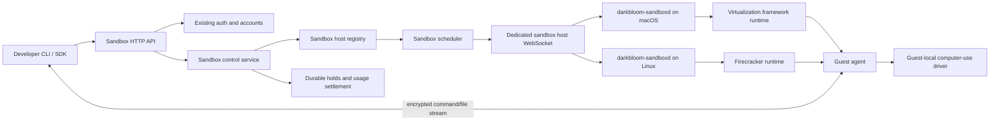
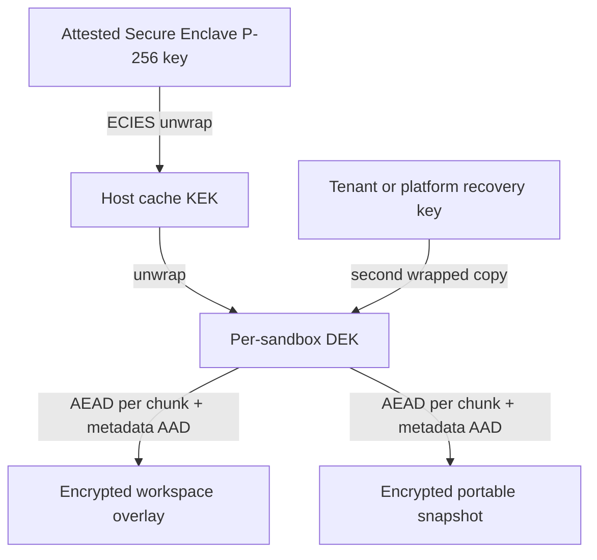
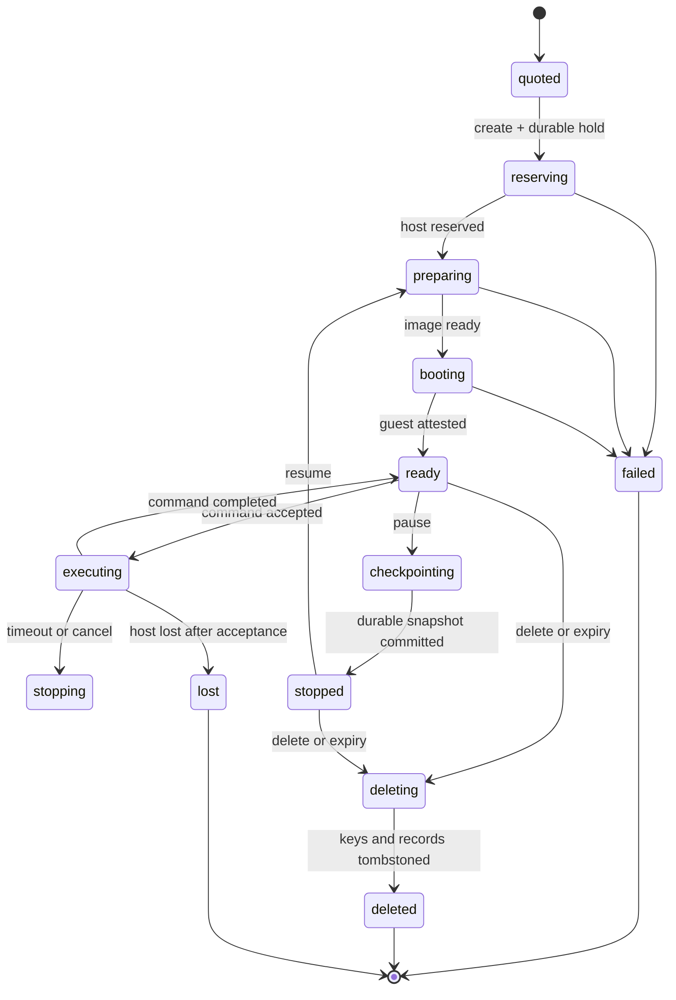

# Darkbloom sandbox platform plan

Status: **proposed for review; no sandbox product is implemented yet**

Date: 2026-08-22

Companion documents:

- [Provider and developer experience](2026-08-22-sandbox-user-experience.md)
- [Economics and pricing](2026-08-22-sandbox-economics.md)

This plan deliberately excludes legal and licensing analysis. It defines the
product and engineering shape Darkbloom can build after legal review is handled
separately.

## 1. Decision

Build a sandbox plane next to the inference plane, not inside it. Reuse
Darkbloom's identity, account balance, deposits, payouts, provider enrollment,
and attestation foundations. Give sandboxes their own host daemon, WebSocket
protocol, scheduler, state machine, durable reservations, usage records, and
rate cards.

Launch three products behind one API:

| Product | Isolation substrate | Initial use | Relative position |
|---|---|---|---|
| Linux Sandbox | Firecracker microVM on Linux/KVM | Agents, tests, builds, general code execution | Commodity, E2B-priced |
| macOS Sandbox | One macOS VM per sandbox on Apple Virtualization.framework | Xcode, Apple-platform builds, public CI jobs | Scarce premium |
| macOS Computer | macOS Sandbox plus a guest-local computer-use driver | GUI automation and agent evaluation | Highest premium |

Start implementation with the macOS command sandbox. It is the differentiated
product and validates the hardest host, image, and Secure Enclave constraints.
Keep the common API runtime-neutral so the Linux Firecracker adapter can follow
without changing the developer contract.

## 2. Launch contract

The private alpha has these hard constraints:

1. The platform admits at most **two running macOS sandboxes globally**. This is
   an explicit coordinator limit, not an undocumented operator convention.
2. Each command has a **15-minute maximum execution time**. Sandbox retention
   and command execution are separate clocks.
3. A sandbox gets a **25 GiB logical disk** by default or **50 GiB** when
   requested.
4. Access is permissioned for both developers and providers.
5. Alpha workloads must not rely on the provider being unable to inspect a
   running VM. Persistent tenant data is encrypted at rest, but the host owner
   remains inside the runtime trust boundary.
6. CPU, memory, chip family, disk, cache retention, and exclusivity are explicit
   quote dimensions.
7. A normal sandbox receives no fractional GPU guarantee. Timing-sensitive CPU
   or GPU work uses an exclusive-host product.
8. Compute is metered only while a sandbox is ready or executing. A retained,
   stopped sandbox pays storage but not a 24-hour compute minimum.

### GitHub Actions caveat

"No secrets" and an arbitrary GitHub Actions runner are incompatible. A runner
uses short-lived registration credentials and can receive `GITHUB_TOKEN`,
repository credentials, and configured job secrets. The alpha can support:

- public repositories whose workflows receive no user-configured secrets; and
- an explicitly labeled **no durable secrets** mode using one-time,
  tightly-scoped registration credentials.

Private-repository runners and workflows with valuable credentials remain
disabled until the runtime threat model changes. Short-lived credentials reduce
blast radius; they do not make an untrusted host confidential.

## 3. First-principles constraints

### 3.1 A macOS user account is not a tenant boundary

App Sandbox constrains a signed app. A separate Unix user constrains ordinary
filesystem access. Neither gives arbitrary, adversarial child code a separate
kernel. The tenant boundary must therefore be a VM, with one guest per active
sandbox. A dedicated host user can still reduce accidental host access by the
sandbox daemon, but it is defense in depth rather than the product boundary.

### 3.2 Computer use is a privileged guest capability, not isolation

Cua Driver has screen-recording and input-control privileges. It must run only
inside the tenant's VM. Running it on the provider's host would turn a guest
feature into host compromise by design. The VM provides isolation; the driver
provides automation.

### 3.3 Secure Enclave protects keys, not running plaintext

Bulk disks are encrypted with symmetric data-encryption keys. A Secure Enclave
P-256 key wraps those keys; it does not encrypt 25–50 GiB directly. When the VM
is running, plaintext necessarily exists in guest memory and storage blocks are
decrypted for use. Secure Enclave key custody protects stopped images and cache
files from offline theft, but it does not provide confidential computing
against the machine owner.

### 3.4 Resource labels must describe enforceable guarantees

Virtualization.framework can configure guest vCPU count and memory size, but its
public API does not pin vCPUs to specific performance cores or partition the
Apple GPU. A "reserved GPU" label on a shared Mac would be false. The defensible
timing-sensitive tier is exclusive use of the whole host, with measured chip
performance and no co-tenant.

### 3.5 Side effects prevent transparent retry

The scheduler may fail over while preparing or booting a sandbox, before a
command is accepted. Once a command starts, replaying it on another machine may
duplicate deployments, purchases, or writes. A lost executing command therefore
ends as `lost`; recovery resumes from the latest durable checkpoint only after
an explicit developer action.

## 4. System boundary



The coordinator owns identity, policy, quotes, admission, lifecycle intent,
metering, and settlement. A dedicated sandbox relay carries bounded session
streams for providers behind NAT during the alpha. It must not share the
inference provider WebSocket writer: file transfer and desktop frames could
otherwise block inference control traffic.

The target data path establishes an ephemeral SDK-to-guest session key. The
relay sees routing metadata and ciphertext, not command output, uploaded files,
or screenshots. This keeps the coordinator out of tenant content, although it
does not remove the host owner from the trust boundary.

## 5. Reuse and separation in the current repository

### Reuse

- API-key and account authentication from `coordinator/auth/`,
  `coordinator/api/`, and `coordinator/store/`.
- The micro-USD double-entry ledger in `coordinator/payments/` and
  `coordinator/store/`.
- Stripe deposits and Connect payouts in `coordinator/billing/`.
- Provider device linking, enrollment, hardware description, and attestation
  concepts from `coordinator/api/provider.go`, `coordinator/attestation/`, and
  `provider-swift/Sources/ProviderCore/Security/`.
- The existing Secure Enclave ECIES key-wrapping pattern in
  `provider-swift/Sources/ProviderCore/KVCache/SecureEnclaveKeyWrappingService.swift`.

### Do not reuse

- The inference `registry.Registry` or model scheduler for sandbox hosts.
- Token pricing in `coordinator/payments/pricing.go`.
- Inference usage rows as sandbox usage rows.
- `serviceReservationManager` in `coordinator/api/reservations.go`; its
  outstanding holds are process-local and cannot safely cover long-lived
  sandboxes across coordinator restarts.
- The inference provider WebSocket protocol in
  `coordinator/protocol/messages.go` as an unstructured catch-all.
- `ProviderCore` as the sandbox daemon's dependency. It pulls in MLX and
  inference code that a virtualization daemon does not need.

The first shared-code refactor should extract provider identity, attestation,
and key-wrapping primitives into a small Swift module consumed by both
`ProviderCore` and the new sandbox daemon. The two daemons remain separate
processes so a VM lifecycle failure cannot terminate inference.

## 6. Host runtime

### 6.1 macOS

Use Apple's Virtualization.framework as the production substrate. It exposes
the VM configuration, CPU, memory, storage, networking, graphics, and macOS
platform objects needed by this product.

Use [Lume](https://github.com/trycua/cua/tree/main/libs/lume) as the first
proof substrate because it is MIT-licensed, exercises the same framework, and
already handles macOS image installation and unattended guest setup. Pin an
audited commit and hide it behind a narrow `VirtualMachineRuntime` interface.
After measurement, either:

1. retain the audited Lume core if its lifecycle and embedding surface are
   stable; or
2. replace the adapter with a small direct Virtualization.framework
   implementation that covers only create, start, stop, pause, disk attach,
   network attach, and display.

Do not start with Tart. It solves similar VM management problems but adds an
[FSL-1.1-ALv2 commercial licensing surface](https://github.com/openai/tart/blob/main/LICENSE)
without supplying a capability needed for the proposed alpha.

`darkbloom-sandboxd` owns:

- host registration, health, capacity, and drain state;
- image verification and cache accounting;
- atomic resource and disk reservation;
- VM lifecycle and crash cleanup;
- the guest-agent transport;
- deadline enforcement;
- usage heartbeats; and
- deletion of ephemeral overlays and key material.

It runs as a signed, hardened daemon under a dedicated host account. It opens no
public inbound port; all control connections originate outbound.

### 6.2 Linux

Use [Firecracker](https://firecracker-microvm.github.io/) through its jailer on
Linux/KVM. Each sandbox gets a guest kernel, root filesystem, cgroup limits,
network namespace, seccomp-constrained VMM, and a vsock guest-agent channel.

Do not use a plain Docker container as the public multi-tenant boundary. OCI
images remain the developer packaging format, but the host converts or mounts
their filesystem as a Firecracker root disk.

The Linux and macOS runtimes implement the same lifecycle interface. Platform
differences remain capabilities rather than forks in the public API.

## 7. Resource model

Every host advertises:

- operating systems and guest versions;
- machine model, chip name, chip family, chip tier, and measured benchmark
  class;
- physical performance/efficiency core counts and allocatable vCPUs;
- total and allocatable memory;
- graphics/computer-use support;
- active, reserved, and maximum sandbox slots;
- free image-cache and workspace bytes;
- network region and egress policy;
- daemon version and runtime version; and
- attestation and code-identity status.

Every offer defines a posted minimum price and hard capacity. The coordinator
publishes a final quote within centrally configured price bands.

For launch, expose a small number of fixed shapes rather than arbitrary
combinations:

| Shape | vCPU | Memory | Disk | Intended use |
|---|---:|---:|---:|---|
| `macos-s` | 4 | 8 GiB | 25 GiB | Builds and tests |
| `macos-m` | 6 | 16 GiB | 25 GiB | Xcode and moderate parallelism |
| `macos-l` | 8 | 32 GiB | 50 GiB | Large builds on eligible hosts |
| `macos-exclusive` | Host capacity | Host capacity | 50 GiB | Timing-sensitive CPU/GPU |

The scheduler validates each shape against the selected host. It never
oversubscribes memory. Shared CPU may be scheduled, but the exclusive shape
admits no other sandbox or inference workload on that host for the reservation
window.

An exact chip request such as `chip.name = "M5"` is a hard filter and carries
the matching posted premium. A portable request should prefer
`chip.minimum_benchmark_class` so future chips can satisfy it.

## 8. Image and storage architecture

### 8.1 Layering

Each sandbox consists of:

1. a read-only, content-addressed base image signed by Darkbloom;
2. a tenant workspace overlay retained for the sandbox lifetime; and
3. a per-run scratch overlay discarded on reset or failure.

Base images are public and deduplicated. Tenant overlays are never shared.
APFS clone semantics are a local optimization on macOS, not part of the
portable image format. Linux uses immutable rootfs layers plus a writable block
overlay.

The 25/50 GiB selection is a logical quota. Billing for retained cache uses
actual unique encrypted bytes, rounded in documented units, rather than the
maximum sparse-disk size.

### 8.2 Key hierarchy



- Generate a random 256-bit DEK per sandbox generation.
- Encrypt overlay chunks with AES-256-GCM or XChaCha20-Poly1305 using unique
  nonces and authenticated metadata containing sandbox ID, generation, chunk
  index, and image-manifest hash.
- Wrap the DEK to the host Secure Enclave-backed KEK for local sticky-cache
  access.
- Store a second wrapped DEK under a tenant-controlled key or a platform
  recovery KMS key. Without this second wrapper, a host-bound cache is not
  portable and host loss permanently destroys the sandbox.
- Delete all wrappers when a sandbox is destroyed; garbage-collect ciphertext
  asynchronously.

The existing provider cache proves the core ECIES wrapping primitive, but
sandbox keys need a distinct domain label, KEK, storage namespace, and audit
trail. Reusing a cryptographic primitive is acceptable; reusing key material
across products is not.

For local disks, use an encrypted APFS volume owned by the sandbox daemon in
addition to chunk-level encryption for persisted snapshots. Keep it unmounted
when the daemon is not serving. This is at-rest protection, not a claim that
host root cannot inspect a running VM.

### 8.3 Sticky placement

A retained sandbox records which hosts hold verified encrypted chunks. A cache
hit is a bounded scheduling preference after trust, capability, resource,
reliability, and price checks. It never overrides those checks.

If the sticky host is offline:

1. select another eligible host;
2. transfer the encrypted snapshot;
3. rewrap the DEK to the new host after attestation; and
4. boot from the restored overlay.

The quote shows whether startup is expected to be warm or cold. Failed image
preparation is not billable.

## 9. Network and guest agent

The default network policy is outbound NAT with:

- provider LAN, RFC1918, link-local, metadata, and host-management ranges
  blocked outside the guest;
- no unsolicited inbound connectivity;
- DNS and byte-count metadata retained, but no payload logging;
- optional destination allowlists for CI jobs; and
- explicit bandwidth and connection limits.

The guest agent is part of every signed base image. It:

- establishes an authenticated vsock/virtio-socket channel to the host daemon;
- proves the expected image and agent version;
- creates command processes under the unprivileged sandbox user;
- streams stdout/stderr and exit status;
- enforces command deadlines in addition to host/coordinator deadlines;
- performs bounded file upload/download;
- reports disk and process health; and
- coordinates clean checkpoint and shutdown.

The host daemon treats every guest message as untrusted. Length limits,
deadlines, finite state checks, and per-session flow control apply before data
reaches the coordinator relay.

## 10. Computer-use tier

Use Cua's open-source stack as an implementation input:

- [Lume](https://cua.ai/docs/lume/guide/getting-started/installation) for the
  VM proof;
- [Cua Driver](https://cua.ai/docs/how-to-guides/driver/install) inside the
  guest for screen and input operations; and
- Cua's sandbox SDK semantics as one reference for the Darkbloom SDK.

The computer image has a dedicated logged-in guest user and a stable,
code-signed driver identity. Accessibility and Screen Recording permissions
must survive image cloning and driver upgrades; this is an explicit proof gate,
not an assumption.

The public surface exposes screenshots, pointer/keyboard actions, window
metadata, and an optional interactive stream. Driver RPC stays on the
guest-agent channel and is never exposed directly to the internet. Interactive
video uses WebRTC with TURN fallback; command-style screenshots may use the
encrypted sandbox relay.

Computer-use sessions are one-to-one with VMs. The service stores timing,
status, and byte counts but not screenshots, typed text, clipboard contents, or
window titles.

## 11. Lifecycle and failure semantics



State transitions are compare-and-swap operations in Postgres with monotonic
generation numbers. Commands have independent IDs and idempotency keys.

Deadlines exist at three layers:

1. coordinator lifecycle deadline;
2. host daemon VM/process deadline; and
3. guest agent process deadline.

The earliest deadline wins. Timeout sends graceful termination, waits a short
fixed grace period, then force-stops the process or VM. Metering stops no later
than the coordinator's observed terminal deadline.

Before `ready`, host failure releases the reservation and permits another host
attempt within the create deadline. After command acceptance, host failure
returns `lost` and never silently replays the command.

## 12. Scheduling

Scheduling is filter-then-rank:

1. Filter for permission, trust, daemon/runtime version, OS image, chip
   requirement, computer-use capability, region, egress policy, disk, vCPU,
   memory, exclusivity, and posted-price ceiling.
2. Atomically reserve host resources and a global macOS slot.
3. Rank eligible offers by final quoted price plus measured startup,
   reliability, load, and cache-miss costs.
4. Add a bounded sticky-cache preference.
5. Use random spread only among near-equal candidates.

The reservation record includes every resource deducted from host capacity.
Disconnect, preparation failure, timeout, cancellation, daemon restart, and
coordinator recovery all converge on the same idempotent release path.

The global two-macOS limit is checked in the same transaction as the sandbox
state transition. A process-local counter is insufficient.

## 13. Billing and settlement

The developer requests a quote before creation. The quote is immutable for its
short validity window and contains:

- compute rate by vCPU-second and GiB-second;
- chip, computer-use, and exclusivity premiums;
- successful boot fee, if any;
- retained-storage rate;
- expected warm/cold startup;
- maximum command hold; and
- platform fee and taxes where applicable.

Creation places a durable balance hold for the quoted maximum. Settlement uses
coordinator-observed state plus bounded provider usage heartbeats:

- no charge for a sandbox that never reaches `ready`;
- an optional boot fee only after successful guest readiness;
- compute from `ready` until `stopped`, `deleted`, or the terminal deadline;
- storage by actual retained encrypted bytes over time;
- no compute charge while stopped;
- no charge after a missing heartbeat grace limit; and
- automatic release/refund of unused hold.

Provider earnings and the platform fee settle atomically with the consumer
debit. Use new sandbox ledger entry types and usage tables; inference's alpha
`platformFeePercent` remains unrelated. Stripe Connect remains the provider
withdrawal rail.

See [Economics and pricing](2026-08-22-sandbox-economics.md) for the unit model
and recommended launch bands.

## 14. Persistence model

Add focused store domains instead of extending the inference usage model:

| Record | Purpose |
|---|---|
| `sandbox_hosts` | Attested host identity and durable operator ownership |
| `sandbox_offers` | Runtime capabilities, posted rates, and availability |
| `sandboxes` | Owner, desired shape, lifecycle state, generation, and expiry |
| `sandbox_reservations` | Durable balance and host-resource holds |
| `sandbox_commands` | Idempotency, acceptance, deadline, and terminal outcome |
| `sandbox_snapshots` | Manifest, encrypted bytes, wrappers, and cache locations |
| `sandbox_usage_slices` | Bounded compute/storage meter intervals |
| `sandbox_settlements` | Atomic consumer debit, provider earning, and fee |

Memory-store implementations support local tests. Production requires Postgres;
a coordinator must refuse sandbox serving when only the memory store is
configured.

## 15. Proposed repository layout

```text
coordinator/
  sandbox/                 lifecycle service and state transitions
  sandboxbilling/          quotes, durable holds, metering, settlement
  sandboxregistry/         host state, reservations, scheduler
  protocol/
    sandbox_messages.go    dedicated sandbox wire types
  api/
    sandbox_handlers.go    authenticated developer API
    sandbox_provider.go    sandbox host WebSocket endpoint

provider-swift/
  Sources/
    ProviderSecurity/      extracted attestation and key wrapping
    SandboxCore/           host state, images, guest transport, metering
    SandboxRuntimeVZ/      Virtualization.framework adapter
    darkbloom-sandboxd/    minimal daemon entry point
    darkbloom-guest-agent/ guest command and file service

sandbox-linux/
  cmd/darkbloom-sandboxd/  Linux host daemon
  firecracker/             jailer/runtime adapter
  guestagent/              Linux guest build

sdk/
  typescript/              public sandbox SDK
  python/                  public sandbox SDK
```

The exact Linux language should be selected after the macOS protocol is stable.
The protocol and state machine come first; duplicating orchestration logic
across Swift and Go/Rust does not.

## 16. Wire protocol

Use a dedicated provider endpoint and tagged messages mirrored in Go and Swift:

Provider to coordinator:

- `sandbox_host_register`
- `sandbox_host_heartbeat`
- `sandbox_prepare_status`
- `sandbox_ready`
- `sandbox_command_accepted`
- `sandbox_command_exit`
- `sandbox_checkpoint_status`
- `sandbox_usage_heartbeat`
- `sandbox_failure`

Coordinator to provider:

- `sandbox_prepare`
- `sandbox_command`
- `sandbox_cancel_command`
- `sandbox_checkpoint`
- `sandbox_stop`
- `sandbox_delete`
- `sandbox_drain`

Every message includes host ID, sandbox ID, sandbox generation, operation ID,
protocol version, and monotonic sequence where relevant. Unknown future fields
are ignored; unknown message types fail closed. Payload sizes are bounded before
full decode. Command/file/desktop data uses a separate framed stream.

## 17. Verification strategy

Every phase ships automated tests plus a live-isolated test on the substrate it
claims to support.

### Control plane

- HTTP tests through `httptest.Server`, including auth, idempotency, quotes,
  limits, and status codes.
- Memory and throwaway-Postgres tests for every sandbox store operation.
- Property/state-machine tests covering invalid and duplicate transitions.
- Concurrent reservation tests proving no third macOS sandbox can pass the
  global limit.
- Crash-recovery tests between hold, host reservation, ready, settlement, and
  release.
- Protocol symmetry fixtures decoded in both Go and Swift.
- Exact micro-USD billing tests across rounding and deadline boundaries.

### macOS host

- A real Apple Silicon VM for create, boot, guest handshake, command, timeout,
  cancel, checkpoint, resume, delete, and daemon restart.
- Cold and sticky-cache boot latency distributions.
- CPU, memory, disk, network, and host-overhead measurements for every shape.
- Host-path, LAN, metadata, and cross-sandbox access denial.
- Encrypted-overlay tamper, wrong-key, replay, deletion, and host-migration
  tests.
- Power-loss simulation while writing a snapshot.
- Public-repository GitHub Actions workflow with secrets disabled.

### Computer use

- Cua Driver installation and TCC persistence across clone, reboot, and update.
- Screenshot, click, type, scroll, cancel, and session teardown in a real guest.
- Confirmation that the driver cannot reach the provider desktop.
- Confirmation that screenshots and input text do not enter coordinator logs or
  telemetry.

### Linux

- Firecracker jailer with real KVM, not a mocked runtime.
- Escape-oriented tests for mounts, devices, namespaces, network, and vsock.
- OCI-to-rootfs build reproducibility and signature verification.

## 18. Delivery sequence and gates

### Phase 0 — substrate proof

Build a local, single-host macOS harness using a pinned Lume commit:

1. create a signed base image;
2. boot two isolated VMs;
3. run commands through a guest agent;
4. enforce a 15-minute deadline;
5. stop, clone, and restore encrypted workspace state;
6. measure cold/warm startup and host overhead; and
7. run Cua Driver inside one guest.

Gate: proceed only if the VM can be lifecycle-managed without host GUI
interaction, encrypted state survives restart, two guests remain isolated, and
TCC state is reproducible. Record measured limits instead of projecting them.

### Phase 1 — durable sandbox control plane

Implement sandbox tables, state transitions, quotes, durable holds, settlement,
host registration, the dedicated protocol, atomic two-slot admission, and API
idempotency.

Gate: restart and concurrency tests prove there is no double allocation,
double charge, leaked hold, or third macOS admission.

### Phase 2 — permissioned macOS command alpha

Ship the signed sandbox daemon, VZ runtime adapter, guest agent, base-image
pipeline, command/file API, egress isolation, fixed shapes, 25/50 GiB disks,
timeouts, and provider drain controls.

Gate: the full developer journey works on two real VMs, failed starts are free,
timeouts stop both work and billing, and host loss produces the documented
non-replayed `lost` result.

### Phase 3 — sticky encrypted persistence

Add chunk manifests, dual-wrapped DEKs, retained storage metering, cache-aware
scheduling, portable restore, garbage collection, and provider cache earnings.

Gate: tamper and wrong-host unwrap fail closed; migration restores exact bytes;
deleted sandboxes have no usable key wrapper; measured warm-start savings exceed
the added cache cost.

### Phase 4 — macOS Computer

Add the guest Cua Driver, computer RPC, WebRTC/TURN interactive transport,
privacy-safe telemetry, and GUI-specific pricing.

Gate: all computer-use actions stay inside the guest, TCC survives the supported
image lifecycle, and neither coordinator nor provider product logs retain
screen/input content.

### Phase 5 — Linux Sandbox

Implement the Firecracker host adapter and OCI image builder against the stable
public API and state machine.

Gate: real-KVM isolation, lifecycle, billing, checkpoint, and network tests pass
with the same observable semantics as macOS where capabilities overlap.

## 19. Launch observability

Collect only content-free operational fields:

- quote, admission, queue, preparation, boot, ready, command, checkpoint, and
  deletion latency;
- outcome and failure-class counters;
- allocated vCPU/GiB/disk and active slot gauges;
- encrypted bytes transferred and retained;
- warm/cold cache outcome;
- usage/hold/settlement/refund amounts;
- provider reliability and daemon/runtime versions; and
- computer stream frame/byte counts without frame contents.

Never collect command text, environment values, stdout/stderr, uploaded file
names or bytes, screenshots, typed text, clipboard contents, or window titles.
The telemetry allowlist remains the privacy backstop.

## 20. Defaults to approve

These defaults make the plan executable without hiding product decisions:

| Decision | Proposed default |
|---|---|
| macOS alpha capacity | Two running sandboxes globally |
| Command deadline | 15 minutes, lower caller value allowed |
| Retention | 24 hours by default; developer may delete earlier |
| Compute while stopped | Not billed |
| Disk | 25 GiB default, 50 GiB option |
| Workloads | Permissioned, public/no-durable-secret jobs |
| macOS substrate | Pinned Lume proof, then retain or replace behind adapter |
| Linux substrate | Firecracker+jailer |
| Normal GPU claim | None |
| Timing-sensitive tier | Exclusive whole host |
| Provider data access claim | Host is trusted in alpha |
| Cache key recovery | Dual wrap required before portable persistence |
| Pricing | Resource rates plus explicit premiums; no hidden 24-hour floor |

## 21. Source snapshot

External behavior and prices change. These sources were checked on 2026-08-22:

- [Apple Virtualization framework](https://developer.apple.com/documentation/virtualization)
- [VZVirtualMachineConfiguration](https://developer.apple.com/documentation/virtualization/vzvirtualmachineconfiguration)
- [Cua repository](https://github.com/trycua/cua)
- [Lume documentation](https://cua.ai/docs/lume/guide/getting-started/installation)
- [Cua Driver documentation](https://cua.ai/docs/how-to-guides/driver/install)
- [Firecracker architecture](https://firecracker-microvm.github.io/)
- [Tart license](https://github.com/openai/tart/blob/main/LICENSE)

