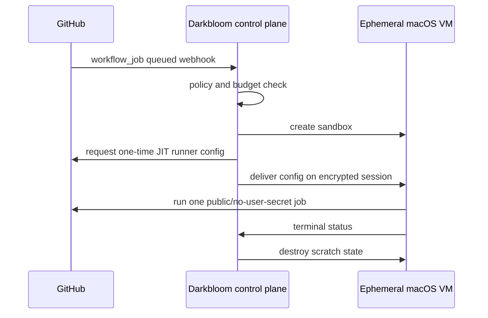
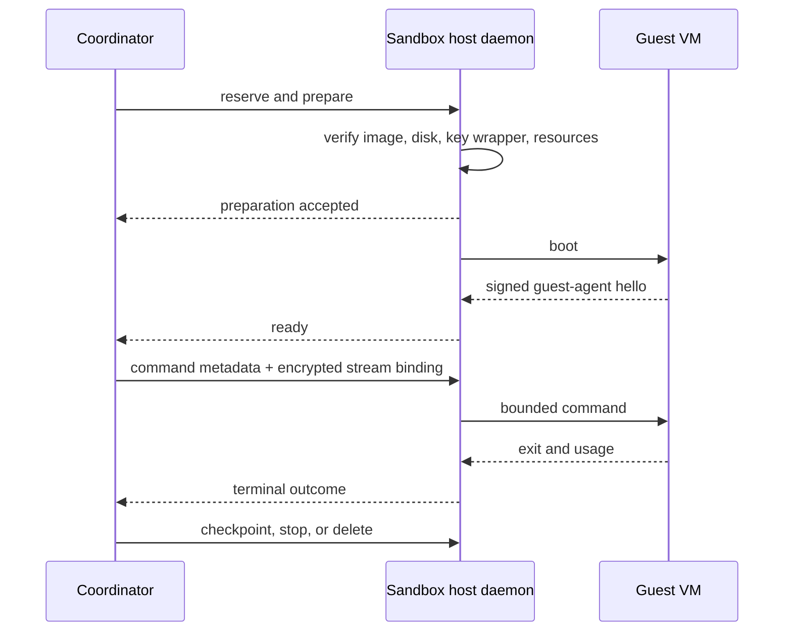

# Sandbox provider and developer experience

Status: **proposed product contract**

Date: 2026-08-22

Parent plan: [Darkbloom sandbox platform plan](2026-08-22-sandbox-platform-plan.md)

Pricing model: [Sandbox economics and pricing](2026-08-22-sandbox-economics.md)

The target is E2B-like ergonomics: one authenticated create call, streamed
commands, simple files, explicit persistence, and deterministic teardown. The
macOS-specific scarcity, chip selection, host trust, and computer-use features
stay visible instead of being hidden behind a generic "container" label.

All commands and API names below are proposed, not currently implemented.

## 1. Developer experience

### 1.1 Onboarding

The developer:

1. joins the permissioned alpha;
2. creates a scoped API key in the Darkbloom console;
3. funds the existing USD balance;
4. selects an allowed workload policy; and
5. installs either `@darkbloom/sandbox` or `darkbloom-sandbox`.

The key can be restricted by:

- maximum spend per day and month;
- allowed sandbox products and images;
- maximum vCPU, memory, and concurrent sandboxes;
- allowed egress policy;
- computer-use access; and
- expiration.

The console labels the alpha accurately:

> Host-trusted alpha. Persistent disks are encrypted at rest. Do not place
> credentials or private data in this sandbox; the machine owner is part of the
> runtime trust boundary.

There is no vague "secure" badge that implies confidential execution.

### 1.2 Quote before create

The developer can request a quote without consuming capacity:

```bash
npx @darkbloom/sandbox quote \
  --os macos \
  --image macos-xcode-26 \
  --cpu 4 \
  --memory 8GiB \
  --disk 25GiB \
  --chip-family M4 \
  --retention 24h
```

Example response:

```text
Product          macOS Sandbox
Eligible hosts   3
Expected start   warm, 8–20s
CPU              $0.2016/4-vCPU-hour
Memory           $0.1296/8-GiB-hour
macOS premium    $0.1656/hour
Storage          25 GiB included while running
Retained storage metered by actual encrypted bytes
Maximum hold     $0.1242 for a 15-minute command
Quote expires    2026-08-22T23:35:00Z
```

The response separates resource rates and premiums. It also states whether the
startup estimate assumes a sticky cache hit. Quotes use integer micro-USD
internally; displayed decimals never drive settlement.

If an exact processor matters:

```bash
npx @darkbloom/sandbox quote --os macos --chip-name M5 --exclusive-host
```

An exact chip is a hard filter. If none is online, the result says so; the
scheduler never silently substitutes another processor.

### 1.3 Create and wait

TypeScript:

```ts
import { Sandbox } from "@darkbloom/sandbox";

const sandbox = await Sandbox.create({
  image: "macos-xcode-26",
  resources: {
    cpuCount: 4,
    memoryMiB: 8192,
    diskGiB: 25,
  },
  chip: {
    minimumFamily: "M4",
  },
  retentionSeconds: 24 * 60 * 60,
  commandTimeoutMs: 15 * 60 * 1000,
  cache: "sticky",
  idempotencyKey: crypto.randomUUID(),
});

await sandbox.waitUntilReady();
```

Python:

```python
from darkbloom_sandbox import Sandbox

sandbox = Sandbox.create(
    image="macos-xcode-26",
    cpu_count=4,
    memory_mib=8192,
    disk_gib=25,
    minimum_chip_family="M4",
    retention_seconds=24 * 60 * 60,
    command_timeout_seconds=15 * 60,
    cache="sticky",
    idempotency_key="build-2841",
)

sandbox.wait_until_ready()
```

The create operation returns immediately with:

- sandbox ID and generation;
- current state;
- immutable quote ID;
- selected product and shape;
- retention expiry;
- maximum command timeout;
- host region and attestation status; and
- a content-free startup event stream.

The SDK handles `quoted → reserving → preparing → booting → ready`. It does not
hide queueing or retry forever. If the two-slot macOS launch limit is full, the
caller chooses:

- `queue: true` with a deadline; or
- immediate `429` with `Retry-After`.

Insufficient balance returns `402`. An impossible shape or chip request returns
`422`. No eligible provider returns `503`. Reusing an idempotency key returns
the original sandbox instead of creating or charging twice.

### 1.4 Run commands

```ts
const result = await sandbox.commands.run({
  command: "swift",
  args: ["test", "--parallel"],
  cwd: "/workspace/repo",
  env: {
    CI: "true",
  },
  timeoutMs: 10 * 60 * 1000,
  onStdout: (chunk) => process.stdout.write(chunk),
  onStderr: (chunk) => process.stderr.write(chunk),
});

console.log(result.exitCode, result.durationMs);
```

Command behavior is explicit:

- `command` and `args` avoid shell interpolation by default;
- `shell: true` is opt-in;
- stdout and stderr are separate ordered streams;
- client disconnect does not silently replay the command;
- cancellation is idempotent;
- caller timeouts may be lower than 15 minutes but never higher;
- the terminal result is `succeeded`, `failed`, `timed_out`, `cancelled`, or
  `lost`; and
- `lost` means the host disappeared after accepting side effects.

The SDK never turns `lost` into a retry. The developer may restore the latest
checkpoint and make that decision with application-specific idempotency.

### 1.5 Files

Small files use the SDK directly:

```ts
await sandbox.files.write("/workspace/repo/config.json", configBytes);
const junit = await sandbox.files.read("/workspace/repo/.build/test.xml");
```

Directories and large artifacts use a manifest plus resumable chunks:

```ts
await sandbox.files.uploadDirectory("./", "/workspace/repo", {
  exclude: [".git", "node_modules", ".env"],
});

await sandbox.files.downloadDirectory(
  "/workspace/repo/.build/artifacts",
  "./artifacts",
);
```

The default excludes known credential files and asks for explicit confirmation
before uploading them. This is a guardrail, not a security boundary. File
contents travel on the encrypted session stream and never enter coordinator
logs.

Uploads are content-addressed within the sandbox generation so retries do not
duplicate bytes. Paths are normalized in the guest agent, traversal is denied,
symlinks do not escape the workspace root, and individual/aggregate byte limits
are enforced.

### 1.6 Pause, resume, reset, and delete

```ts
await sandbox.pause();
await sandbox.resume();
await sandbox.reset({ preserveWorkspace: true });
await sandbox.kill();
```

Semantics:

| Action | Compute billing | Storage | Result |
|---|---|---|---|
| `pause` | Stops after durable checkpoint | Retained | VM stops; workspace can resume |
| `resume` | Starts at `ready` | Retained | Sticky host preferred, not guaranteed |
| `reset` | Continues while ready | Optional | Scratch layer replaced |
| `kill` | Stops | Deleted | Key wrappers tombstoned; irreversible |
| Retention expiry | Stops | Deleted | Same cleanup path as `kill` |

The dashboard shows logical disk quota and actual encrypted retained bytes
separately. Increasing 25 GiB to 50 GiB is allowed only while stopped and after
a fresh quote. Shrinking is not supported initially.

### 1.7 GitHub Actions

The safe initial workflow is a Darkbloom GitHub App for allowlisted public
repositories:



The developer installs the GitHub App, selects public repositories, chooses a
shape/chip policy, and sets a spend cap. Darkbloom creates one ephemeral runner
per job and destroys it afterward.

This mode still handles a short-lived GitHub credential. The guarantee is **no
durable developer secrets**, not literally zero credentials. Workflows that
request repository/environment secrets or private source remain outside the
alpha contract.

### 1.8 Computer use

For an approved project:

```ts
const sandbox = await Sandbox.create({
  image: "macos-computer-26",
  resources: { cpuCount: 6, memoryMiB: 16384, diskGiB: 50 },
  computerUse: true,
  retentionSeconds: 60 * 60,
});

await sandbox.waitUntilReady();

const computer = await sandbox.computer.connect();
const frame = await computer.screenshot();
await computer.click({ x: 620, y: 410 });
await computer.type({ text: "hello from the agent" });
await computer.key({ key: "ENTER" });
```

The same session can issue shell commands and computer actions. Coordinates are
bound to a reported display size and frame generation so stale screenshots do
not produce accidental clicks after a resize.

Developers can request a one-time interactive viewer URL. It:

- expires quickly;
- requires project authentication;
- displays a visible recording/automation indicator;
- supports view-only or input-enabled scope;
- has a kill control independent of the agent; and
- does not pass through the provider's desktop.

Screenshots and typed text are not included in usage telemetry. The developer
decides whether their own application records them.

### 1.9 Billing experience

The project page shows:

- active compute by sandbox and command;
- retained encrypted bytes;
- boot, chip, computer-use, and exclusive-host premiums;
- current durable hold;
- settled amount;
- refund/release amount;
- provider and platform split where disclosure is appropriate; and
- daily/monthly budget progress.

Each command response includes a machine-readable usage summary:

```json
{
  "usage": {
    "ready_ms": 631442,
    "cpu_count": 4,
    "memory_mib": 8192,
    "retained_byte_seconds": 0,
    "boot_fee_micro_usd": 0,
    "compute_micro_usd": 58093,
    "premium_micro_usd": 29046,
    "total_micro_usd": 87139
  }
}
```

The numbers are informational until the matching immutable settlement ID is
present. A project may set `maxTotalMicroUSD` on create; the coordinator stops
new commands before the bound can be exceeded.

### 1.10 Developer dashboard

The first console surface needs only:

- sandboxes list with state, image, shape, chip, region, cost, and expiry;
- create/quote form;
- command status and content-free lifecycle events;
- pause, resume, and delete controls;
- cache/storage usage;
- budget and usage history;
- API keys and policy scopes; and
- a computer viewer for the GUI tier.

Command output belongs in the SDK/CLI stream, not persistent console logs.

## 2. Provider experience

### 2.1 Eligibility and doctor

The existing Darkbloom provider installs the sandbox host component from a
signed release, then runs:

```bash
darkbloom sandbox host doctor
```

The doctor reports pass/fail for:

- supported Apple Silicon and macOS host version;
- Virtualization.framework entitlement and a real VM start probe;
- Secure Enclave key load, unwrap self-test, and code identity;
- available CPU, memory, and disk after host reserves;
- encrypted APFS workspace;
- outbound coordinator and relay connectivity;
- image signature verification;
- network isolation rules;
- power/sleep settings;
- guest image compatibility; and
- Cua/TCC readiness if computer use is enabled.

It prints exact remediation for failed checks and never advertises capacity
until all mandatory checks pass.

### 2.2 Configure an offer

```bash
darkbloom sandbox host configure \
  --macos-slots 2 \
  --host-memory-reserve 12GiB \
  --host-cpu-reserve 2 \
  --workspace 500GiB \
  --cache 300GiB \
  --allow-images macos-xcode-26,macos-computer-26 \
  --minimum-compute-price 0.70/hour \
  --minimum-storage-price 0.06/GiB-month
```

The CLI auto-detects and signs machine model, chip, core topology, memory, and
runtime versions. Providers cannot claim an M5 while running another chip.

Configuration distinguishes:

- maximum active VM slots;
- allocatable vCPU and memory;
- bytes reserved for the host;
- workspace versus base-image cache;
- accepted images and workload policy;
- ordinary versus exclusive-host availability;
- computer-use capability; and
- posted minimum prices.

The coordinator rejects an offer that exceeds measured capacity or violates
platform price bands. No provider needs to bid on individual jobs during the
alpha.

### 2.3 Preflight and enable

```bash
darkbloom sandbox host prefetch macos-xcode-26
darkbloom sandbox host benchmark
darkbloom sandbox host enable
```

`prefetch` downloads a signed, content-addressed base image and verifies it
before advertisement. `benchmark` measures boot, CPU, disk, network, and
checkpoint performance and assigns a benchmark class. `enable` launches the
separate `darkbloom-sandboxd` service and registers offers.

The inference provider may keep running. Capacity accounting subtracts explicit
host reserves, and exclusive-host offers require inference to drain before a
sandbox can be accepted. If reliable coexistence cannot be demonstrated, the
product requires dedicated sandbox hosts instead of pretending isolation is
free.

### 2.4 Normal job lifecycle



The provider sees:

- sandbox ID;
- product, image, shape, and policy class;
- allocated resources and expected retention;
- lifecycle state and health;
- network and storage byte counts;
- current and accrued payout; and
- failure class with actionable host diagnostics.

The normal UI does not display command text, environment values, output,
filenames, screenshots, clipboard data, or typed text. The host owner remains
technically trusted in alpha, but the product must not make inspection a
feature.

### 2.5 Capacity and host safety

The daemon reserves resources before boot and releases them through one
idempotent cleanup path. It refuses a new job when:

- free memory or disk is below the declared reserve;
- the host is thermally constrained or sleeping;
- image/key verification fails;
- a prior VM is not cleanly accounted for;
- network isolation is unhealthy;
- the daemon or guest image is below the required version;
- the provider is draining; or
- an exclusive reservation conflicts with any workload.

The provider can impose local hard limits stricter than the coordinator offer.
The coordinator treats a mismatch as unavailable capacity, not as permission to
overcommit.

### 2.6 Cache and storage earnings

The host page shows:

- base-image bytes, which are platform infrastructure and not tenant-billable;
- encrypted tenant bytes by sandbox ID only;
- retention expiry;
- cache hits, misses, transfer bytes, and restore latency;
- storage payout accrued by byte-second; and
- pending garbage collection.

Providers never receive the tenant DEK in exportable form. Unwrap occurs through
the signed daemon's Secure Enclave key path. Deleting a sandbox removes its
local wrapped DEK before asynchronous ciphertext reclamation.

Sticky cache is opt-in capacity. A provider may lower its cache limit or stop
accepting new retained data, but already sold retention remains reserved until
expiry or successful migration.

### 2.7 Earnings and payout

Example status:

```text
Sandbox host          online, attested
Running               1 / 2 macOS slots
Reserved              4 vCPU, 8 GiB, 25 GiB
Exclusive host        available after inference drain
Tenant cache          118.4 GiB / 300 GiB
Today compute         $8.42
Today storage         $0.31
Pending settlement    $0.18
Withdrawable          $27.56
Reliability           99.96%
```

Compute payout accrues only for coordinator-observed billable states. Storage
payout accrues for verified retained bytes. A sandbox that fails before ready
earns no compute; a successful cold boot may earn the quoted boot fee.

Settlement lands in the existing provider balance and withdraws through Stripe
Connect. The statement separates gross developer charge, Darkbloom platform
fee, adjustments/refunds, and provider net.

### 2.8 Drain and maintenance

```bash
darkbloom sandbox host drain --deadline 30m
darkbloom sandbox host status
darkbloom sandbox host disable
```

Drain behavior:

1. stop advertising new offers;
2. let executing commands finish within their existing deadline;
3. checkpoint retained sandboxes;
4. migrate portable retained images where capacity exists;
5. stop remaining VMs;
6. report zero reservations; and
7. permit upgrade or reboot.

`disable` without a drain is rejected while commands execute unless the
provider passes an explicit emergency flag. Emergency stop produces `lost`
outcomes, stops billing at the coordinator deadline, and lowers reliability.

Daemon upgrades use the same drain contract. Existing encrypted snapshots stay
versioned; an upgrade cannot silently rewrite their format.

### 2.9 Provider dashboard

The minimum provider surface contains:

- attestation and daemon/runtime health;
- slot and resource allocation;
- active lifecycle states;
- image and tenant-cache usage;
- benchmark and thermal status;
- compute/storage earnings;
- failure classes and recovery actions;
- drain/update controls; and
- privacy-safe usage history.

CLI parity comes first so a headless Mac can operate without the console.

## 3. Shared state and error language

Developer and provider views use the same canonical states:

| State | Developer meaning | Provider meaning |
|---|---|---|
| `queued` | Waiting for eligible capacity | No host reservation yet |
| `preparing` | Image/state being placed | Resources atomically reserved |
| `booting` | Guest starting | VM created; guest agent not ready |
| `ready` | Commands accepted | Compute meter active |
| `executing` | One or more commands running | Deadline and process tracked |
| `checkpointing` | Pause in progress | Snapshot not yet durable |
| `stopped` | No compute charge | Resources released; storage retained |
| `deleting` | Irreversible cleanup | Keys tombstoned, bytes reclaiming |
| `failed` | Never became usable | Pre-ready terminal failure; no compute |
| `lost` | Side effects may have occurred | Host lost after command acceptance |
| `deleted` | Resource gone | No remaining billable retention |

Errors carry:

- stable machine code;
- safe human message;
- retryability;
- whether side effects may have occurred;
- whether any charge settled;
- operation and settlement IDs; and
- `Retry-After` when capacity is the only blocker.

This common language is more important than hiding platform differences. It
lets SDKs, the console, providers, and support reason about the same event
without parsing logs.

