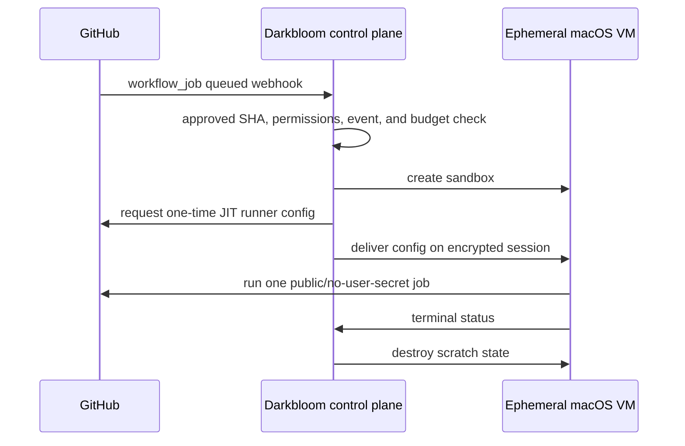
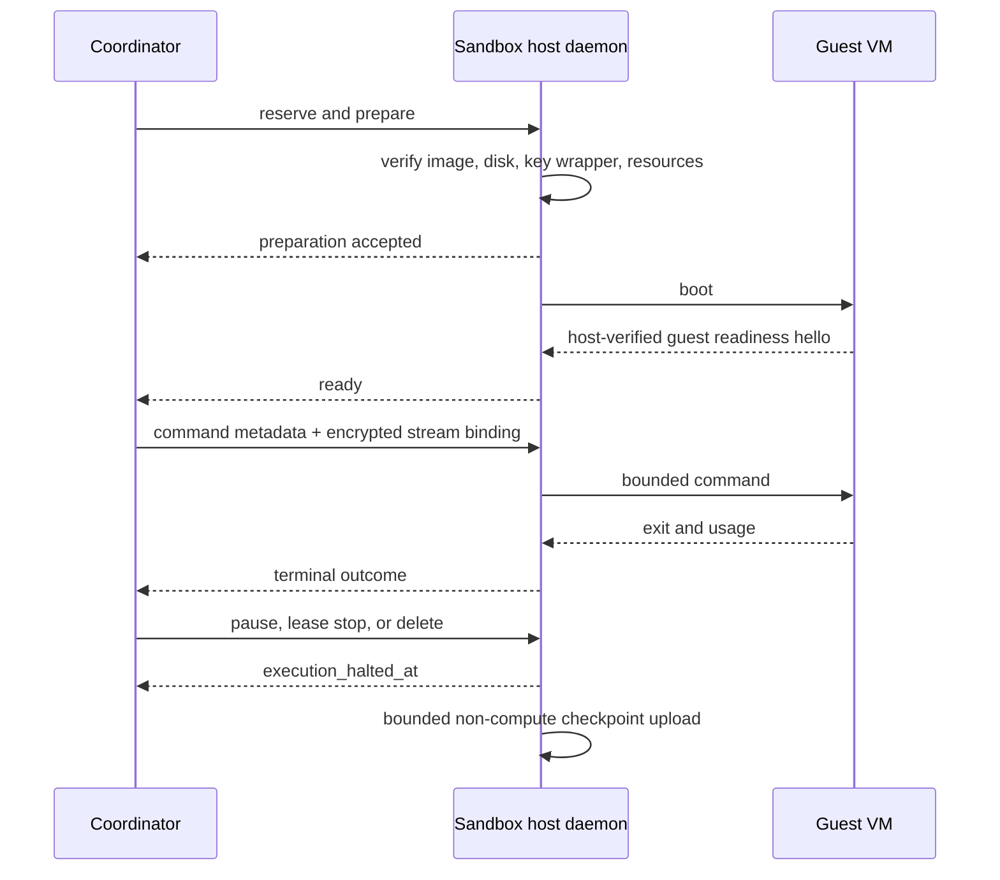

# Sandbox provider and developer experience

Status: **proposed product contract**

Date: 2026-08-22

Parent plan: [Darkbloom sandbox platform plan](2026-08-22-sandbox-platform-plan.md)

Pricing model: [Sandbox economics and pricing](2026-08-22-sandbox-economics.md)

The target is E2B-like ergonomics: one authenticated create call, streamed
commands, simple files, explicit persistence, and deterministic teardown. The
macOS-specific scarcity, chip selection, host trust, and computer-use features
stay visible instead of being hidden behind a generic "container" label.

All commands and API names below are proposed, not currently implemented.

## 1. Developer experience

### 1.1 Onboarding

The developer:

1. joins the permissioned alpha;
2. creates a scoped API key in the Darkbloom console;
3. funds the existing USD balance;
4. selects an allowed workload policy; and
5. installs either `@darkbloom/sandbox` or `darkbloom-sandbox`.

The key can be restricted by:

- maximum spend per day and month;
- allowed sandbox products and images;
- maximum vCPU, memory, and concurrent sandboxes;
- allowed egress policy;
- computer-use access; and
- expiration.

These controls require a new sandbox policy record keyed by API-key ID; the
current inference model allowlist/spend fields are not treated as sufficient.
Every quote, create, lease renewal, command, file, computer, and viewer request
enforces that record.

An API key with no sandbox policy is denied. Quotes and session grants display
the authorizing policy revision. Key/policy revocation invalidates queued
quotes, closes viewer/data sessions, rejects new operations, terminates an
active command, and starts the funded shutdown path; it never leaves an
unfunded ready VM running.

The console labels the alpha accurately:

> Host-trusted alpha. Persistent disks are encrypted at rest. Do not place
> credentials or private data in this sandbox; the machine owner is part of the
> runtime trust boundary.

There is no vague "secure" badge that implies confidential execution.

### 1.2 Quote before create

The developer can request a quote without consuming capacity:

```bash
npx @darkbloom/sandbox quote \
  --os macos \
  --image macos-xcode-26 \
  --cpu 4 \
  --memory 8GiB \
  --workspace 25GiB \
  --chip-family M4 \
  --compute-lease 15m \
  --idle-timeout 2m \
  --retention 24h
```

Example response:

```text
Product          macOS Sandbox
Eligible hosts   3
Expected start   warm, 8–20s
CPU              $0.2016/4-vCPU-hour
Memory           $0.1296/8-GiB-hour
macOS premium    $0.1656/hour
Workspace        25 GiB included while running
User-work hold   $0.1242 for a 15-minute billable window
Shutdown guard   $0.0083 for one minute; no new work
Durable storage  $0.3333 maximum for 24h/125 GiB
Sticky cache     $0.1667 maximum for 24h/125 GiB
Network cap      $0.0000; egress disabled for this quote
Maximum hold     $0.6325 before tax
Quote expires    2026-08-22T23:35:00Z
```

The response separates resource rates and premiums. It also states whether the
startup estimate assumes a sticky cache hit. Quotes use integer micro-USD
internally; displayed decimals never drive settlement.

If an exact processor matters:

```bash
npx @darkbloom/sandbox quote --os macos --chip-name M5 --exclusive-host
```

An exact chip is a hard filter. If none is online, the result says so; the
scheduler never silently substitutes another processor.

### 1.3 Create and wait

TypeScript:

```ts
import { Sandbox } from "@darkbloom/sandbox";

const sandbox = await Sandbox.create({
  image: "macos-xcode-26",
  resources: {
    cpuCount: 4,
    memoryMiB: 8192,
    workspaceGiB: 25,
  },
  chip: {
    minimumFamily: "M4",
  },
  computeLeaseSeconds: 15 * 60,
  idleTimeoutSeconds: 2 * 60,
  retentionSeconds: 24 * 60 * 60,
  commandTimeoutMs: 15 * 60 * 1000,
  networkEgressLimitBytes: 0,
  recovery: "platform-managed",
  cache: "sticky",
  idempotencyKey: crypto.randomUUID(),
});

await sandbox.waitUntilReady();
```

Python:

```python
from darkbloom_sandbox import Sandbox

sandbox = Sandbox.create(
    image="macos-xcode-26",
    cpu_count=4,
    memory_mib=8192,
    workspace_gib=25,
    minimum_chip_family="M4",
    compute_lease_seconds=15 * 60,
    idle_timeout_seconds=2 * 60,
    retention_seconds=24 * 60 * 60,
    command_timeout_seconds=15 * 60,
    network_egress_limit_bytes=0,
    recovery="platform-managed",
    cache="sticky",
    idempotency_key="build-2841",
)

sandbox.wait_until_ready()
```

The create operation returns immediately with:

- sandbox ID and generation;
- current state;
- immutable quote ID;
- selected product and shape;
- compute-lease and idle-stop expiry;
- retention expiry;
- recovery mode;
- maximum command timeout;
- host region and attestation status; and
- a content-free startup event stream.

The SDK obtains a quote, then handles
`queued → reserving → preparing → booting → ready`. It does not hide queueing
or retry forever. If the two-slot macOS launch limit is full, the caller
chooses:

- `queue: true` with a deadline; or
- immediate `429` with `Retry-After`.

Insufficient balance returns `402`. An impossible shape or chip request returns
`422`. No eligible provider returns `503`. Reusing an idempotency key returns
the original sandbox instead of creating or charging twice.

Queueing holds neither funds nor host capacity. At admission the coordinator
revalidates quote expiry and balance atomically. An expired quote returns
`QUOTE_EXPIRED`; the SDK never accepts a higher replacement price unless the
caller opted into a stated ceiling.

### 1.4 Run commands

```ts
const result = await sandbox.commands.run({
  command: "swift",
  args: ["test", "--parallel"],
  cwd: "/workspace/repo",
  env: {
    CI: "true",
  },
  timeoutMs: 10 * 60 * 1000,
  idempotencyKey: crypto.randomUUID(),
  onStdout: (chunk) => process.stdout.write(chunk),
  onStderr: (chunk) => process.stderr.write(chunk),
});

console.log(result.exitCode, result.durationMs);
```

Command behavior is explicit:

- `command` and `args` avoid shell interpolation by default;
- `shell: true` is opt-in;
- stdout and stderr are separate ordered streams;
- client disconnect does not silently replay the command;
- cancellation is idempotent;
- caller timeouts may be lower than 15 minutes but never higher;
- the alpha allows one active command per sandbox;
- a command must fit inside the funded compute lease or atomically renew it
  before dispatch;
- idempotency keys are scoped to API key, sandbox, and generation; SDKs use one
  versioned deterministic-CBOR serialization, an exact retry returns the
  original command, and changed command fields with the same key return
  `409 IDEMPOTENCY_KEY_REUSED`;
- the terminal result is `succeeded`, `failed`, `timed_out`, `cancelled`, or
  `lost`; and
- `lost` means a dispatched command may have produced side effects and its
  outcome cannot be proven.

The SDK never turns `lost` into a retry. The developer may restore the latest
checkpoint and make that decision with application-specific idempotency.
Command timeout/cancel terminates the process and returns the sandbox to
`ready` if funded user-work time remains; compute then continues only until the
idle timeout or lease stop.

Rotating an API key creates a new idempotency namespace. Before retrying an
ambiguous command with the replacement key, the developer queries the original
command ID; cross-key deduplication is not implied.

The default ready-idle timeout is two minutes. The SDK can explicitly renew:

```ts
await sandbox.renewComputeLease({
  seconds: 15 * 60,
  maxAdditionalMicroUSD: 132_480,
});
```

Renewal settles prior usage, checks settled spend plus every open hold, places a
new durable hold, then extends execution. Failure halts the VM inside the
already funded one-minute shutdown guard. Snapshot encryption/upload happens
after confirmed `execution_halted_at` and is not compute-billed. If the host
disappears instead, the coordinator closes billing at bounded
`metering_ended_at`, leaves `execution_halted_at` null, immediately displays
`fence_wait`, and waits for the capacity fence to expire before recovery or
reassignment. A same-host reconnect can reconcile and perform cleanup but
cannot reopen billing or accept work under the old lease.

### 1.5 Files

Small files use the SDK directly:

```ts
await sandbox.files.write("/workspace/repo/config.json", configBytes);
const junit = await sandbox.files.read("/workspace/repo/.build/test.xml");
```

Directories and large artifacts use a manifest plus resumable chunks:

```ts
await sandbox.files.uploadDirectory("./", "/workspace/repo", {
  exclude: [".git", "node_modules", ".env"],
});

await sandbox.files.downloadDirectory(
  "/workspace/repo/.build/artifacts",
  "./artifacts",
);
```

The default excludes known credential files and asks for explicit confirmation
before uploading them. This is a guardrail, not a security boundary. File
contents travel on the encrypted session stream and never enter coordinator
logs.

Uploads are content-addressed within the sandbox generation so retries do not
duplicate bytes. Paths are normalized in the guest agent, traversal is denied,
symlinks do not escape the workspace root, and individual/aggregate byte limits
are enforced.

### 1.6 Pause, resume, reset, and delete

```ts
await sandbox.pause();
await sandbox.resume();
await sandbox.reset({ preserveWorkspace: true });
await sandbox.kill();
```

Semantics:

| Action | Compute billing | Storage | Result |
|---|---|---|---|
| `pause` | Stops at `execution_halted_at` | Upload continues without compute billing | VM halts, then boot/workspace state checkpoints |
| `resume` | Starts at `ready` | Retained | Sticky host preferred, not guaranteed |
| `reset` | Continues while ready | Optional | Scratch layer replaced |
| `kill` | Stops | Access revoked | Active wrappers tombstoned; irreversible via API |
| Retention expiry | Stops | Deleted | Same cleanup path as `kill` |

If durable upload fails after the VM halts, state is `stopped_local`: no compute
is billed, no durable-storage charge settles for that generation, and the
developer may retry upload or acquire fresh leases for same-host resume. Host
loss can destroy that uncommitted generation. A 10-minute platform-funded grace
then discards it and falls back to the prior durable snapshot, or reports
`unrecoverable` when no prior generation exists. Any in-flight command may
separately have the terminal outcome `lost`.

The dashboard shows the sparse boot image, logical workspace quota, boot-delta
bytes, and actual encrypted retained bytes separately. Increasing the workspace
from 25 GiB to 50 GiB is allowed only while stopped and after a fresh quote.
Shrinking is not supported initially.

`platform-managed` recovery lets Darkbloom authorize restore through its KMS;
the console states that the platform can decrypt. `tenant-managed` recovery
requires a client-held key on every non-sticky resume and cannot be recovered by
support. Deletion revokes active authorization immediately, while ciphertext
and backup wrappers expire under the displayed backup-retention policy rather
than an instant-erasure promise.

Cross-host restore preserves disk/configuration bytes but may change the
host-derived Apple VM identity and require Apple-service reauthentication. The
alpha forbids signed-in Apple IDs, signing certificates, notarization, and any
workflow that requires stable Apple-service identity.

### 1.7 GitHub Actions

The Phase 3 runner workflow is a Darkbloom GitHub App for allowlisted public
repositories:



The developer installs the GitHub App, selects public repositories, chooses a
shape/chip policy, and sets a spend cap. Darkbloom creates one ephemeral runner
per job through GitHub's
[JIT runner configuration API](https://docs.github.com/en/rest/actions/self-hosted-runners)
and destroys it afterward.

This mode still handles a short-lived GitHub credential. The guarantee is **no
durable developer secrets and host-trusted integrity**, not literally zero
credentials. The GitHub App requires an approved workflow commit SHA,
read-only `GITHUB_TOKEN`, no OIDC, no
organization/repository/environment secrets, no `secrets: inherit` or
`${{ secrets.* }}` references, no release/deploy/signing job, no
`pull_request_target`, and no unapproved reusable workflow or action. Every
action and reusable workflow must be pinned to an approved immutable SHA. It
rejects jobs whose fully resolved workflow graph cannot prove those conditions
before asking GitHub for JIT configuration.

Private source remains outside the alpha contract. The host provider can still
read the ephemeral runner token, alter source or outputs, and forge a successful
test result. This tier is not suitable for release artifacts, signing, deploys,
or security-sensitive merge gates.

### 1.8 Computer use

For an approved project:

```ts
const sandbox = await Sandbox.create({
  image: "macos-computer-26",
  resources: { cpuCount: 6, memoryMiB: 16384, workspaceGiB: 50 },
  computerUse: true,
  computeLeaseSeconds: 15 * 60,
  idleTimeoutSeconds: 2 * 60,
  retentionSeconds: 60 * 60,
});

await sandbox.waitUntilReady();

const computer = await sandbox.computer.connect();
const frame = await computer.screenshot();
await computer.click({ x: 620, y: 410 });
await computer.type({ text: "hello from the agent" });
await computer.key({ key: "ENTER" });
```

The same session can issue shell commands and computer actions. Coordinates are
bound to a reported display size and frame generation so stale screenshots do
not produce accidental clicks after a resize.

Developers can request a one-time interactive viewer URL. It:

- expires quickly;
- requires project authentication;
- displays a visible recording/automation indicator;
- supports view-only or input-enabled scope;
- has a kill control independent of the agent; and
- does not pass through the provider's desktop.

Screenshots and typed text are not included in usage telemetry. The developer
decides whether their own application records them. Cua product telemetry is
disabled in the guest image and blocked by its egress policy.

### 1.9 Billing experience

The project page shows:

- active compute by sandbox and command;
- retained encrypted bytes;
- boot, chip, computer-use, and exclusive-host premiums;
- current durable hold;
- settled amount;
- refund/release amount;
- provider and platform split where disclosure is appropriate; and
- daily/monthly budget progress.

Each command response includes a machine-readable usage summary:

```json
{
  "usage": {
    "compute_lease_id": "scl_01K...",
    "execution_halted_at": null,
    "metering_ended_at": null,
    "metering_end_reason": null,
    "ready_ms": 631442,
    "cpu_count": 4,
    "memory_mib": 8192,
    "retained_byte_seconds": 0,
    "boot_fee_micro_usd": 0,
    "compute_micro_usd": 58093,
    "premium_micro_usd": 29046,
    "total_micro_usd": 87139
  }
}
```

The numbers are informational until the matching immutable settlement ID is
present. Final settlement always has `metering_ended_at`; normal shutdown also
has `execution_halted_at`, while host-loss settlement records a bounded
`metering_end_reason` without pretending the daemon confirmed a stop. A project
may set `maxTotalMicroUSD` on create. The coordinator checks settled usage plus
all open compute/storage/egress holds atomically, refuses a renewal that would
cross the bound, and checkpoints/stops before the current funded lease expires.
It does not merely block the next command while idle compute keeps accruing.

### 1.10 Developer dashboard

The first console surface needs only:

- sandboxes list with state, image, shape, chip, region, cost, and expiry;
- create/quote form;
- command status and content-free lifecycle events;
- pause, resume, and delete controls;
- cache/storage usage;
- budget and usage history;
- API keys and policy scopes; and
- a computer viewer for the GUI tier.

Command output belongs in the SDK/CLI stream, not persistent console logs.

## 2. Provider experience

### 2.1 Eligibility and doctor

The existing Darkbloom provider installs the sandbox host component from a
signed release, then runs:

```bash
darkbloom sandbox host doctor
```

The doctor reports pass/fail for:

- supported Apple Silicon and macOS host version;
- Virtualization.framework entitlement and a real VM start probe;
- Secure Enclave key load, unwrap self-test, and code identity;
- continuously logged-in dedicated Aqua session, APNs token, and authenticated
  LaunchAgent-to-LaunchDaemon XPC;
- available CPU, memory, and disk after host reserves;
- encrypted APFS workspace;
- outbound coordinator and relay connectivity;
- image signature verification;
- blessed release-manifest and running daemon code-identity verification;
- network isolation rules;
- power/sleep settings;
- guest image compatibility; and
- Cua/TCC readiness if computer use is enabled.

It prints exact remediation for failed checks and never advertises capacity
until all mandatory checks pass. The Mac may be physically headless, but the
dedicated account must retain an Aqua login session for APNs; losing it drains
lease eligibility.

### 2.2 Configure an offer

```bash
darkbloom sandbox host configure \
  --macos-slots 2 \
  --host-memory-reserve 12GiB \
  --host-cpu-reserve 2 \
  --workspace-capacity 500GiB \
  --cache 300GiB \
  --allow-images macos-xcode-26,macos-computer-26 \
  --minimum-net-compute-price macos-s=0.34/hour \
  --minimum-net-cache-price 0.025/GiB-month
```

The CLI auto-detects and signs machine model, chip, core topology, memory, and
runtime versions. Providers cannot claim an M5 while running another chip.

Configuration distinguishes:

- maximum active VM slots;
- allocatable vCPU and memory;
- bytes reserved for the host;
- workspace versus base-image cache;
- accepted images and workload policy;
- ordinary versus exclusive-host availability;
- computer-use capability; and
- posted minimum prices.

The coordinator rejects an offer that exceeds measured capacity or violates
platform price bands. No provider needs to bid on individual jobs during the
alpha.

Provider floors are **net payouts for a named shape**, not gross developer
prices or ambiguous whole-host rates. At the proposed $0.4968/hour gross
`macos-s` price and 70% provider share, the provider receives $0.34776/hour, so
the example $0.34 floor is eligible. The quote and provider statement show
gross price, provider net, platform fee, and any failure adjustment.

### 2.3 Preflight and enable

```bash
darkbloom sandbox host prefetch macos-xcode-26
darkbloom sandbox host benchmark
darkbloom sandbox host enable
```

`prefetch` downloads a signed, content-addressed base image and verifies it
before advertisement. `benchmark` measures boot, CPU, disk, network, and
checkpoint performance and assigns a benchmark class. `enable` first drains
inference on that physical Mac, then atomically acquires its
`sandbox_dedicated` workload-mode lease before launching the separate
`darkbloom-sandboxd` service and registering offers.

Inference does not keep serving on an alpha sandbox host. The inference routing
gate rejects a machine in `sandbox_dedicated` mode, and sandbox admission
rejects one until inference has drained and released its mode lease. A future
mixed mode requires an atomic cross-plane resource arbiter plus measured
interference limits; subtracting two independent capacity counters is not
sufficient.

### 2.4 Normal job lifecycle



The provider sees:

- sandbox ID;
- product, image, shape, and policy class;
- allocated resources and expected retention;
- lifecycle state and health;
- network and storage byte counts;
- current and accrued payout; and
- failure class with actionable host diagnostics.

The normal UI does not display command text, environment values, output,
filenames, screenshots, clipboard data, or typed text. The host owner remains
technically trusted in alpha, but the product must not make inspection a
feature.

### 2.5 Capacity and host safety

The daemon accepts resources only with a current capacity lease and fencing
token, and releases them through one idempotent cleanup path. It stops before a
lease expires and refuses a new job when:

- the physical host lacks a current `sandbox_dedicated` workload-mode lease;
- free memory or disk is below the declared reserve;
- the host is thermally constrained or sleeping;
- image/key verification fails;
- a prior VM is not cleanly accounted for;
- network isolation is unhealthy;
- the daemon or guest image is below the required version;
- the provider is draining; or
- an exclusive reservation conflicts with any workload.

The provider can impose local hard limits stricter than the coordinator offer.
The coordinator treats a mismatch as unavailable capacity, not as permission to
overcommit.

### 2.6 Sticky-cache earnings

Phase 2 durable snapshots live in the platform object store and pay no host
storage share. In Phase 3 a provider may sell an optional verified local
sticky-cache copy. The host page then shows:

- base-image bytes, which are platform infrastructure and not tenant-billable;
- encrypted tenant bytes by sandbox ID only;
- retention expiry;
- cache hits, misses, transfer bytes, and restore latency;
- sticky-cache payout accrued by verified byte-second; and
- pending garbage collection.

The provider's Secure Enclave private key is non-exportable, but unwrap returns
the host KEK/tenant DEK to signed daemon memory while serving. A malicious host
can extract those plaintext keys or inspect the guest. Deleting a sandbox
revokes the local wrapper immediately; ciphertext and backup wrappers follow
the disclosed retention policy.

Sticky cache is opt-in capacity with a separate developer add-on. A provider
may lower its cache limit or stop
accepting new retained data, but already sold retention remains reserved until
expiry or successful migration.

### 2.7 Earnings and payout

Example status:

```text
Sandbox host          online, attested
Running               1 / 2 macOS slots
Reserved              4 vCPU, 8 GiB, 25 GiB workspace
Capacity lease        valid, renews in 18s
Exclusive host        available after inference drain
Tenant cache          118.4 GiB / 300 GiB
Today compute         $8.42
Today sticky cache    $0.31
Pending settlement    $0.18
Withdrawable          $27.56
Reliability           99.96%
```

Compute payout accrues only for coordinator-observed billable states. Sticky
cache payout accrues only for a verified Phase 3 local copy; the platform pays
the Phase 2 durable object-store bill. A sandbox that fails before ready earns
no compute; a successful cold boot may earn the quoted boot fee.

Settlement lands in the existing provider balance and withdraws through Stripe
Connect. The statement separates gross developer charge, Darkbloom platform
fee, adjustments/refunds, and provider net.

### 2.8 Drain and maintenance

```bash
darkbloom sandbox host drain --deadline 30m
darkbloom sandbox host status
darkbloom sandbox host disable
```

Drain behavior:

1. stop advertising new offers;
2. let executing commands finish within their existing deadline;
3. checkpoint retained sandboxes;
4. migrate portable retained images where capacity exists;
5. stop remaining VMs;
6. report zero reservations; and
7. permit upgrade or reboot.

`disable` without a drain is rejected while commands execute unless the
provider passes an explicit emergency flag. Emergency stop produces `lost`
outcomes for ambiguous in-flight commands, closes billing at bounded
`metering_ended_at`, enters `fence_wait` until the old lease is fenced out, then
leaves the sandbox to recover its prior durable generation or become
`unrecoverable`. It lowers provider reliability.

Daemon upgrades use the same drain contract. Existing encrypted snapshots stay
versioned; an upgrade cannot silently rewrite their format.

### 2.9 Provider dashboard

The minimum provider surface contains:

- attestation and daemon/runtime health;
- slot and resource allocation;
- active lifecycle states;
- image and tenant-cache usage;
- benchmark and thermal status;
- compute/sticky-cache earnings;
- failure classes and recovery actions;
- drain/update controls; and
- privacy-safe usage history.

CLI parity comes first so a headless Mac can operate without the console.

## 3. Shared state and error language

The quote is an expiring object, not a sandbox state. Developer and provider
views use the same canonical sandbox states:

| State | Developer meaning | Provider meaning |
|---|---|---|
| `queued` | Waiting for eligible capacity | No host reservation yet |
| `reserving` | Admission is committing | Balance hold and fenced capacity lease are atomic |
| `preparing` | Image/state being placed | Resources leased; disks materializing |
| `booting` | Guest starting | VM created; guest agent not ready |
| `ready` | One command can be accepted | Funded compute lease and meter active |
| `executing` | The single alpha command may have side effects | Acceptance, deadline, and process tracked |
| `stopping` | Idle, sandbox cancel, or lease stop in progress | New work rejected; grace then force-stop |
| `checkpointing` | Execution halted; durable upload in progress | No compute meter; snapshot not yet durable |
| `stopped` | No compute charge | Resources released; storage retained |
| `stopped_local` | Durable upload failed; same-host recovery only | CPU/memory released; local encrypted disk retained |
| `fence_wait` | Billing ended; halt is not yet proven | No new work; same fenced host may reconnect for reconciliation/cleanup |
| `recovering` | Host/generation loss is being reconciled | Old fence expired; prior durable generation being selected |
| `unrecoverable` | No durable generation can resume | Auditable tombstone remains; delete is allowed |
| `deleting` | Irreversible cleanup | Keys tombstoned, bytes reclaiming |
| `failed` | Never became usable | Pre-ready terminal failure; no compute |
| `cancelled` | Queue/create cancelled before use | No charge or host lease |
| `deleted` | Resource gone | No remaining billable retention |

`lost` remains a terminal **command** outcome: dispatch may have produced side
effects, but the result cannot be reconciled. It never prevents sandbox
cleanup. The sandbox either recovers a prior durable generation or becomes
`unrecoverable`.

Errors carry:

- stable machine code;
- safe human message;
- retryability;
- whether side effects may have occurred;
- whether any charge settled;
- operation and settlement IDs; and
- `Retry-After` when capacity is the only blocker.

This common language is more important than hiding platform differences. It
lets SDKs, the console, providers, and support reason about the same event
without parsing logs. The authoritative transition and settlement table is in
[Lifecycle and failure semantics](2026-08-22-sandbox-platform-plan.md#11-lifecycle-and-failure-semantics).
