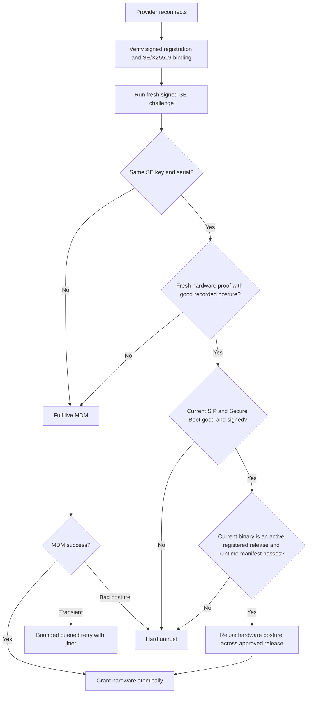

# v0.8.15 Provider Rollout Hardware-Trust Collapse

- **Date:** 2026-08-29
- **Status:** Mitigated; permanent coordinator and rollout fixes required before the next provider release
- **Scope:** production coordinator, provider auto-update rollout, Secure Enclave challenge verification, MicroMDM `SecurityInfo`, provider hardware-trust reuse
- **Privacy:** counts and low-cardinality outcomes only. No provider IDs, serial numbers, Secure Enclave keys, APNs tokens, or customer request contents appear in this report.

## TL;DR

The v0.8.15 provider binary was healthy: upgraded providers connected, passed runtime verification, advertised models, and served when hardware trust was available. The production failure was a coordinator trust-transition and rollout-orchestration defect.

The coordinator's hardware-trust reuse cache accepted a prior MDM proof only for the **same binary hash** and only for **10 minutes**. A coordinator hot-swap caused the fleet to perform live MDM verification around 01:51 UTC. The provider release began about 20 minutes later. Each provider restarted with the new v0.8.15 binary hash, so both trust-reuse gates failed: the proof was older than 10 minutes and its binary hash was v0.8.14. More than one thousand connected providers immediately entered live MicroMDM `SecurityInfo` verification. The retry loop had no fleet-wide concurrency limit and insufficient jitter. MicroMDM/APNs delivery timed out at 100–174 attempts per minute, providers stayed `self_signed`, and the hardware-only scheduler excluded them despite healthy WebSockets and runtimes.

Observed network capacity fell from roughly 21,100 tok/s before the rollout to roughly 1,537 tok/s at the incident low point. The public connected-provider count remained around 1,260, which initially hid the loss of routable hardware trust.

A one-time, bounded trust bridge recovered the fleet without directly assigning hardware trust. Exactly 999 recent hardware-verified device records were backed up. Their expected binary hash was bridged from the registered v0.8.14 hash to the signed/notarized v0.8.15 hash. After the unchanged coordinator restarted, every provider still had to pass the existing hardware fast-skip gates: a fresh Secure Enclave-signed challenge, the same registration-bound SE key and serial, the exact bridged binary hash, currently enabled SIP and Secure Boot carried in trusted signed status fields, no hard-untrust state, and a configured MDM verifier. The provider's independent registration, runtime-manifest, code-attestation, and routing gates remained in force, but are not direct predicates inside `tryTrustReuseFastSkip`. The coordinator seeded 1,005 reusable records and granted 1,002 providers hardware trust through the live fast-skip. Capacity recovered above 15,400 tok/s and continued climbing.

## Impact

### User-visible and network impact

- Providers remained connected, so `/health` and raw provider counts looked mostly normal.
- Hardware-trusted capacity collapsed; the operator dashboard reported approximately 86 hardware-attested machines at the low point.
- Network capacity fell from approximately 21,100 tok/s to approximately 1,537 tok/s.
- Existing model provider counts and route diversity contracted until trust was restored.
- Requests were primarily shed as retryable 429s or retried across remaining hardware-trusted providers; the reduced pool increased pressure and latency.
- The v0.8.15 release itself stayed active by operator decision.

### Deploy-window request impact

Two approved short drains occurred during the surrounding operations:

- Coordinator hot-swap: 416 in flight at drain start, 86 after 60 seconds.
- Incident recovery restart: 187 in flight at drain start, 42 after 30 seconds.

Requests remaining after those bounded drains may have been interrupted when Docker's stop deadline elapsed. The permanent release process must not depend on short drains while hundreds of long-running generations remain active.

## Timeline (UTC)

| Time | Event |
|---|---|
| 01:49 | Coordinator hot-swap drain begins. |
| 01:50:58 | New coordinator completes repeatable Postgres migrations (`already_applied`). |
| 01:51:09 | Runtime manifest sync completes; code/trust reuse caches seed. |
| 01:51:10–01:51:15 | First post-swap MDM verification herd succeeds for approximately 1,056 providers and records hardware proofs against the v0.8.14 binary hash. |
| 01:58 | Tag `v0.8.15` triggers the provider release workflow. |
| 02:11 | Signed/notarized v0.8.15 bundle is uploaded and registered as latest. Provider auto-updates accelerate. |
| 02:20–02:30 | v0.8.15 adoption grows rapidly; hundreds of providers restart and reconnect. |
| 02:28 | Snapshot shows 502 online v0.8.15 providers (38.88% of the 90-second online cohort), all runtime-verified. |
| 02:30–02:53 | MDM `SecurityInfo` timeouts sustain 100–174/minute; hardware grants remain isolated. |
| ~02:53 | Approximately 1,145 providers are on v0.8.15, hardware-attested count is approximately 86, and capacity is approximately 1,537 tok/s. |
| 03:02 | Exact bridge candidate set is reviewed. |
| 03:04:32 | Transactional trust bridge updates the reviewed records. |
| 03:07:09 | Unchanged coordinator container restarts after the approved 30-second drain. |
| 03:07:57 | Coordinator seeds 1,005 fresh trust-reuse records. |
| ~03:08 | 1,002 live SE fast-skip grants restore hardware trust without live MDM. |
| Post-recovery | Capacity rises through approximately 12,738, 14,617, and 15,431 tok/s while code-attestation and model warmth continue recovering. |

## Detection and evidence

### Connected did not mean routable

The failure was a trust-state collapse, not a connection failure:

```text
WebSocket connected
runtime verified
models advertised
code attestation substantially healthy
hardware trust missing
        ↓
MIN_TRUST=hardware excludes provider from routing
```

At one incident snapshot:

- connected providers: approximately 1,261;
- v0.8.15 runtime-verified providers: hundreds and growing;
- code-attested providers: approximately 1,122;
- hardware-attested providers: approximately 86;
- network capacity: approximately 1,537 tok/s.

### MDM/APNs was the bottleneck

The coordinator host was not resource-bound:

| Resource | Observation |
|---|---:|
| Coordinator CPU | ~568% of 30 cores (~19%) |
| Coordinator memory | ~1.0 GiB / 56.9 GiB |
| Host load | ~12 on 30 cores |
| Persistent disk | ~2% used |

The production logs instead showed:

- 3,150 `securityinfo-timeout` outcomes in the initial investigation window;
- only 10 hardware grants in the same 25-minute window;
- 1,414 WebSocket connects and 1,342 disconnects during rollout churn;
- continuous waves of 100–174 MDM timeouts per minute.

### Trust-record mismatch

Immediately before mitigation, the online v0.8.15 cohort showed:

- 1,145 online v0.8.15 providers;
- 1,055 with existing hardware trust-reuse rows;
- 1,021 rows still bound to the v0.8.14 binary hash;
- only 28 rows already bound to v0.8.15;
- only 10 rows fresh under the 10-minute reuse window.

The final strict bridge predicate selected 999 unique Secure Enclave identities whose prior successful hardware verification occurred between 01:51:10 and 02:30:17 UTC.

## Root cause

### Root cause statement

The coordinator coupled reusable hardware/MDM posture to an exact application binary hash and a 10-minute window. A provider update necessarily changes the binary hash. The release followed a coordinator-wide MDM verification by approximately 20 minutes, so both reuse conditions failed for the fleet. The fallback MDM loop immediately scheduled unbounded per-connection verification and synchronized retries, overwhelming the MDM/APNs delivery path.

### The responsible code paths

#### Exact-binary and 10-minute hardware reuse

Introduced by commit `0d496be76` / PR #391 (`DAR-326 Phase 0: provider trust-reuse cache`).

`coordinator/api/trust_reuse.go`:

```go
const defaultTrustReuseWindow = 10 * time.Minute
```

and:

```go
if r.binaryHash == "" || r.binaryHash != freshBinaryHash {
    return trustReuseRecord{}, false
}
```

The original intent was defense in depth: a persisted hardware proof could not be reused by another binary. The implementation inadvertently made every approved provider release a fleet-wide live-MDM event.

#### Unbounded immediate MDM fallback

Introduced by commit `643710181` / PR #341 (`per-connection MDM verification`).

`coordinator/api/provider.go`, `mdmVerificationLoop`:

- immediate first attempt for every connection;
- retry after 2 minutes;
- retry after 6 minutes;
- retry every 15 minutes thereafter;
- no global semaphore or queue;
- no per-fleet rollout jitter.

This design ensured that one provider could eventually recover, but it did not bound work for a thousand simultaneous binary transitions.

### What did not cause the incident

- The Qwen3.8 model runtime did not cause the trust collapse.
- The v0.8.15 provider did not crash as a fleet: providers connected, reported models, and passed runtime verification.
- `EIGENINFERENCE_MIN_PROVIDER_VERSION` remained `0.7.5`.
- PR #700's APNs code-identity changes were not the hardware-trust gate that collapsed. Hardware trust is controlled by `trust_reuse.go` and the MDM verification loop.
- GCE CPU, memory, disk, and network resources were not saturated.

### Contributing factors

1. **Back-to-back fleet operations.** The provider release started before the coordinator-restart MDM/APNs delivery budget had recovered.
2. **No staged provider rollout.** Registering the release made it globally available; no 1%/5%/25% progression gate existed.
3. **Connected-provider observability hid routability.** Raw provider counts remained high while hardware trust collapsed.
4. **No hardware-trust ratio release gate.** The release workflow did not pause when hardware-trusted/connected fell sharply.
5. **No MDM queue-depth/timeout gate.** The coordinator exposed outcomes but no admission controller protected MicroMDM/APNs.
6. **Short operational drains.** Approved short drains left valid long-running requests active at forced shutdown.
7. **Cloud Build tag drift.** The production build emitted a short image tag while the runbook required a full-commit tag. The deploy used a manually added full tag pointing to the same verified digest. This did not cause the incident but must be corrected.

## Emergency mitigation

### Safety model

The mitigation did **not** run:

```sql
UPDATE providers SET trust_level = 'hardware';
```

No provider was granted live trust directly from SQL.

The bridge only made a prior hardware proof eligible for the existing in-process reuse decision. The post-restart coordinator still required every provider to satisfy the direct `tryTrustReuseFastSkip` gates:

- same registration-bound Secure Enclave key;
- same serial number;
- fresh Secure Enclave-signed challenge;
- current binary hash equal to the bridged signed/notarized v0.8.15 release hash;
- current SIP enabled in trusted signed status fields;
- current Secure Boot enabled in trusted signed status fields;
- cached record still at hardware trust with good recorded SIP/Secure Boot;
- cached record within the configured freshness window;
- no hard-untrust state;
- configured MDM verification, for which reuse substitutes.

The provider's separate registration, runtime-manifest, code-attestation, minimum-version, and routing gates remained enforced around this decision. They must not be described as direct predicates of `tryTrustReuseFastSkip`; the permanent design below intentionally tightens approved cross-release reuse by adding a typed release/runtime decision.

Only after those live checks did `tryTrustReuseFastSkip` call the atomic hardware grant.

### Candidate predicate

A row was eligible only when:

1. the provider was currently online on v0.8.15;
2. its SE key and serial matched a prior trust row;
3. the prior row was `hardware`;
4. prior SIP and full Secure Boot were true;
5. the prior binary hash was the exact registered v0.8.14 hash;
6. prior verification occurred after the coordinator hot-swap;
7. the active release table contained the exact signed/notarized v0.8.15 hash.

### Backup and transaction

- Backup table: `incident_trust_bridge_20260829_030255`
- Root-only CSV: `/var/lib/darkbloom-deploy/incidents/incident_trust_bridge_20260829_030255.csv`
- CSV SHA-256: `4202219cde8401013eaf81d462ea7a5d08c640ffe9a8e41ac72a20f2360b18c7`
- Unique records backed up: 999
- Transactionally bridged: 998
- Already naturally matching v0.8.15: 1
- Hard-untrust-deleted records restored: 0
- Post-transaction matching records: 999

### Restart and recovery

The same coordinator image and environment restarted; the provider release remained active by operator decision.

- Drain start: 187 in flight
- After 30 seconds: 42 in flight
- Healthy after restart: 49 seconds
- Reuse rows seeded: 1,005
- Hardware fast-skip grants: 1,002
- Additional MDM grants during initial recovery: 132–142
- Provider count after recovery: approximately 1,278–1,305
- Selected routes observed with hardware trust only
- Capacity recovery: ~1,537 → 12,738 → 14,617 → 15,431 tok/s and climbing

## Why the emergency bridge was acceptable but is not the permanent design

The bridge was a one-transition, human-reviewed mapping from one registered release hash to the next for devices with a very recent successful hardware proof. It retained the live cryptographic gates and produced a complete rollback artifact.

It is not suitable as routine release machinery because:

- it is an out-of-band database mutation;
- it refreshes proof age operationally rather than through a typed policy;
- it requires a coordinator restart to reload the in-memory cache;
- it does not express approved release lineage in code;
- repeated manual use would be difficult to audit and easy to misuse.

The backup table must remain until the permanent fix is deployed and at least one clean provider release transition has completed. Do not restore old hashes after healthy v0.8.15 proofs have naturally replaced them; restoration would recreate the mismatch. Archive and drop the incident table only through a separate reviewed operation.

## Permanent fix

### Design principle: separate device trust from application trust

The coordinator currently conflates two independent proofs.

**Device/hardware proof:**

```text
Secure Enclave identity + serial
MDM enrollment
Apple device attestation
SIP and Secure Boot posture
```

**Application/runtime proof:**

```text
registered signed provider release
live binary hash
runtime manifest and metallib
code identity
```

A provider release should re-prove application identity. It should not require a new live MDM round-trip when the same device presents a recent hardware proof and a fresh signed challenge showing good current posture.

### Target control flow



### Required code changes

#### 1. Introduce an approved-release transition policy

Add a typed release-verification input to the trust decision rather than rewriting persisted rows.

The trust-reuse decision should accept a changed binary hash only when all of the following hold:

- the cached hardware proof matches the same SE key and serial;
- cached trust is hardware with good recorded MDM posture;
- the proof is within the hardware-proof freshness policy;
- a fresh signed challenge reports the new binary hash and good SIP/Secure Boot;
- the new binary hash belongs to an active release for the provider's platform/version;
- runtime and runtime-manifest checks pass;
- code attestation passes;
- the provider is not hard-untrusted;
- the transition is not a downgrade below the configured minimum.

Do not infer approval from a semver increase alone.

Candidate implementation boundaries:

- `coordinator/api/trust_reuse.go`
  - replace exact-hash-only `reuseTrust` with a result that distinguishes `same_binary`, `approved_release_transition`, and rejection reasons;
  - keep the current exact-hash path unchanged for ordinary reconnects;
  - pass a validated release transition fact from `Server`, not raw request data.
- `coordinator/api/provider.go`
  - assemble the registered-release/runtime/code gates before `tryTrustReuseFastSkip` grants hardware;
  - emit one low-cardinality decision outcome per attempted reuse.
- `coordinator/store`
  - hardware reuse records may retain `last_verified_binary_hash` for audit, but it must not be the sole hardware-proof eligibility key;
  - preserve MDM/MDA verification time independently from application-release time.

#### 2. Split freshness policies

Use separate clocks:

- `hardware_proof_verified_at`: last full MDM/MDA verification;
- `application_proof_verified_at`: current connection's signed binary/runtime/code proof.

The current ten-minute hardware window is too short for a normal coordinator deploy plus provider rollout and is not aligned with MDM/APNs delivery behavior. Select the new hardware-proof TTL through the threat model and MDM revocation requirements. A concrete initial rollout value should be at least one hour, configurable with a reviewed maximum, while every connection still performs the fresh signed SIP/Secure Boot challenge.

Reboot/posture safety must come from the live signed challenge and hard-untrust path, not solely from a ten-minute wall clock.

#### 3. Add bounded MDM verification scheduling

Replace one immediate goroutine per connection with a coordinator-owned scheduler:

- singleflight per SE key;
- fixed global concurrency cap (initially 8–16, measured against MicroMDM/APNs);
- bounded queue with cancellation on disconnect;
- randomized initial delay for fleet reconnects;
- decorrelated jitter for retries;
- explicit queue wait, attempt, timeout, and grant metrics;
- no synchronized 2m/6m/15m waves.

Suggested retry ranges rather than exact points:

- first retry: 2–4 minutes;
- second retry: 6–12 minutes;
- steady retry: 15–30 minutes.

The scheduler must prioritize first-ever/unverified devices over redundant refreshes.

#### 4. Add staged provider release rollout

Registering a release must not imply immediate 100% fleet eligibility.

Required stages:

```text
canary allowlist
1%
5%
25%
50%
100%
```

Use deterministic provider identity hashing so stage membership is stable. Promote only after an observation window satisfies:

- hardware-trusted/connected ratio remains within baseline tolerance;
- MDM timeout rate remains bounded;
- code-attested ratio remains stable;
- provider reconnect and crash-loop rates remain bounded;
- network capacity and model-specific warm capacity remain within tolerance;
- final 5xx and queue-timeout rates remain within baseline.

The updater endpoint should return the previous release to providers outside the active stage; it must never request a downgrade from already-upgraded providers.

#### 5. Add release-sequencing gates

Do not perform a provider rollout immediately after a coordinator restart. Require a clean observation window at least as long as the hardware-proof reuse and APNs delivery recovery policy. At minimum:

- provider count recovered;
- hardware-trusted ratio recovered;
- MDM verification queue drained;
- no sustained timeout wave;
- code-attestation ratio recovered;
- one signed provider canary completed.

Coordinator deploy and provider release approvals must remain separate actions.

#### 6. Add observability and automatic pause

Required gauges/counters:

- connected providers by version and trust level;
- hardware-trusted/connected ratio;
- hardware reuse decisions by outcome;
- approved cross-release reuse grants;
- MDM scheduler queue depth, active attempts, wait time, timeout rate, and grants;
- provider adoption by version;
- routable/warm providers by version and model;
- network capacity by provider version;
- release rollout stage and pause reason.

Automatically pause rollout when hardware-trusted ratio or network capacity falls beyond a reviewed threshold. Raw connected count is not a sufficient health signal.

#### 7. Fix production image provenance

`deploy/gcp/cloudbuild-prod.yaml` must publish the full 40-character commit tag directly. The runbook must not depend on an operator adding a full tag to a short-tagged digest after the build.

### Required tests

#### Trust policy unit tests

- same binary + fresh hardware proof succeeds;
- approved release transition succeeds;
- unregistered binary hash fails;
- inactive release fails;
- downgrade below minimum fails;
- changed SE key fails;
- changed serial fails;
- bad or unsigned SIP/Secure Boot fails;
- hard-untrusted provider fails;
- expired hardware proof falls back to MDM;
- runtime-manifest or code-attestation failure prevents cross-release reuse;
- persisted row alone never grants trust.

#### Concurrency and fleet simulation

Simulate at least 1,500 providers across:

1. coordinator restart with unchanged binaries;
2. hardware recovery;
3. approved provider release transition;
4. provider process restarts;
5. second reconnect wave.

Acceptance criteria:

- no fleet-wide live MDM herd;
- MDM active attempts never exceed the configured cap;
- no synchronized retry spikes;
- unchanged devices fast-skip only after live signed challenge;
- approved new binary fast-skips hardware MDM only after runtime/code gates;
- unapproved binaries never receive hardware trust;
- routable capacity remains above the reviewed floor;
- no trust-state resurrection after hard untrust;
- restart-safe Postgres seeding retains every decision invariant.

#### End-to-end rollout test

A release-controller test must prove staged adoption and automatic pause when a synthetic hardware-trust ratio drops. Promotion must resume only after an explicit operator action and a clean new observation window.

## Operational runbook changes

Before the next provider release:

1. Confirm the coordinator contains approved-release hardware reuse and bounded MDM scheduling.
2. Deploy coordinator separately.
3. Hold until provider, hardware-trust, code-attestation, and MDM queue metrics recover.
4. Upgrade one canary provider.
5. Confirm hardware trust survives the binary transition without live MDM.
6. Promote through staged percentages.
7. Never raise `EIGENINFERENCE_MIN_PROVIDER_VERSION` during the rollout.
8. Keep the previous signed release active until the rollout has completed and remained stable.
9. Use long-enough drains for valid long-running generations unless a human explicitly accepts interruption.

## Action plan

| Priority | Action | Acceptance evidence |
|---|---|---|
| P0 | Implement approved-release hardware trust reuse | Unit tests cover every allow/deny gate; one canary upgrade performs zero live MDM and gains hardware after live SE challenge. |
| P0 | Add global MDM scheduler with concurrency cap and jitter | 1,500-provider simulation never exceeds cap or synchronizes retries. |
| P0 | Add staged provider release controller and automatic pause | Canary/1/5/25/50/100 stages proven; trust/capacity regression pauses rollout. |
| P1 | Separate hardware-proof and application-proof timestamps | Store/API migration reviewed; exact-hash reconnect behavior remains intact. |
| P1 | Add version/trust/capacity rollout dashboards and alerts | Operators can see connected versus routable hardware providers by version. |
| P1 | Add coordinator-restart-then-provider-update integration scenario | Reproduces this incident before the fix and remains green after it. |
| P1 | Publish full-commit coordinator image tags from Cloud Build | Runbook candidate tag exists directly after every successful master build. |
| P2 | Archive and remove incident backup after a clean later release | Separate approved operation; no restoration of obsolete hashes. |

## Lessons

1. Connected provider count is not a capacity metric when routing requires hardware trust.
2. Hardware posture and application identity are separate proofs and need separate lifecycle policies.
3. A safe single-provider retry loop can become unsafe when multiplied by the fleet.
4. Provider releases are production traffic changes even when the coordinator API remains healthy.
5. Back-to-back coordinator and provider rollouts must be treated as one coupled failure domain.
6. A release that passes build, signing, notarization, unit tests, and a single-machine canary can still fail through fleet-control-plane synchronization.
7. Emergency data bridges can be safe only when bounded, backed up, live-proof-gated, and explicitly temporary.
