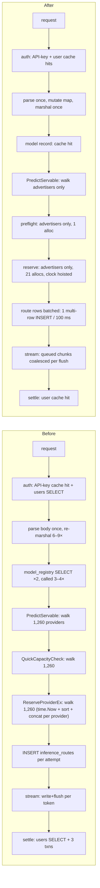
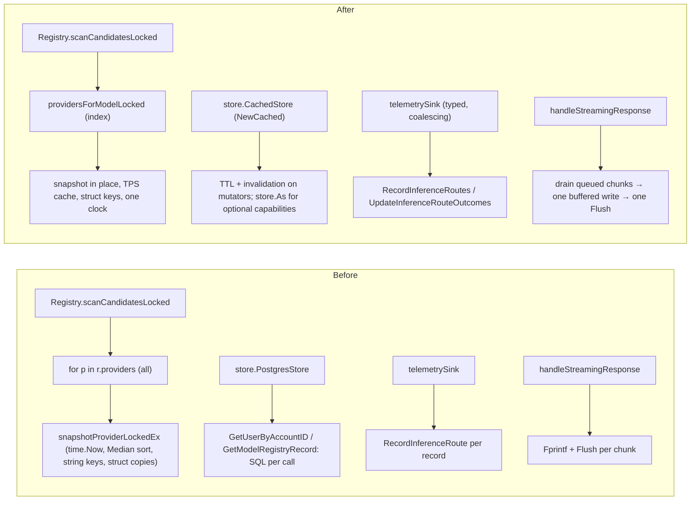

# PR body draft — coordinator performance program (2026-09-02)

_(Draft for the PR description. Numbers in the tables are filled from
`docs/reports/2026-09-02-coordinator-performance-program.md`.)_

## Summary

First-principles performance pass over every coordinator operation on the
inference path and at fleet scale. The 2026-09-01 collapse showed the
per-request cost is dominated by full-fleet walks; this PR removes the walks'
per-provider costs and prunes them to the providers that advertise the model,
removes the per-request database round trips, parses the request body once,
batches route telemetry, coalesces streamed chunks per flush, and caches the
public read endpoints. Every change is measured by a committed benchmark
(`registry/fleet_scale_bench_test.go`, 1,260 providers) and an end-to-end
harness (`api/perf_e2e_test.go`, real HTTP + WebSocket providers).

## Before / After — behavior

## Before / After — code

## Measurements

_(see §2 and §5 of the report)_

## Notes for reviewers

- No overlap with PR #799's hunks (`consumer.go` 93–115 / 587–640 / 871–1130 /
  1426–1450, `dispatch.go` 184 / 1213 / 1652 / 1720, `inference_admission.go`
  219–340, `server.go` 27 / 492 / 793 / 1294, `main.go` 591–700 / 1048+).
- Single-process assumption for the store cache is documented in
  `store/cached.go`; manual SQL edits take up to the TTL to become visible
  (runbook row added).
