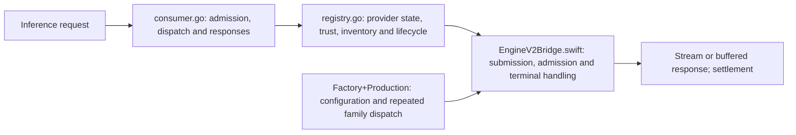
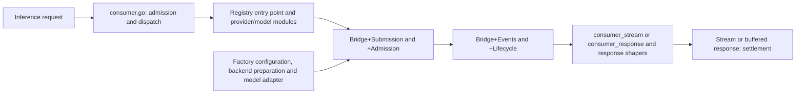

# Coordinator and provider modularization checkpoint

> Last updated: 2026-09-04 · commit `7ae06021f`

The second cleanup pass separates coordinator and provider responsibilities,
removes unused paths and duplicated helpers, and preserves the serving contracts.
This records commits after `e928d395f` through `7ae06021f`; the earlier hot-path
measurements remain in [the first-pass report](2026-09-04-coordinator-provider-hotpaths.md).
No new serving-latency or model-throughput improvement is claimed here.

## Scope and retained changes

| Milestone | Commit | Result |
|---|---|---|
| Retired telemetry and MDM wrappers | `b9dbd1276` | Removed obsolete telemetry handling and command wrappers; MDM issuance uses the waiter-bound paths |
| Registry responsibilities | `e1a6de84c` | Separated provider state/evidence, request synchronization, lifecycle, heartbeat, model inventory/loading, and fleet views; consolidated four small fragments and duplicated capacity-copy logic |
| API response paths | `e883d340f` | Separated streaming, buffered responses, chat/Responses shaping, and SSE helpers; removed unused dispatch/response wrappers |
| Provider request lifecycle | `5e79c2787` | Separated bridge submission, admission, cancellation, resizing, identity, and events; removed redundant state |
| Provider engine construction | `7ae06021f` | Separated configuration, backend preparation, and model adaptation; consolidated family dispatch and simplified assembly |

Registry declarations remain in the same Go package. An AST comparison confirms
that all **263 declarations formerly in `registry.go` retain identical declaration
bodies** after relocation. The additional heartbeat-copy refactor shares the
pointer-detachment rules between accepted heartbeat state and public snapshots;
it retains nil versus empty semantics and the existing allocation count.

## Source size: deletion versus relocation

These are physical `.go` and `.swift` source lines, including comments and blank
lines, from `git diff --numstat --no-renames e928d395f 7ae06021f -- coordinator provider-swift`.
Tests are Go `_test.go` files and Swift files under `Tests/`.

| Scope | Changed files | Added lines | Removed lines | Net lines |
|---|---:|---:|---:|---:|
| Coordinator | 58 | 8,031 | 8,349 | −318 |
| Provider | 14 | 1,842 | 2,735 | −893 |
| Production source | 56 | 9,838 | 10,933 | −1,095 |
| Test source | 16 | 35 | 151 | −116 |
| Total | 72 | 9,873 | 11,084 | **−1,211** |

The coordinator/provider rows and production/test rows are two views of the same
total. Most of the 11,084 removed lines reappear in responsibility modules; they
are **moves, not discarded functionality**. The net reduction includes removed
wrappers, duplicated implementations, redundant state, obsolete handling, and
associated tests. No public protocol or supported model family was retired by
this pass.

| Entry point | Before | After | Where responsibilities moved |
|---|---:|---:|---|
| `coordinator/registry/registry.go` | 6,513 | 320 | `provider.go`, `provider_evidence.go`, `attestation_policy.go`, `pending_request.go`, `provider_lifecycle.go`, `heartbeat.go`, model modules and fleet views |
| `coordinator/api/consumer.go` | 4,481 | 3,001 | `consumer_stream.go`, `consumer_response.go`, `chat_response.go`, `responses_response.go`, `chat_stream_terminal.go`, `sse_events.go`, `stream_message.go` |
| `provider-swift/Sources/ProviderCore/Inference/EngineV2Bridge.swift` | 1,911 | 400 | `+Submission`, `+Admission`, `+Lifecycle`, `+Resizing`, `+Identity`, `+Events` |
| `provider-swift/Sources/ProviderCore/Inference/EngineV2Factory+Production.swift` | 1,187 | 167 | `+Configuration`, `+BackendPreparation`, `+ModelAdapter` |

## Before and after

Before, request and provider responsibilities accumulated in broad files:

After, the same serving path uses explicit responsibility modules:

## Validation and limits

- `GOTOOLCHAIN=go1.25.0 go test ./coordinator/...` passed across all 25 tested
  packages; the API package completed in 153.454 seconds.
- Registry and routing-simulation suites passed normally and with `-race` on the
  final registry changes using Go 1.25.0. Existing coverage exercises routing
  gates, reservation races, reconnect state, heartbeat ownership, and snapshots.
- The full provider build and test run passed: **82 XCTest tests, zero failures**,
  plus **2,452 Swift Testing tests in 250 suites**.
- `docs-check --all` verifies the synchronized current code citations and maps;
  historical reports, design records, and release notes retain their old paths.

Raw local test logs were `/tmp/darkbloom-cleanup-coordinator-test.log` and
`/tmp/darkbloom-cleanup-provider-test.log`; registry extraction proofs and race
logs were retained under `/private/tmp/darkbloom-registry-modules-20260904/`.
These tests establish the refactor checkpoint. Machine load was not isolated for
microbenchmarks, and this pass establishes no new end-to-end performance result.
