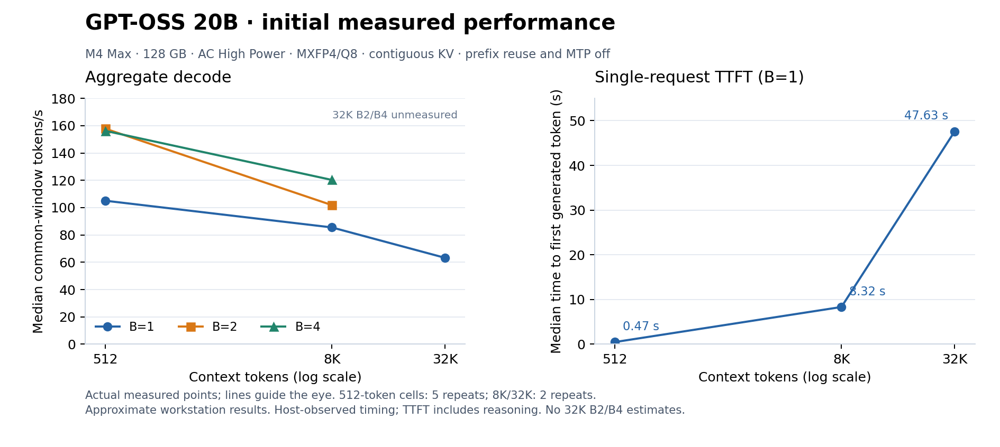

# GPT-OSS 20B quick profile — M4 Max

> Last updated: 2026-09-05 · commit `4d9811f7c`

On this M4 Max, the initial High Power baseline delivers about **105 tok/s solo and 150–160 aggregate tok/s at B=2/4** for short context. At 8K context, it delivers approximately **86 / 102 / 120 aggregate tok/s at B=1/2/4**. The clearest first optimization is removing unnecessary prefill vocabulary projections; no code speedup is claimed in this report.

## Measurements

Hardware: Apple M4 Max, 40 GPU cores, 128 GB RAM, macOS 26.5.2. AC High Power mode was checked before and after each primary cell. Model: `mlx-community/gpt-oss-20b-MXFP4-Q8`, snapshot `773a7da77e569019bb0fd17a554b263738d669a3`. Production contiguous-KV engine, greedy decoding, **prefix reuse and MTP disabled**.

Short-context cells have five measured repetitions and 256 post-first-token decode tokens per row. Longer-context cells have two repetitions and 128 decode tokens per row. Each process performs shape warmup first. Aggregate decode counts tokens in the shared interval after every row has emitted its first token and before any row finishes; it excludes staggered prefill and batch drain.

| Context tokens | Batch | Aggregate decode tok/s | Fair share per request, tok/s | Median request TTFT |
|---:|---:|---:|---:|---:|
| 512 | 1 | 105.1 | 105.1 | 0.47 s |
| 512 | 2 | 157.8 | 78.9 | 1.09 s |
| 512 | 4 | 156.2 | 39.1 | 2.80 s |
| 512 | 8 | 151.8 | 19.0 | 4.14 s |
| 8,192 | 1 | 85.5 | 85.5 | 8.32 s |
| 8,192 | 2 | 101.9 | 50.9 | 16.34 s |
| 8,192 | 4 | 120.3 | 30.1 | 27.60 s |
| 32,768 | 1 | 63.2 | 63.2 | 47.63 s |

Separate single-token prefill runs measured **0.44 s at 512 tokens** and **3.68 s at 4K**. TTFT above means the first model token on a synthetic prompt, not the first visible final-answer content. Fair share is aggregate/B; it is not a substitute for actual per-row latency, which is retained in the raw data.

## What the traces establish

### 1. Remove unnecessary prefill vocabulary projections

The valid 8K prefill trace records **four Q8 LM-head GEMMs**, each with `M=2048, N=201088, K=2880`. Thus it projects **8,192 positions although only one frontier position is needed**. The float32 outputs represent 6.59 GB of logical output across the four chunks; this is neither measured DRAM traffic nor simultaneously retained memory.

The first experiment should skip intermediate-chunk LM-head projections. Then test projecting only the final row for the frontier chunk. The latter changes GEMM versus matvec selection and therefore needs a numerical/token comparison. A conservative staged variant keeps the final full-shape projection while skipping intermediate projections. Neither variant has been applied or benchmarked here.

### 2. Reuse immutable widened constants in decode

Subsequent analysis corrected the original per-step dispatch interpretation. Reused compiled primitives retained old selected-step labels: the 1200 fused SwiGLU dispatches span 50 actual steps, not three. Therefore the earlier approximately 2450-dispatches-per-step figure is not a reliable per-step measure and is withdrawn.

The three selected steps do contain 1467 BF16-to-FP32 copies—489 per step. Repeated widening of immutable quantization scales/biases and linear biases is a concrete caching opportunity that can preserve FP32 arithmetic. Counts alone do not establish the latency saving. See the [improvement estimate and attribution correction](2026-09-05-gptoss20b-improvement-estimate.md).

### 3. Specialize the GPT-OSS expert matvec geometry

The same B=4 trace confirms the generic MXFP4 gathered-matvec route: `M=1, N=2880, K=2880`, 16 assignments across 32 experts. It records 216 expert QMV dispatches across three steps—72 per step—with no expert GEMM transition at B=4. The source fast-path condition requires K divisible by 512; 2880 does not qualify. A tail-capable kernel specialized for this geometry is a concrete next decode experiment.

The model inventory finds 11.25 GiB of stored tensor payloads, 84.18% in expert weights, and 20.91 billion logical parameters. The existing sweep's stored-element parameter estimate is deliberately not used as logical model size or bandwidth evidence. Half the 24 layers use full attention and half use a 128-token sliding window; the long-context throughput decline also warrants attention/KV profiling after these immediate experiments.

## Evidence and reproduction

Worktree: `.worktrees/gptoss20b-profile`, branch `research/gptoss20b-profile`. Original master working files were left untouched. All runs are local; no production changes, pushes, or releases occurred.

- [Original build receipt metadata](data/gptoss20b-profile/baseline-build-receipt.json): binary SHA-256 `32b0cb755120baeaee1a7fb2c4b886b9903c3a777cf523ec217b4b4f18075c86`.
- [Short-context measurement summary](data/gptoss20b-profile/baseline-short-summary.json).
- [8K and 32K measurement summary](data/gptoss20b-profile/long-context-summary.json).
- [Model tensor/config inventory](data/gptoss20b-profile/model-inventory.json).
- [Published 8K prefill trace excerpt](data/gptoss20b-profile/prefill-8192-trace-summary.json).
- [Published selected B=4 decode trace excerpt](data/gptoss20b-profile/decode-512-b4-trace-summary.json): 250,400 events, zero reported errors or unknown pipeline dispatches.
- [Chart source CSV](data/gptoss20b-profile/quick-primary-measurements.csv).

The [portable evidence package](data/gptoss20b-profile/README.md) also includes [per-repetition numeric samples and output hashes](data/gptoss20b-profile/measurement-samples.json), allowing review from a repository clone. The large raw traces, complete stdout/stderr and host/process snapshots, executables, Metal libraries, and source-patch archives remain local and are not included in the PR. Published excerpts retain source-artifact hashes; the build receipt retains exact library pins. `scripts/profile-gptoss.py` reproduces the matrix; `scripts/gptoss_profile/controls.py` runs paired ABBA controls. Instrumented timings are excluded from the throughput table.

## Limits and current state

These are approximate workstation results, not an isolated benchmark or a precise ranking of B=2 versus B=4. Desktop activity changed during later ABBA controls, producing roughly 30% variation; those controls are retained in [the published ABBA summary](data/gptoss20b-profile/control-b2-b4-summary.json). Two B=8 rows varied in greedy output across repetitions. Earlier power-transition runs and an overflowing full B=4 trace are excluded from the primary findings. To honor the request for quick results, 32K B=2/B=4 and additional mixed-arrival runs were deferred.

The benchmark metric suite passed 31 Swift tests, and the Python tooling passed 22 tests. The last restored native tracer suite passed 34 of 35 tests, with one completeness fixture still unresolved; further fixture work was stopped for the quick pass. Both actual traces used above passed their artifact validators. Instrumentation and staged experiments remain research work; no model or kernel optimization has been promoted.
