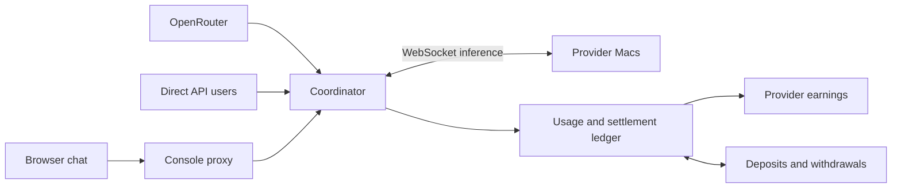

# Darkbloom security model and code review

> Last updated: 2026-09-10 · commit `bd00919a0`

A consolidated security review for maintainers to challenge, correct and develop into canonical threat-model updates and implementation fixes. Status: proposed review; findings and priorities are open for discussion in this PR.

Source reviewed: `bd00919a0b6a9354495dc9c90b28656bcf52d73d`. A fresh upstream check at approximately 22:54 UTC on September 10 returned the same `master` revision. This document consolidates the review and subsequent architecture, payments and browser-encryption clarifications. It is a proposed model and assessment, not a claim that the required controls have been implemented.

## How to review this document

Start with **Assessment** and **System and guarantees** to check that the model matches the service you intend to operate. Then read **Decisions to resolve** and the **Findings overview**. That is the first review pass; the detailed findings and original threat register are included below for verification.

For each finding, record whether you agree with the observed behavior, whether the stated impact matches your operating policy, and who should own the fix or validation. Where you disagree, identify the enforcing code, configuration or test evidence that changes the conclusion. A locally reproduced defect, a source finding and an untested hardware hypothesis have different evidential weight.

Contents:

- [Assessment](#assessment)
- [System and guarantees](#system-and-guarantees)
- [Decisions to resolve](#decisions-to-resolve)
- [Findings overview](#findings-overview)
- [Detailed findings](#detailed-findings)
- [Update order and completion criteria](#update-order-and-completion-criteria)
- [Evidence and limits](#evidence-and-limits)
- [Appendix: all original threats](#appendix-all-original-threats)

## Assessment

**The model now covers the principal system boundaries, but the code and checked-in threat model still have material gaps.** The review found reproducible payment and admission defects, incomplete response verification, and trust/privacy claims that exceed the available evidence. The six focused review probes still reproduce their asserted behavior at the checked revision.

The repository's [canonical threat model](../threat-model.yaml) has not yet incorporated these expanded requirements. It contains 52 threat entries, a duplicate `T-041` and an undefined `ADV-004` reference. Some statements are stale, and the automated reviewer omits certain deleted, renamed and unmapped code. PR #889 remains open at the last check and removes the workflow without fixing these issues.

This dated report is the single reading copy for the PR. Supporting probes and test results are included in the evidence directory. The PR adds documentation and evidence only; it does not change runtime behavior or replace the canonical threat model. Maintainers can revise this report during PR review; after landing it becomes a frozen record under the docs policy.

## System and guarantees

OpenRouter and direct API consumers send inference requests to a coordinator. The coordinator authenticates accounts, admits and routes work, communicates over WebSockets with globally distributed Macs, relays responses and settles usage. Providers earn money for eligible work. The browser chat interface adds a console proxy and an optional browser-to-coordinator encryption setting.

The diagram shows the principal application paths; it does not imply every intermediary can read sealed bodies. Authentication, release identity, Apple MDM/MDA, key publication, persistent storage and payment processors are dependencies that must also be represented in the model. The canonical privacy explanation remains [request encryption](../architecture/security/encryption.md); the discussion below records the security review at the pinned revision.

| Boundary | Required guarantee | Primary review priorities |
|---|---|---|
| Consumer/provider → coordinator | Untrusted traffic cannot exhaust shared capacity, bypass account limits, or corrupt another request. | Admission limits, connection deadlines, message budgets, bounded queues, cancellation, retries and settlement ownership. |
| Coordinator → provider | Each selected machine remains eligible to receive the request and runs the approved inference application with authentic model resources. | Device/app/key binding, current posture, release revocation, model admission, cache and plaintext lifecycle. |
| Provider → consumer | The returned stream belongs to this request; execution respects the requested model, context, parameters and tools; usage and charges are defensible. | Request binding, response validation, model/resource identity, usage validation and explicit assurance limits. |
| Consumer → settlement → provider | Charge the correct payer once and durably allocate the correct earnings and fees; every refund and withdrawal reconciles. | Validated usage, agreed pricing, authenticated beneficiary, atomic or recoverable settlement, replay protection and external reconciliation. |

Treat provider messages as untrusted even after admission. Device identity, possession of an encryption key, an approved application, authentic model resources and correct execution of a particular request are separate claims. A valid signature establishes attribution and integrity of its signed fields; it does not alone prove that the requested inference was performed correctly.

### Privacy and browser encryption

The optional browser setting seals the request body before it reaches the console proxy. With authentic browser code and the correct coordinator key, intermediaries can forward the body without decrypting it. The coordinator then decrypts and re-seals the request to the selected provider. **The coordinator and selected provider remain plaintext endpoints.**

| Component | What it can access |
|---|---|
| Browser and same-origin application code | Prompt plaintext before sealing, decoded responses, local chat state and API credentials. This feature does not protect against malicious application code or a compromised browser. |
| Console proxy / TLS-terminating intermediary | Sealed body when enabled, plus visible headers and traffic metadata. The console proxy receives the API credential. It also serves/proxies the key-discovery path and is part of the current key-authentication trust chain. |
| Coordinator | Decrypted request and response content, account identity, routing and billing data. |
| Selected provider | Decrypted inference input and generated output. Provider custody and runtime protections remain necessary. |

When disabled, requests use ordinary JSON over the configured HTTPS connections; disabling this setting does not itself disable TLS. When enabled, body sealing covers the serialized chat request. Account credentials, the owner-route preference header, timing and sizes are outside that body. Local storage, telemetry, uploaded media and other API endpoints require their own review; this toggle is not a blanket encryption policy for the account.

Source: [chat request preparation](https://github.com/Layr-Labs/d-inference/blob/bd00919a0b6a9354495dc9c90b28656bcf52d73d/console-ui/src/lib/chat/stream.ts#L115), [proxy credentials](https://github.com/Layr-Labs/d-inference/blob/bd00919a0b6a9354495dc9c90b28656bcf52d73d/console-ui/src/lib/http/proxy-client.ts#L18), [console forwarding](https://github.com/Layr-Labs/d-inference/blob/bd00919a0b6a9354495dc9c90b28656bcf52d73d/console-ui/src/app/api/chat/route.ts#L10), [coordinator decryption](https://github.com/Layr-Labs/d-inference/blob/bd00919a0b6a9354495dc9c90b28656bcf52d73d/coordinator/api/sender_encryption.go#L126).

### Key distribution, failure and replay

- **Opt-in and failure behavior:** the preference defaults off and is stored locally. Once enabled, failed key discovery or sealing stops the chat request; it does not automatically resend plaintext. A stale-key error clears the cache for the next attempt. Invalid ciphertext is rejected by the coordinator. See [encryption.ts](https://github.com/Layr-Labs/d-inference/blob/bd00919a0b6a9354495dc9c90b28656bcf52d73d/console-ui/src/lib/encryption.ts#L62) and [stream.ts:148](https://github.com/Layr-Labs/d-inference/blob/bd00919a0b6a9354495dc9c90b28656bcf52d73d/console-ui/src/lib/chat/stream.ts#L148).
- **Key authenticity:** the browser obtains a key through same-origin `/api/encryption-key`, checks the algorithm and length, and caches it for one hour. This does not independently verify a coordinator hardware attestation or pin a separately authenticated key. The cache key is a URL label, not evidence that the key belongs to a trustworthy runtime. See [encryption.ts:90](https://github.com/Layr-Labs/d-inference/blob/bd00919a0b6a9354495dc9c90b28656bcf52d73d/console-ui/src/lib/encryption.ts#L90).
- **Key compromise:** a fresh browser key per request does not protect recorded request envelopes if the corresponding long-lived coordinator private key is later obtained. The envelope contains the sender public key, nonce and ciphertext—the other inputs used by the coordinator’s `box.Open`. The “forward secrecy” comment in [encryption.ts:8](https://github.com/Layr-Labs/d-inference/blob/bd00919a0b6a9354495dc9c90b28656bcf52d73d/console-ui/src/lib/encryption.ts#L8) must be narrowed. This is a protocol property, not evidence of an actual key compromise.
- **Replay and billing:** sealing does not establish request uniqueness. A focused middleware probe sends the identical envelope twice; authentication, spending limits and billing deduplication are separate requirements. A party still needs an authorized submission path. The model must not promise that nonce-based encryption alone prevents duplicate inference charges.
- **Configuration separation:** saving the API example URL affects examples. Actual chat/key proxy destinations come from the operator’s server configuration. The encryption cache still references the legacy browser coordinator override; review cache labeling and displayed identity for consistency, without reintroducing client-selected upstream URLs. See [settings state](https://github.com/Layr-Labs/d-inference/blob/bd00919a0b6a9354495dc9c90b28656bcf52d73d/console-ui/src/app/settings/useConsoleSettings.ts#L33) and [server coordinator URL](https://github.com/Layr-Labs/d-inference/blob/bd00919a0b6a9354495dc9c90b28656bcf52d73d/console-ui/src/lib/server/coordinator.ts#L15).

### Money and accounting

| Party or operation | Required guarantee |
|---|---|
| OpenRouter/service account | Charge the authenticated billing account using the applicable advertised/agreed price, validated usage and authorized spending limits. Preserve reconciliation between request usage and account statements. |
| Direct API consumer | Apply the correct platform/provider price and account terms; enforce account and key spending limits; release unused reservations and apply refunds once. |
| Provider | Attribute eligible work to the provider and rightful earning account; compute its share correctly; durably record money owed even when immediate credit fails. |
| Platform and referrals | Account for each fee and referral allocation without creating money or silently losing revenue. Separate any explicitly funded incentive or subsidy from consumer charges. |
| Deposit | One verified external payment produces one credit, including concurrent delivery, retries and process failure. |
| Withdrawal | Only eligible earned funds can leave the account. Bind the destination and amount to the authenticated owner; debit once, pay once, and refund once only when the external outcome warrants it. |

For ordinary paid inference, the finalized consumer charge must equal provider earnings plus the platform’s retained fee plus referral allocations. Unposted amounts must remain explicit liabilities or recoverable settlement entries. Refunds and reversals must preserve that relationship through compensating entries. Withdrawal fees, currency conversion and rounding need separate, reconcilable entries rather than unexplained balance differences.

Each billable request needs a durable settlement identity linked to its attempts. Retain the payer, earning beneficiary, resolved model and public alias, pricing/fee version, validated usage, reservation, charge, allocations and terminal outcome. Freeze applicable commercial terms and beneficiary identity at a defined point; mutable account or price lookups at completion must not silently change a request’s agreement. Store this evidence without retaining prompt content.

### Payment failure cases to cover

These are proposed review requirements, not claims that every control below exists.

| Threat | Required validation |
|---|---|
| Provider inflates tokens or bills substituted/incomplete work | Validate usage and numeric bounds before billing; verify supported execution/receipt evidence; enforce spending authorization for both channels. R4, R9 and R10 apply. |
| Consumer cancellation or retries cause incorrect payment | Specify whether and how partial work is billable. Test pre-content cancellation, mid-stream disconnect, late completion, timeout, failover and speculative losing attempts. Charging consumers and compensating provider work are separate policy decisions. |
| Duplicate or lost settlement after crash | Interrupt each persistence boundary; replay across replicas and restart; assert one charge and one set of allocations, or an explicit recoverable pending state. |
| Price, account role or provider ownership changes during inference | Test updates while requests are in flight against the documented snapshot/effective-time rule. Current completion code reads prices and the provider account at settlement; this deserves explicit policy and tests. |
| Wrong beneficiary or forged billing attribution | Derive payer/key/provider ownership from authenticated coordinator state; bind every financial action to the correct request and account. |
| Deposit replay, withdrawal races or ambiguous external payment | Exercise duplicate/out-of-order callbacks, concurrent withdrawals, response loss, process restart, rejected transfers and delayed finality. Unknown external outcomes must remain pending until resolved. |
| Ledger and usage reports disagree | Reconcile request settlements, balances, provider earnings, fees, refunds and external transaction references. Missing usage/report writes must be detectable and repairable. |

### Existing controls to preserve

| Boundary | What the source supports | Limits of this review |
|---|---|---|
| Request/response encryption | Per-request NaCl Box on the provider leg; coordinator chunk decryption; provider fails on response-encryption errors. Coordinator is a plaintext endpoint. | Unit tests passed; no live confidential-VM attestation or packet capture. |
| Media fetching | Connect-time address policy, redirect checks, byte/concurrency budgets, cost gating and sealed-request restrictions. | Full `mediafetch` suite passed; no production egress probing. |
| Inline video | Memory-backed AVFoundation resource loader and external-reference restrictions replace temporary plaintext video files. | Pinned Swift/engine sources inspected; native AVFoundation tests not run. |
| Model/cache state | Account/model/contract-scoped routing HMACs, encrypted SSD cache, keyed lookup filenames and descriptor-relative no-follow file I/O. | Source review only for native storage; hardware key lifecycle remains a prerequisite. |
| Release revocation | Active-release policy generations, invalidation of stale evidence and platform-aware response cache invalidation. | Coordinator suites passed; actual enforcement depends on configured rollout mode. Tracked `prod.env` says `shadow`; live runtime configuration was not inspected. |
| Privileged fan helper | Dedicated code-signing requirements and UID/user-identity policy. | Sampled authorization and file-I/O code; no hardware fan actuation or recovery qualification. |
| Admin/telemetry | Admin UI fails closed without Basic Auth credentials; server-only DB access; typed profiler bounds and admin export gates. | No production database permission audit; explicit DB TLS verification override deserves a documented deployment exception. |

The review script also consumes the PR checkout's YAML as system context and runs the checked-out Python with the API secret available. Treat policy provenance and CI secret isolation as a separate review concern: authoritative policy should come from a trusted revision, proposed policy changes should be diff data, and secret-bearing execution should not run arbitrary PR code. This is a workflow trust design recommendation, not a reproduced secret leak. Do not switch blindly to `pull_request_target` while checking out and executing the PR head.

## Decisions to resolve

These are unresolved product/security policies to document during review. They are not prerequisites for fixing the already-confirmed defects.

| Decision | What needs to be explicit |
|---|---|
| Provider eligibility | Which posture, application, release and key evidence is mandatory for public paid requests? What causes quarantine, and how is eligibility restored after restart or posture change? |
| Partial and speculative work | What is billable when a consumer cancels, a provider times out, or a speculative attempt loses? Who funds provider work that is not charged to the consumer? |
| Commercial terms | At what point are price, fee, payer and earning beneficiary fixed? How do account or ownership changes affect work already in flight? |
| Encryption assurance | Is response sealing mandatory when request sealing is enabled? What authenticates the coordinator key? What privacy promise is shown before and after response verification? |
| Exceptions and residual risk | Which owner-only routes, rollout modes or degraded states are intentionally allowed? Who owns each exception, and what must never be advertised as verified? |

## Findings overview

P1 marks high-priority findings and P2 marks medium-priority findings in this review. IDs remain stable even when findings are grouped by area. Severity is not a claim of demonstrated production exploitation.

| Finding | Current basis |
|---|---|
| R1 — duplicate deposit credit | Reproduced again in the real webhook handler with synthetic signatures and an in-memory concurrency barrier. |
| R2 — replacement-process authorization / device-key composition | Source and existing tests confirm authorization behavior; hardware exploitability remains unproven. |
| R3 — repeated approved device-code redemption | Reproduced again: three distinct provider credentials. |
| R4 — missing pinned-model hash accepted | Reproduced again at the catalog predicate; complete malicious model dispatch not exercised. |
| R5 — browser account lifecycle | Source finding; browser reproduction outstanding. |
| R6 — review coverage omissions | Offline script audit reconfirms omitted deletions, renames and new unmapped code. |
| R7 — stale and inconsistent threat model | Audit reconfirms 52 entries, duplicate `T-041`, undefined `ADV-004`, plus previously traced stale claims. |
| R8 — coordinator resource/configuration gaps | Source finding; live configuration and load testing outstanding. |
| R9 — usage claims exceed service hold | Reproduced again: 100,000 reported completion tokens charged on a request capped at one. Service-reservation behavior is configuration dependent. |
| R10 — unverified response attestation fields | Invalid signature/hash strings retained in the same completion probe; no verification found in the traced serializers. |
| R11 — consumer charged but provider unpaid | Reproduced again with a transient credit failure; completion replay does not repair it. |
| R12 — plaintext response accepted after sealed request | Source finding; browser substitution test outstanding. |
| R13 — contradictory coordinator-secrecy UI | Source-confirmed contradiction with coordinator decryption. |

## Detailed findings

Each entry preserves the original evidence, conditions and proposed remedy. Source links are GitHub permalinks pinned to the reviewed revision; evidence links open the saved test or audit results.

### Payments and accounting

#### R1 · P1 · Stripe deposit credit is not idempotent

**Confirmed by a deterministic local reproduction.** Two valid callbacks for one $1 checkout payment credit $2. Both callbacks read a pending billing session before either writes completion. Each then calls `CreditDeposit`; session completion is a later, best-effort operation. Ordinary concurrent delivery is enough; this does not require forging a Stripe signature.

Evidence: [billing_handlers.go:156](https://github.com/Layr-Labs/d-inference/blob/bd00919a0b6a9354495dc9c90b28656bcf52d73d/coordinator/api/billing_handlers.go#L156), `handleStripeWebhook`; [billing.go](https://github.com/Layr-Labs/d-inference/blob/bd00919a0b6a9354495dc9c90b28656bcf52d73d/coordinator/billing/billing.go), `CreditDeposit`; [postgres.go:2408](https://github.com/Layr-Labs/d-inference/blob/bd00919a0b6a9354495dc9c90b28656bcf52d73d/coordinator/store/postgres.go#L2408), `creditBalanceSQL`. The SQL atomically couples each credit to its ledger row, but has no payment-reference deduplication. Atomic balance arithmetic is not payment idempotency. The in-memory reproduction exercises the real webhook and signature verification with synthetic credentials; the Postgres conclusion is from source inspection, not a live database race test.

**Update:** implement one store operation that claims a unique checkout/payment identity and credits it in the same transaction. Coordinate billing-session completion and replay-safe referral processing. Cover concurrent callbacks, retry after a lost response, and a crash between credit and session completion. Keep T-030 / SEC-012 open until these pass.

#### R9 · P1 · Provider usage claims bypass requested output limits during settlement

**Reproduced at the real completion handler with an in-memory store.** A synthetic pending request had `RequestedMaxTokens=1`, a 100 micro-USD service hold and sufficient account balance. Its provider reported 100,000 completion tokens. The handler charged 100,000 micro-USD and delivered that usage through the completion channel. The reported usage was not checked against the requested maximum or independently counted output.

Costs derive from `msg.Usage` at [provider.go:2367](https://github.com/Layr-Labs/d-inference/blob/bd00919a0b6a9354495dc9c90b28656bcf52d73d/coordinator/api/provider.go#L2367). The service-reservation branch charges that cost at [provider.go:2423](https://github.com/Layr-Labs/d-inference/blob/bd00919a0b6a9354495dc9c90b28656bcf52d73d/coordinator/api/provider.go#L2423). The ordinary reservation branch caps total cost at twice the reservation at [provider.go:2465](https://github.com/Layr-Labs/d-inference/blob/bd00919a0b6a9354495dc9c90b28656bcf52d73d/coordinator/api/provider.go#L2465); the service branch lacks that cap. A cap limits loss but does not authenticate the underlying token count. Exploitation requires a provider able to submit completion messages for a dispatched request; this probe does not bypass admission or reproduce a deployed OpenRouter transaction. Service-path exposure depends on service reservations being enabled.

**Update:** validate nonnegative, bounded usage and safe pricing arithmetic before admission reconciliation, billing, reputation updates or publication. Define model-specific counting rules for hidden reasoning, tools, media, caching and tokenizer versions. Enforce authorized spending bounds across both channels. Where independent counting is unavailable, label the count as provider-reported and document the remaining reliance on trusted execution. Invalid claims must have one defined failure/settlement outcome.

#### R11 · P1 · Consumer debit can succeed while provider credit is lost

**Confirmed with a local fault-injection probe of the real completion handler.** The synthetic request charged the consumer 150 micro-USD. The store then returned a transient error on its first provider-credit call. The completion was delivered, the provider received zero, and replaying the same completion did not retry the credit. The probe’s store would have accepted a second credit attempt; none occurred.

The handler finalizes charging before separately calling `CreditProviderAccount`; the failure branch logs and continues: [provider.go:2715](https://github.com/Layr-Labs/d-inference/blob/bd00919a0b6a9354495dc9c90b28656bcf52d73d/coordinator/api/provider.go#L2715). Pending-request removal and terminal arbitration prevent completion replay from repairing this failure. No durable inference-credit retry was found in the inspected path. Separately, usage persistence is asynchronous at [provider.go:2585](https://github.com/Layr-Labs/d-inference/blob/bd00919a0b6a9354495dc9c90b28656bcf52d73d/coordinator/api/provider.go#L2585), so it is not an atomic authoritative settlement record.

The store already protects an individual provider credit: [postgres.go:4161](https://github.com/Layr-Labs/d-inference/blob/bd00919a0b6a9354495dc9c90b28656bcf52d73d/coordinator/store/postgres.go#L4161) atomically couples the earning, balance, ledger and summaries and deduplicates nonempty job IDs. That protects repeated credit attempts; it does not ensure an attempt is retried after the handler abandons it.

**Update:** persist a complete settlement transaction or a durable settlement obligation before declaring financial completion. If all internal accounts share one database, assess an atomic transaction for the charge and allocations. Otherwise, use durable retryable work with unique operation identities and reconciliation. Do not retry the entire current handler blindly: consumer debits, platform fees and referral credits also need replay-safe semantics. Test failed provider credit, failed fee credit, lost response after commit and crash between each step.

Evidence: [passing reproduction](../assets/security-review-2026-09-10/payment-settlement-probes.log.txt), [probe source](../assets/security-review-2026-09-10/api_review_0910_test.go.txt), `TestReview0910ProviderCreditFailureNotRecoveredByReplay`. This is an in-memory fault-injection test, not a live Postgres or payment-processor experiment.

### Provider admission and result integrity

#### R2 · P1 · Cached code identity can authorize a replacement process without fresh app proof

**Confirmed authorization behavior; owner-downgrade exploitability needs hardware validation.** `reuseAttestationForTransition` deliberately permits the cached process key to differ from the current key. `tryCrossVersionReuse` sends the new key a challenge over its WebSocket. The current process proves it can decrypt with that key and sign with the registered P-256 identity. The release identity used to authorize this transition comes from `deriveApprovedReleaseTransition`, which checks signed, provider-reported hashes against the release inventory.

This proves key possession and agreement with approved metadata. It does not independently establish that the replacement key is held by the approved application under current protected boot settings. Once an attacker can invoke the persistent signing credential, a new key plus truthful public release hashes is enough for the protocol inputs. A fresh signature over a self-report does not make the report a hardware measurement.

Evidence: [provider_codeattest.go:81](https://github.com/Layr-Labs/d-inference/blob/bd00919a0b6a9354495dc9c90b28656bcf52d73d/coordinator/api/provider_codeattest.go#L81), `tryCrossVersionReuse`; [code_attest_throttle.go:255](https://github.com/Layr-Labs/d-inference/blob/bd00919a0b6a9354495dc9c90b28656bcf52d73d/coordinator/api/code_attest_throttle.go#L255), `reuseAttestationForTransition`; [server.go:1929](https://github.com/Layr-Labs/d-inference/blob/bd00919a0b6a9354495dc9c90b28656bcf52d73d/coordinator/api/server.go#L1929), `deriveApprovedReleaseTransition`. Existing tests `TestRestartFreshProcessKeyTransitionsViaResumeWithoutPush` and `TestRestartSameBinaryTransitionsViaResumeWithoutPush` explicitly approve the replacement-key behavior; the focused security test run passed them.

A second gap is the device-to-process composition. `attestation.Verify` checks a signature against the key supplied in the blob; it does not certify that key's Secure Enclave origin. `verifyProviderViaMDM` selects an enrolled device through the blob's serial and grants hardware trust before the separate MDA result. The MDA nonce is a hash of the claimed P-256 key. Having a device attest caller-selected bytes does not by itself prove that the corresponding private key resides on that device or in the approved app. See [attestation.go:136](https://github.com/Layr-Labs/d-inference/blob/bd00919a0b6a9354495dc9c90b28656bcf52d73d/coordinator/attestation/attestation.go#L136), [provider.go:3269](https://github.com/Layr-Labs/d-inference/blob/bd00919a0b6a9354495dc9c90b28656bcf52d73d/coordinator/api/provider.go#L3269), and [provider.go:3584](https://github.com/Layr-Labs/d-inference/blob/bd00919a0b6a9354495dc9c90b28656bcf52d73d/coordinator/api/provider.go#L3584).

**Update:** split device posture, signing-key provenance, app identity, and exact inference-key custody into separate proof obligations. Keep same-process reconnect optimization only under an established custody/lifecycle invariant; require a sound app/key authorization path for replacement processes. Test owner-controlled downgrade and two-device composition with genuine hardware. Do not claim that simply shortening the reuse window, demanding a new self-signature, or adding a live MDM round-trip completes the fix. T-013, T-015, T-033, T-034, T-036 and T-037 need correction.

#### R4 · P1 · Missing weight hashes still pass catalog admission

**Confirmed at the catalog predicate:** a catalog-pinned model rejects an incorrect hash but accepts an omitted hash. `modelAllowedByCatalogLocked` explicitly returns true when `model.WeightHash == ""`. The subsequent `models_update` path has a stricter rule that rejects missing pinned hashes, so integrity policy depends on the path used to advertise the model. Challenge handling also skips empty entries in `ModelHashes`.

Evidence: [model_catalog.go:121](https://github.com/Layr-Labs/d-inference/blob/bd00919a0b6a9354495dc9c90b28656bcf52d73d/coordinator/registry/model_catalog.go#L121), `modelAllowedByCatalogLocked`; [provider_models.go:112](https://github.com/Layr-Labs/d-inference/blob/bd00919a0b6a9354495dc9c90b28656bcf52d73d/coordinator/registry/provider_models.go#L112), `MergeProviderModels`; [provider.go:1426](https://github.com/Layr-Labs/d-inference/blob/bd00919a0b6a9354495dc9c90b28656bcf52d73d/coordinator/api/provider.go#L1426). The probe proves the predicate asymmetry; it is not an end-to-end malicious-model execution demonstration. Other privacy, capability and trust gates still apply.

**Update:** centralize pinned-model integrity policy across registration, updates, restore, routing and challenges. Missing evidence should mean “verification pending,” with no public routing for that model until verified. Preserve the explicit owner-only off-catalog policy separately. A matching reported hash still depends on app custody and authenticated model resources; it is not proof of execution. T-007, T-012 and T-027 share this finding and should reference one canonical issue.

#### R10 · P2 · Response attestation fields are forwarded without verification

The same probe supplied `not-a-signature` and `not-a-hash`; both were retained on the pending response. [provider.go:2279](https://github.com/Layr-Labs/d-inference/blob/bd00919a0b6a9354495dc9c90b28656bcf52d73d/coordinator/api/provider.go#L2279) copies the values directly. Response serializers then expose them, including [consumer_stream.go:122](https://github.com/Layr-Labs/d-inference/blob/bd00919a0b6a9354495dc9c90b28656bcf52d73d/coordinator/api/consumer_stream.go#L122). The coordinator source search found no verification of this response signature or reconstruction/comparison of its response hash. This gap does not defeat the separate authenticated encryption on chunks.

The native signing function covers `requestId:completionTokens:responseBody`: [SecurityHardening.swift:358](https://github.com/Layr-Labs/d-inference/blob/bd00919a0b6a9354495dc9c90b28656bcf52d73d/provider-swift/Sources/ProviderCore/Security/SecurityHardening.swift#L358). It does not bind a complete request digest, model/resource identity or prompt-token count. Even a verified signature over those fields would not establish correct inference.

**Update:** specify a versioned, unambiguous signed transcript and verify it against the admitted identity. Bind the attempt, canonical request digest, execution/resource identity, response transcript, terminal status and usage. Define exactly which stream bytes count, including tools and reasoning. With streaming, final verification arrives after content has been released; expose that timing honestly and define the terminal failure behavior. Verifying receipts improves integrity and attribution, while execution assurance still depends on the device/app/key trust chain.

### Browser privacy and credentials

#### R12 · P2 · Successful sealed requests do not require sealed responses in the browser

**Source-confirmed; browser injection test outstanding.** [stream.ts:203](https://github.com/Layr-Labs/d-inference/blob/bd00919a0b6a9354495dc9c90b28656bcf52d73d/console-ui/src/lib/chat/stream.ts#L203) decrypts response events only when `x-eigen-sealed` is `true`. If it is absent on a successful response, the client parses ordinary events despite having sent a sealed request. A response-modifying intermediary can therefore supply replacement plaintext events without demonstrating possession of the expected encryption key. Merely stripping the header from genuine ciphertext is not enough to produce readable content; the issue is acceptance of a substituted plaintext stream. This does not expose the encrypted prompt by itself.

**Update:** require authenticated sealed content for successful responses to sealed requests. Define allowable pre-decryption HTTP errors separately. Validate terminal completion and define handling for missing, duplicated or reordered events. Test header removal plus stream replacement, ciphertext modification, early disconnect, key rotation and stale caches.

#### R13 · P2 · Verification panel promises secrecy from the coordinator

The settings explanation correctly says the coordinator decrypts. However, [NormalMode.tsx:43](https://github.com/Layr-Labs/d-inference/blob/bd00919a0b6a9354495dc9c90b28656bcf52d73d/console-ui/src/components/verification/NormalMode.tsx#L43) says Darkbloom servers cannot read prompts and that the coordinator only sees ciphertext. The claim is marked always active. This directly contradicts the implementation and remains wrong with browser sealing enabled.

**Update:** make all privacy indicators describe the actual protected connection, the plaintext endpoints and the current request’s encryption state. Do not equate a successful key fetch, encryption, hardware posture, execution correctness or a provider signature. They establish different facts.

#### R5 · P2 · Browser session cleanup is not tied to account identity

**Source-confirmed lifecycle gap.** `provisionConsoleKey` returns any existing browser API key without checking its owner. Its in-flight operation is shared across the tab, not keyed by account. Logout clears storage and resets a variable, but does not cancel or invalidate the outstanding operation. A delayed response can repopulate the old account's key after logout or an account switch. Later requests read that same storage slot.

Separately, logout does not clear the persisted Zustand chat history. A later user of the same browser can see the prior conversation state. These are account-switch/shared-browser issues; no remote cross-account exploit was exercised.

Evidence: [useAuth.ts:40](https://github.com/Layr-Labs/d-inference/blob/bd00919a0b6a9354495dc9c90b28656bcf52d73d/console-ui/src/hooks/useAuth.ts#L40), `provisionConsoleKey`, `resetConsoleKeyProvisionBackoff`, `logout`; [proxy-client.ts](https://github.com/Layr-Labs/d-inference/blob/bd00919a0b6a9354495dc9c90b28656bcf52d73d/console-ui/src/lib/http/proxy-client.ts), `getApiKey`; [store.ts:187](https://github.com/Layr-Labs/d-inference/blob/bd00919a0b6a9354495dc9c90b28656bcf52d73d/console-ui/src/lib/store.ts#L187), `partialize`.

**Update:** associate provisioning and storage with the authenticated account and a session generation. Invalidate outstanding work on logout/account change, and check the generation immediately before writing credentials. Reset or isolate both memory and persisted chat state according to an explicit privacy policy. Add delayed-response, account-switch and multi-tab tests. T-001 / SEC-003 and T-018 / SEC-024 remain open.

#### R3 · P2 · An approved device code mints multiple long-lived provider tokens

**Confirmed locally:** the same approved code produced three distinct tokens. `handleDeviceToken` creates a token while the device-code row remains `approved`; subsequent polls repeat the operation until expiry. An exposed code can therefore create additional credentials after the legitimate client receives its token. This requires possession of the approved device code, not just its short user-facing approval code.

Evidence: [device_auth.go:131](https://github.com/Layr-Labs/d-inference/blob/bd00919a0b6a9354495dc9c90b28656bcf52d73d/coordinator/api/device_auth.go#L131), `handleDeviceToken`; [reproduction output](../assets/security-review-2026-09-10/runtime-probes.log.txt).

**Update:** atomically redeem the approved code and create exactly one credential. Define retry behavior after a lost response explicitly; reject or safely replay the same redemption rather than minting another credential. Test parallel redemption and rollback on token-write failure. T-039 / SEC-011 remains open.

### Coordinator protection

#### R8 · P2 · Public control-plane resource controls remain incomplete

The provider WebSocket upgrades before authentication and accepts a 10 MiB frame limit. The read loop has no registration deadline; optional account-token lookup occurs after registry registration. The HTTP wrapper does not supply a global connection admission limit. This permits resource use before identity validation, even if later inference eligibility is denied. No load attack was run.

Admin OTP init/verify are also registered without local per-IP or per-email rate limiting. Privy may impose its own controls; they were not tested. MDM webhook authentication remains optional in the application: an unset secret leaves exact solicited-command correlation as the principal local check. That is a conditional configuration exposure, not evidence that production is currently unauthenticated.

Evidence: [provider.go:125](https://github.com/Layr-Labs/d-inference/blob/bd00919a0b6a9354495dc9c90b28656bcf52d73d/coordinator/api/provider.go#L125), `handleProviderWS`, `providerReadLoop`; [server.go:2928](https://github.com/Layr-Labs/d-inference/blob/bd00919a0b6a9354495dc9c90b28656bcf52d73d/coordinator/api/server.go#L2928), route wiring; [server.go:2666](https://github.com/Layr-Labs/d-inference/blob/bd00919a0b6a9354495dc9c90b28656bcf52d73d/coordinator/api/server.go#L2666), `HandleMDMWebhook`.

**Update:** bound unauthenticated connection count, registration time and pre-registration bytes; add authentication-aware admission while preserving an explicit enrollment/bootstrap path. Rate-limit OTP issuance and verification at the relevant identity/IP layers. Require webhook authentication in the production configuration contract. Keep T-006, T-021 and T-026 open with deployment prerequisites stated.

### Threat-model quality and review coverage

#### R6 · P1 · The reviewer silently loses deleted and unmapped code

**Confirmed by offline probes of the actual script functions.** The parser recognizes a path only from `+++ b/`. Deleted files use `+++ /dev/null`; pure renames have no such line. Both vanish from the parsed file inventory. A new sensitive file without a threat pattern appears only as a filename; its diff is withheld from the model even though the model is asked to detect new attack surfaces.

Current unmapped files include `coordinator/api/provider_codeattest.go`, `coordinator/api/trust_reuse.go`, `coordinator/registry/attestation_policy.go`, `console-ui/src/lib/server/coordinator.ts`, and `admin-ui/src/proxy.ts`. Changes to the review workflow and threat model are also unmapped. Existing broad `registry.go`/`provider.go` references did not follow responsibility as code moved into smaller files.

Evidence: [threat-model-review.py:77](https://github.com/Layr-Labs/d-inference/blob/bd00919a0b6a9354495dc9c90b28656bcf52d73d/.github/scripts/threat-model-review.py#L77), `parse_diff_by_file`, `build_focused_diff`, `build_user_message`; [offline audit](../assets/security-review-2026-09-10/latest-model-audit.json). The audit's file counts are a mechanical mapping inventory, not a percentage of the codebase that is secure or insecure.

**Update:** use a reliable changed-file manifest including old/new paths and statuses; review deletions and renames; classify previously unmapped runtime changes and supply their code. Add deterministic coverage checks that fail or require explicit disposition when a security surface has no mapping. The nominal total diff cap also overflows in the probe (80,640 characters against 80,000); budget by actual remaining space and distinguish reviewed, truncated and omitted content.

#### R7 · P2 · The threat model cannot reliably identify or describe its own controls

The YAML contains 52 entries but only 51 distinct threat IDs: `T-041` names both prefix-cache privacy and profile-signing identity. T-051 references undefined adversary `ADV-004`. Parsing YAML succeeds; `docs-check` also passes, because neither establishes this semantic integrity.

Several statements are demonstrably stale:

- T-004/T-024 still report plain string comparison for release credentials, although `releaseKeyAuthorized` uses constant-time comparison.
- T-017 describes client-selected upstream origins; the cited routes now use the server's `coordinatorUrl()`.
- T-019 says security headers are absent; `next.config.ts` defines them. CSP still allows inline scripts and eval, which is a distinct residual risk.
- T-025 describes a broken cache key; release mutations now call platform-scoped `invalidateReleaseCaches`.
- T-015 says startup refuses disabled SIP; `collectSecurityPosture` is explicitly warning-only and delegates routing eligibility to the coordinator.
- T-014/T-028 claim per-request CPU-buffer wiping. The named `secureZero` helpers have no production callers in `provider-swift/Sources`; their presence is not evidence of complete request-buffer erasure. GPU and retained cache data require their own lifecycle analysis.
- T-036 claims a five-minute reuse window cannot span a downgrade reboot, while its continuity discussion assumes roughly three minutes. Neither timing assertion is a hardware-enforced bound; the ordinary reuse duration is configurable without the continuity path's hard cap.

**Update:** preserve stable IDs with an explicit migration for the collision; validate every reference; record implementation status, enforcement configuration, evidence and residual risk independently. Retire only the specific fixed findings, rather than declaring their entire boundary safe. See the [complete threat register](#appendix-all-original-threats).

## Update order and completion criteria

The following order replaces the earlier supplement-by-supplement numbering. Provider trust and payment correctness should be developed together because trustworthy execution evidence supports accurate billing. Model maintenance accompanies the runtime fixes.

| Work | Completion criteria |
|---|---|
| Contain confirmed financial defects: R1, R9, R11 | One external deposit yields one credit; validated usage stays within authorized bounds; consumer charge and provider/fee allocations are atomic or durably recoverable. Database crash, concurrency and replay tests verify both consumer and provider outcomes. |
| Close public model-admission gaps and bound coordinator work: R4, R8 | Missing required hashes cannot enter public routing; pre-registration time, connections and bytes are bounded; required webhook and OTP controls have deployment evidence. |
| Qualify provider custody and execution assumptions: R2 | Hardware tests cover replacement keys, restart, downgrade, relay/composition, revoked releases and cache-key lifecycle. Each trust claim has a complete argument and evidence; self-reported metadata is labeled accordingly. |
| Correct response integrity and privacy: R10, R12, R13 | A specified transcript is verified; sealed requests require sealed successful responses; browser failure/substitution tests pass; all privacy copy reflects plaintext endpoints and actual request state. |
| Repair credential and browser lifecycle: R3, R5 | Approved device codes cannot mint additional credentials; delayed provisioning cannot restore a logged-out account's key; conversation state follows the documented account-isolation policy. |
| Integrate and validate the canonical model: R6, R7 | Unique IDs and valid references; all relevant changed code represented; trustworthy policy provenance; explicit reviewed/omitted coverage; owners and acceptance evidence for every unresolved guarantee. |

Every canonical threat entry should carry implementation status, enforcement configuration, verification evidence, reviewed revision, residual risk, owner and next action. “Implemented” must not imply “enforced in production” or “proven against a malicious machine owner.”

A passing test closes only the behavior it tests. Financial store operations need real database qualification; app/key custody needs genuine hardware experiments; browser behavior needs browser tests. Rollout configuration and live deployment verification remain separate from source correctness.

## Evidence and limits

- The latest fetched merged source is unchanged from the original review. No later fixes were found on `master` at the stated check time. Other unmerged branches and live deployment state are outside that check.
- All 11 selected Go packages passed in the broader run: attestation, APNs, MDM, auth, billing, payments, base rewards, media fetching, encryption helpers, registry and API. [Full baseline log](../assets/security-review-2026-09-10/coordinator-tests.log.txt).
- A focused security selection also passed. Some tests approve behavior whose security assumptions remain under review; passing does not establish those assumptions. [Focused log](../assets/security-review-2026-09-10/focused-security-tests.log.txt).
- All six added probes completed with Go race detection at the same revision, without detected races. They intentionally assert defects or protocol limits, so “PASS” confirms reproduction. They cover duplicate deposit credit, repeated device-code redemption, missing model-hash admission, excessive reported usage/invalid receipt fields, failed provider credit, and repeated sealed-envelope acceptance. [Latest probe log](../assets/security-review-2026-09-10/latest-review-probes.log.txt).
- The middleware replay probe does not exercise authentication or demonstrate duplicate billing. The catalog probe does not demonstrate complete malicious-model dispatch. Payment probes use synthetic accounts and an in-memory store, not live payments or a Postgres failure experiment.
- The offline review audit reproduces missing diff coverage and schema/reference issues. [Latest audit](../assets/security-review-2026-09-10/latest-model-audit.json). Documentation lint passed for 266 files, but does not validate security claims. [Documentation log](../assets/security-review-2026-09-10/docs-check.log.txt).
- Browser/native tests, full-system E2E, Postgres crash/concurrency testing, Apple hardware compromise experiments and live configuration checks remain outstanding. The source review found the tracked release policy in `shadow`; this does not prove live runtime configuration.
- The six-probe race run includes the later payment and browser-middleware probes and supersedes the earlier supplements' narrower race-coverage notes. The macOS linker warning is recorded in the log; both test packages completed.

Review probes are available in [API probe source](../assets/security-review-2026-09-10/api_review_0910_test.go.txt) and [registry probe source](../assets/security-review-2026-09-10/registry_review_0910_test.go.txt). [Reproduction instructions](../assets/security-review-2026-09-10/README.md) describe how to run them and interpret results.

## Appendix: all original threats

The following table accounts for every entry in the repository's original threat model. “Observed” means source evidence supports a control; it does not mean the entire boundary is safe. The duplicate `T-041` entries are preserved here so neither original threat disappears during reconciliation. New requirements and R1–R13 above supplement this original inventory; they have not yet been assigned canonical threat IDs.

| Threat | Disposition | Evidence and required correction |
|---|---|---|
| T-001 | Open; extend | Account binding and stale provisioning completion remain concerns; R5. [console-ui/src/hooks/useAuth.ts](https://github.com/Layr-Labs/d-inference/blob/bd00919a0b6a9354495dc9c90b28656bcf52d73d/console-ui/src/hooks/useAuth.ts) (`provisionConsoleKey`) |
| T-002 | Control observed | Tiered body limits present. No claim of global concurrency/memory immunity. [coordinator/api/server.go](https://github.com/Layr-Labs/d-inference/blob/bd00919a0b6a9354495dc9c90b28656bcf52d73d/coordinator/api/server.go) (`bodyLimitMiddleware`) |
| T-003 | Retain; narrow assurance | Coordinator is a plaintext endpoint. Distinguish inference non-retention from separately uploaded support logs and provider caches. [coordinator/api/sender_encryption.go](https://github.com/Layr-Labs/d-inference/blob/bd00919a0b6a9354495dc9c90b28656bcf52d73d/coordinator/api/sender_encryption.go) |
| T-004 | Partly stale | Separate admin authorization remains; remove the obsolete plain-string release-key comparison finding. [coordinator/api/release_handlers.go](https://github.com/Layr-Labs/d-inference/blob/bd00919a0b6a9354495dc9c90b28656bcf52d73d/coordinator/api/release_handlers.go) (`releaseKeyAuthorized`) |
| T-005 | Open residual | Ledger records are present; no immutable consumer-signed receipt protocol established in this review. [coordinator/api/billing_handlers.go](https://github.com/Layr-Labs/d-inference/blob/bd00919a0b6a9354495dc9c90b28656bcf52d73d/coordinator/api/billing_handlers.go) |
| T-006 | Open; correct mitigation | Pre-auth sockets/frames consume resources; blessed-hash telemetry is not a resource-admission control. R8. [coordinator/api/provider.go](https://github.com/Layr-Labs/d-inference/blob/bd00919a0b6a9354495dc9c90b28656bcf52d73d/coordinator/api/provider.go) (`handleProviderWS`) |
| T-007 | Open | Missing-hash admission confirmed; matching metadata does not prove execution. R4. [coordinator/registry/model_catalog.go](https://github.com/Layr-Labs/d-inference/blob/bd00919a0b6a9354495dc9c90b28656bcf52d73d/coordinator/registry/model_catalog.go) (`modelAllowedByCatalogLocked`) |
| T-008 | Control observed | Keep encrypted-chunk fail-closed behavior and native regression tests; provider native suite not run here. [provider-swift/Sources/ProviderCore/ProviderLoop+InferenceHandler.swift](https://github.com/Layr-Labs/d-inference/blob/bd00919a0b6a9354495dc9c90b28656bcf52d73d/provider-swift/Sources/ProviderCore/ProviderLoop%2BInferenceHandler.swift) |
| T-009 | Resolved behavior; remap | Backend-neutral capability gate is present; map the extracted policy file. [coordinator/registry/attestation_policy.go](https://github.com/Layr-Labs/d-inference/blob/bd00919a0b6a9354495dc9c90b28656bcf52d73d/coordinator/registry/attestation_policy.go) (`providerSupportsPrivateTextModeAtLocked`) |
| T-010 | Partially reviewed | Cancellation architecture retained; remap split handlers and retain the active-GPU-pass limitation. Native cancellation suite outstanding. [provider-swift/Sources/ProviderCore/ProviderLoop+InferenceHandler.swift](https://github.com/Layr-Labs/d-inference/blob/bd00919a0b6a9354495dc9c90b28656bcf52d73d/provider-swift/Sources/ProviderCore/ProviderLoop%2BInferenceHandler.swift) |
| T-011 | Rewrite assumptions | Per-process key generation is present. Neither unconditional root-readability on a protected boot nor complete erasure is established. [provider-swift/Sources/ProviderCore/Crypto/NodeKeyPair.swift](https://github.com/Layr-Labs/d-inference/blob/bd00919a0b6a9354495dc9c90b28656bcf52d73d/provider-swift/Sources/ProviderCore/Crypto/NodeKeyPair.swift) (`NodeKeyPair`) |
| T-012 | Open | Initial catalog admission still permits missing hashes; models_update is stricter. R4. [coordinator/registry/model_catalog.go](https://github.com/Layr-Labs/d-inference/blob/bd00919a0b6a9354495dc9c90b28656bcf52d73d/coordinator/registry/model_catalog.go) (`modelAllowedByCatalogLocked`) |
| T-013 | Rewrite security claim | Self-reported hash and keychain access are not an independent approved-app measurement; align with actual APNs/release gates. R2. [coordinator/api/provider_codeattest.go](https://github.com/Layr-Labs/d-inference/blob/bd00919a0b6a9354495dc9c90b28656bcf52d73d/coordinator/api/provider_codeattest.go) (`tryCrossVersionReuse`) |
| T-014 | Partial; remove unsupported closure | Anti-debug/core-dump controls exist; blanket per-request buffer wiping lacks demonstrated call sites. R7. [provider-swift/Sources/ProviderCore/Security/SecurityHardening.swift](https://github.com/Layr-Labs/d-inference/blob/bd00919a0b6a9354495dc9c90b28656bcf52d73d/provider-swift/Sources/ProviderCore/Security/SecurityHardening.swift) (`secureZeroData`) |
| T-015 | Incorrect implemented claim | Local startup is warning-only; coordinator policy owns routing. Reboot safety needs proof of replacement-key authorization. R2/R7. [provider-swift/Sources/ProviderCore/Security/SecurityHardening.swift](https://github.com/Layr-Labs/d-inference/blob/bd00919a0b6a9354495dc9c90b28656bcf52d73d/provider-swift/Sources/ProviderCore/Security/SecurityHardening.swift) (`collectSecurityPosture`) |
| T-016 | Not fully revalidated | Keep disk/resource exhaustion risk; native loader/cache reserve failure tests remain required. [provider-swift/Sources/ProviderCore/KVCacheSSD/SSDPrefixCache.swift](https://github.com/Layr-Labs/d-inference/blob/bd00919a0b6a9354495dc9c90b28656bcf52d73d/provider-swift/Sources/ProviderCore/KVCacheSSD/SSDPrefixCache.swift) |
| T-017 | Original mechanism stale | Cited routes use server-configured upstream selection; remap the common helper and test hostile headers. [console-ui/src/lib/server/coordinator.ts](https://github.com/Layr-Labs/d-inference/blob/bd00919a0b6a9354495dc9c90b28656bcf52d73d/console-ui/src/lib/server/coordinator.ts) (`coordinatorUrl`) |
| T-018 | Open | Logout clears keys but not persisted chat state. R5. [console-ui/src/lib/store.ts](https://github.com/Layr-Labs/d-inference/blob/bd00919a0b6a9354495dc9c90b28656bcf52d73d/console-ui/src/lib/store.ts) (`partialize`) |
| T-019 | Original mechanism stale; residual | Security headers exist; inline/eval script allowances remain a separate CSP limitation. [console-ui/next.config.ts](https://github.com/Layr-Labs/d-inference/blob/bd00919a0b6a9354495dc9c90b28656bcf52d73d/console-ui/next.config.ts) (`securityHeaders`) |
| T-020 | Open configuration defect | Absent/placeholder Privy app ID still selects authenticated MOCK_AUTH. Not a coordinator auth bypass. [console-ui/src/components/providers/PrivyClientProvider.tsx](https://github.com/Layr-Labs/d-inference/blob/bd00919a0b6a9354495dc9c90b28656bcf52d73d/console-ui/src/components/providers/PrivyClientProvider.tsx) (`PrivyClientProvider`) |
| T-021 | Conditional open | Shared secret remains optional; solicited-command ownership is present. Actual production exposure not inspected. [coordinator/api/server.go](https://github.com/Layr-Labs/d-inference/blob/bd00919a0b6a9354495dc9c90b28656bcf52d73d/coordinator/api/server.go) (`HandleMDMWebhook`) |
| T-022 | Historical; do not reopen old path | Retired ACME proxy route is not the current trust path; keep new trust-composition questions separate. [coordinator/mdm/mdm.go](https://github.com/Layr-Labs/d-inference/blob/bd00919a0b6a9354495dc9c90b28656bcf52d73d/coordinator/mdm/mdm.go) (`RequestDeviceAttestation`) |
| T-023 | Availability residual | MDM/MDA failures are handled separately; no Apple-service outage experiment performed. [coordinator/api/provider.go](https://github.com/Layr-Labs/d-inference/blob/bd00919a0b6a9354495dc9c90b28656bcf52d73d/coordinator/api/provider.go) (`verifyProviderViaMDM`) |
| T-024 | Residual; partly stale | Admin key remains powerful; constant-time comparison is fixed. Rotation, least privilege and deployment custody need independent evidence. [coordinator/api/release_handlers.go](https://github.com/Layr-Labs/d-inference/blob/bd00919a0b6a9354495dc9c90b28656bcf52d73d/coordinator/api/release_handlers.go) (`isAdminAuthorized`) |
| T-025 | Original defect resolved in source | Release mutations call platform-scoped invalidation and refresh/converge policy. [coordinator/api/release_cache.go](https://github.com/Layr-Labs/d-inference/blob/bd00919a0b6a9354495dc9c90b28656bcf52d73d/coordinator/api/release_cache.go) (`invalidateReleaseCaches`) |
| T-026 | Open | OTP routes have no local rate-limit wrapper; upstream Privy defenses not qualified. R8. [coordinator/api/server.go](https://github.com/Layr-Labs/d-inference/blob/bd00919a0b6a9354495dc9c90b28656bcf52d73d/coordinator/api/server.go) (`routes`) |
| T-027 | Open; deduplicate issue | Same missing-hash problem as T-007/T-012; one canonical SEC-007 remediation. [coordinator/registry/model_catalog.go](https://github.com/Layr-Labs/d-inference/blob/bd00919a0b6a9354495dc9c90b28656bcf52d73d/coordinator/registry/model_catalog.go) (`modelAllowedByCatalogLocked`) |
| T-028 | Open; correct CPU claim | GPU release is not an erasure proof; unused CPU wipe helpers do not support blanket CPU cleanup claims. [libs/mlx-swift-lm/Libraries/MLXLMCommon/ContinuousBatchingV2/SequenceKV/ContiguousKVBackend.swift](https://github.com/Layr-Labs/mlx-swift-lm/blob/6aa60eeb51881eed53a457a4edf1d94918eff89f/Libraries/MLXLMCommon/ContinuousBatchingV2/SequenceKV/ContiguousKVBackend.swift) (`release`) |
| T-029 | Policy observed; native test pending | Pure idle policy checks elapsed time, loaded state and inflight work; full unload behavior not exercised. [provider-swift/Sources/ProviderCore/Inference/IdleTimeoutPolicy.swift](https://github.com/Layr-Labs/d-inference/blob/bd00919a0b6a9354495dc9c90b28656bcf52d73d/provider-swift/Sources/ProviderCore/Inference/IdleTimeoutPolicy.swift) (`shouldUnload`) |
| T-041 (prefix cache) | Controls sampled; ID collision | Account-scoped routing HMACs and encrypted/keyed SSD layout exist. Native key lifecycle, residual timing and persistent plaintext-derived artifacts still need qualification. [coordinator/registry/cache_route_keys.go](https://github.com/Layr-Labs/d-inference/blob/bd00919a0b6a9354495dc9c90b28656bcf52d73d/coordinator/registry/cache_route_keys.go) (`providerCacheScope`) |
| T-030 | Confirmed open | Concurrent valid deposit callbacks doubled a synthetic payment. R1. [coordinator/api/billing_handlers.go](https://github.com/Layr-Labs/d-inference/blob/bd00919a0b6a9354495dc9c90b28656bcf52d73d/coordinator/api/billing_handlers.go) (`handleStripeWebhook`) |
| T-031 | Open or explicit product decision | Unauthenticated wallet lookup still exposes balance/history; confirm intended public/private fields. [coordinator/api/consumer.go](https://github.com/Layr-Labs/d-inference/blob/bd00919a0b6a9354495dc9c90b28656bcf52d73d/coordinator/api/consumer.go) (`handleProviderEarnings`) |
| T-032 | Not deployment-verified | Mnemonic custody/root-only environment promises require live deployment evidence; no secret access attempted. [coordinator/cmd/coordinator/main.go](https://github.com/Layr-Labs/d-inference/blob/bd00919a0b6a9354495dc9c90b28656bcf52d73d/coordinator/cmd/coordinator/main.go) |
| T-033 | Rewrite closure | Fresh challenge signatures prove possession; they do not certify software-vs-hardware key origin or app custody. R2. [coordinator/attestation/attestation.go](https://github.com/Layr-Labs/d-inference/blob/bd00919a0b6a9354495dc9c90b28656bcf52d73d/coordinator/attestation/attestation.go) (`Verify`) |
| T-034 | Incomplete trust claim | Current replacement-key reuse is broader than the exact-process narrative. Preserve APNs verification but qualify composition. R2. [coordinator/api/provider_codeattest.go](https://github.com/Layr-Labs/d-inference/blob/bd00919a0b6a9354495dc9c90b28656bcf52d73d/coordinator/api/provider_codeattest.go) (`tryCrossVersionReuse`) |
| T-035 | Residual; hardware validation pending | Persistent signing identity exists; deliberate key rotation and attribution policy remain separate requirements. [provider-swift/Sources/ProviderCore/Security/PersistentEnclaveKey.swift](https://github.com/Layr-Labs/d-inference/blob/bd00919a0b6a9354495dc9c90b28656bcf52d73d/provider-swift/Sources/ProviderCore/Security/PersistentEnclaveKey.swift) |
| T-036 | Rewrite accepted premise | Hardware reuse relies on temporal/continuity assumptions and signed reports; MDA is separate from hardware grant. R2/R7. [coordinator/api/trust_reuse.go](https://github.com/Layr-Labs/d-inference/blob/bd00919a0b6a9354495dc9c90b28656bcf52d73d/coordinator/api/trust_reuse.go) (`tryTrustReuseFastSkip`) |
| T-037 | Rewrite | Describe a boot/session authorization problem; do not claim a measured narrow exposure window from a periodic self-report. [coordinator/api/provider.go](https://github.com/Layr-Labs/d-inference/blob/bd00919a0b6a9354495dc9c90b28656bcf52d73d/coordinator/api/provider.go) (`verifyChallengeResponse`) |
| T-038 | Control observed | Keep HTTP server time/header bounds; upgraded WebSockets need their own bounds. [coordinator/cmd/coordinator/main.go](https://github.com/Layr-Labs/d-inference/blob/bd00919a0b6a9354495dc9c90b28656bcf52d73d/coordinator/cmd/coordinator/main.go) |
| T-039 | Confirmed open | One approved code produced three credentials. R3. [coordinator/api/device_auth.go](https://github.com/Layr-Labs/d-inference/blob/bd00919a0b6a9354495dc9c90b28656bcf52d73d/coordinator/api/device_auth.go) (`handleDeviceToken`) |
| T-040 | Split by route/configuration | Device verification URL still falls back to request Host; signed enrollment has a separate canonical-origin guard. [coordinator/api/device_auth.go](https://github.com/Layr-Labs/d-inference/blob/bd00919a0b6a9354495dc9c90b28656bcf52d73d/coordinator/api/device_auth.go) (`handleDeviceCode`) |
| T-041 (profile signing) | ID migration required; partial review | Separate this signing-identity threat from the cache ID. Canonical-origin enrollment guards are present; certificate custody not audited. [coordinator/api/enroll.go](https://github.com/Layr-Labs/d-inference/blob/bd00919a0b6a9354495dc9c90b28656bcf52d73d/coordinator/api/enroll.go) |
| T-042 | Local control sampled; not proof of closure | Challenge/log isolation does not settle app/key custody after downgrade; retain targeted native tests. [coordinator/api/provider_codeattest.go](https://github.com/Layr-Labs/d-inference/blob/bd00919a0b6a9354495dc9c90b28656bcf52d73d/coordinator/api/provider_codeattest.go) (`handleCodeAttestationResponse`) |
| T-043 | Not fully revalidated | Recovery-service architecture sampled; signed-install and rollback safety need independent native tests. [provider-swift/Sources/ProviderCore/Service/WatchdogRecoveryService.swift](https://github.com/Layr-Labs/d-inference/blob/bd00919a0b6a9354495dc9c90b28656bcf52d73d/provider-swift/Sources/ProviderCore/Service/WatchdogRecoveryService.swift) |
| T-044 | Control sampled | Fan service uses signing requirement and configured UID/user identity; no live XPC/hardware test. [provider-swift/Sources/DarkbloomFanService/FanPeerAuthentication.swift](https://github.com/Layr-Labs/d-inference/blob/bd00919a0b6a9354495dc9c90b28656bcf52d73d/provider-swift/Sources/DarkbloomFanService/FanPeerAuthentication.swift) (`FanPeerAuthorizationPolicy`) |
| T-045 | Not fully revalidated | Inspect root-owned install/policy artifacts under real signed installation before declaring closed. [provider-swift/Sources/darkbloom/Fan/FanServiceManager+Install.swift](https://github.com/Layr-Labs/d-inference/blob/bd00919a0b6a9354495dc9c90b28656bcf52d73d/provider-swift/Sources/darkbloom/Fan/FanServiceManager%2BInstall.swift) |
| T-046 | Not hardware-validated | Durable recovery mechanism exists; helper death/partial writes/launchd recovery need actuation tests. [provider-swift/Sources/DarkbloomFanService/FanOwnershipRecovery.swift](https://github.com/Layr-Labs/d-inference/blob/bd00919a0b6a9354495dc9c90b28656bcf52d73d/provider-swift/Sources/DarkbloomFanService/FanOwnershipRecovery.swift) |
| T-047 | Not fully revalidated | Keep version/protocol mismatch and disconnect tests; no claim of verified fan safety here. [provider-swift/Sources/DarkbloomFanHelper/FanXPCService.swift](https://github.com/Layr-Labs/d-inference/blob/bd00919a0b6a9354495dc9c90b28656bcf52d73d/provider-swift/Sources/DarkbloomFanHelper/FanXPCService.swift) |
| T-048 | Hardware qualification required | Chip-specific sensor mapping cannot be validated from source alone. [provider-swift/Sources/DarkbloomFanCore/SMCBackend.swift](https://github.com/Layr-Labs/d-inference/blob/bd00919a0b6a9354495dc9c90b28656bcf52d73d/provider-swift/Sources/DarkbloomFanCore/SMCBackend.swift) |
| T-049 | Controls observed and Go-tested | SSRF/resource controls remain; maintain explicit egress/privacy residuals and map deadline-budget changes. [coordinator/mediafetch/ssrf.go](https://github.com/Layr-Labs/d-inference/blob/bd00919a0b6a9354495dc9c90b28656bcf52d73d/coordinator/mediafetch/ssrf.go) |
| T-050 | Control observed; native test pending | Memory-backed video asset and external-reference restrictions exist at pinned engine revision. [libs/mlx-swift-lm/Libraries/MLXLMCommon/MemoryBackedVideoAsset.swift](https://github.com/Layr-Labs/mlx-swift-lm/blob/6aa60eeb51881eed53a457a4edf1d94918eff89f/Libraries/MLXLMCommon/MemoryBackedVideoAsset.swift) (`MemoryBackedVideoAsset`) |
| T-051 | Controls sampled; schema broken | Typed profiler bounds/export gates exist; undefined ADV-004 and adjacent admin/log-report surfaces need disposition. [coordinator/api/profiler_provider.go](https://github.com/Layr-Labs/d-inference/blob/bd00919a0b6a9354495dc9c90b28656bcf52d73d/coordinator/api/profiler_provider.go) |
