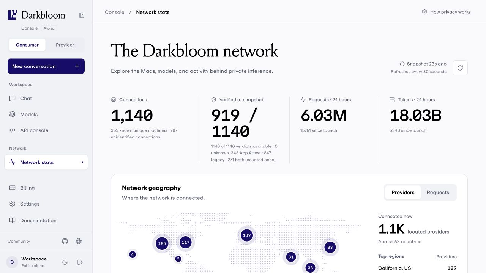

# App Attest enrollment recovery and network snapshot investigation

> Last updated: 2026-09-22 · commit `736911a19`

This investigation covers provider 0.9.8 and coordinator source `011ccd3d1`.
The repairs described here are a proposed patch, not a production deployment
or proof that every affected Mac has recovered. Customer identities, private
certificates, receipts and raw proof bodies are excluded.

## Reproduced failures

| Failure | Evidence | Repair and limit |
|---|---|---|
| Public App Attest count falls to zero | A source snapshot contained 1,139 connections, 336 App Attest, 846 legacy and 270 dual-path verdicts. Every serialized App Attest lease had 29 seconds remaining. At snapshot +40 seconds, the old UI reported zero App Attest and only 846 verified connections, matching the reported screen. | Network stats, filters and proof details now describe the source snapshot and retain its visible age. Live owner controls and coordinator dispatch still enforce current expiry. |
| Valid Apple attestation rejected as `authenticator_trailing_data` | Six rejected production proofs contained a valid 116-byte CDhash extension map with flags `0x40`; two accepted controls used `0xc0`. All passed the embedded Apple chain, exact Mac ACL and nonce checks before the framing rejection. | The parser accepts this bounded, complete attestation-only extension shape. Private replay accepts all six rejected proofs and both controls. Unflagged assertion tails and malformed extensions remain rejected. |
| Initial enrollment retries an unusable key indefinitely | One screenshot-matched machine reused the same unaccepted key through seven operation timeouts and 22 generic Apple errors across reconnects. The underlying native error was discarded by the released client. | Failed or interrupted enrollment retires the key under the existing persisted one-hour cooldown and shared generation budget. The initiating Apple failure cannot be reconstructed from the old coarse error. |

Apple's [enrollment guidance](https://developer.apple.com/documentation/devicecheck/establishing-your-app-s-integrity)
permits retrying the same key after `serverUnavailable`; other attestation
errors require a new key. The patch records an attempt marker before calling
Apple, preserves a successfully saved enrollment proof across lost responses,
and does not rotate accepted credentials for generic assertion errors.

## Distinct reporter cases

Account-scoped inspection at approximately 20:03–20:05 America/Los_Angeles
found an enrolled-key assertion failure as well. That credential previously
produced 116 verified assertions, then returned 123 `apple_error` results since
September 16. Its last success and first failure both reported provider 0.9.4
and macOS build `26A428`; this failure predates 0.9.8. Its current connection
had legacy authorization and completed 21 distinct successful route requests
in the preceding 15 minutes. **The enrollment repair is not a demonstrated
fix for this assertion failure.**

Another reporting account had two currently App Attest-authorized Macs and a
third whose availability check reported `unsupported`, using legacy authorization.
All three had successful routes in that same 15-minute inspection. An OS version
report alone does not establish Apple API support or serving authorization.

The supplied email for the group-DM reporter had no provider tokens or machine
sessions. A machine matching the screenshot's hardware/model/activity was found
under another login; that association remains tentative, not a confirmed account
match.

New optional diagnostics preserve a closed domain bucket, signed numeric error
code and one bounded underlying-error pair. Native descriptions, arbitrary
domain strings and `userInfo` are excluded. These are untrusted diagnostic data,
never authorization evidence. Old generic errors cannot reveal their native cause.

## UI check

The production-built local console was checked against public stats. It displayed
343 App Attest connections when the source snapshot was 32 seconds old, retaining
the stale indicator. The captured frame below is another observation; fleet counts
may differ. Synthetic regression coverage pins the original 1,139-connection
failure at +40 seconds and verifies that live expiry still works.

## 0.9.9 follow-up audit

The follow-up checked Apple's enrollment, assertion, error and macOS policy
contracts against the key lifecycle, callback adapter, stored enrollment context,
receipt worker, authorization evaluator, dispatch gates and rollout docs.

| Additional finding | Reproduction and change |
|---|---|
| Service-unavailable recovery changed the original hash after a reconnect | Apple's [serverUnavailable contract](https://developer.apple.com/documentation/devicecheck/dcerror-swift.struct/code/serverunavailable) requires the same key and hash. The immediate loop complied, but the next coordinator attempt changed its session/challenge/endpoint transcript. A restart/protocol-upgrade test failed on the old code. `ShadowEnrollmentAttempt` now persists the original enrollment inputs and returns their original server context; subsequent serving assertions use fresh current-process inputs. |
| Cancellation during known-safe backoff retired the key | The PR review identified a marker still armed after Apple's server-unavailable reply. A reproduced cancellation then cleared a fresh key and hit its one-hour generation cooldown. The marker is now cleared durably before backoff and armed separately before each Apple call. The cancellation/restart test preserves the key and original hash. |
| Expired original enrollment could stop recovery permanently | The server's 24-hour clock starts before the Apple call, while older clients cached its successful reply afterward. A regression reproduces the expiry as a terminal `enrollment_context` result. Matching expired transactions now reject the proof as `enrollment_expired` and retry later, so the client can retire its expired cache. Binding mismatches are tested separately and remain terminal. |
| Rollout docs described obsolete shadow-only behavior | The shared evaluator already feeds the enabled serving path. Turning shadow off alone does not stop exchanges when serving remains enabled. The current runbook preserves existing serving settings during upgrades and explains the availability impact of explicitly disabling both paths. |

The version constants and release runbook now prepare **0.9.9**, without publishing
it or changing the active release. A bounded read-only production inspection at
20:30 America/Los_Angeles found no archived `enrollment_context`,
`enrollment_storage_error`, `counter_replay` or `certificate_chain` outcomes in
the preceding 24 hours. The expiry correction is a reproduced code defect, not
an attribution for the current Slack reports.

The audit retains the security boundaries: no accepted-key rotation on generic
assertion errors; no support inferred from OS version alone; no authorization
from a cached enrollment proof, diagnostic field or network snapshot; no change
to revocation, receipt expiry or exact signed-build qualification. A permanently
unanswered Apple callback still holds its operation slot; repeated live calls
are not allowed to accumulate. Apple's native cause in the historical assertion
case remains unavailable because the old client discarded it. New diagnostic
codes and actual post-upgrade proofs are needed before calling that case resolved.

## Privacy and data exposure audit

The additional audit compared Apple's current [validation contract](https://developer.apple.com/documentation/devicecheck/validating-apps-that-connect-to-your-server),
[receipt contract](https://developer.apple.com/documentation/devicecheck/assessing-fraud-risk)
and [retry contract](https://developer.apple.com/documentation/devicecheck/dcerror-swift.struct/code/serverunavailable)
against this PR. It traced the provider callback/transcript, key storage,
coordinator verifier, evidence archive, operational event sinks, public API and
authenticated admin export. This is a source audit with local regressions, not
a claim that production access controls or every affected Mac were qualified.

| Finding | Evidence and disposition |
|---|---|
| Private-only providers appeared in an unauthenticated roster | `handleProviderAttestation` iterated all registry providers, unlike public stats. A regression failed because the response exposed a private connection, hardware metadata and persistent legacy SE public key. The handler now excludes private-only rows before serialization and shared caching. Tests preserve normal public verification fields and owner-only visibility. This requires a coordinator deployment; no provider upgrade is needed for this filter. |
| Public legacy keys permit cross-session linkage | The roster intentionally includes `se_public_key`, also used by response verification and older provider diagnostics. It is not the App Attest credential or a private key. The patch preserves compatibility and corrects the privacy description; replacing it with session-scoped evidence requires a separate consumer/diagnostic migration. Hiding private-only sessions cannot erase keys exposed in earlier public sessions. |
| Operational IDs leave the evidence database | `observeWithAppleError` emits account/machine IDs and prospective-policy credential IDs through the shared emitter to process logs and configured Datadog Logs API. Raw proofs and receipts do not enter those event fields. This is operational data sharing, not an unauthenticated endpoint. Minimized external log fields and explicit log access/retention controls remain follow-ups. |
| Evidence access is authenticated but uses shared credentials | The admin proxy and evidence download both require Basic Auth, fail closed when configuration is missing, and downloads use `private, no-store`. The code provides neither individual operator identity nor a dedicated download audit trail. SSO/RBAC and attributed export auditing remain follow-ups. Production IAM, database encryption, backups and third-party log retention were not inspected in this pass. |
| Some presentation still described shadow-only operation | The reference still called the dispatch gate a future feature, and the admin page claimed APNs/MDM alone remained authoritative. Both now distinguish evidence collection from separately enabled, current serving authorization. Historical proof success alone does not grant serving. |

The reviewed verifier checks the embedded Apple chain, nonce, signing App ID,
key binding, environment, enrollment counter and strictly increasing assertion
counter. The exact Mac access-policy value requires SIP and Full Security.
Serving separately checks the current signed-code measurement against qualified
release policy, owner/connection/endpoint bindings, receipts and revocation.
The earlier framing repair remains limited to authenticated attestation data;
assertions do not accept unflagged tails.

The App Attest call receives a hash of Darkbloom's attestation transcript, not
inference prompts. The Apple exchange also carries Apple's own attestation
evidence; this does not imply that Apple receives no device/app information.
The app's assertion adapter uses its own process-generated X25519 endpoint and
locally measured status, and decrypts the coordinator challenge itself. The
reviewed App Attest path does not expose a generic remote signing API. Keychain
stores the key identifier and recovery state, not the App Attest private key;
new records are nonsynchronizing and device-only. Native error diagnostics
contain bounded domain/code values rather than descriptions or `userInfo`.

These checks do not turn CPU/GPU inference into Secure Enclave execution or
prove the absence of runtime vulnerabilities. The provider remains a plaintext
endpoint, alongside the coordinator's confidential-VM processing. Exact signed
artifact validation and security-transition tests remain release requirements.
Apple's approximate recent key-count risk metric is not an immutable physical
machine ID; neither canonical Darkbloom identity nor receipt history establishes
physical uniqueness.

No private-key or inference-prompt disclosure was found in the reviewed App
Attest transcript, event fields or public verdict. That statement is limited to
these paths; it is not a complete audit of inference/media handling, every log,
or production infrastructure. The historical generic assertion failure above
still lacks the native diagnostic needed to establish its initiating cause.

## Validation and rollout boundary

The full coordinator suite, focused App Attest/protocol race tests, 33 focused
Swift App Attest tests, 803 console tests, console lint/build and docs checks
passed during preparation. The privacy follow-up additionally tests the public
roster, shared cache, owner/account isolation and concurrent verification under
the Go race detector. Admin lint/build and 16 tests pass; two disposable-Postgres
integration tests remain skipped. The admin build uses a non-production
placeholder database URL for required configuration, not a live connection.
The focused Swift harness compiles the actual module
and tests without the inference dependency graph; it is not signed-app
qualification. The full provider suite and final CI results belong to the PR's
validation record.

Deploying the coordinator can accept the authenticated framing variant on existing
clients. The console deployment fixes snapshot presentation. Enrollment recovery
and native diagnostics require a new signed provider release and adoption. No
database migration, trust bypass, forced provider restart or automatic production
mitigation was performed. The rollout monitor remains paused at the operator's request.

Follow-up runtime checks must distinguish fresh enrollment success, subsequent
verified assertions, current serving authorization and successful inference.
Passing parser tests or preserving a historical snapshot does not establish
those outcomes for a particular affected Mac.
