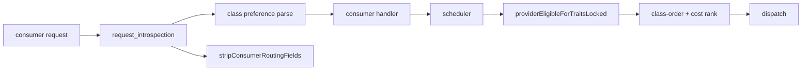
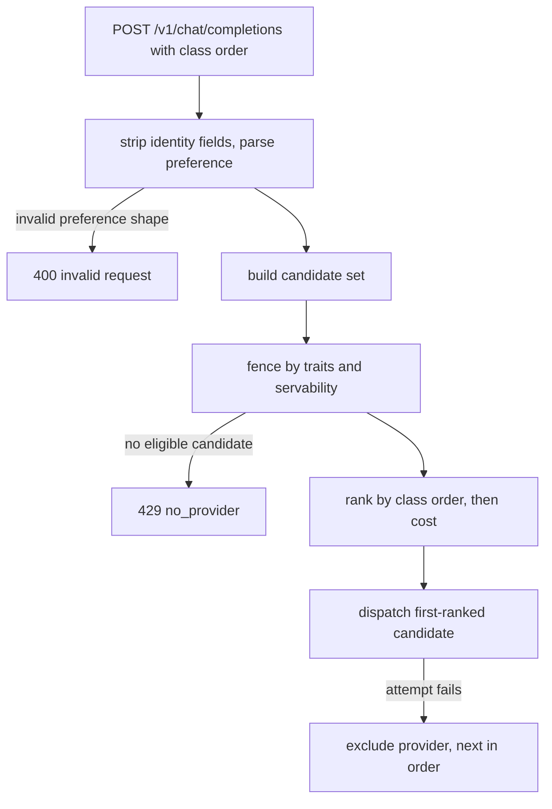

# ORP-001: Consumer-specified provider order

> Last updated: 2026-09-25 · commit `b6f9574ed`

Darkbloom gives callers no way to rank providers on a request; every request is routed purely by the internal cost function. Part of the OpenRouter-perspective review; see the [review index](../README.md).

## What

OpenRouter's `provider.order` lets a caller list preferred providers and have routing try them in that order before falling back (OpenRouter provider routing, https://openrouter.ai/docs/features/provider-routing). Darkbloom actively strips any consumer-supplied provider targeting: `provider_serial`/`provider_serials` request fields are removed and ignored in `coordinator/api/request_introspection.go` (`stripConsumerRoutingFields`), and the scheduler scores candidates only by its internal cost model in `coordinator/registry/scheduler.go` (`buildCandidateInto`). The only consumer routing control today is self-route, `X-Darkbloom-Route: self|prefer` (`coordinator/api/self_route.go`, `resolveSelfRoutePolicy`). Because Darkbloom never exposes provider identity to consumers, the privacy-preserving variant is ordering by provider *class* — attestation level, chip family, or region — or by a pseudonymous provider token, never by raw identity.

## Why

Integrators migrating from OpenRouter lose a routing primitive their latency and cost tuning depends on; they cannot say "try this class of providers first", so workloads tuned around a provider ranking must be re-tuned blind.

## Prompt

Add a consumer-facing provider-order preference to the coordinator that respects the privacy model. Goal: a request can carry a routing preference that ranks candidate providers by caller-visible *class* (attestation level, chip family, region) or pseudonymous provider token, and the scheduler tries classes in the given order before the default cost ordering. Constraints: (1) never accept or echo raw provider serials — keep `stripConsumerRoutingFields` rejecting identity-bearing fields, and never log or return provider identity; (2) the preference is soft within Darkbloom's guarantees: trait gates (`providerEligibleForTraitsLocked`) and servability still fence ineligible candidates; ordering applies only among eligible candidates; (3) when no preference is present, candidate order must be byte-identical to today; (4) failover within and across classes stays governed by the existing attempt budget. Files to touch: `coordinator/api/request_introspection.go` (parse and validate the new preference field), `coordinator/api/consumer.go` (thread it into dispatch), `coordinator/registry/scheduler.go` (apply class-order ranking in the candidate sort), plus tests. Acceptance criteria: a request with a class order dispatches to the first-ranked eligible class; a request without it behaves exactly as before; an attempt to pass raw provider serials is still stripped and ignored.

## Workflow

1. Read `stripConsumerRoutingFields` in `coordinator/api/request_introspection.go` to see how request-level routing fields are validated today.
2. Define the privacy-safe preference schema (ordered list of class keys, e.g. `attestation`, `chip_family`, `region`, or pseudonymous tokens) and its parser.
3. Decide the wire placement (request field vs header) and document it alongside the self-route header.
4. Thread the parsed preference from the API handler into the scheduler's candidate selection.
5. In the scheduler, rank eligible candidates by class order first, then by the existing cost model within a class.
6. Keep trait gating and servability filtering ahead of preference ranking.
7. Add unit tests: parse/validation, class ordering, interaction with trait fences, no-preference regression, identity-field rejection.
8. Run `make coordinator-test`.

## Loop

Run `make coordinator-test` (or `go test ./coordinator/api/... ./coordinator/registry/...` while iterating). Check: preference parsing tests pass; existing scheduler and routing tests pass unchanged; a request with no preference produces the identical candidate order as before; requests carrying `provider_serial` are still stripped. Definition of done: all coordinator tests green, class-order preference honored among eligible candidates, zero provider-identity leakage in logs or responses.

## Graph

## Layout

- Modify `coordinator/api/request_introspection.go` — parse and validate the provider-class order preference.
- Modify `coordinator/api/consumer.go` — thread the preference into dispatch.
- Modify `coordinator/registry/scheduler.go` — class-order ranking among eligible candidates.
- Add/extend tests in `coordinator/api` and `coordinator/registry`.
- No UI surface.

## Flow

Severity: medium · Effort: M
