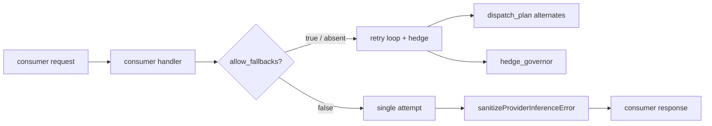
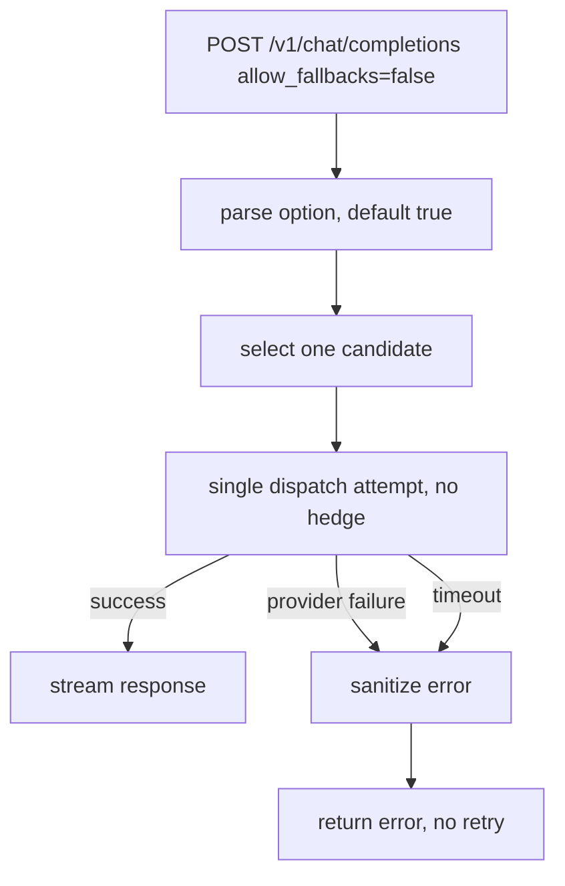

# ORP-002: `allow_fallbacks` opt-out

> Last updated: 2026-09-25 · commit `b6f9574ed`

Darkbloom always fails a request over to another provider and gives callers no way to ask for a single attempt; OpenRouter callers can set `allow_fallbacks:false`. Part of the OpenRouter-perspective review; see the [review index](../README.md).

## What

OpenRouter's `allow_fallbacks` (default true) lets a caller disable provider failover so a request either succeeds on the chosen provider or errors (OpenRouter provider routing, https://openrouter.ai/docs/features/provider-routing). Darkbloom failover is always on and invisible: dispatch retries up to `maxDispatchAttempts=64` attempts with failed providers added to `excludeProviders` (`coordinator/api/consumer.go`), retains up to 8 provisional alternates per request (`coordinator/registry/dispatch_plan.go`, `dispatchPlanMaxAlternates`), and fires a speculative hedge at 50% of the TTFT deadline (`coordinator/registry/hedge_governor.go`). There is no request-level switch to disable any of this.

## Why

Some callers need deterministic single-provider execution: reproducible runs, pinned attestation evidence for a single serving session, or strict cost certainty where a silent retry on a second provider is unacceptable. Today they cannot express that; a failed attempt always slides to another provider.

## Prompt

Add an `allow_fallbacks` request option to the coordinator, defaulting to true (current behavior). Goal: when a request sets `allow_fallbacks:false`, dispatch makes exactly one provider attempt and suppresses the speculative hedge; if that attempt fails, the request returns the failure instead of retrying on another provider. Constraints: (1) default behavior with the field absent must be byte-identical to today; (2) with fallbacks disabled, cap attempts at 1, do not consult alternates from the dispatch plan, and disable the hedge governor for the request; (3) error responses still pass through `sanitizeProviderInferenceError` (`coordinator/api/inference_error_sanitize.go`) — no provider-authored prose crosses to the consumer; (4) billing must only charge for actual usage from the single attempt. Files to touch: `coordinator/api/consumer.go` (parse the option, gate the retry loop and `excludeProviders` path), `coordinator/registry/hedge_governor.go` (opt the request out of hedging), `coordinator/registry/dispatch_plan.go` (skip alternate retention when disabled), plus tests. Acceptance criteria: `allow_fallbacks:false` yields at most one provider attempt and no hedge; a failed single attempt surfaces an error promptly; absent or `true` matches current multi-attempt behavior exactly.

## Workflow

1. Read the dispatch retry loop in `coordinator/api/consumer.go` around `maxDispatchAttempts` and `excludeProviders`.
2. Add `allow_fallbacks` to the request parsing path, defaulting to true.
3. When false, clamp the effective attempt limit to 1 and skip alternate selection in the dispatch plan.
4. Plumb the flag to `coordinator/registry/hedge_governor.go` so no hedge request is spawned.
5. Ensure the single-attempt failure path returns the sanitized error without enqueueing a retry.
6. Add unit tests: flag parse/default, single-attempt behavior, hedge suppression, error sanitization on the failure branch.
7. Run `make coordinator-test`.

## Loop

Run `make coordinator-test` (or `go test ./coordinator/api/... ./coordinator/registry/...` while iterating). Check: new flag tests pass; existing failover and hedge tests pass unchanged when the flag is absent; a simulated provider failure with `allow_fallbacks:false` produces exactly one dispatch attempt. Definition of done: all coordinator tests green, deterministic single-attempt execution behind the flag, unchanged default behavior.

## Graph

## Layout

- Modify `coordinator/api/consumer.go` — option parsing and retry-loop gating.
- Modify `coordinator/registry/hedge_governor.go` — per-request hedge opt-out.
- Modify `coordinator/registry/dispatch_plan.go` — skip alternates when fallbacks disabled.
- Add/extend tests in `coordinator/api` and `coordinator/registry`.
- No UI surface.

## Flow

Severity: low · Effort: S
