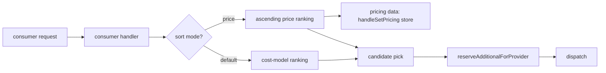
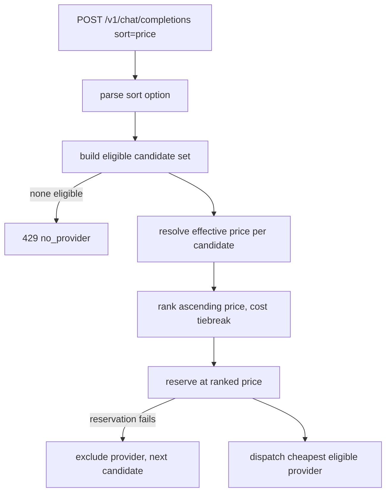

# ORP-003: `provider.sort=price`

> Last updated: 2026-09-25 · commit `b6f9574ed`

Darkbloom's routing cost model has no price term, so callers cannot ask for the cheapest eligible provider; OpenRouter offers `sort=price`. Part of the OpenRouter-perspective review; see the [review index](../README.md).

## What

OpenRouter's `provider.sort=price` ranks candidate providers cheapest-first (OpenRouter provider routing, https://openrouter.ai/docs/features/provider-routing). Darkbloom's scheduler cost is slotStatePenalty + effectiveQueue×3000ms + totalPending×750ms + backlog tokens/decode-TPS + health penalties in `coordinator/registry/scheduler.go` (`buildCandidateInto`) — no price term anywhere. Yet pricing data exists: per-provider custom prices are set via `PUT /v1/pricing` (`coordinator/api/billing_handlers.go`, `handleSetPricing`) and applied at reservation time (`coordinator/api/consumer.go`, `reserveAdditionalForProvider`). The data needed for a price sort is present; it is just never consulted during candidate ranking.

## Why

Cost-sensitive batch workloads cannot express "cheapest first". A bulk job that would happily wait longer for a cheaper provider is routed by latency alone and may land on the most expensive eligible candidate, inflating spend with no way to opt out.

## Prompt

Add a price sort mode to candidate ranking. Goal: a request can express `sort=price` (or the Darkbloom equivalent), and the scheduler ranks eligible candidates by ascending effective per-token price — provider custom price when set, otherwise the platform model price — before applying the existing cost model as a tiebreaker. Constraints: (1) price comes from the same source `handleSetPricing` writes and `reserveAdditionalForProvider` reads, so routing and billing cannot disagree; (2) eligibility gates (traits, servability, health) still apply before ranking; (3) when no sort is requested, candidate order is byte-identical to today; (4) do not expose provider identity or per-provider prices in consumer responses — the sort affects routing only; (5) keep failover semantics unchanged after the first pick. Files to touch: `coordinator/registry/scheduler.go` (price-aware ranking branch), `coordinator/api/consumer.go` (parse the sort option and thread it in), and the pricing read path shared with `coordinator/api/billing_handlers.go`, plus tests. Acceptance criteria: with price sort requested, the dispatched candidate is the cheapest eligible one; billing for that request matches the price that drove the ranking; default requests route exactly as before.

## Workflow

1. Read `buildCandidateInto` in `coordinator/registry/scheduler.go` and the pricing read path used by `reserveAdditionalForProvider` in `coordinator/api/consumer.go`.
2. Define a sort-mode request option with values covering the default plus `price`.
3. Resolve each candidate's effective price (provider custom price falling back to platform model price) at ranking time.
4. Add the price-sort branch: ascending price, existing cost model as tiebreaker.
5. Keep trait gating and health fences ahead of the sort.
6. Verify the price used for ranking equals the price used for reservation top-up.
7. Add unit tests: sort parse, cheapest-first ordering, tiebreaking, billing/routing price agreement, no-sort regression.
8. Run `make coordinator-test`.

## Loop

Run `make coordinator-test` (or `go test ./coordinator/registry/... ./coordinator/api/...` while iterating). Check: price-sort tests pass; existing scheduler tests pass unchanged; a two-provider fixture with different custom prices dispatches to the cheaper one under the sort and to the lower-cost one without it. Definition of done: all coordinator tests green, cheapest-first routing behind the option, ranking price identical to billed price.

## Graph

## Layout

- Modify `coordinator/registry/scheduler.go` — price-sort ranking branch in candidate selection.
- Modify `coordinator/api/consumer.go` — sort option parsing and threading.
- Reuse the pricing read path shared with `coordinator/api/billing_handlers.go`.
- Add/extend tests in `coordinator/registry` and `coordinator/api`.
- No UI surface.

## Flow

Severity: medium · Effort: M
