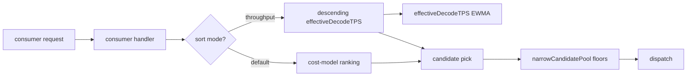
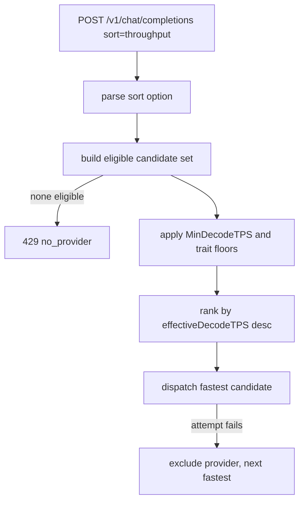

# ORP-004: `provider.sort=throughput`

> Last updated: 2026-09-25 · commit `b6f9574ed`

Darkbloom tracks per-provider decode throughput but never lets a caller sort by it; OpenRouter offers `sort=throughput`. Part of the OpenRouter-perspective review; see the [review index](../README.md).

## What

OpenRouter's `provider.sort=throughput` ranks candidate providers by tokens per second (OpenRouter provider routing, https://openrouter.ai/docs/features/provider-routing). Darkbloom's scheduler already maintains a load-scaled EWMA decode TPS per candidate in `coordinator/registry/scheduler.go` (`effectiveDecodeTPS`) and uses it only inside the blended cost model of `buildCandidateInto`; there is no mode where throughput dominates the ranking. Soft pool narrowing (`narrowCandidatePool`) supports `MinDecodeTPS` as a floor, but a floor is not a sort: the winner is still picked by the latency/queue-weighted cost.

## Why

Interactive batch jobs such as eval sweeps want maximum tokens per second, not minimum time-to-first-token. Without a throughput sort, these workloads are routed to whichever candidate wins the TTFT-weighted cost, and large generations finish later than the fleet's best decode rate allows.

## Prompt

Add a throughput sort mode to candidate ranking. Goal: a request can express `sort=throughput`, and the scheduler ranks eligible candidates by descending `effectiveDecodeTPS`, using the existing cost model only as a tiebreaker. Constraints: (1) reuse `effectiveDecodeTPS` as-is — do not introduce a second throughput metric that can drift from the cost model's input; (2) eligibility gates (traits, servability, health) still fence candidates before ranking, and `narrowCandidatePool` floors still apply; (3) when no sort is requested, candidate order is byte-identical to today; (4) the sort is a ranking hint only — failover and hedging behavior after the first pick is unchanged; (5) no provider identity or per-provider TPS values are exposed in consumer responses. Files to touch: `coordinator/registry/scheduler.go` (throughput-sort branch), `coordinator/api/consumer.go` (parse the sort option and thread it in), plus tests. Acceptance criteria: with throughput sort requested, the dispatched candidate has the highest `effectiveDecodeTPS` among eligible candidates; default requests route exactly as before.

## Workflow

1. Read `buildCandidateInto`, `effectiveDecodeTPS`, and `narrowCandidatePool` in `coordinator/registry/scheduler.go`.
2. Define the sort-mode request option (shared with the other sort modes) and parse it in `coordinator/api/consumer.go`.
3. Thread the sort mode into the candidate-selection call.
4. Add the throughput branch: rank by `effectiveDecodeTPS` descending, cost model as tiebreaker.
5. Confirm trait gating and health fences run before the sort.
6. Add unit tests: sort parse, descending-TPS ordering, tiebreak behavior, interaction with `MinDecodeTPS` floors, no-sort regression.
7. Run `make coordinator-test`.

## Loop

Run `make coordinator-test` (or `go test ./coordinator/registry/... ./coordinator/api/...` while iterating). Check: throughput-sort tests pass; existing scheduler tests pass unchanged; a fixture with known EWMA TPS values dispatches to the fastest eligible candidate under the sort and to the cost-model winner without it. Definition of done: all coordinator tests green, max-throughput routing behind the option, no change to default ordering.

## Graph

## Layout

- Modify `coordinator/registry/scheduler.go` — throughput-sort ranking branch.
- Modify `coordinator/api/consumer.go` — sort option parsing and threading.
- Add/extend tests in `coordinator/registry` and `coordinator/api`.
- No UI surface.

## Flow

Severity: medium · Effort: M
