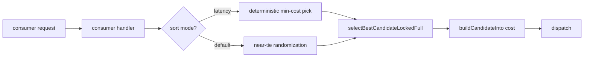
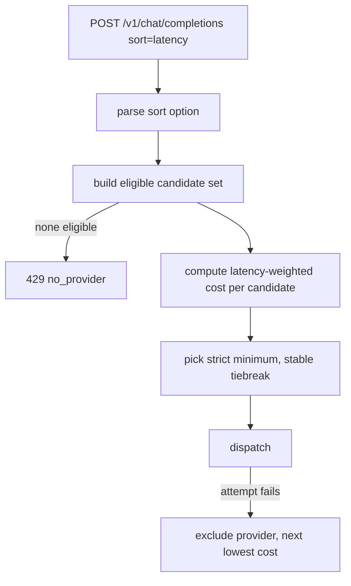

# ORP-005: `provider.sort=latency`

> Last updated: 2026-09-25 · commit `b6f9574ed`

Darkbloom's default cost model is already latency-weighted, but there is no explicit, documented latency sort mode a caller can select and rely on; OpenRouter offers `sort=latency`. Part of the OpenRouter-perspective review; see the [review index](../README.md).

## What

OpenRouter's `provider.sort=latency` ranks candidates by lowest expected latency (OpenRouter provider routing, https://openrouter.ai/docs/features/provider-routing). Darkbloom's scheduler cost in `coordinator/registry/scheduler.go` (`buildCandidateInto`) is dominated by latency-shaped terms — effectiveQueue×3000ms, totalPending×750ms, backlog tokens over decode TPS — so the default behavior is close to a latency sort. The gap is that the mode is implicit: it is not selectable by name, not documented as a consumer-facing contract, and final selection in `selectBestCandidateLockedFull` includes near-tie randomization, so "lowest latency" is not honored deterministically.

## Why

This is a parity line-item. Callers porting OpenRouter configs that name `sort=latency` have no equivalent knob, and the absence of a documented default ordering leaves ambiguity about what the scheduler guarantees when candidates nearly tie.

## Prompt

Expose latency sort as an explicit, deterministic mode. Goal: a request can express `sort=latency`; the scheduler then ranks eligible candidates by the latency-weighted cost model and picks the minimum deterministically, skipping the near-tie randomization in `selectBestCandidateLockedFull`. Constraints: (1) do not change the cost formula itself — this issue only makes the existing latency weighting selectable and deterministic; (2) keep the default (no sort requested) behavior byte-identical to today, including near-tie randomization, unless the default is explicitly redefined as `sort=latency` and documented as such; (3) eligibility gates still fence candidates before ranking; (4) no new consumer-visible provider data — the sort affects ordering only. Files to touch: `coordinator/registry/scheduler.go` (`selectBestCandidateLockedFull` deterministic branch, sort-mode plumbing), `coordinator/api/consumer.go` (parse the sort option), plus tests. Acceptance criteria: with `sort=latency`, repeated identical requests pick the same minimum-cost eligible candidate; without the option, behavior matches today exactly.

## Workflow

1. Read `buildCandidateInto` and `selectBestCandidateLockedFull` in `coordinator/registry/scheduler.go`; locate the near-tie randomization.
2. Add the shared sort-mode option and parse `latency` in `coordinator/api/consumer.go`.
3. Thread the mode into candidate selection.
4. In `selectBestCandidateLockedFull`, add the deterministic branch: strict minimum cost, stable tiebreak, no randomization.
5. Leave default-path randomization untouched.
6. Add unit tests: sort parse, deterministic repeated selection, near-tie behavior in both modes, no-sort regression.
7. Run `make coordinator-test`.

## Loop

Run `make coordinator-test` (or `go test ./coordinator/registry/... ./coordinator/api/...` while iterating). Check: determinism tests pass under `sort=latency` (same candidate across repeated runs); existing near-tie randomization tests still pass on the default path; no other scheduler behavior shifts. Definition of done: all coordinator tests green, explicit latency sort honored deterministically, default ordering unchanged.

## Graph

## Layout

- Modify `coordinator/registry/scheduler.go` — deterministic branch in `selectBestCandidateLockedFull`.
- Modify `coordinator/api/consumer.go` — sort option parsing.
- Add/extend tests in `coordinator/registry` and `coordinator/api`.
- No UI surface.

## Flow

Severity: low · Effort: S
