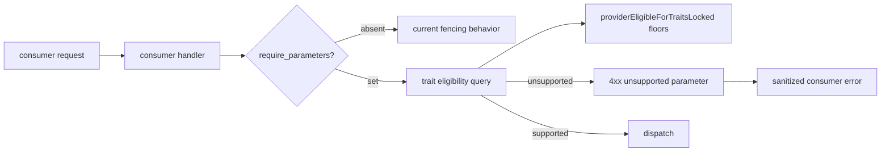
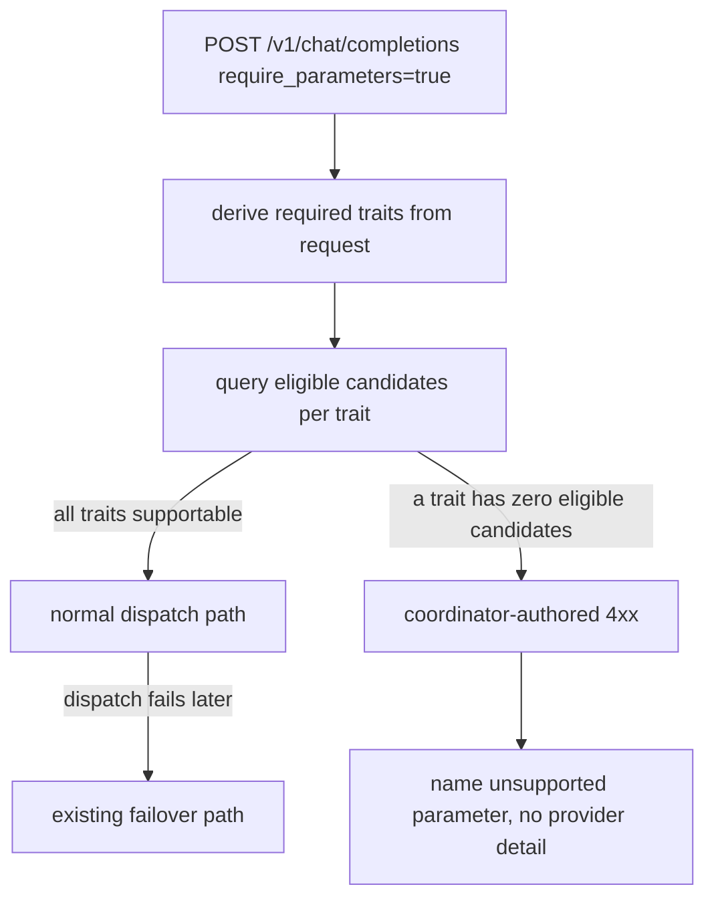

# ORP-006: `require_parameters` hard gate

> Last updated: 2026-09-25 · commit `b6f9574ed`

Darkbloom fences providers that cannot honor request parameters, but a caller cannot ask for a hard failure instead of silent degradation; OpenRouter's `require_parameters` does exactly that. Part of the OpenRouter-perspective review; see the [review index](../README.md).

## What

OpenRouter's `require_parameters` (default false) makes the request fail if no provider can honor parameters like `tools` or `response_format`, instead of silently dropping them (OpenRouter provider routing, https://openrouter.ai/docs/features/provider-routing). Darkbloom's trait gating is hard but invisible: a request needing tools is fenced away from providers below capability floors in `coordinator/registry/request_traits.go` (`providerEligibleForTraitsLocked`), and the rules for degrading unsupported parameters are internal — the consumer cannot express "fail instead of silently dropping my tools". If every eligible provider lacks a needed trait, the request fails with a capacity-style error rather than a parameter-specific one, and the caller cannot tell the difference.

## Why

A dropped `response_format` turns a structured pipeline into silent free-text: JSON-schema consumers receive unparseable output with no signal that the constraint was ignored. Callers need an explicit fail-fast contract for parameter support.

## Prompt

Add a `require_parameters`-style hard gate. Goal: when a request opts in, the coordinator validates before dispatch that at least one eligible candidate can honor every constrained parameter in the request (`tools`, `response_format`, and any other gated traits); if none can, the request fails immediately with a clear 4xx identifying the unsupported requirement, and no dispatch is attempted. Constraints: (1) reuse the trait floors in `providerEligibleForTraitsLocked` as the source of truth for capability — do not duplicate capability tables; (2) default behavior (flag absent) is unchanged; (3) the error is coordinator-authored and passes the same sanitization discipline as other consumer errors (`coordinator/api/inference_error_sanitize.go`, `sanitizeProviderInferenceError`) — no provider identity or provider prose in the message; (4) the check runs before reservation so a gated request never bills. Files to touch: `coordinator/api/consumer.go` (parse the option, pre-dispatch capability check, error mapping), `coordinator/registry/request_traits.go` (expose a checkable eligibility query), plus tests. Acceptance criteria: an opted-in request whose `response_format` no eligible provider supports returns 4xx naming the unsupported parameter and dispatches nothing; an opted-in request with support routes normally; behavior without the flag is unchanged.

## Workflow

1. Read `providerEligibleForTraitsLocked` in `coordinator/registry/request_traits.go` and the request-trait derivation for `tools`/`response_format`.
2. Add the opt-in request option parsing in `coordinator/api/consumer.go`.
3. Add a registry query that reports which required traits have zero eligible candidates, without exposing provider details.
4. Gate dispatch on that query when the option is set; map failures to a 4xx with a parameter-specific code.
5. Ensure the check precedes reservation and billing.
6. Add unit tests: option parse, hard-fail on unsupported `response_format`/`tools`, pass-through when supported, pre-billing failure, default-path regression.
7. Run `make coordinator-test`.

## Loop

Run `make coordinator-test` (or `go test ./coordinator/api/... ./coordinator/registry/...` while iterating). Check: hard-gate tests pass; existing trait-fencing tests pass unchanged; a fixture with no tool-capable provider returns the parameter-specific 4xx under the flag and the current behavior without it. Definition of done: all coordinator tests green, fail-fast parameter contract behind the flag, zero provider-identity leakage in errors.

## Graph

## Layout

- Modify `coordinator/api/consumer.go` — option parsing, pre-dispatch gate, error mapping.
- Modify `coordinator/registry/request_traits.go` — checkable trait-eligibility query.
- Add/extend tests in `coordinator/api` and `coordinator/registry`.
- No UI surface.

## Flow

Severity: medium · Effort: M
