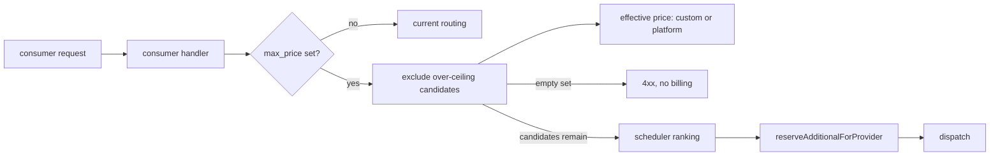
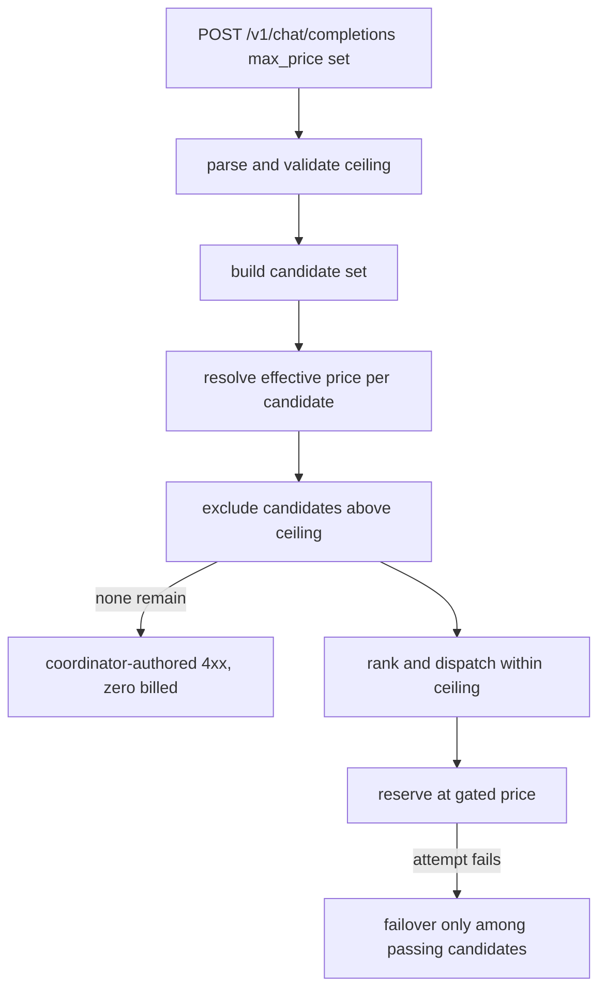

# ORP-007: `max_price` hard filter

> Last updated: 2026-09-25 · commit `b6f9574ed`

Darkbloom applies prices at reservation time but never gates dispatch on a caller-set price ceiling; OpenRouter's `max_price` excludes providers above a ceiling before routing. Part of the OpenRouter-perspective review; see the [review index](../README.md).

## What

OpenRouter's `max_price:{prompt,completion,image,request}` filters out any provider whose rates exceed the caller's ceiling (OpenRouter provider routing, https://openrouter.ai/docs/features/provider-routing). Darkbloom has both per-model platform prices and per-provider custom prices set via `PUT /v1/pricing` (`coordinator/api/billing_handlers.go`, `handleSetPricing`), but there is no request-level ceiling check before dispatch commit: `reserveAdditionalForProvider` (`coordinator/api/consumer.go`) applies whatever price the chosen provider carries — it does not gate it. A caller has no way to exclude expensive providers up front.

## Why

Consumers cannot cap worst-case request cost. Reservations can top up beyond expectation when routing lands on a provider with high custom prices, and the caller discovers the cost only on the bill.

## Prompt

Add a request-level price ceiling filter. Goal: a request can carry a `max_price`-style ceiling (per-token prompt/completion, matching Darkbloom's pricing dimensions); before dispatch commits, any candidate whose effective price — provider custom price when set, otherwise platform model price — exceeds the ceiling is excluded from the candidate set, and if exclusion empties the set the request fails with a clear 4xx before any reservation. Constraints: (1) the price compared must be the same effective price `reserveAdditionalForProvider` will charge, so the gate and the bill cannot disagree; (2) default behavior (no ceiling) is byte-identical to today; (3) the gate runs before reservation so a filtered request never bills; (4) errors are coordinator-authored under the sanitization discipline (`coordinator/api/inference_error_sanitize.go`, `sanitizeProviderInferenceError`) — the consumer learns that no candidate fits the ceiling, never which provider was excluded or its price; (5) failover only considers candidates that pass the gate. Files to touch: `coordinator/api/consumer.go` (parse ceiling, pre-reservation gate, error mapping), the pricing read path shared with `coordinator/api/billing_handlers.go`, `coordinator/registry/scheduler.go` (apply the exclusion during candidate selection), plus tests. Acceptance criteria: a request with a ceiling never dispatches to a candidate whose effective price exceeds it; a ceiling that excludes all candidates returns 4xx with zero usage billed; requests without a ceiling route exactly as today.

## Workflow

1. Read `reserveAdditionalForProvider` in `coordinator/api/consumer.go` and the pricing read path to pin the effective-price definition.
2. Add ceiling field parsing to the request path, validated and defaulted off.
3. Resolve each candidate's effective price during candidate selection in `coordinator/registry/scheduler.go`.
4. Exclude over-ceiling candidates before the first dispatch attempt and before reservation.
5. Map the empty-set case to a coordinator-authored 4xx.
6. Add unit tests: ceiling parse/validation, exclusion behavior, empty-set 4xx with no billing, gate/bill price agreement, no-ceiling regression.
7. Run `make coordinator-test`.

## Loop

Run `make coordinator-test` (or `go test ./coordinator/api/... ./coordinator/registry/...` while iterating). Check: gate tests pass with fixtures of differing custom prices; billing assertions confirm no charge on gated requests; existing reservation tests pass unchanged. Definition of done: all coordinator tests green, worst-case cost capped by the ceiling, no provider price or identity leaked in errors.

## Graph

## Layout

- Modify `coordinator/api/consumer.go` — ceiling parsing, pre-reservation gate, error mapping.
- Modify `coordinator/registry/scheduler.go` — over-ceiling candidate exclusion.
- Reuse the pricing read path shared with `coordinator/api/billing_handlers.go`.
- Add/extend tests in `coordinator/api` and `coordinator/registry`.
- No UI surface.

## Flow

Severity: medium · Effort: M
