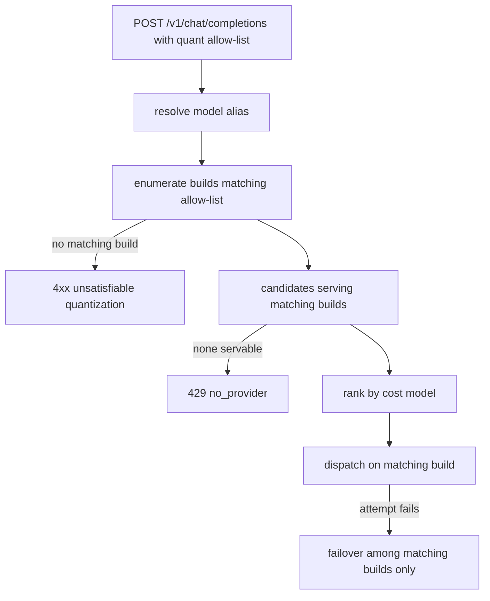

# ORP-008: Quantization-aware model selection

> Last updated: 2026-09-25 · commit `b6f9574ed`

Darkbloom hosts multiple quantization builds per model but hides them from consumers and picks one on their behalf; OpenRouter exposes a `quantizations` filter. Part of the OpenRouter-perspective review; see the [review index](../README.md).

## What

OpenRouter's `quantizations` filter lets a caller restrict routing to specific quantization levels (int4 through fp32) (OpenRouter provider routing, https://openrouter.ai/docs/features/provider-routing). Darkbloom has concrete quantization builds per model, but they are hidden from `/v1/models` unless `?include_builds=1` is passed (`coordinator/api/models_endpoints.go`, `handleListModels`), and alias resolution picks a build for the caller (`coordinator/api/consumer.go`, `resolveRequestedModel`). A consumer cannot pin a quantization or exclude one on a request.

## Why

Quality-sensitive callers cannot pin or exclude quantization levels: a request the caller wanted served by an 8-bit build can land on a 4-bit build, silently changing output quality. Callers evaluating quality/price trade-offs have no lever.

## Prompt

Add quantization-aware model selection. Goal: (1) `/v1/models` exposes build-level quantization metadata for each model in a documented field, so callers can discover available quants without an undocumented query flag; (2) a request can restrict which quantization levels are acceptable (an allow-list on the request, or a concrete build id where stable), and the scheduler only considers providers serving a matching build for the resolved model. Constraints: (1) quantization is model-build metadata, not provider identity — exposing it does not violate the privacy model; (2) trait gating and servability still fence candidates ahead of the quantization filter; (3) requests without a quant restriction resolve exactly as today via `resolveRequestedModel`; (4) if the restriction matches no servable build, fail with a clear 4xx rather than silently widening; (5) keep alias→build resolution behavior unchanged for unrestricted requests. Files to touch: `coordinator/api/models_endpoints.go` (build metadata in list responses), `coordinator/api/consumer.go` (parse the restriction, thread it into resolution and dispatch), `coordinator/registry/scheduler.go` (filter candidates by serving build), plus tests. Acceptance criteria: `/v1/models` lists quantization per build; a restricted request is served only by matching builds; an unsatisfiable restriction returns 4xx; unrestricted requests behave exactly as before.

## Workflow

1. Read `handleListModels` in `coordinator/api/models_endpoints.go` and `resolveRequestedModel` in `coordinator/api/consumer.go`; map where build/quantization metadata lives in the registry.
2. Add a documented quantization field to build entries in the `/v1/models` response.
3. Define the request-level quant restriction schema and parse it.
4. Thread the restriction through model resolution into candidate selection.
5. Filter candidates to providers serving a matching build in `coordinator/registry/scheduler.go`.
6. Map the no-matching-build case to a coordinator-authored 4xx.
7. Add unit tests: models-list metadata, restriction parse, build filtering, unsatisfiable-restriction 4xx, unrestricted regression.
8. Run `make coordinator-test`; if the UI surfaces model metadata, run `make ui-test`.

## Loop

Run `make coordinator-test` (or `go test ./coordinator/api/... ./coordinator/registry/...` while iterating); run `make ui-test` if console-ui model pages change. Check: `/v1/models` response shape tests cover the new field; scheduler tests confirm only matching builds are considered; existing alias-resolution tests pass unchanged. Definition of done: all tests green, quantization discoverable and pinnable per request, silent quant downgrade impossible when a restriction is set.

## Graph

```mermaid
flowchart LR
  C[consumer request] --> API[consumer handler]
  API --> RES[resolveRequestedModel]
  RES --> QFIL{quant restriction?}
  QFIL -->|none| TODAY[default build pick]
  QFIL -->|set| MATCH[matching builds only]
  MATCH --> SCH[scheduler candidates by build]
  TODAY --> SCH
  MODELS[/v1/models handler] --> META[build quantization metadata]
  SCH --> DISP[dispatch]
```

## Layout

- Modify `coordinator/api/models_endpoints.go` — quantization metadata in model list responses.
- Modify `coordinator/api/consumer.go` — restriction parsing and threading.
- Modify `coordinator/registry/scheduler.go` — build-based candidate filtering.
- Add/extend tests in `coordinator/api` and `coordinator/registry`.
- Optional: surface build metadata on the console-ui models page if the API shape is consumed there.

## Flow



Severity: medium · Effort: M
