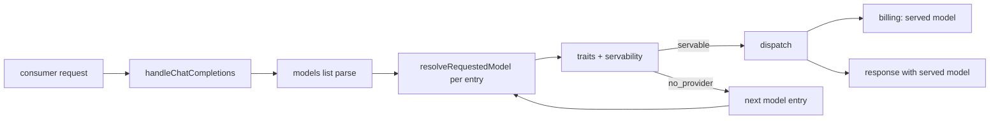

# ORP-009: Request-level `models[]` fallback list

> Last updated: 2026-09-25 · commit `b6f9574ed`

Darkbloom resolves exactly one model per request and only falls back at the operator level; OpenRouter lets a caller pass an ordered `models[]` list with `route:"fallback"`. Part of the OpenRouter-perspective review; see the [review index](../README.md).

## What

OpenRouter accepts `models:[...]` with `route:"fallback"` and tries the listed models in order when earlier ones are unavailable (OpenRouter model routing, https://openrouter.ai/docs/features/model-routing; provider routing, https://openrouter.ai/docs/features/provider-routing). Darkbloom's `handleChatCompletions` resolves a single model via `resolveRequestedModel` (`coordinator/api/consumer.go`), and the only fallback is operator-side: an alias slides to the previous build in `maybeFallbackAlias` (`coordinator/api/consumer.go`). Consumers have no request-level model list, and the public capacity API (`coordinator/api/capacity.go`, `handleModelsCapacity`; `coordinator/registry/model_capacity.go`, `ModelCapacity`) lets them check `aggregate_tps` and `estimated_ttft_ms` per model but not act on it mid-request.

## Why

A caller whose first-choice model is at capacity gets 429 `no_provider` instead of a graceful slide to their second choice. Workloads that can accept any of several models must implement client-side retry with new requests, paying queue and TTFT cost on each attempt.

## Prompt

Add a request-level model fallback list. Goal: chat/completions requests accept an ordered `models` list (alongside or instead of `model`); the coordinator resolves and attempts them in order, sliding to the next model only when the current one has no servable candidate (the `no_provider` condition), and reports which model actually served in the response. Constraints: (1) each list entry goes through the same resolution, trait gating, and servability checks as a single-model request — no bypass; (2) the slide happens only on no-capacity, not on content or provider errors, and a mid-stream failure never switches models; (3) billing meters the model that actually served; (4) `maybeFallbackAlias` behavior within each entry is unchanged; (5) response errors stay sanitized (`coordinator/api/inference_error_sanitize.go`, `sanitizeProviderInferenceError`); the served-model field names the model alias, never provider identity; (6) single-model requests behave byte-identically to today. Files to touch: `coordinator/api/consumer.go` (`handleChatCompletions` — list parsing, ordered resolution, slide loop, served-model reporting), plus tests. Acceptance criteria: a two-model list with the first at zero capacity is served by the second in one request; the response identifies the served model; a list where every model is unservable returns 429 `no_provider`; single-model requests are unchanged.

## Workflow

1. Read `handleChatCompletions` and `resolveRequestedModel` in `coordinator/api/consumer.go`; trace where `no_provider` is produced.
2. Add `models` list parsing with validation (non-empty, known aliases resolvable per entry).
3. Implement the ordered resolution loop: resolve entry, attempt dispatch, slide only on no-capacity.
4. Record the serving model on the request and include it in the response metadata.
5. Ensure reservation and billing bind to the serving entry's model and price.
6. Keep per-entry behavior (alias fallback, trait gates, hedging) identical to single-model dispatch.
7. Add unit tests: list parse/validation, ordered slide on no-capacity, no-slide on provider error, served-model reporting, billing attribution, single-model regression.
8. Run `make coordinator-test`.

## Loop

Run `make coordinator-test` (or `go test ./coordinator/api/...` while iterating). Check: slide tests pass with a capacity-zero first model; error-path tests confirm provider errors do not trigger a slide; billing tests confirm the serving model is charged; existing single-model tests pass unchanged. Definition of done: all coordinator tests green, graceful in-request slide to the caller's second choice, correct billing and served-model reporting.

## Graph



## Layout

- Modify `coordinator/api/consumer.go` — list parsing, ordered resolution, slide loop, served-model reporting.
- Add/extend tests in `coordinator/api`.
- No UI surface.

## Flow

```mermaid
flowchart TD
  A[POST /v1/chat/completions models=[m1, m2]] --> B[validate and resolve m1]
  B --> C{m1 servable?}
  C -->|yes| D[dispatch m1]
  C -->|no_provider| E[resolve m2]
  E --> F{m2 servable?}
  F -->|yes| G[dispatch m2]
  F -->|no_provider| H[429 no_provider]
  D -->|provider error mid-attempt| I[sanitized error, no slide]
  D --> J[response names m1]
  G --> K[response names m2, billed as m2]
```

Severity: medium · Effort: M
