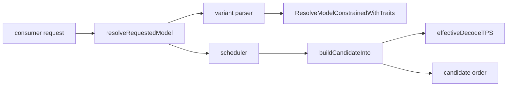
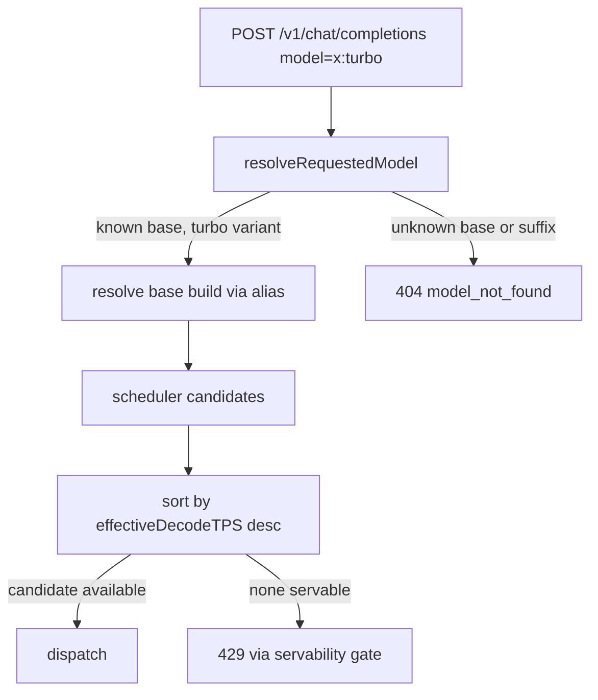

# ORP-010: Throughput-first model variant (`:nitro` analogue)

> Last updated: 2026-09-25 · commit `b6f9574ed`

Darkbloom has no way for a caller to ask for maximum raw decode throughput on a request; routing always follows the latency/queue/health-weighted cost model. Part of the OpenRouter-perspective review; see the [review index](../README.md).

## What

OpenRouter exposes routing variants as model-id suffixes, including `:nitro`, which re-sorts candidate providers by throughput and targets priority-tier endpoints (OpenRouter model variants, https://openrouter.ai/docs/guides/routing/model-variants/overview and https://openrouter.ai/docs/features/provider-routing). Darkbloom resolves every model id through `coordinator/api/consumer.go` (`resolveRequestedModel`) into `coordinator/registry` (`ResolveModelConstrainedWithTraits`), and the scheduler scores candidates with a latency/queue/health-weighted cost that has no throughput-first mode: `coordinator/registry/scheduler.go` (`buildCandidateInto`), with load-scaled decode TPS available as `effectiveDecodeTPS`. There is no suffix syntax and no sort override, so `model:turbo`-style requests are impossible.

## Why

Batch, eval, and offline-class callers care about aggregate tokens per second, not time-to-first-token. Today they cannot express that preference, so the scheduler may pick a low-latency but low-throughput candidate, and large batch jobs finish later than the fleet allows.

## Prompt

Add a throughput-first routing variant to the coordinator. Goal: a consumer can request `<model>:turbo` and the scheduler sorts eligible candidates by descending `effectiveDecodeTPS` instead of the default TTFT-weighted cost. Constraints: (1) the suffix is a routing variant, not a catalog entry — it must not appear in `/v1/models` output and must resolve to the base model's metadata; (2) unknown suffixes must still produce the existing 404 `model_not_found` behavior from `resolveRequestedModel`; (3) do not change the default candidate ordering when no suffix is present; (4) do not expose provider identity anywhere. Files to touch: `coordinator/api/consumer.go` (`resolveRequestedModel` — parse and strip the suffix, record the sort override on the request), `coordinator/registry/scheduler.go` (`buildCandidateInto` — accept a sort-mode parameter and, in throughput mode, rank by `effectiveDecodeTPS`), plus tests in the owning packages. Acceptance criteria: `POST /v1/chat/completions` with `model: "x:turbo"` routes to the highest-throughput eligible candidate; `model: "x"` behavior is byte-identical to today; `model: "x:bogus"` returns 404 `model_not_found`.

## Workflow

1. Read `resolveRequestedModel` in `coordinator/api/consumer.go` and trace how the resolved build id reaches the scheduler.
2. Define a small `RoutingVariant` type (start with `none` and `turbo`) and a parser that splits the suffix from the model id.
3. Thread the variant through the request path into the scheduler call site.
4. In `buildCandidateInto`, add a sort-mode branch that ranks by `effectiveDecodeTPS` descending when the variant is `turbo`.
5. Keep queue/health eligibility gates unchanged; only the ordering changes.
6. Add unit tests: suffix parse, throughput ordering, unknown-suffix 404, no-suffix regression.
7. Run `make coordinator-test`.

## Loop

Run `make coordinator-test` (or `go test ./coordinator/api/... ./coordinator/registry/...` while iterating). Check: new suffix tests pass; existing alias-resolution and scheduler tests pass unchanged; a request without a suffix produces the identical candidate order as before (pin with a golden test if one exists). Definition of done: all coordinator tests green, `model:turbo` orders candidates by `effectiveDecodeTPS`, unknown suffix returns 404 `model_not_found`.

## Graph

## Layout

- Modify `coordinator/api/consumer.go` — suffix parsing in `resolveRequestedModel`.
- Modify `coordinator/registry/scheduler.go` — sort-mode branch in `buildCandidateInto`.
- Add `coordinator/api/variant_parse_test.go` and extend scheduler tests.
- No UI surface.

## Flow

Severity: low · Effort: M
