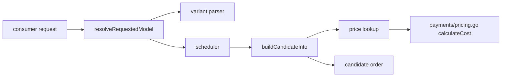
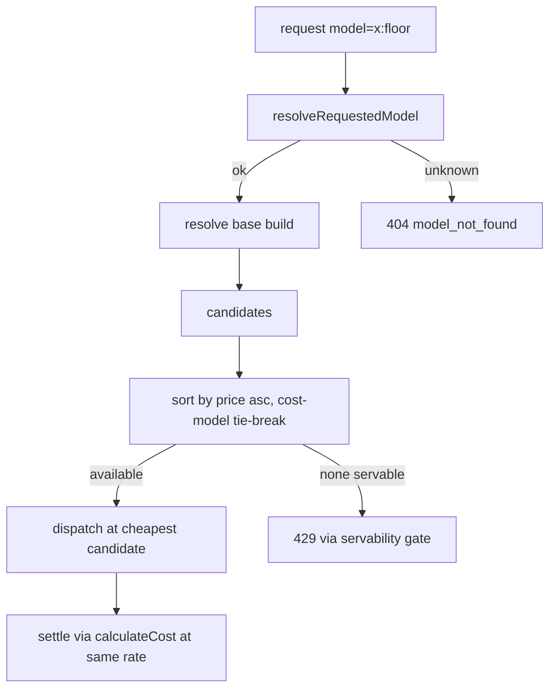

# ORP-011: Cheapest-first model variant (`:floor` analogue)

> Last updated: 2026-09-25 · commit `b6f9574ed`

Darkbloom has no per-request way to minimize cost; the scheduler's candidate scoring contains no price term at all. Part of the OpenRouter-perspective review; see the [review index](../README.md).

## What

OpenRouter's `:floor` routing variant re-sorts candidates by price and targets flex-tier endpoints (OpenRouter model variants, https://openrouter.ai/docs/guides/routing/model-variants/overview and https://openrouter.ai/docs/features/provider-routing). Darkbloom's scheduler cost model is latency/queue/health-weighted with no price input: `coordinator/registry/scheduler.go` (`buildCandidateInto`). Platform pricing is resolved only after routing, at settlement: `coordinator/payments/pricing.go` (`calculateCost`, `DefaultInputPricePerMillion`, `DefaultOutputPricePerMillion`). Because the scheduler never sees price, a `model:floor`-style suffix has nothing to sort on.

## Why

Cost-first workloads (bulk summarization, overnight batch, budget-capped agents) cannot express "cheapest acceptable provider" per request. They get whichever candidate the latency model prefers and pay its rate, with no way to trade latency for price.

## Prompt

Add a price-minimizing routing variant. Goal: `<model>:floor` sorts eligible candidates by ascending estimated per-token price before the latency cost model breaks ties. Constraints: (1) this issue depends on theme-A issue ORP-003 (a `sort=price` capability and a scheduler-visible price term); land that first or build the price term here and share it; (2) the scheduler must consume the same price source as settlement — `coordinator/payments/pricing.go` (`calculateCost`, `DefaultInputPricePerMillion`, `DefaultOutputPricePerMillion`) — so the ordering callers see matches what they are charged; (3) the suffix is a routing variant, not a catalog entry, and must not appear in `/v1/models`; (4) unknown suffixes keep the 404 `model_not_found` behavior from `coordinator/api/consumer.go` (`resolveRequestedModel`); (5) never expose provider identity. Files to touch: `coordinator/api/consumer.go` (suffix parse), `coordinator/registry/scheduler.go` (`buildCandidateInto` price sort branch), a small price-lookup seam from registry to the pricing data, and tests. Acceptance criteria: with two eligible candidates at different prices, `model:floor` picks the cheaper one; default ordering unchanged without the suffix; prices used for sorting equal settlement prices.

## Workflow

1. Confirm ORP-003 status; decide whether this issue ships its own price term or reuses ORP-003's.
2. Read `calculateCost` and the default price constants in `coordinator/payments/pricing.go`.
3. Define how a candidate's effective price is computed (per-model build rates, defaulting to `DefaultInputPricePerMillion` / `DefaultOutputPricePerMillion`).
4. Add the `floor` variant parse in `resolveRequestedModel` (shared parser with ORP-010 if landed).
5. Add a price-sort branch in `buildCandidateInto`, tie-broken by the existing cost model.
6. Unit tests: price ordering, tie-break, default regression, unknown suffix 404.
7. Run `make coordinator-test`.

## Loop

Iterate with `go test ./coordinator/registry/... ./coordinator/api/... ./coordinator/payments/...`, then `make coordinator-test`. Check: sort prices match settlement prices for the same model build (test both default and per-model rates); no-suffix candidate order is unchanged; `model:floor:bogus` resolves per the variant-resolution rules (ORP-015). Definition of done: tests green and a two-price fixture demonstrably routes `:floor` to the cheaper candidate.

## Graph

## Layout

- Modify `coordinator/api/consumer.go` — suffix parse in `resolveRequestedModel`.
- Modify `coordinator/registry/scheduler.go` — price sort in `buildCandidateInto`.
- Add a price-source seam (registry-facing read of pricing data) and tests.
- No UI surface.

## Flow

Severity: low · Effort: M
