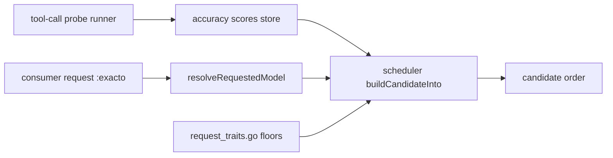
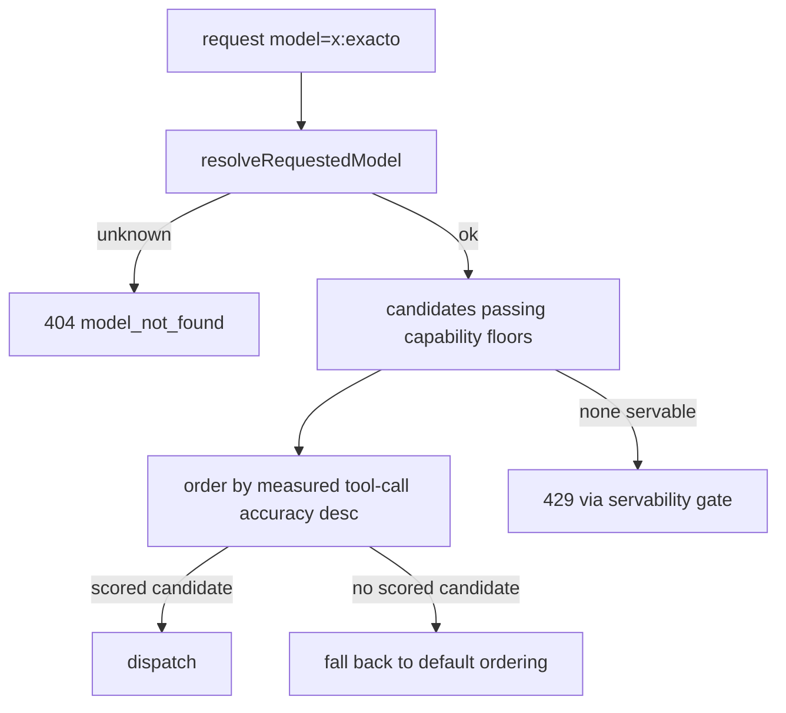

# ORP-012: Tool-calling-quality variant (`:exacto` analogue)

> Last updated: 2026-09-25 · commit `b6f9574ed`

Darkbloom gates tool-capable routing on capability floors but has no quality signal, so callers cannot steer toward providers whose builds actually call tools reliably. Part of the OpenRouter-perspective review; see the [review index](../README.md).

## What

OpenRouter's `:exacto` variant uses measured tool-calling quality signals to prefer endpoints with better tool-use accuracy (OpenRouter model variants, https://openrouter.ai/docs/guides/routing/model-variants/overview). Darkbloom's trait system knows only binary capability floors — a (provider, model) pair either meets the tool-capability floor or it is fenced: `coordinator/registry/request_traits.go`. Model aliases resolve to concrete quant builds via `coordinator/api/consumer.go` (`resolveRequestedModel`) → `coordinator/registry` (`ResolveModelConstrainedWithTraits`), and tool-call reliability varies across those quants and builds, but nothing measures or routes on it.

## Why

Agentic workloads fail silently when a build emits malformed tool calls: the request is servable, passes every capability floor, and still produces a broken tool-call stream. Callers who depend on function calling cannot ask for the builds that do it well.

## Prompt

Add a measured tool-calling-quality signal and an `:exacto`-style routing variant that prefers it. Goal: `<model>:exacto` restricts or strongly prefers candidates whose measured tool-calling accuracy exceeds a threshold. Constraints: (1) the quality signal must come from measurement, not self-report — run a small periodic tool-calling probe suite per (provider-class, model build) and store an aggregate score; individual provider identity must never be exposed to consumers, so expose the signal only as an internal routing input; (2) keep the existing capability floors in `coordinator/registry/request_traits.go` as a hard gate; the quality score only orders candidates that pass it; (3) the suffix is a routing variant, not a catalog entry; unknown suffixes keep 404 `model_not_found`; (4) probes must use negligible fleet capacity and be schedulable off-peak. Files to touch: a new probe/scoring module under `coordinator/registry/` (or a sibling package), `coordinator/api/consumer.go` (`resolveRequestedModel` suffix parse), `coordinator/registry/scheduler.go` (`buildCandidateInto` quality-preference branch), persistence for scores in `coordinator/store/`, and tests. Acceptance criteria: candidates with higher measured tool-call accuracy rank first under the variant; unrated candidates fall back to default ordering; the floor gate still fences incapable pairs; default routing unchanged.

## Workflow

1. Design the probe: a fixed set of synthetic tool-calling prompts with deterministic pass/fail grading.
2. Add a score record (per model build and provider class) to `coordinator/store/` with an aggregate accuracy value.
3. Build the probe runner that dispatches probes like ordinary requests and records results.
4. Feed scores into candidate state so `buildCandidateInto` can read them.
5. Add the `exacto` variant parse in `resolveRequestedModel` and the preference branch in the scheduler.
6. Unit tests: scoring aggregation, variant ordering, floor interaction, unrated fallback.
7. Run `make coordinator-test`, then a routingsim pass if harness fixtures cover quality ordering.

## Loop

Iterate with `go test ./coordinator/registry/... ./coordinator/api/... ./coordinator/store/...`, then `make coordinator-test`. Check: score aggregation is stable across probe runs in tests; candidates below the floor are fenced regardless of score; unrated builds are never starved (they keep default ordering); probes cannot starve real traffic (budget cap test). Definition of done: tests green, probe scores influence only the `:exacto` ordering, and no provider identity appears in any consumer-facing payload.

## Graph

## Layout

- Add `coordinator/registry/tool_quality_probes.go` — probe scheduling and grading.
- Add score persistence in `coordinator/store/`.
- Modify `coordinator/api/consumer.go` — variant parse.
- Modify `coordinator/registry/scheduler.go` — quality-preference ordering in `buildCandidateInto`.
- No UI surface.

## Flow

Severity: low · Effort: L
