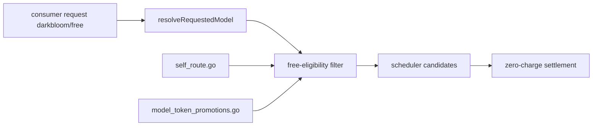
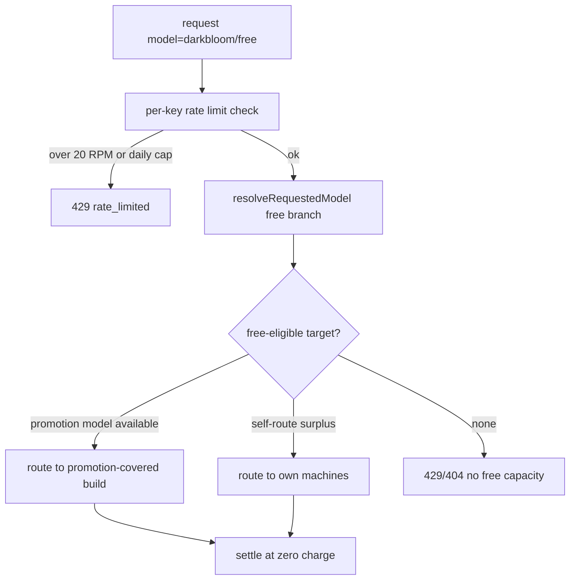

# ORP-013: Free-tier router model

> Last updated: 2026-09-25 · commit `b6f9574ed`

Darkbloom already has free-of-charge request paths, but no discoverable routable model that targets them. Part of the OpenRouter-perspective review; see the [review index](../README.md).

## What

OpenRouter offers `openrouter/free`, a router model that picks among free models only, plus per-model `:free` catalog variants, both rate-limited at 20 requests/minute plus a daily cap (OpenRouter model variants, https://openrouter.ai/docs/guides/routing/model-variants/overview and https://openrouter.ai/docs/features/provider-routing). Darkbloom's free paths exist but are invisible as a model: self-route keys settle free (`coordinator/api/self_route.go`), and claimable per-account per-model token promotions settle free (`coordinator/store/model_token_promotions.go`, `coordinator/api/model_token_*.go` handlers). Neither is reachable by naming a model; every consumer model id resolves to a priced build via `coordinator/api/consumer.go` (`resolveRequestedModel`).

## Why

Free on-ramps are the top of funnel for both sides of the marketplace: consumers try the network without a card, and providers donate surplus capacity for visibility. Because no `darkbloom/free` alias exists, a new consumer must already understand self-route keys or token promotions to make a zero-cost request — most never will.

## Prompt

Add a `darkbloom/free` router alias that routes only to zero-cost capacity. Goal: a consumer sends `model: "darkbloom/free"` and the coordinator picks an eligible free target — models covered by the caller's unclaimed or unexhausted token promotions (`coordinator/store/model_token_promotions.go`) and, for self-route keys, the caller's own surplus capacity (`coordinator/api/self_route.go`). Constraints: (1) enforce per-key rate limits comparable to OpenRouter's free tier — 20 requests/minute and a daily cap — tracked per API key; (2) the alias must appear in `/v1/models` output (it is a catalog/router entry, unlike routing suffixes) with metadata describing it as a router; (3) when no free capacity is eligible, return a clear 429 or 404-class error, never silently route to paid capacity; (4) settlement for these requests must record zero charge through the existing free paths, not a pricing special-case; (5) no provider identity exposure. Files to touch: `coordinator/api/consumer.go` (`resolveRequestedModel` router-alias branch), the model-listing handler `coordinator/api/models_endpoints.go` (`handleListModels`), a free-eligibility filter alongside the scheduler in `coordinator/registry/`, rate-limit plumbing under `coordinator/ratelimit/`, and tests. Acceptance criteria: `darkbloom/free` appears in `/v1/models`; a key with an active promotion gets routed to a promotion-covered model at zero charge; a key with no free path gets the documented error; rate limits trip at the configured thresholds.

## Workflow

1. Enumerate the zero-cost paths (self-route, token promotions) and define the eligibility predicate for the free router.
2. Register `darkbloom/free` as a router alias with catalog visibility.
3. Branch `resolveRequestedModel` to resolve the alias into a set of free-eligible concrete builds for this key.
4. Filter scheduler candidates to free-eligible targets; empty set returns the documented error.
5. Add per-key 20 RPM + daily-cap limits for the alias in `coordinator/ratelimit/`.
6. Wire `handleListModels` to include the router entry.
7. Unit tests: eligibility matrix, zero-charge settlement, rate-limit trip, catalog listing.
8. Run `make coordinator-test`.

## Loop

Iterate with `go test ./coordinator/api/... ./coordinator/registry/... ./coordinator/ratelimit/... ./coordinator/store/...`, then `make coordinator-test`. Check: settlement rows for free-router requests show zero charge through the existing self-route/promotion paths; a key past its daily cap gets 429 while its paid models still work; `/v1/models` lists the alias without leaking build or provider details. Definition of done: all coordinator tests green and the free path is end-to-end exercisable with only an API key.

## Graph

## Layout

- Modify `coordinator/api/consumer.go` — router-alias branch in `resolveRequestedModel`.
- Modify `coordinator/api/models_endpoints.go` — list the router entry.
- Add free-eligibility filtering in `coordinator/registry/`.
- Modify `coordinator/ratelimit/` — per-key free-tier limits.
- Reuse `coordinator/api/self_route.go` and `coordinator/store/model_token_promotions.go` as eligibility sources.
- No UI surface.

## Flow

Severity: medium · Effort: M
