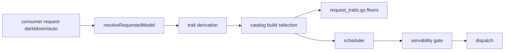
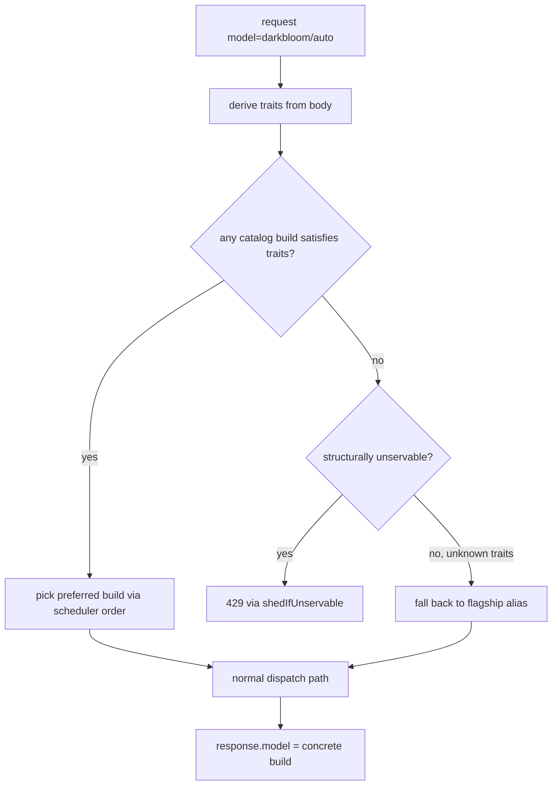

# ORP-014: `auto` smart-router model

> Last updated: 2026-09-25 · commit `b6f9574ed`

Darkbloom has no router model that picks a catalog model from request shape; callers must name a concrete alias. Part of the OpenRouter-perspective review; see the [review index](../README.md).

## What

OpenRouter's `openrouter/auto` is a smart router that chooses a model on the caller's behalf (OpenRouter model variants, https://openrouter.ai/docs/guides/routing/model-variants/overview and https://openrouter.ai/docs/features/provider-routing). Darkbloom's only built-in "router" behavior is the alias→previous-build fallback in `coordinator/api/consumer.go` (`maybeFallbackAlias`), which keeps an alias alive during a build transition — it never selects across models. Every other request resolves one requested alias to one concrete build via `resolveRequestedModel` → `coordinator/registry` (`ResolveModelConstrainedWithTraits`), with trait floors (tools, vision, context) applied per request in `coordinator/registry/request_traits.go`.

## Why

One-endpoint integrations want "best available private model" without tracking the catalog: they send tools when they have them, images when they have them, long contexts when they have them, and expect the platform to pick. Today each such integration must hardcode an alias and breaks or degrades when that build retires.

## Prompt

Add a `darkbloom/auto` router alias that selects a catalog model from request traits. Goal: `model: "darkbloom/auto"` inspects the request — presence of tools, vision inputs, required context length, requested max tokens — derives `RequestTraits`, and picks the best currently-servable catalog model whose build satisfies those traits, then routes as a normal request to that build. Constraints: (1) selection must respect the existing trait floors (`coordinator/registry/request_traits.go`) and the servability gate (`coordinator/api/servability_gate.go`, `shedIfUnservable`); a structurally unservable derived request still sheds with 429; (2) the response must name the concrete model build actually used (OpenRouter does this in `response.model`), while never exposing provider identity; (3) ranking should prefer the network's default quality/capacity order — reuse the scheduler's cost model among eligible builds rather than inventing a new one; (4) `darkbloom/auto` appears in `/v1/models` as a router entry; (5) unknown-trait requests fall back to the default flagship alias rather than erroring. Files to touch: `coordinator/api/consumer.go` (`resolveRequestedModel` auto branch), a selection helper in `coordinator/registry/` that enumerates catalog builds satisfying derived traits, `coordinator/api/models_endpoints.go` (`handleListModels` listing), and tests. Acceptance criteria: a tools request routes to a tool-capable build; a vision request to a vision-capable build; an over-long context sheds 429 via the servability gate; `response.model` names the concrete build.

## Workflow

1. Define the trait-derivation function from a parsed request body (tools, images, context tokens, max tokens).
2. Add a registry helper that lists catalog builds satisfying derived traits, ordered by the scheduler's preference.
3. Branch `resolveRequestedModel` on the `darkbloom/auto` alias into this helper.
4. Ensure the selected build flows through the normal scheduling, servability, and settlement paths unchanged.
5. Surface the chosen build in `response.model` and response metadata without provider identity.
6. List `darkbloom/auto` in `handleListModels`.
7. Unit tests: trait→build matrix, fallback to flagship alias, 429 on unservable, response model naming.
8. Run `make coordinator-test`.

## Loop

Iterate with `go test ./coordinator/api/... ./coordinator/registry/...`, then `make coordinator-test`. Check each trait combination routes to an expected build class; `maybeFallbackAlias` behavior for ordinary aliases is untouched; servability shedding still fires for derived-unservable requests. Definition of done: tests green and an integration-style test drives a tools request through `darkbloom/auto` to a tool-capable build with the concrete build named in the response.

## Graph

## Layout

- Modify `coordinator/api/consumer.go` — auto branch in `resolveRequestedModel`.
- Add a build-selection helper in `coordinator/registry/`.
- Modify `coordinator/api/models_endpoints.go` — router listing.
- Add tests in `coordinator/api/` and `coordinator/registry/`.
- No UI surface.

## Flow

Severity: low · Effort: L
