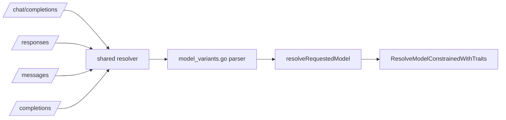
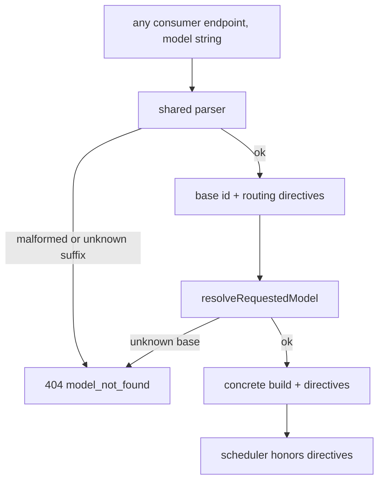

# ORP-015: Variant resolution and 404 semantics

> Last updated: 2026-09-25 · commit `b6f9574ed`

Once suffix variants exist, Darkbloom needs one pinned resolution rule set; today there is no spec, so every endpoint will drift its own suffix handling. Part of the OpenRouter-perspective review; see the [review index](../README.md).

## What

OpenRouter's rule is precise: strip routing variants (`:nitro`, `:floor`, `:exacto`), keep catalog variants (`:free`, `:batch` — own `/models` entries), last sort variant wins, and an unknown catalog suffix returns 404 on lookup (OpenRouter model variants, https://openrouter.ai/docs/guides/routing/model-variants/overview). Darkbloom resolves model ids in one function — `coordinator/api/consumer.go` (`resolveRequestedModel`) → `coordinator/registry` (`ResolveModelConstrainedWithTraits`), unknown model → 404 `model_not_found` — but serves four consumer endpoints (`/v1/chat/completions`, `/v1/responses`, `/v1/messages`, `/v1/completions`), and concrete builds are hidden unless `?include_builds=1` (`coordinator/api/models_endpoints.go`, `handleListModels`). Without a written rule, each endpoint's pre-processing can come to treat `:` suffixes differently.

## Why

Suffix handling that drifts between endpoints is a correctness and security surface: a variant honored on chat completions but silently ignored on messages, or a build-id suffix accepted on one path and 404'd on another, gives callers unverifiable behavior and gives attackers a probe surface for catalog internals.

## Prompt

Specify and centralize variant resolution. Goal: one shared resolver, called by all four consumer endpoints, implementing: (1) parse `model` into base id + ordered suffix list; (2) strip routing variants (throughput, floor, exacto class) and record them as routing directives on the request; (3) keep catalog variants as part of the lookup id (they are distinct catalog entries); (4) last sort variant wins when several combine; (5) unknown catalog suffix → 404 `model_not_found` from `resolveRequestedModel`; (6) unknown routing variant → 404 as well, since silently ignoring a directive is worse than failing. Constraints: do not change behavior for ids without suffixes; do not expose concrete builds in errors beyond what `?include_builds=1` already reveals; the resolution table lives in one file with tests, documented in the consumer API reference. Files to touch: a new `coordinator/api/model_variants.go` with the parser and classification tables, `coordinator/api/consumer.go` (`resolveRequestedModel` calls it), the `/v1/responses`, `/v1/messages`, `/v1/completions` handlers to route through the same resolver, `docs/reference/api-contracts.md` for the documented semantics, and tests. Acceptance criteria: all four endpoints resolve identical model strings identically; each rule above has a dedicated test; the docs page describes the exact grammar and 404 behavior.

## Workflow

1. Write the grammar and classification table (routing vs catalog variants) as the spec, in the new file's package docs.
2. Implement the parser: split, classify, validate, produce base id + directives.
3. Wire `resolveRequestedModel` to the parser.
4. Audit the other three consumer endpoints; route their model resolution through the same function.
5. Add per-rule unit tests, including combination order and unknown-suffix 404.
6. Add an endpoint-parity test feeding identical model strings to all four handlers.
7. Document the semantics in `docs/reference/api-contracts.md`.
8. Run `make coordinator-test` and `make docs-check`.

## Loop

Iterate with `go test ./coordinator/api/...`, then `make coordinator-test` and `make docs-check`. Check: the parity test proves identical resolution across endpoints; unsuffixed ids resolve byte-identically to before; every error path returns the existing 404 `model_not_found` shape. Definition of done: tests and docs-check green, single resolver in use on all four endpoints, semantics documented.

## Graph

## Layout

- Add `coordinator/api/model_variants.go` — parser + classification tables.
- Add `coordinator/api/model_variants_test.go` — per-rule tests.
- Modify `coordinator/api/consumer.go` — `resolveRequestedModel` uses the parser.
- Modify the responses/messages/completions handlers to share resolution.
- Modify `docs/reference/api-contracts.md` — documented grammar and 404s.
- No UI surface.

## Flow

Severity: low · Effort: S
