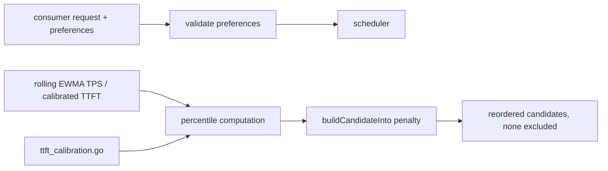
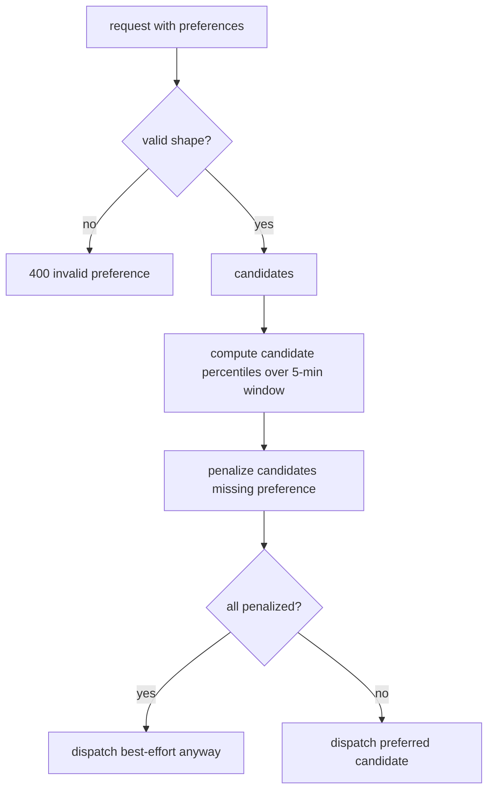

# ORP-016: Percentile-based soft preferences (`preferred_min_throughput` / `preferred_max_latency`)

> Last updated: 2026-09-25 · commit `b6f9574ed`

Darkbloom callers cannot express "fast if possible" as a soft routing preference; the only speed knobs are hard gates or nothing. Part of the OpenRouter-perspective review; see the [review index](../README.md).

## What

OpenRouter accepts `preferred_min_throughput` and `preferred_max_latency` on requests, each a number or a p50/p75/p90/p99 percentile object evaluated over a rolling 5-minute window, and treats them as deprioritize-only — candidates below the preference sink in the ordering but are never excluded (https://openrouter.ai/docs/features/provider-routing). Darkbloom's scheduler already tracks the raw material: EWMA decode TPS and load-scaled `effectiveDecodeTPS`, plus calibrated TTFT in `coordinator/registry/ttft_calibration.go`, scored in `coordinator/registry/scheduler.go` (`buildCandidateInto`). Public per-model capacity (`coordinator/registry/model_capacity.go`, `ModelCapacity` with `aggregate_tps`, `estimated_ttft_ms`) confirms the stats exist. But there is no request field that feeds them back into ordering as a soft preference.

## Why

Latency-sensitive-but-tolerant workloads (interactive chat with a fallback renderer, prefetch agents) want "fast if possible" without the brittleness of a hard gate that 429s during a fleet-wide slow minute. Without soft preferences they either accept arbitrary ordering or over-constrain and shed load they would have accepted.

## Prompt

Add soft routing preferences to the consumer request schema. Goal: a request may carry `preferred_min_throughput` and `preferred_max_latency`, each either a number (tokens/s, ms) or a percentile object (`{"p90": ...}`); the scheduler computes the referenced percentile of each candidate's rolling-window stats (EWMA TPS, calibrated TTFT from `coordinator/registry/ttft_calibration.go`) and applies a monotone penalty in `buildCandidateInto` for candidates below the preference — never excluding them. Constraints: (1) deprioritize-only: an empty-after-penalty candidate set must still dispatch, preferences only reorder; (2) percentile evaluation uses a rolling 5-minute window consistent with the stats the registry already maintains — do not add a second stats pipeline; (3) invalid preference shapes return a 400 validation error, they do not silently no-op; (4) preferences interact predictably with variant suffixes (ORP-010/011): suffix picks the sort key, preferences penalize within it; (5) no provider identity exposure. Files to touch: request types in `coordinator/api/types/`, `coordinator/api/consumer.go` (parse + validate), `coordinator/registry/scheduler.go` (penalty term in `buildCandidateInto`), percentile computation over existing rolling stats, and tests. Acceptance criteria: a preference demonstrably reorders a two-candidate fixture; a preference no candidate meets still dispatches; malformed preference → 400.

## Workflow

1. Add the preference fields to the consumer request types with strict validation.
2. Decide the penalty function (e.g. multiplicative cost bump scaled by shortfall) and document it.
3. Expose per-candidate rolling percentile values from the stats the registry already keeps.
4. Apply the penalty in `buildCandidateInto` behind a nil-check so default routing is unchanged.
5. Wire parse + validation in `consumer.go`.
6. Unit tests: reorder, never-exclude, invalid-shape 400, percentile math, interaction with variant sorts.
7. Run `make coordinator-test`; add a routingsim fixture if the harness supports preference fields.

## Loop

Iterate with `go test ./coordinator/registry/... ./coordinator/api/...`, then `make coordinator-test`. Check: with preferences absent, candidate ordering is bit-identical to today; the never-exclude invariant holds even when every candidate misses the preference; percentile windows roll correctly in time-based tests. Definition of done: tests green, penalty documented, preferences reorder but never gate.

## Graph

## Layout

- Modify `coordinator/api/types/` — request preference fields.
- Modify `coordinator/api/consumer.go` — parse + validate.
- Modify `coordinator/registry/scheduler.go` — penalty in `buildCandidateInto`.
- Reuse `coordinator/registry/ttft_calibration.go` stats; add percentile helper in `coordinator/registry/`.
- No UI surface.

## Flow

Severity: medium · Effort: M
