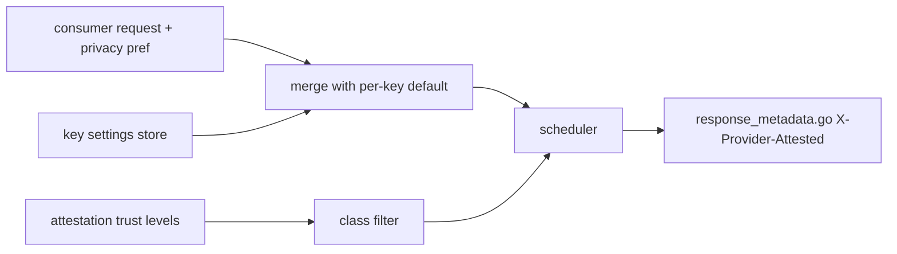
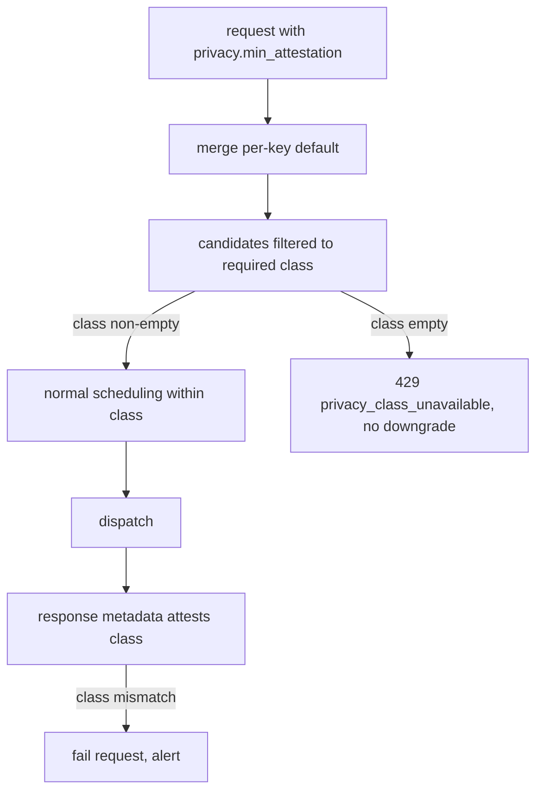

# ORP-017: Consumer data-collection / privacy routing preference

> Last updated: 2026-09-25 · commit `b6f9574ed`

Darkbloom's privacy posture is expressed through attestation trust levels, but consumers have no per-request way to demand the strongest class. Part of the OpenRouter-perspective review; see the [review index](../README.md).

## What

OpenRouter lets a caller set `data_collection: "deny"` (or `zdr`) to exclude providers that train on request data (https://openrouter.ai/docs/features/provider-routing). Darkbloom's analogue is not a training-policy flag — the network's privacy guarantee is attestation-based: providers carry trust levels and responses surface verification metadata via `X-Provider-Attested` headers (`coordinator/api/response_metadata.go`). Routing today does not let a consumer restrict candidates by attestation class; any eligible candidate in `coordinator/registry/scheduler.go` (`buildCandidateInto`) may serve the request regardless of its trust level.

## Why

Privacy is the product. A consumer whose data policy requires the strongest-attested execution (for example regulated workloads) currently cannot express that per request; they either trust the default pool or self-route. This is the single most on-brand parity gap with OpenRouter's `data_collection: "deny"`.

## Prompt

Add a request-level privacy routing preference and a per-key default. Goal: a request may declare a minimum attestation class (name it after Darkbloom's trust-level vocabulary, e.g. `privacy: {"min_attestation": "highest"}`), and the scheduler restricts eligible candidates to providers in that class; a per-API-key default applies when the request omits it. Constraints: (1) the mapping is class-based, never identity-based — consumers select attestation classes, never providers; (2) when no candidate in the required class is available, return a clear error (429 with a privacy-class reason), do not silently downgrade; a downgrade must require an explicit request-level opt-in; (3) the per-key default lives with the other key settings and is settable via the existing key-management API and console UI; (4) response metadata (`coordinator/api/response_metadata.go`) continues to report the actual attestation class so callers can verify the guarantee was met; (5) keep the feature honest: only classes the attestation pipeline actually verifies are selectable. Files to touch: request types in `coordinator/api/types/`, `coordinator/api/consumer.go` (parse + key-default merge), `coordinator/registry/scheduler.go` (class filter ahead of `buildCandidateInto`), key settings storage in `coordinator/store/`, the console-ui API-keys settings panel, and tests. Acceptance criteria: a request with the preference only routes to candidates in the named class; empty class → documented error, no downgrade; key default applies and is overridable per request; the attestation class in response metadata matches the requirement.

## Workflow

1. Enumerate the attestation classes the pipeline verifies and define the selectable set.
2. Add the request field with validation in `coordinator/api/types/`.
3. Add the per-key default column/setting in `coordinator/store/` and key-management handlers.
4. Merge request field over key default in `consumer.go`.
5. Filter scheduler candidates by class before scoring; empty set → typed error.
6. Verify response metadata reports actual class; add a mismatch guard in tests.
7. Add the setting to the console-ui API-keys panel.
8. Run `make coordinator-test`, `make ui`.

## Loop

Iterate with `go test ./coordinator/api/... ./coordinator/registry/... ./coordinator/store/...`, then `make coordinator-test`, plus `make ui-lint && make ui-test` for the console change. Check: no-downgrade invariant under an empty class; key-default precedence (request > key > none); metadata honesty. Definition of done: coordinator and UI tests green, class restriction end-to-end from request to candidate filter to response metadata.

## Graph

## Layout

- Modify `coordinator/api/types/` — privacy preference field.
- Modify `coordinator/api/consumer.go` — parse + default merge.
- Modify `coordinator/registry/scheduler.go` — class filter.
- Modify `coordinator/store/` — per-key default.
- Modify `console-ui/src/components/api-keys/` — default setting UI.
- Modify `docs/reference/api-contracts.md` — field semantics.

## Flow

Severity: medium · Effort: M
