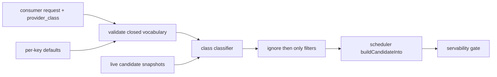
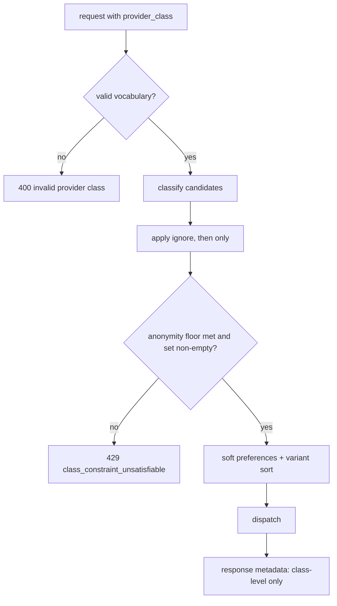

# ORP-018: Privacy-preserving provider-class `only`/`ignore`

> Last updated: 2026-09-25 · commit `b6f9574ed`

OpenRouter's `only`/`ignore` route by provider slug; Darkbloom cannot expose provider identity, so the parity feature must be allow/deny by provider class. Part of the OpenRouter-perspective review; see the [review index](../README.md).

## What

OpenRouter's provider routing accepts `only` and `ignore` lists of provider slugs (https://openrouter.ai/docs/features/provider-routing). Darkbloom's consumer surface deliberately never names providers — concrete quant builds are even hidden unless `?include_builds=1` (`coordinator/api/models_endpoints.go`, `handleListModels`) — so slug-based selection is off the table by design. The equivalent capability is allow/deny over privacy-preserving provider classes: chip family, attestation level, region, and the caller's own self-route machines (`coordinator/api/self_route.go`). The scheduler (`coordinator/registry/scheduler.go`, `buildCandidateInto`) currently has no class-based allow/deny input; candidates are filtered only by capability floors (`coordinator/registry/request_traits.go`) and servability (`coordinator/api/servability_gate.go`, `shedIfUnservable`).

## Why

Enterprise callers need compliance-shaped routing — "only attested classes X and Y", "never region Z", "prefer my own machines first" — without deanonymizing the fleet. Without class-based `only`/`ignore`, the only escape hatch is self-routing everything, which forfeits network capacity.

## Prompt

Add class-based `only`/`ignore` routing constraints. Goal: a request (and optionally a per-key default) may carry `provider_class: {"only": [...], "ignore": [...]}` where entries come from a closed, privacy-preserving class vocabulary: chip family, attestation level, region, and `self` (the caller's own self-route machines). The scheduler intersects `only` and subtracts `ignore` before scoring in `buildCandidateInto`. Constraints: (1) the class vocabulary is closed and documented; unknown class values → 400, never a silent no-op; (2) classes must be coarse enough that they cannot identify an individual provider — reject or merge any class whose live membership falls below a minimum anonymity set (e.g. fewer than N providers) by treating it as unsatisfiable rather than routing to a pinpointed target; (3) unlike the soft preferences in ORP-016, `only`/`ignore` are hard filters — an empty result returns 429 with a class-constraint reason, consistent with the servability gate's shape; (4) `only` and `ignore` combine with the privacy preference (ORP-017) and variant suffixes without contradiction — define precedence: `ignore` first, then `only`, then soft preferences, then variant sort; (5) never echo class membership details in errors. Files to touch: request types in `coordinator/api/types/`, `coordinator/api/consumer.go` (parse, validate, key-default merge), a class-classification helper in `coordinator/registry/`, `coordinator/registry/scheduler.go` (filter ahead of `buildCandidateInto`), `docs/reference/api-contracts.md`, and tests. Acceptance criteria: class filters demonstrably restrict the candidate set; unknown class → 400; empty-after-filter → documented 429; anonymity-set floor enforced in tests.

## Workflow

1. Define the closed class vocabulary and the anonymity-set floor.
2. Add request fields + validation in `coordinator/api/types/`.
3. Build the class classifier in `coordinator/registry/` mapping live candidates to classes.
4. Apply `ignore` then `only` filters in the scheduler before scoring.
5. Wire parse/validate/default-merge in `consumer.go`.
6. Add the empty-set 429 with a non-identifying reason.
7. Unit tests: filter matrix, precedence with ORP-016/017, unknown class 400, anonymity floor, error shapes.
8. Document the vocabulary in `docs/reference/api-contracts.md`; run `make coordinator-test` and `make docs-check`.

## Loop

Iterate with `go test ./coordinator/api/... ./coordinator/registry/...`, then `make coordinator-test` and `make docs-check`. Check: filters compose with variant sorts and soft preferences in the pinned precedence order; no error or log path reveals which providers belong to a class; anonymity-floor classes are unsatisfiable, not pinpointing. Definition of done: tests and docs-check green, vocabulary documented, privacy invariants covered by tests.

## Graph

## Layout

- Modify `coordinator/api/types/` — `provider_class` field.
- Modify `coordinator/api/consumer.go` — parse/validate/default merge.
- Add `coordinator/registry/provider_classes.go` — classification + anonymity floor.
- Modify `coordinator/registry/scheduler.go` — filters ahead of `buildCandidateInto`.
- Modify `docs/reference/api-contracts.md` — vocabulary + error shapes.
- No UI surface (per-key defaults can reuse the ORP-017 key-settings panel when it lands).

## Flow

Severity: medium · Effort: M
