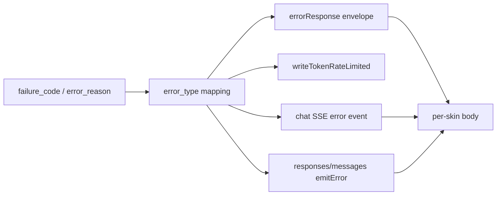
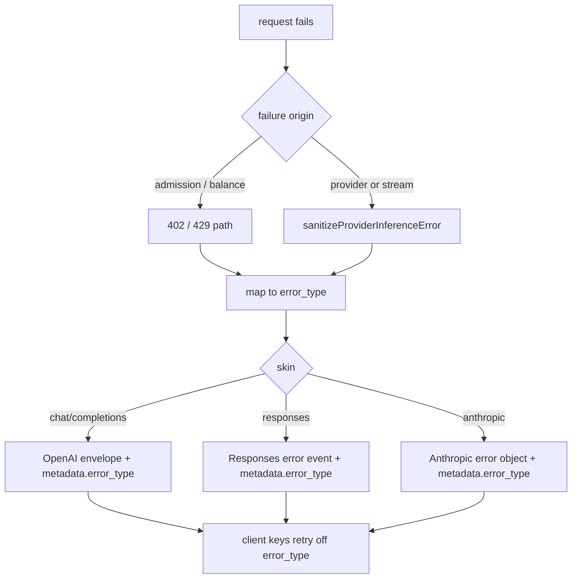

# ORP-019: Stable typed `error.metadata.error_type` across all three API skins

> Last updated: 2026-09-25 · commit `b6f9574ed`

Darkbloom classifies provider failures into closed vocabularies internally but never surfaces one stable typed error value in the consumer response body, and each API skin renders errors differently. Part of the OpenRouter-perspective review; see the [review index](../README.md).

## What

OpenRouter attaches a stable typed `error.metadata.error_type` (`rate_limit_exceeded`, `provider_overloaded`, `provider_unavailable`, `content_policy_violation`, `refusal`, `context_length_exceeded`, …) that is consistent across the Chat, Responses, and Anthropic skins via per-skin translation tables (OpenRouter errors, https://openrouter.ai/docs/api-reference/errors). Darkbloom already maintains the equivalent closed vocabularies at the sanitization boundary — `failure_code` (invalid_request, invalid_media, media_too_large, unsupported_media, template_render, model_unavailable, capacity, cancelled, encryption_failure, internal_failure, generation_failure) and `error_reason` (client_error, provider_error, capacity_timeout, queue_full, token_budget_exhaust, deadline_unreachable, draining, …) in `coordinator/api/inference_error_sanitize.go` (`sanitizeProviderInferenceError`), with `terminal_cause` in `coordinator/api/terminal_cause.go` — but the consumer body carries only the OpenAI-compatible `{"error":{"type","message","code","param?"}}` envelope from `coordinator/api/httputil.go` (`errorResponse`), where `code` defaults to `type` and `type` is a free-form per-call-site string. The four skins share handlers — `handleChatCompletions`, `handleCompletions`/`handleGenericInference`, `handleAnthropicMessages` in `coordinator/api/consumer.go` — yet emit skin-specific error shapes.

## Why

Client SDK retry and failover logic keys off stable error types. Without a single typed value, every integrator parses free-text `type` strings that differ per skin, and any rewording of a message silently breaks their error handling.

## Prompt

Add a single coordinator-authored `error_type` enum to the consumer error surface, derived from the existing closed vocabularies and rendered identically in meaning (per-skin in shape) across all four API skins. Goal: every error response body — non-streaming, pre-stream, and mid-stream SSE — carries `error.metadata.error_type` from a documented closed enum (e.g. `invalid_request`, `context_length_exceeded`, `rate_limit_exceeded`, `insufficient_funds`, `provider_overloaded`, `provider_unavailable`, `content_policy_violation` reserved per ORP-027, `internal_error`), mapped from `failure_code`/`error_reason` at the sanitization boundary. Constraints: (1) the enum is coordinator-authored; provider error prose and provider identity never cross (see `sanitizeProviderInferenceError`); (2) each skin keeps its outer shape — OpenAI envelope for chat/completions, the Responses error event, the Anthropic error object — with the same `error_type` value inside `metadata`; (3) `error_type` is additive: existing `type`/`message`/`code` fields stay byte-compatible for current clients; (4) the mapping table lives in one file with a test pinning every enum value. Files to touch: `coordinator/api/inference_error_sanitize.go` (mapping), `coordinator/api/httputil.go` (`errorResponse` metadata), `coordinator/api/chat_metadata_stream.go` and `coordinator/api/consumer_stream.go` (SSE error events), plus tests. Acceptance criteria: the same underlying failure yields the same `error_type` on `/v1/chat/completions`, `/v1/responses`, `/v1/completions`, and `/v1/messages`; the enum is exhaustive over `failure_code` × HTTP status class.

## Workflow

1. Read `sanitizeProviderInferenceError` and `safeInferenceFailureStatus` in `coordinator/api/inference_error_sanitize.go` to enumerate the closed vocabularies and status mapping.
2. Define the `error_type` enum and the mapping from (`failure_code`, `error_reason`, HTTP status) to `error_type` in a new small file, e.g. `coordinator/api/consumer_error_type.go`.
3. Extend `errorResponse` in `coordinator/api/httputil.go` to accept and emit `metadata.error_type`.
4. Thread the mapped value through the non-streaming error paths in `coordinator/api/consumer.go` and the rate-limit path `writeTokenRateLimited` in `coordinator/api/server.go`.
5. Emit the same value in mid-stream error events: `writeChatStreamTerminalError` (`coordinator/api/chat_metadata_stream.go`) and the emitters in `coordinator/api/consumer_stream.go` / `coordinator/api/generic_endpoint_stream.go`.
6. Add per-skin translation tests asserting identical `error_type` for the same failure across all four skins.
7. Pin the full enum in a test so additions are deliberate.
8. Run `make coordinator-test`.

## Loop

Run `make coordinator-test` (or `go test ./coordinator/api/...` while iterating). Check: mapping is exhaustive over `failure_code` and the 402/429 paths; all four skins emit identical `error_type` for a shared failure; existing error-shape tests still pass unchanged apart from the additive field; no provider-authored string appears in any new field. Definition of done: coordinator tests green, one enum, one mapping file, per-skin parity tests green.

## Graph

## Layout

- Create `coordinator/api/consumer_error_type.go` — enum plus mapping from closed vocabularies.
- Modify `coordinator/api/httputil.go` — `errorResponse` emits `metadata.error_type`.
- Modify `coordinator/api/inference_error_sanitize.go` — attach mapped type at the sanitization boundary.
- Modify `coordinator/api/server.go` — `writeTokenRateLimited` carries the typed value.
- Modify `coordinator/api/chat_metadata_stream.go`, `coordinator/api/consumer_stream.go`, `coordinator/api/generic_endpoint_stream.go` — SSE error events carry the typed value.
- Add tests in `coordinator/api` pinning the enum and per-skin parity.
- No UI surface.

## Flow

Severity: medium · Effort: M
