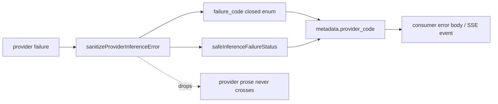
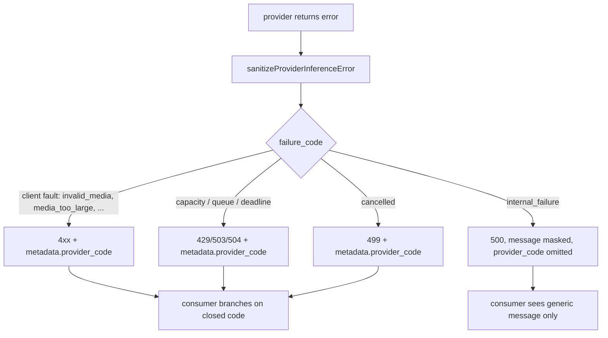

# ORP-020: Bounded provider-error metadata passthrough

> Last updated: 2026-09-25 · commit `b6f9574ed`

Darkbloom knows precisely why a provider failed but tells the consumer only a generic message. Part of the OpenRouter-perspective review; see the [review index](../README.md).

## What

OpenRouter returns `error.metadata.provider_code` carrying the upstream error code, and omits it on 500s where the message is masked to a generic string (OpenRouter errors, https://openrouter.ai/docs/api-reference/errors). Darkbloom already classifies every provider failure into a closed vocabulary — `failure_code` with values invalid_request, invalid_media, media_too_large, unsupported_media, template_render, model_unavailable, capacity, cancelled, encryption_failure, internal_failure, generation_failure — at the sanitization boundary in `coordinator/api/inference_error_sanitize.go` (`sanitizeProviderInferenceError`), with the HTTP status derived centrally by `safeInferenceFailureStatus` in the same file. The consumer, however, receives only the generic envelope message (for example "inference generation failed") from `coordinator/api/httputil.go` (`errorResponse`); the classified `failure_code` never crosses into the response body. The privacy-safe passthrough is to surface the already-sanitized `failure_code` — a closed enum — as `metadata.provider_code`, never provider prose, never provider identity.

## Why

A consumer cannot tell "my image was too large" (`media_too_large`, fix the request) from "the provider died" (`generation_failure`, retry) without opening a support ticket — even though the coordinator already knows the answer.

## Prompt

Surface the already-sanitized `failure_code` to consumers as `error.metadata.provider_code` on inference-failure responses. Goal: every provider-originated failure body (non-streaming and mid-stream SSE error events) carries `metadata.provider_code` set to the closed `failure_code` value, so clients can branch on it programmatically. Constraints: (1) only the closed vocabulary crosses — `failure_code` values exactly as defined in `sanitizeProviderInferenceError`; provider-authored strings, paths, prompt fragments, and provider identity are never emitted; (2) on 500-class internal failures, follow the OpenRouter convention and omit `provider_code`, keeping the message masked; (3) the field is additive and does not change existing `type`/`message`/`code` values; (4) keep the mapping in one place so the vocabulary stays closed — a test must pin the full value set. Files to touch: `coordinator/api/inference_error_sanitize.go` (expose the code alongside the sanitized status), `coordinator/api/httputil.go` (`errorResponse` metadata), `coordinator/api/chat_metadata_stream.go` and `coordinator/api/consumer_stream.go` (SSE error events), plus tests. Acceptance criteria: a `media_too_large` failure returns HTTP 413 with `metadata.provider_code: "media_too_large"`; an internal failure returns 500 with no `provider_code`; no response ever contains a provider-authored string.

## Workflow

1. Read `sanitizeProviderInferenceError` and `safeInferenceFailureStatus` in `coordinator/api/inference_error_sanitize.go` to see where `failure_code` is produced and where it is dropped.
2. Extend the sanitized error struct to carry the `failure_code` value through to the response writers.
3. Extend `errorResponse` in `coordinator/api/httputil.go` to render `metadata.provider_code` when present.
4. Emit the same field in mid-stream error events via `writeChatStreamTerminalError` (`coordinator/api/chat_metadata_stream.go`) and the emitters in `coordinator/api/consumer_stream.go` / `coordinator/api/generic_endpoint_stream.go`.
5. Omit the field on 500-class failures, mirroring OpenRouter's masking rule.
6. Add a test pinning the closed vocabulary and asserting no other string can reach `provider_code`.
7. Add per-skin tests: same failure, same `provider_code` on all four skins.
8. Run `make coordinator-test`.

## Loop

Run `make coordinator-test` (or `go test ./coordinator/api/...` while iterating). Check: each `failure_code` value maps to the status from `safeInferenceFailureStatus` and appears verbatim in `metadata.provider_code`; 500s omit it; a deliberately hostile provider message cannot leak into the field (fuzz a provider error string through `sanitizeProviderInferenceError`). Definition of done: tests green, vocabulary pinned, zero provider prose in any consumer body.

## Graph

## Layout

- Modify `coordinator/api/inference_error_sanitize.go` — carry `failure_code` through the sanitized error.
- Modify `coordinator/api/httputil.go` — `errorResponse` renders `metadata.provider_code`.
- Modify `coordinator/api/chat_metadata_stream.go`, `coordinator/api/consumer_stream.go`, `coordinator/api/generic_endpoint_stream.go` — SSE error events carry the field.
- Add tests in `coordinator/api` pinning the vocabulary and the 500-omission rule.
- No UI surface.

## Flow

Severity: medium · Effort: M
