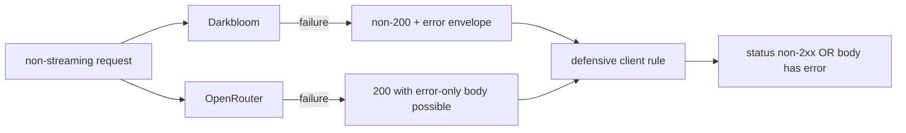
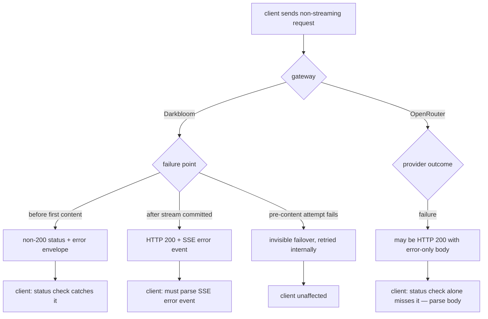

# ORP-021: Non-streaming error-body convention parity

> Last updated: 2026-09-25 · commit `b6f9574ed`

Darkbloom signals non-streaming provider failure with proper HTTP status codes, while OpenRouter can return HTTP 200 with an error-only body; SDKs shared between the two can silently mis-handle one side. Part of the OpenRouter-perspective review; see the [review index](../README.md).

## What

OpenRouter may answer a non-streaming request whose provider failed with HTTP 200 and a body containing only an `error` object (OpenRouter errors, https://openrouter.ai/docs/api-reference/errors). Darkbloom takes the stricter convention: the status is derived centrally from the failure class by `safeInferenceFailureStatus` in `coordinator/api/inference_error_sanitize.go` (400/413/415/422 client faults, 429 queue-full, 503 capacity, 504 deadline, 502 encryption/disconnect, 499 cancel, 500 internal) and the body is the OpenAI-compatible `{"error":{"type","message","code","param?"}}` envelope from `coordinator/api/httputil.go` (`errorResponse`). One caveat on Darkbloom's side: deferred commit in `coordinator/api/consumer.go` means no HTTP status is written until first content, so pre-content failover is invisible and a failure discovered only after streaming has begun is delivered in-band as an SSE error event with HTTP 200 already committed. This is a documentation and client-guidance issue, not a code change: document the deliberate divergence and the "check the body even on 200" hazard for dual-integration users.

## Why

An integration ported from OpenRouter that checks only for an error-shaped body, or one ported to OpenRouter that checks only the status code, silently misses failures on the other platform. Silent divergence in error conventions turns real failures into empty completions.

## Prompt

Write consumer-facing documentation that pins Darkbloom's non-streaming error convention and gives explicit dual-integration guidance. Goal: a developer integrating both Darkbloom and OpenRouter behind one client knows exactly how failure is signalled on each side. Content requirements: (1) state that Darkbloom always uses a non-200 status for non-streaming failures, with the full status table as implemented by `safeInferenceFailureStatus`; (2) state the mid-stream exception — once streaming commits HTTP 200, terminal failure arrives as an SSE `data: {"error":{message,type}}` event (`writeChatStreamTerminalError`, `coordinator/api/chat_metadata_stream.go`; Responses skin `emitter.emitError`, `coordinator/api/consumer_stream.go`); (3) state that OpenRouter may return 200 with an error-only body even for non-streaming requests, and that Darkbloom deliberately does not; (4) give a defensive client rule: treat a response as failed if the status is non-2xx OR the parsed body contains a top-level `error`; (5) note that pre-content failover is invisible to the client (deferred commit) so no error is surfaced for attempts that fail before first content. Constraints: docs-only change; no behavior change; follow the docs rules in `docs/AGENTS.md` (cite symbols, no line numbers, freshness stamp via `make docs-stamp`). Files to touch: a consumer how-to such as `docs/consumer/error-handling.md` (create), its entry in `docs/consumer/README.md`, and `docs/reference/api-contracts.md` (error-convention table). Acceptance criteria: `make docs-check` passes; the page names every status class; the dual-integration rule is stated verbatim.

## Workflow

1. Read `safeInferenceFailureStatus` in `coordinator/api/inference_error_sanitize.go` and transcribe the exact status mapping.
2. Read the deferred-commit machinery in `coordinator/api/consumer.go` to describe accurately when a non-200 can no longer be sent.
3. Draft `docs/consumer/error-handling.md` following the how-to skeleton in `docs/AGENTS.md` §3.
4. Add the error-convention table to `docs/reference/api-contracts.md`.
5. Add the defensive client rule and the OpenRouter divergence note with the docs URL.
6. Index the new page from `docs/consumer/README.md` with a one-line description.
7. Run `make docs-stamp FILES="docs/consumer/error-handling.md"` and `make docs-check`.

## Loop

Run `make docs-check` and re-run it after each edit until clean. Check: every cited path and symbol exists; relative links resolve; the status table matches `safeInferenceFailureStatus` value for value; the freshness stamp is present on the new page. Definition of done: docs lint green and a reviewer can derive correct dual-integration error handling from the new page alone.

## Graph

## Layout

- Create `docs/consumer/error-handling.md` — the error-handling how-to with the divergence note and client rule.
- Modify `docs/consumer/README.md` — index entry.
- Modify `docs/reference/api-contracts.md` — error-convention status table.
- No coordinator code changes. No UI surface.

## Flow

Severity: low · Effort: S
