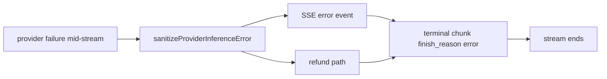
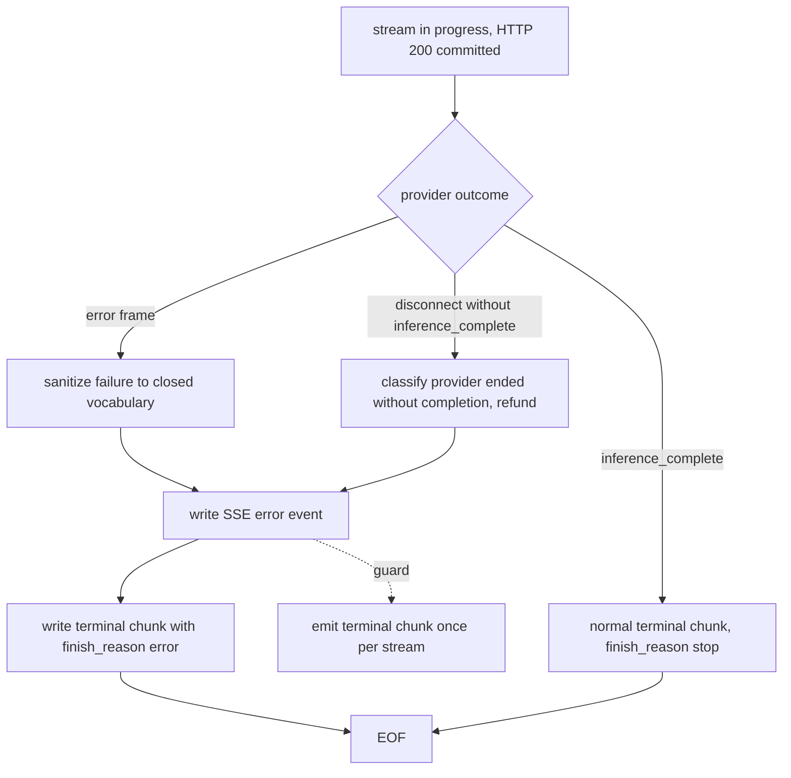

# ORP-022: `finish_reason:"error"` on terminal SSE chunks

> Last updated: 2026-09-25 · commit `b6f9574ed`

A failed Darkbloom stream ends with an in-band error event and no terminal chunk carrying `finish_reason:"error"`, so SDKs that detect failure only via the final chunk see a clean stop. Part of the OpenRouter-perspective review; see the [review index](../README.md).

## What

OpenRouter delivers a mid-stream failure as an SSE chunk with a top-level `error` and `finish_reason:"error"`; the HTTP status stays 200 (OpenRouter errors, https://openrouter.ai/docs/api-reference/errors). Darkbloom delivers the failure as an SSE `data: {"error":{message,type}}` event via `writeChatStreamTerminalError` in `coordinator/api/chat_metadata_stream.go` (Responses skin: `emitter.emitError` in `coordinator/api/consumer_stream.go`; completions and Anthropic skins: the emitters in `coordinator/api/generic_endpoint_stream.go`) — and then the stream just ends. No terminal chunk with `finish_reason:"error"` is emitted. A stream that dies without `inference_complete` is classified internally as "provider ended without completion" with a refund (`coordinator/api/consumer_stream.go`), but the consumer-visible wire shape carries no finish-reason signal.

## Why

Several OpenAI-compatible SDKs surface stream failure only through `finish_reason`. A Darkbloom stream that failed mid-generation looks to those SDKs like a clean early stop, so truncated output is delivered to end users as if it were complete.

## Prompt

Emit a terminal SSE chunk carrying `finish_reason:"error"` after every mid-stream error event, on every skin. Goal: after the existing error event, the coordinator writes one final chunk in the skin's native shape whose finish reason is `error`, then terminates the stream. Constraints: (1) the error event itself is unchanged — closed vocabulary only, no provider prose (boundary: `sanitizeProviderInferenceError`, `coordinator/api/inference_error_sanitize.go`); (2) the terminal chunk matches each skin's schema — a chat-completions chunk with `choices[0].finish_reason: "error"` and empty delta, the Responses terminal event with the equivalent failure status, an Anthropic `message_stop`-shaped terminal carrying the error indication that skin supports; (3) do not emit `finish_reason:"error"` on the "provider ended without completion" refund path twice — the terminal chunk is emitted exactly once per failed stream; (4) successful streams are byte-identical to today. Files to touch: `coordinator/api/chat_metadata_stream.go` (`writeChatStreamTerminalError`), `coordinator/api/consumer_stream.go` (`emitter.emitError` call sites), `coordinator/api/generic_endpoint_stream.go` (`completionsStreamEmitter.emitError`, `messagesStreamEmitter.emitError`), plus tests. Acceptance criteria: a mid-stream failure on each of the four skins produces error event → terminal chunk with error finish reason → EOF, in that order; a successful stream is unchanged; existing stream tests pass apart from the added terminal chunk on failure paths.

## Workflow

1. Read `writeChatStreamTerminalError` in `coordinator/api/chat_metadata_stream.go` and the three emitters in `coordinator/api/consumer_stream.go` / `coordinator/api/generic_endpoint_stream.go` to enumerate every mid-stream error call site.
2. Define a per-skin `emitTerminalErrorChunk` helper that writes the final chunk with the error finish reason.
3. Call it immediately after each error event, guarding against double emission on the refund path.
4. For the chat skin, emit a chunk with an empty `delta` and `choices[0].finish_reason = "error"`.
5. For the Responses skin, emit the skin's terminal failure event.
6. For the Anthropic skin, emit the closest terminal shape the skin supports and document the mapping.
7. Add stream-order tests per skin: error event precedes terminal chunk precedes EOF.
8. Add a regression test that a successful stream has no error finish reason.
9. Run `make coordinator-test`.

## Loop

Run `make coordinator-test` (or `go test ./coordinator/api/...` while iterating). Check: per-skin tests assert the exact chunk sequence on failure; success-path streams are byte-identical; the refund path ("provider ended without completion") emits the terminal chunk exactly once. Definition of done: all four skins signal failure through finish reason, tests green, no success-path change.

## Graph

## Layout

- Modify `coordinator/api/chat_metadata_stream.go` — terminal error chunk for the chat skin.
- Modify `coordinator/api/consumer_stream.go` — Responses skin terminal event and refund-path single emission.
- Modify `coordinator/api/generic_endpoint_stream.go` — completions and Anthropic skin terminal chunks.
- Add stream-order tests in `coordinator/api`.
- No UI surface.

## Flow

Severity: medium · Effort: S
