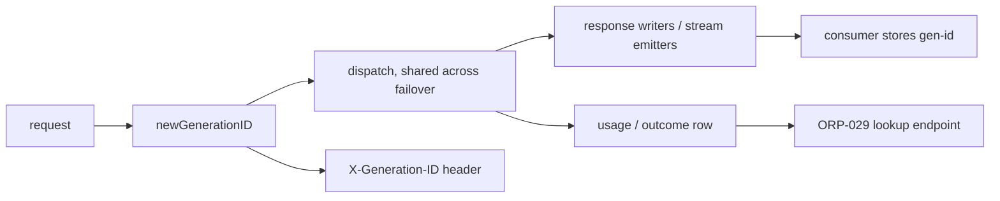
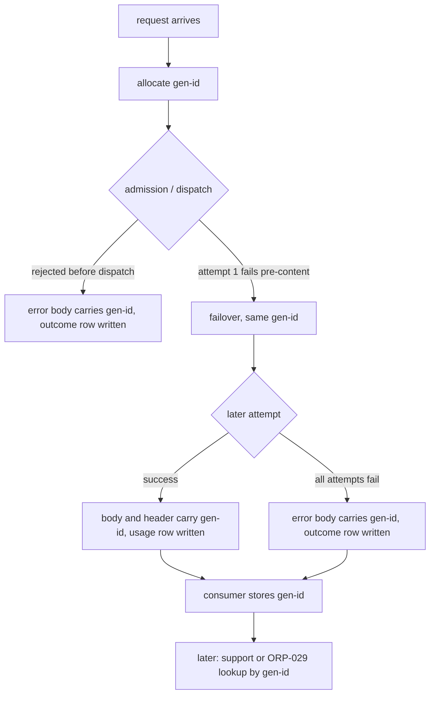

# ORP-023: Queryable generation IDs on every response

> Last updated: 2026-09-25 · commit `b6f9574ed`

Darkbloom tags requests with `X-Request-ID` but returns no per-generation identifier in the response body that a consumer can query after the fact. Part of the OpenRouter-perspective review; see the [review index](../README.md).

## What

OpenRouter assigns every generation a `gen-…` id, returned in the response body, that is queryable later via `GET /api/v1/generation?id=` (OpenRouter errors, https://openrouter.ai/docs/api-reference/errors). Darkbloom sets `X-Request-ID` on responses in `coordinator/api/response_metadata.go`, but that ID is a header only: it does not appear in the response body, is not persisted against the usage record in a consumer-queryable way, and there is no per-generation lookup endpoint. The usage and refund machinery (for example the "provider ended without completion" refund path in `coordinator/api/consumer_stream.go`) records outcomes internally without an identifier the caller can cite.

## Why

"What happened to request X" is unanswerable for consumers today. Support tickets, refund disputes, and client-side reconciliation all depend on an ID the caller can store at response time and query later; a header that is not tied to a lookup surface does not serve that need.

## Prompt

Add a coordinator-issued `gen-…` generation ID to every inference response and persist it with the usage row so a later lookup endpoint (ORP-029) can key off it. Goal: every non-streaming response body, and the final chunk of every stream on every skin, carries `id` (or a `generation_id` field where the skin's `id` slot is taken) with value `gen-<random>`; the same value is written to the usage/billing record for the request and echoed in a response header for clients that do not parse bodies. Constraints: (1) the ID is coordinator-authored — random, unguessable, and free of provider identity and request content; (2) the ID is allocated once per request, before dispatch, and survives pre-content failover (deferred commit in `coordinator/api/consumer.go` means retried attempts share one generation ID); (3) failed requests that reached dispatch also get an ID and a persisted outcome row, so error responses can cite it; (4) existing skin-level `id` fields keep their current semantics — add a distinct field rather than repurposing one where a conflict exists. Files to touch: `coordinator/api/consumer.go` (allocate and thread the ID), `coordinator/api/response_metadata.go` (header), the response writers and stream emitters (`coordinator/api/chat_metadata_stream.go`, `coordinator/api/consumer_stream.go`, `coordinator/api/generic_endpoint_stream.go`), and the usage-record write path, plus tests. Acceptance criteria: a successful response and a failed-after-dispatch response both carry the same shape of `gen-…` ID; the ID in the body matches the ID persisted with the usage row; streams expose it in the final chunk.

## Workflow

1. Read `coordinator/api/response_metadata.go` to see how `X-Request-ID` is generated and decide whether the generation ID reuses or replaces that value.
2. Add a `newGenerationID()` helper producing `gen-` plus a cryptographically random suffix.
3. Allocate the ID at the top of `handleChatCompletions` and `handleGenericInference` in `coordinator/api/consumer.go`, before admission.
4. Thread the ID through dispatch so all failover attempts of one request share it.
5. Emit the ID in each skin's response writer and in the terminal stream chunk per skin.
6. Persist the ID on the usage/outcome record in the store write path, including failure and refund outcomes.
7. Add an `X-Generation-ID` response header alongside the body field.
8. Add tests: ID present on success, on pre-stream failure, on mid-stream failure; body ID equals persisted ID.
9. Run `make coordinator-test`.

## Loop

Run `make coordinator-test` (or `go test ./coordinator/api/... ./coordinator/store/...` while iterating). Check: ID format is `gen-` prefixed and unique per request; the same ID appears in body, header, and usage row; failover does not mint new IDs; failed requests leave a queryable outcome row. Definition of done: tests green and a support flow can take a `gen-…` ID from a client and find exactly one outcome record.

## Graph

## Layout

- Modify `coordinator/api/consumer.go` — allocate the generation ID per request, thread through dispatch.
- Modify `coordinator/api/response_metadata.go` — emit `X-Generation-ID`.
- Modify `coordinator/api/chat_metadata_stream.go`, `coordinator/api/consumer_stream.go`, `coordinator/api/generic_endpoint_stream.go` — ID in terminal chunks.
- Modify the store usage/outcome write path — persist the ID with the row.
- Add tests in `coordinator/api` and the store package.
- No UI surface.

## Flow

Severity: medium · Effort: M
