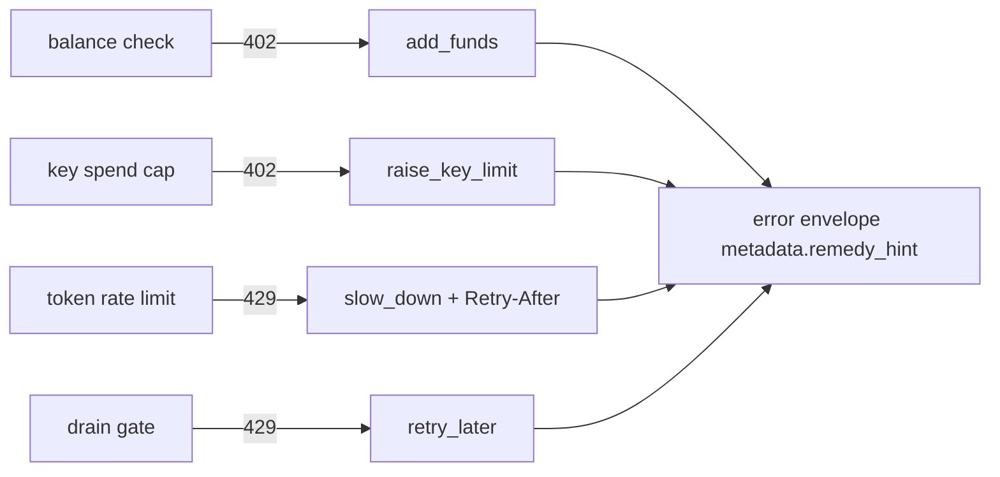
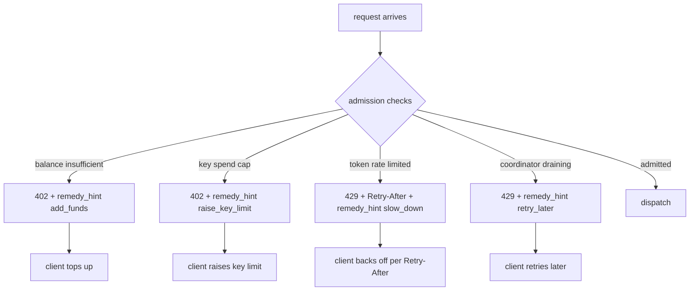

# ORP-024: `metadata.remedy_hint` on 402/429

> Last updated: 2026-09-25 · commit `b6f9574ed`

Darkbloom's limit errors tell the caller that it was rejected but not what action would unblock it. Part of the OpenRouter-perspective review; see the [review index](../README.md).

## What

OpenRouter attaches a machine-readable `remedy_hint` to limit errors so a client can programmatically decide what to do next (OpenRouter errors, https://openrouter.ai/docs/api-reference/errors). Darkbloom's limit responses carry no remedy field: the 429 family is written by `writeTokenRateLimited` in `coordinator/api/server.go` (with the drain-gate reusing it in `coordinator/api/drain.go`), and the 402 insufficient-funds rejection is written from the admission path in `coordinator/api/inference_admission.go` (`reserveInferenceBalance`). The body is the standard OpenAI-compatible envelope from `coordinator/api/httputil.go` (`errorResponse`); nothing in it distinguishes "top up", "slow down", or "switch model".

## Why

An agent hitting a limit cannot programmatically choose between topping up, backing off, or switching to a cheaper model; it must either hard-code a guess per status code or surface an opaque failure to its operator.

## Prompt

Add a coordinator-authored `metadata.remedy_hint` field to 402 and 429 responses, drawn from a closed enum. Goal: every limit rejection carries a machine-readable remedy: 402 balance exhaustion → `add_funds`; per-key spend-cap 402 → `raise_key_limit`; token-rate 429 → `slow_down` (with the existing `Retry-After` staying authoritative for timing); coordinator drain 429 → `retry_later`. Constraints: (1) the enum is closed and coordinator-authored — no provider strings, no provider identity; (2) the hint is advisory metadata, additive to the existing envelope; `Retry-After` semantics are unchanged; (3) the mapping from rejection site to hint lives in one place with a test pinning it; (4) hints must never contradict the status: a 402 never suggests `slow_down`. Files to touch: `coordinator/api/server.go` (`writeTokenRateLimited` gains a remedy parameter), `coordinator/api/drain.go` (drain rejections pass `retry_later`), `coordinator/api/inference_admission.go` (`reserveInferenceBalance` passes the balance/key-cap hint — see ORP-025 for the distinction), `coordinator/api/httputil.go` (`errorResponse` renders the metadata), plus tests. Acceptance criteria: each rejection site emits exactly one hint from the closed enum; a test enumerates every 402/429 call site and asserts a hint is present.

## Workflow

1. Read `writeTokenRateLimited` in `coordinator/api/server.go` and its call sites, plus the drain-gate reuse in `coordinator/api/drain.go`.
2. Read `reserveInferenceBalance` in `coordinator/api/inference_admission.go` to find the 402 write sites.
3. Define the closed `remedy_hint` enum and the per-site mapping.
4. Extend `errorResponse` in `coordinator/api/httputil.go` to render `metadata.remedy_hint`.
5. Thread the hint through `writeTokenRateLimited`, the drain gate, and the admission rejections.
6. Add tests asserting the hint value per call site and pinning the enum.
7. Run `make coordinator-test`.

## Loop

Run `make coordinator-test` (or `go test ./coordinator/api/...` while iterating). Check: every 402/429 response in the test suite now carries a hint; the enum test fails if a new value is added without updating the mapping; `Retry-After` values are unchanged. Definition of done: tests green and a client can branch on `remedy_hint` alone to pick its recovery action.

## Graph

## Layout

- Modify `coordinator/api/server.go` — `writeTokenRateLimited` carries the remedy hint.
- Modify `coordinator/api/drain.go` — drain rejections pass `retry_later`.
- Modify `coordinator/api/inference_admission.go` — 402 rejections carry the balance or key-cap hint.
- Modify `coordinator/api/httputil.go` — envelope renders `metadata.remedy_hint`.
- Add tests in `coordinator/api` pinning the enum and per-site mapping.
- No UI surface.

## Flow

Severity: low · Effort: S
