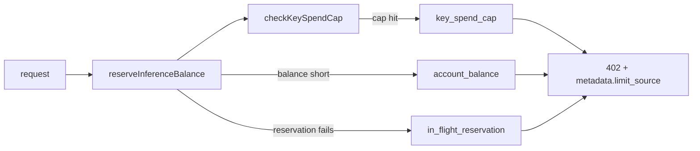
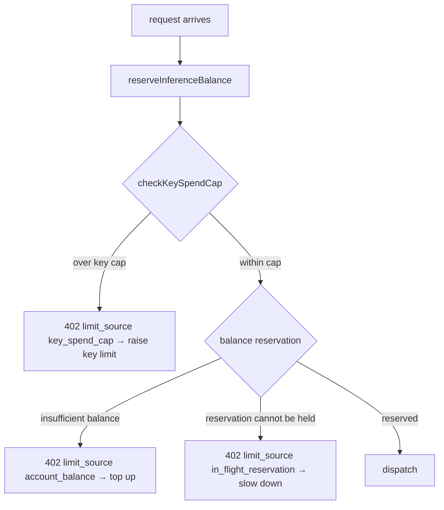

# ORP-025: `metadata.limit_source` on 402

> Last updated: 2026-09-25 · commit `b6f9574ed`

Darkbloom has several distinct ways to reject a request for lack of funds, but the 402 body does not say which one fired. Part of the OpenRouter-perspective review; see the [review index](../README.md).

## What

OpenRouter's 402 responses carry `metadata.limit_source` (for example `openrouter_in_flight_budget`, `openrouter_key_limit`, `openrouter_credits`) alongside `Retry-After` and a remedy hint (OpenRouter errors, https://openrouter.ai/docs/api-reference/errors). Darkbloom checks at least three distinct funding conditions in the admission path — account balance reservation in `reserveInferenceBalance` (`coordinator/api/inference_admission.go`), the per-key spend cap in `checkKeySpendCap` (`coordinator/api/apikey_handlers.go`), and the in-flight reservation itself — but all of them surface as the same `insufficient_funds` 402 envelope from `coordinator/api/httputil.go` (`errorResponse`).

## Why

A caller hitting its per-key spend cap should raise the key limit, not top up the account; a caller with an exhausted balance must top up. Today both rejections look identical, so automated funding logic tops up accounts that were never the problem.

## Prompt

Distinguish the 402 sources with a coordinator-authored `metadata.limit_source` field. Goal: every 402 from the admission path carries `metadata.limit_source` from a closed enum — `account_balance` (reservation against the account balance failed), `key_spend_cap` (`checkKeySpendCap` rejected), `in_flight_reservation` (the reservation itself could not be held). Constraints: (1) closed coordinator-authored enum only — no account figures, no key metadata beyond the caller's own key, no provider data; (2) the field is additive; status, `type`, and message are unchanged; (3) pair each source with the matching `remedy_hint` from ORP-024 (`add_funds` vs `raise_key_limit` vs `slow_down`) — implement together if ORP-024 is not yet landed; (4) a test enumerates every 402 call site and asserts both fields are present and consistent. Files to touch: `coordinator/api/inference_admission.go` (`reserveInferenceBalance` rejection sites), `coordinator/api/apikey_handlers.go` (`checkKeySpendCap` result plumbing), `coordinator/api/httputil.go` (`errorResponse` metadata), plus tests. Acceptance criteria: each of the three funding rejections yields a distinct `limit_source`; a caller can programmatically route `account_balance` to a top-up flow and `key_spend_cap` to a key-settings flow.

## Workflow

1. Read `reserveInferenceBalance` in `coordinator/api/inference_admission.go` and enumerate its rejection sites.
2. Read `checkKeySpendCap` in `coordinator/api/apikey_handlers.go` to see how its rejection reaches the response writer.
3. Define the closed `limit_source` enum with the three values.
4. Thread the source from each rejection site into `errorResponse` metadata in `coordinator/api/httputil.go`.
5. Align each source with the ORP-024 `remedy_hint` mapping.
6. Add tests: one per rejection source, asserting status 402, `limit_source`, and the paired hint.
7. Run `make coordinator-test`.

## Loop

Run `make coordinator-test` (or `go test ./coordinator/api/...` while iterating). Check: a balance-exhausted account and a key-capped key on a funded account produce different `limit_source` values in tests; no new information about account state leaks beyond the closed enum. Definition of done: tests green, three sources distinguishable, enum pinned.

## Graph

## Layout

- Modify `coordinator/api/inference_admission.go` — tag each 402 rejection with its source.
- Modify `coordinator/api/apikey_handlers.go` — plumb the key-cap source through.
- Modify `coordinator/api/httputil.go` — envelope renders `metadata.limit_source`.
- Add tests in `coordinator/api` for each rejection source.
- No UI surface.

## Flow

Severity: low · Effort: S
