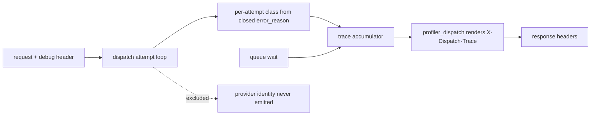
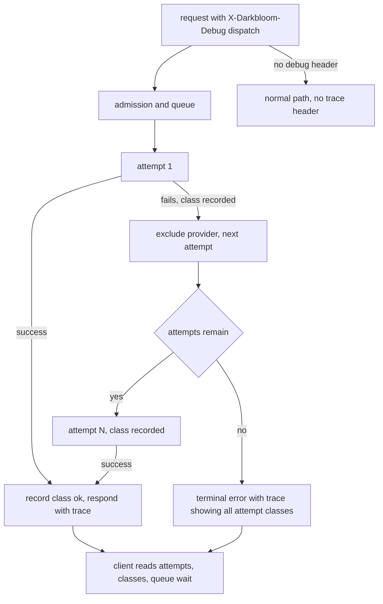

# ORP-026: Opt-in sanitized dispatch trace

> Last updated: 2026-09-25 · commit `b6f9574ed`

Darkbloom exposes aggregate request timing but nothing about what happened inside dispatch — how many attempts ran, why each failed, or how long the request queued. Part of the OpenRouter-perspective review; see the [review index](../README.md).

## What

OpenRouter offers `debug.echo_upstream_body` and experimental pipeline metadata for debugging routing behavior (OpenRouter errors, https://openrouter.ai/docs/api-reference/errors). Darkbloom's dispatch internals are rich: the attempt loop in `coordinator/api/dispatch.go` retries across providers with an `excludeProviders` set, pre-content failover is invisible because no status is written until first content (`coordinator/api/consumer.go`, held-boilerplate machinery), and queueing waits are tracked internally. The only consumer-visible decomposition is the `X-Timing` header (`coordinator/api/profiler_dispatch.go`). Nothing exposes per-attempt structure. The privacy-safe version is an opt-in, coordinator-authored trace: attempt count, failover class per attempt (from the closed `error_reason` vocabulary in `coordinator/api/inference_error_sanitize.go`), and queue wait — never provider identity, never provider strings.

## Why

Integrators debugging tail latency have only aggregate timing. They cannot tell "my request queued behind a busy fleet" from "three providers failed before one answered", so they cannot tune timeouts or decide whether to report a capacity problem.

## Prompt

Add an opt-in response header carrying a sanitized dispatch trace. Goal: when the request carries a debug header (for example `X-Darkbloom-Debug: dispatch`), the response includes `X-Dispatch-Trace` with a compact coordinator-authored summary: `attempts=N`, a per-attempt failover class drawn from the closed `error_reason` vocabulary (client_error, provider_error, capacity_timeout, queue_full, token_budget_exhaust, deadline_unreachable, draining, …), and queue wait in milliseconds. Constraints: (1) the trace contains only counts, closed-vocabulary classes, and durations — no provider serials, no provider names, no model-routing internals that reveal fleet composition, no request content; (2) opt-in only: absent the header, responses are byte-identical to today; (3) the trace is built alongside the existing `X-Timing` plumbing in `coordinator/api/profiler_dispatch.go` so it adds no work when disabled; (4) cap the per-attempt list length (for example 8 entries) so a pathological retry storm cannot bloat headers. Files to touch: `coordinator/api/dispatch.go` (record per-attempt class during the attempt loop), `coordinator/api/profiler_dispatch.go` (render the header), `coordinator/api/consumer.go` (parse the opt-in header, thread the flag), plus tests. Acceptance criteria: a request that fails over twice returns a trace with three attempts and the correct class per attempt; a request without the debug header returns no trace; no provider-identifying string appears in the header.

## Workflow

1. Read the attempt loop and `excludeProviders` bookkeeping in `coordinator/api/dispatch.go` to find where each attempt's outcome is known.
2. Read `coordinator/api/profiler_dispatch.go` to see how `X-Timing` values are accumulated and rendered.
3. Define the trace format (attempt count, ordered per-attempt classes, queue wait) with a length cap.
4. Record each attempt's closed `error_reason` class in the dispatch state as attempts resolve.
5. Parse the opt-in header in `handleChatCompletions` and `handleGenericInference` and thread the flag into dispatch.
6. Render `X-Dispatch-Trace` in the profiler header writer only when opted in.
7. Add tests: failover sequence produces the expected class list; opt-out produces no header; cap enforced.
8. Run `make coordinator-test`.

## Loop

Run `make coordinator-test` (or `go test ./coordinator/api/...` while iterating). Check: trace classes come only from the closed `error_reason` vocabulary; opt-out requests show no behavioral or byte-level change; a simulated multi-attempt failover yields the exact expected trace; no provider ID appears anywhere in the header (grep the test response). Definition of done: tests green, trace opt-in, vocabulary closed, cap enforced.

## Graph

## Layout

- Modify `coordinator/api/dispatch.go` — record per-attempt failover class.
- Modify `coordinator/api/profiler_dispatch.go` — render `X-Dispatch-Trace` when opted in.
- Modify `coordinator/api/consumer.go` — parse the opt-in header and thread the flag.
- Add tests in `coordinator/api` for trace content, opt-out, and cap.
- No UI surface.

## Flow

Severity: low · Effort: M
