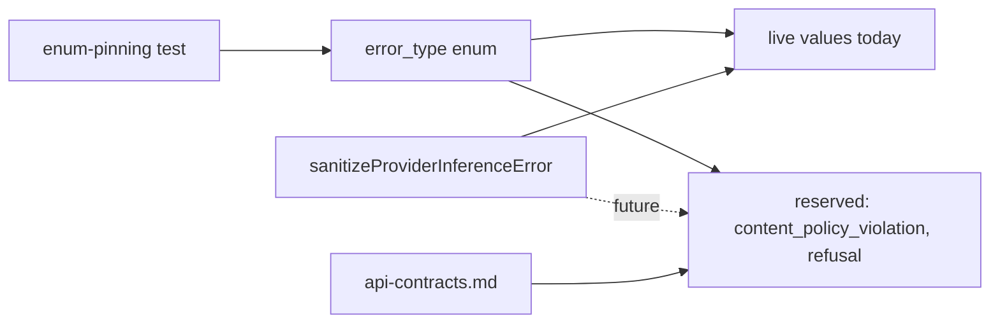
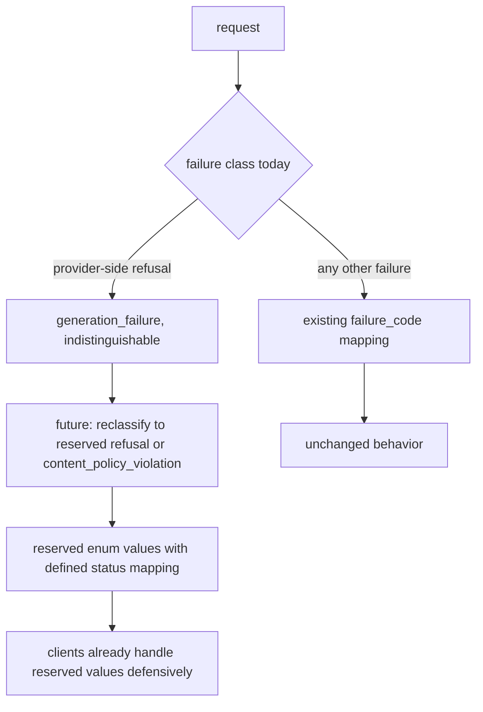

# ORP-027: Moderation/policy error taxonomy reservation

> Last updated: 2026-09-25 · commit `b6f9574ed`

Darkbloom has no moderation layer and no reserved error vocabulary for one, so a future policy layer would have to fork the error taxonomy after clients have already coded against it. Part of the OpenRouter-perspective review; see the [review index](../README.md).

## What

OpenRouter's typed error vocabulary includes `content_policy_violation` and `refusal` with structured metadata, reserved as first-class error types (OpenRouter errors, https://openrouter.ai/docs/api-reference/errors). Darkbloom's closed `failure_code` vocabulary in `coordinator/api/inference_error_sanitize.go` (`sanitizeProviderInferenceError`) — invalid_request, invalid_media, media_too_large, unsupported_media, template_render, model_unavailable, capacity, cancelled, encryption_failure, internal_failure, generation_failure — has no moderation or refusal value. There is no moderation endpoint (`/v1/moderations` is not implemented; see the route table in `coordinator/api/server.go`), and a provider-side model refusal today is indistinguishable from any other generation failure: it surfaces either as ordinary streamed content or under the catch-all `generation_failure`. Status mapping in `safeInferenceFailureStatus` (same file) likewise has no policy class.

## Why

Retrofitting error vocabularies breaks clients: once integrators key retry logic off the ORP-019 `error_type` enum, adding policy values later is a breaking change to their switch statements. Reserving the values and the HTTP mapping now is nearly free and keeps a future moderation layer from forking the taxonomy.

## Prompt

Reserve the moderation/policy error types in the consumer-facing taxonomy without building a moderation layer. Goal: (1) the ORP-019 `error_type` enum (or, if ORP-019 has not landed, a documented reservation in the sanitization boundary) includes `content_policy_violation` and `refusal` as reserved values with a defined HTTP mapping (400-class for input policy violations, 200-with-`finish_reason:"error"`-style in-band signalling for mid-stream refusals, per the ORP-022 convention); (2) the sanitization boundary in `sanitizeProviderInferenceError` documents that provider-side refusals currently collapse into `generation_failure` and must be reclassified when a moderation layer lands; (3) client-facing docs state the reservation so integrators can write forward-compatible handling. Constraints: no detection logic, no provider changes, no endpoint additions — this is a taxonomy reservation only; reserved values must never be emitted by current code paths (a test asserts this); privacy rule holds: any future policy metadata is coordinator-authored, never provider prose. Files to touch: the `error_type` mapping (ORP-019) or `coordinator/api/inference_error_sanitize.go` (reservation comment and vocabulary note), the enum-pinning test, and `docs/reference/api-contracts.md` (reserved values). Acceptance criteria: the reserved values are documented with their intended status mapping; a test proves no current path can emit them; docs tell integrators to handle them defensively.

## Workflow

1. Read `sanitizeProviderInferenceError` and `safeInferenceFailureStatus` in `coordinator/api/inference_error_sanitize.go` to confirm no policy class exists.
2. Decide the carrier: the ORP-019 `error_type` enum if landed, otherwise a reservation note at the sanitization boundary.
3. Define the reserved values and their intended HTTP mapping (400-class input violation; in-band terminal error for mid-stream refusal).
4. Add the reserved values to the enum-pinning test with an assertion that current code never emits them.
5. Document the reservation and forward-compatible handling guidance in `docs/reference/api-contracts.md`.
6. Record the policy stance: provider-side refusals are `generation_failure` today and will be reclassified, not relabeled retroactively.
7. Run `make coordinator-test` and `make docs-check`.

## Loop

Run `make coordinator-test` and `make docs-check`. Check: the enum test pins the reserved values; the no-emission test fails if any code path starts emitting them without updating the mapping; docs lint passes and the reserved values appear in the error reference. Definition of done: reservation documented and pinned, zero behavior change.

## Graph

## Layout

- Modify the ORP-019 `error_type` mapping (or `coordinator/api/inference_error_sanitize.go` if ORP-019 is unlanded) — reserve the two policy values.
- Modify the enum-pinning test in `coordinator/api` — assert reservation and non-emission.
- Modify `docs/reference/api-contracts.md` — document reserved values and handling guidance.
- No coordinator behavior changes. No UI surface.

## Flow

Severity: low · Effort: S
