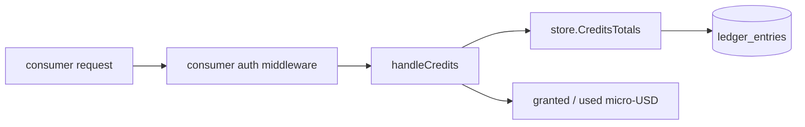
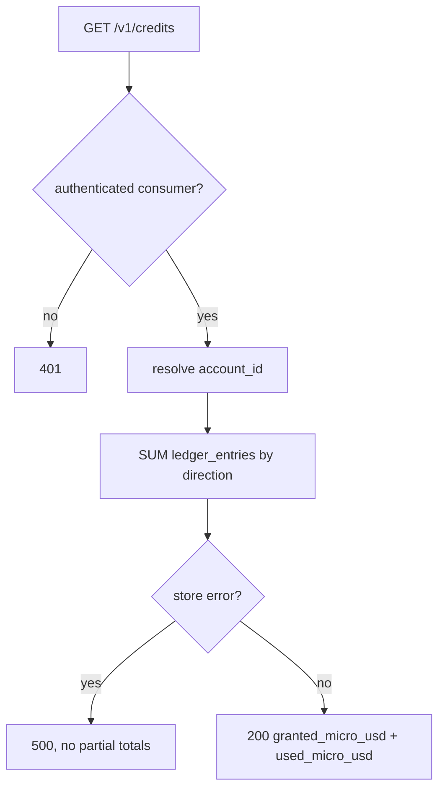

# ORP-028: `GET /v1/credits` (granted vs used)

> Last updated: 2026-09-25 · commit `b6f9574ed`

Darkbloom's balance endpoint reports only current balances, with no lifetime-granted vs lifetime-used split. Part of the OpenRouter-perspective review; see the [review index](../README.md).

## What

OpenRouter exposes `GET /api/v1/credits` returning `{total_credits, total_usage}` — lifetime credits granted versus lifetime credits consumed (OpenRouter API reference, https://openrouter.ai/docs/api-reference/get-credits). Darkbloom's consumer balance endpoint `GET /v1/payments/balance` returns `{balance_micro_usd, balance_usd, withdrawable_micro_usd, withdrawable_usd}` — a snapshot of what remains, with no record of what was ever put in (`coordinator/api/consumer.go`, `handleBalance`). The data to answer this exists: the ledger records every deposit, invite credit, promo grant, and consumption as one of 14 `LedgerEntryType` values (`coordinator/store/interface.go`), and the credit primitives `Credit`, `CreditWithdrawable`, `CreditWithdrawableOnce` write those entries (`coordinator/store/postgres.go`). No endpoint aggregates them into granted-vs-used totals.

## Why

Finance reconciliation and the basic question "how much have I ever put in" are unanswerable from the API. A consumer comparing their Stripe receipts against their Darkbloom account, or computing effective cost per request over their account lifetime, cannot do it without support running SQL.

## Prompt

Add `GET /v1/credits` to the coordinator's consumer API, returning lifetime granted and lifetime used micro-USD totals for the authenticated account. Goal: response shape `{granted_micro_usd, used_micro_usd, granted_usd, used_usd}` where granted is the sum of all credit-side ledger entries (deposits, invite credits, promo grants, referral rewards, refunds) and used is the sum of all debit-side entries (settlements, withdrawals); both derived from `ledger_entries` for the caller's `account_id` only. Constraints: (1) integer micro-USD arithmetic throughout, USD fields are display conveniences; (2) aggregate directly from `ledger_entries` with a grouped query — do not add a new table or a running-total column; (3) scope strictly to the authenticated consumer's account, no cross-account leakage even in error paths; (4) entry-type classification (credit vs debit) must be explicit and tested per `LedgerEntryType`, not inferred from amount sign. Files to touch: `coordinator/api/consumer.go` (new handler), `coordinator/api/server.go` (route wiring), `coordinator/store/interface.go` (store method), `coordinator/store/postgres.go` and `coordinator/store/memory.go` (implementations), plus tests. Acceptance criteria: a consumer sees granted and used totals matching a hand-computed sum over their ledger rows; an account with only a balance but no ledger history returns zeros; both stores implement the query.

## Workflow

1. Read `handleBalance` in `coordinator/api/consumer.go` for the auth and response-shape conventions of consumer money endpoints.
2. Enumerate the 14 `LedgerEntryType` values in `coordinator/store/interface.go` and classify each as credit, debit, or neither.
3. Add a `CreditsTotals(accountID)` method to the store interface returning two integers.
4. Implement it in Postgres as a grouped `SUM` over `ledger_entries` by direction, and in the memory store as a loop.
5. Add `handleCredits` in `coordinator/api/consumer.go` mirroring `handleBalance`'s auth and error handling.
6. Wire `GET /v1/credits` in `coordinator/api/server.go`.
7. Add tests: known ledger fixture sums correctly; each entry type lands on the expected side; wrong-account requests see only their own totals.
8. Run `make coordinator-test`.

## Loop

Run `make coordinator-test` (or `go test ./coordinator/api/... ./coordinator/store/...` while iterating). Check: totals equal `SUM(amount_micro_usd)` grouped by direction against a seeded ledger fixture; memory and Postgres stores agree; response contains no account identifiers beyond the caller's. Definition of done: tests green and `curl -H "Authorization: Bearer $KEY" /v1/credits` returns totals that reconcile against the ledger.

## Graph

## Layout

- Modify `coordinator/api/consumer.go` — add `handleCredits`.
- Modify `coordinator/api/server.go` — wire `GET /v1/credits`.
- Modify `coordinator/store/interface.go` — add `CreditsTotals` to the store interface.
- Modify `coordinator/store/postgres.go`, `coordinator/store/memory.go` — implement the aggregate.
- Add tests in `coordinator/api` and `coordinator/store`.
- No UI surface.

## Flow

Severity: medium · Effort: S
