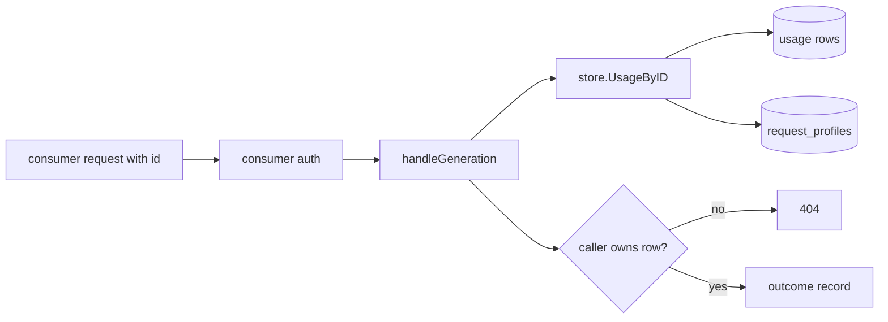
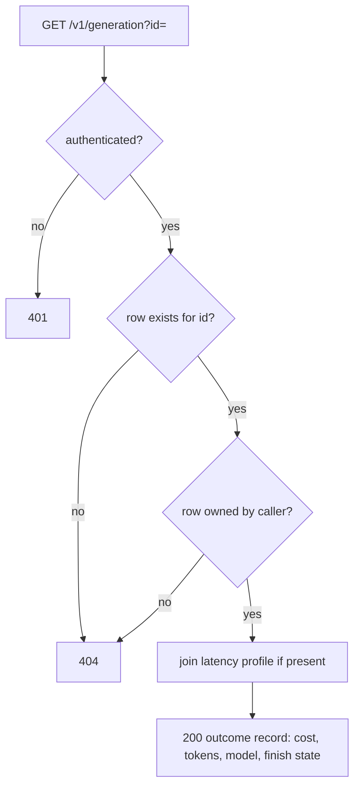

# ORP-029: `GET /v1/generation?id=` per-request lookup

> Last updated: 2026-09-25 · commit `b6f9574ed`

Darkbloom records a usage row per request but offers no way to fetch a single request's outcome by ID. Part of the OpenRouter-perspective review; see the [review index](../README.md).

## What

OpenRouter exposes `GET /api/v1/generation?id=gen-…` returning one generation's `total_cost`, token counts, latency, model, finish state, streamed flag, and cache discount (OpenRouter API reference, https://openrouter.ai/docs/api-reference/get-a-generation). Darkbloom writes a usage row per settled request — `{job_id, model, prompt_tokens, completion_tokens, cost_micro_usd, timestamp}` — but those rows are only reachable as the flat last-100 list from `GET /v1/payments/usage` (`coordinator/api/consumer.go`, `handleUsage`), and rows beyond the cap of 100 (`coordinator/payments/payments.go`, `usageHistoryLimit`) are unreachable by consumers at all. Latency data exists in the `request_profiles` pipeline (`coordinator/store/postgres_profiles.go`, `coordinator/api/timing_metrics.go`) but is not joined to any consumer-facing lookup.

## Why

Debugging a specific anomalous charge — "why did this request cost 3× my expectation" — requires paging the whole usage history and hoping the row is still inside the 100-entry window. Support and refund disputes have no per-request record to cite.

## Prompt

Add `GET /v1/generation?id=<id>` to the coordinator's consumer API, returning the full outcome record for a single request owned by the caller. Goal: response contains generation/request ID, model, prompt and completion token counts, cost in micro-USD, timestamp, finish state (completed / failed / cancelled / refunded), streamed flag, and latency fields sourced from the request-profiles pipeline where present. Constraints: (1) the lookup key is the generation ID minted by ORP-023 if that lands first, otherwise reuse the existing `job_id` on usage rows — document which; (2) strict caller scoping: an ID belonging to another account returns 404, not 403, to avoid ID enumeration; (3) no provider identity in the response — no provider serial, provider name, or machine identifiers, matching the privacy posture of the rest of the consumer API; (4) rows for failed-after-dispatch requests and refunded requests must be returned with their outcome, not only successful ones; (5) latency fields are optional — absent when the profile record was pruned. Files to touch: `coordinator/api/consumer.go` (new handler), `coordinator/api/server.go` (route), `coordinator/store/interface.go` (lookup method), `coordinator/store/postgres.go` and `coordinator/store/memory.go` (implementations), plus tests. Acceptance criteria: a consumer fetches their own request by ID and sees cost, tokens, model, and finish state; a foreign ID returns 404; a failed request's row shows its failure outcome.

## Workflow

1. Confirm the lookup key: check whether ORP-023 generation IDs exist in the store; otherwise plan on `job_id`.
2. Read `handleUsage` in `coordinator/api/consumer.go` for the usage-row shape and auth pattern.
3. Read `coordinator/store/postgres_profiles.go` to identify the latency fields available per request and their retention.
4. Add a store method `UsageByID(accountID, generationID)` returning the row plus optional profile data.
5. Implement in Postgres (join usage to profile records by job ID) and in the memory store.
6. Add `handleGeneration` in `coordinator/api/consumer.go`; wire the route in `coordinator/api/server.go`.
7. Define the response type in `coordinator/api/types/types.go`, excluding all provider-identifying fields.
8. Add tests: own ID found, foreign ID 404, unknown ID 404, failed request included, latency absent when profile pruned.
9. Run `make coordinator-test`.

## Loop

Run `make coordinator-test` (or `go test ./coordinator/api/... ./coordinator/store/...` while iterating). Check: response carries no provider-identifying field (grep the response struct and test fixtures); foreign-ID enumeration returns the same 404 shape as unknown-ID; both stores return identical rows. Definition of done: a support flow can take an ID from a client and retrieve exactly one caller-scoped outcome record.

## Graph

## Layout

- Modify `coordinator/api/consumer.go` — add `handleGeneration`.
- Modify `coordinator/api/server.go` — wire `GET /v1/generation`.
- Modify `coordinator/api/types/types.go` — consumer generation record type, provider fields excluded.
- Modify `coordinator/store/interface.go`, `coordinator/store/postgres.go`, `coordinator/store/memory.go` — lookup by ID with optional latency join.
- Add tests in `coordinator/api` and `coordinator/store`.
- No UI surface.

## Flow

Severity: medium · Effort: M
